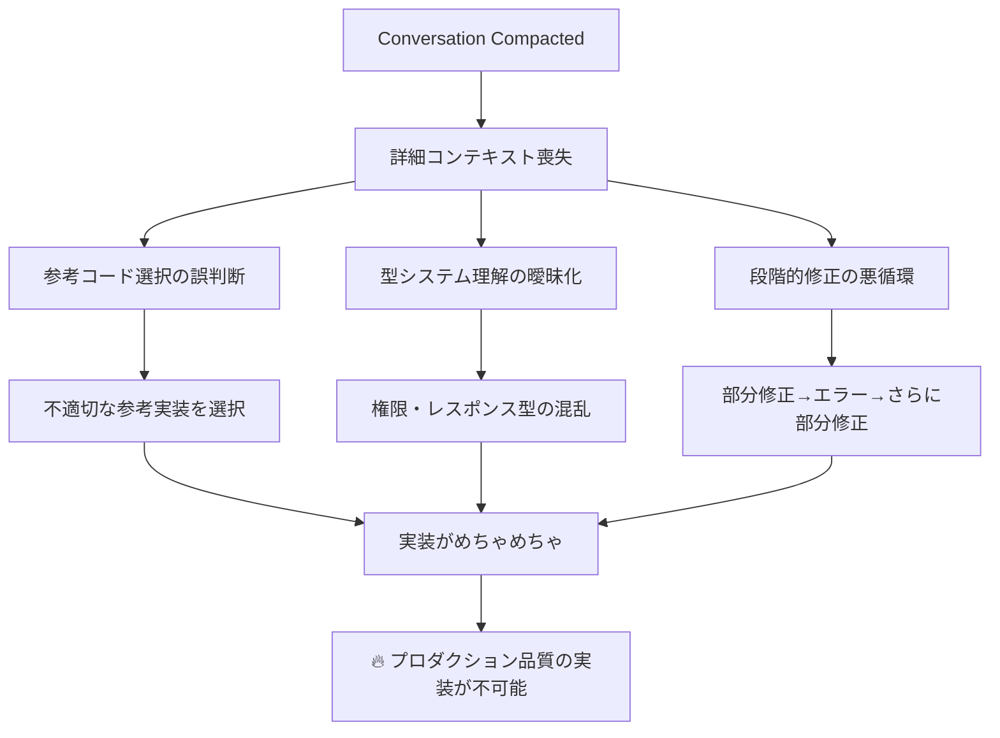

# Claude Code Context - idp-server

## プロジェクト概要
- **プロジェクト名**: idp-server
- **種類**: 包括的なアイデンティティプロバイダーフレームワーク
- **言語**: Java 21+ (Spring Boot)
- **ビルドシステム**: Gradle
- **現在のブランチ**: feat/issues-294

## アーキテクチャの特徴
- フレームワーク非依存のコア設計
- モジュラー構造による高い拡張性
- マルチテナント対応
- OAuth 2.0, OpenID Connect, CIBA, FAPI, Verifiable Credentials サポート

## プロジェクト構成

### メインアプリケーション
- `app/` - Spring Boot メインアプリケーション

### コアライブラリ (libs/)
- `idp-server-core` - コアエンジンロジック
- `idp-server-platform` - プラットフォーム基盤
- `idp-server-use-cases` - ユースケース実装
- `idp-server-control-plane` - コントロールプレーン

### 拡張機能
- `idp-server-core-extension-pkce` - PKCE (RFC 7636)
- `idp-server-core-extension-fapi` - Financial API
- `idp-server-core-extension-ciba` - Client Initiated Backchannel Authentication
- `idp-server-core-extension-verifiable-credentials` - Verifiable Credentials
- `idp-server-core-extension-ida` - Identity Assurance

### アダプター・統合
- `idp-server-springboot-adapter` - Spring Boot統合
- `idp-server-core-adapter` - コアアダプター
- `idp-server-webauthn4j-adapter` - WebAuthn/FIDO2統合
- `idp-server-email-aws-adapter` - AWS SESメール送信
- `idp-server-notification-fcm-adapter` - Firebase Cloud Messaging

### セキュリティ・認証
- `idp-server-authentication-interactors` - 認証インタラクター (Password, Email, WebAuthn等)
- `idp-server-security-event-framework` - セキュリティイベントフレームワーク
- `idp-server-security-event-hooks` - セキュリティイベントフック

### データ・連携
- `idp-server-database` - データベース層 (PostgreSQL/MySQL対応)
- `idp-server-federation-oidc` - OIDC連携

## 開発環境要件
- Java 21以上
- Docker & Docker Compose
- Node.js 18以上 (E2Eテスト用)

## テスト構成
- `e2e/` - E2Eテストスイート
  - `scenario/` - 現実的なユーザー・システム動作テスト
  - `spec/` - 仕様準拠テスト (OIDC, FAPI, JARM, VC等)
  - `monkey/` - 障害注入・エッジケーステスト
- `performance-test/` - K6によるパフォーマンステスト

## その他のディレクトリ
- `documentation/` - Docusaurus ドキュメント (英語・日本語対応)
- `config-sample/` - サンプル設定
- `secret/` - 機密情報・鍵管理
- `nginx/` - Nginxリバースプロキシ設定

## 設定・起動
1. `./init.sh` - API Key/Secret生成
2. 環境変数設定 (.env.local)
3. Docker イメージビルド
4. `docker compose up`
5. `./setup.sh` - 初期設定

## ビルド・テストコマンド
- **フォーマット修正**: `./gradlew spotlessApply` (ビルド前に必ず実行)
- ビルド: `./gradlew build`
- テスト: `./gradlew test`
- E2Eテスト: `cd e2e && npm test`
- 品質チェック: `./gradlew spotlessCheck`

## libs/idp-server-core 解析結果

### 概要
- **役割**: OpenID Connect/OAuth 2.0 のコアエンジン実装
- **依存関係**: idp-server-platform のみに依存
- **設計**: ドメイン駆動設計(DDD)による階層化アーキテクチャ

### 主要パッケージ構造

#### 1. 認証 (Authentication)
- `org.idp.server.core.openid.authentication/`
- ACR、LoA、MFA、認証ポリシー、インタラクション実行
- プラグイン可能な認証メカニズム

#### 2. OAuth/OIDC プロトコル
- `org.idp.server.core.openid.oauth/`
- **設定管理**: クライアント設定、サーバー設定
- **リクエスト処理**: 認可リクエスト、バリデーター
- **レスポンス生成**: 認可レスポンス、エラーハンドリング
- **クライアント認証**: client_credentials、mTLS、プラグイン

#### 3. プロトコル拡張
- **CIBA**: `type/ciba/` - Client Initiated Backchannel Authentication
- **PKCE**: `type/pkce/` - Proof Key for Code Exchange
- **RAR**: `type/rar/` - Rich Authorization Requests
- **VC**: `type/vc/`, `type/verifiablecredential/` - Verifiable Credentials
- **mTLS**: `type/mtls/` - Mutual TLS

#### 4. トークン管理
- `org.idp.server.core.openid.token/`
- **発行**: TokenRequestHandler、OAuthTokenCreationService
- **検証**: TokenIntrospectionHandler (内部/外部/拡張)
- **取り消し**: TokenRevocationHandler
- **プロトコル**: DefaultTokenProtocol

#### 5. ユーザーアイデンティティ
- `org.idp.server.core.openid.identity/`
- **コアエンティティ**: User - 包括的なユーザープロファイル
- **デバイス管理**: AuthenticationDevice、AuthenticationDevices
- **権限管理**: UserRole、権限、テナント/組織割り当て
- **ID Token**: プラグイン可能なID Token生成

#### 6. グラント管理
- `org.idp.server.core.openid.grant_management/`
- 認可グラント、同意管理

#### 7. ディスカバリー・メタデータ
- `org.idp.server.core.openid.discovery/`
- OpenID Connect Discovery実装

#### 8. フェデレーション
- `org.idp.server.core.openid.federation/`
- **SSO**: OIDC、SAML連携
- 外部IdP統合

#### 9. UserInfo エンドポイント
- `org.idp.server.core.openid.userinfo/`
- ユーザー情報提供、プラグイン拡張

### 主要ドメインモデル

#### ClientConfiguration
- OAuth/OIDCクライアント設定の包括的管理
- 拡張設定(ClientExtensionConfiguration)サポート
- FAPI、mTLS、Verifiable Credentials対応

#### User
- OpenID Connect標準クレーム完全対応  
- マルチテナント・組織サポート
- 認証デバイス管理(WebAuthn等)
- Verified Claims、カスタムプロパティ
- ユーザーライフサイクル管理

#### GrantType
- 標準OAuth グラント + CIBA拡張
- `authorization_code`, `client_credentials`, `refresh_token`, `ciba`

### アーキテクチャ特徴

1. **レイヤー分離**
   - Handler (プロトコル処理)
   - Service (ビジネスロジック) 
   - Repository (データアクセス抽象化)

2. **拡張性**
   - Plugin インターフェース
   - Extension 設定
   - プロトコル固有の type パッケージ

3. **マルチテナント対応**
   - TenantIdentifier、OrganizationIdentifier
   - テナント別設定管理

4. **セキュリティ**
   - 包括的なバリデーション
   - エラーハンドリング
   - 監査ログ対応


## コード規約・実装パターン分析 (idp-server 設計原則準拠)

### 設計原則・理念

#### OIDC世界観の尊重
- **プロトコル妥当性**: OAuth 2.0/OIDC 仕様への厳密な準拠
- **標準逸脱の禁止**: 拡張機能は適切にカプセル化
- **相互運用性**: 明確性と互換性の確保
- **拡張性と互換性**: CIBA・FAPI・OID4IDA等の拡張仕様サポート
- **抽象化**: OIDC未カバー領域（認証・永続化・通知）のプラグイン設計

### Hexagonal Architecture 4層分離設計

#### 1. **Controller層** (SpringBoot Adapter)
- **責務**: 入出力のDTO変換のみ
- **禁止事項**: ロジック・リポジトリアクセス厳禁
- **パターン**: HTTP → DTO → UseCase → DTO → HTTP

#### 2. **UseCase層** (UseCases: EntryService)
- **責務**: ユースケースごとに1クラス
- **命名**: `{Domain}{Action}EntryService`
- **担当**: トランザクション制御、プロトコル切り替え、永続化
- **パターン**: オーケストレーション専用、ビジネスロジック禁止

#### 3. **Core層** (Handler-Service-Repository)
- **責務**: OIDC仕様準拠ドメインモデル・プロトコル検証
- **型安全**: 値オブジェクト (`GrantId`, `ClientId`, `AcrValue`)
- **レスポンス**: OIDC仕様準拠REST API レスポンス生成

#### 4. **Adapter層** (DB)
- **分離**: `CommandRepository`, `QueryRepository`
- **責務**: 永続化処理のカプセル化
- **禁止**: ドメインロジック実行厳禁

### Core層 Handler-Service-Repository パターン

#### 1. **Handler層の責務と命名規約**
- **命名**: `{Domain}{Action}Handler` 例: `TokenRequestHandler`, `AuthorizationRequestHandler`
- **責務**: プロトコル処理とオーケストレーション、入力検証の委任、レスポンス生成
- **パターン**: Constructor injection、final フィールド、単一責務
- **入出力**: 専用IOオブジェクト (`{Operation}Request`, `{Operation}Response`)

```java
public class TokenRequestHandler {
  private final OAuthTokenCreationServices oAuthTokenCreationServices;
  private final ClientAuthenticationHandler clientAuthenticationHandler;
  
  public TokenRequestResponse handle(TokenRequest tokenRequest, ...) {
    // 1. 入力検証委任
    // 2. コンテキスト抽出
    // 3. サービス呼び出し
    // 4. 構造化レスポンス返却
  }
}
```

#### 2. **Service層の責務と命名規約**
- **命名**: `{Domain}{Action}Service` または `{Abstract}Service`
- **責務**: 純粋なビジネスロジック実装
- **特徴**: ステートレス、単一グラント/操作特化、インターフェース実装

#### 3. **Repository層の命名規約**
- **Query**: `{Entity}QueryRepository` - 読み取り操作
- **Command**: `{Entity}CommandRepository` - 書き込み操作  
- **Operation**: `{Entity}OperationCommandRepository` - 複合操作

### 検証・バリデーション パターン

#### Validator vs Verifier の責任分離
```java
// Validator: 入力形式チェック
public class {Domain}{Operation}Validator {
  public void validate({Operation}Request request) {
    // パラメータ存在チェック、形式検証
    // → {Operation}BadRequestException
  }
}

// Verifier: ビジネスルール検証  
public class {Domain}{Operation}Verifier {
  public void verify({Operation}Context context) {
    throwExceptionIfInvalidCondition(context);
    // → OAuthRedirectableBadRequestException (OAuth用)
  }
  
  private void throwExceptionIfInvalidCondition({Operation}Context context) {
    if (condition) {
      throw new OAuthRedirectableBadRequestException(
        "invalid_request", 
        "詳細なエラー説明"
      );
    }
  }
}
```

### IO (Input/Output) パッケージ構造

#### 必須IO構造
```
handler/
└── {operation}/
    ├── {Operation}Handler.java
    └── io/
        ├── {Operation}Request.java
        ├── {Operation}Response.java
        ├── {Operation}Status.java  
        └── {Operation}Context.java
```

### エラーハンドリング規約

#### 例外階層とメッセージング
- **Base**: `OAuthException` - OAuth標準エラーコード
- **Domain**: `{Domain}BadRequestException`, `{Domain}NotFoundException`
- **Method**: `throwExceptionIf{Condition}()` - 条件ベース検証メソッド

```java
void throwExceptionIfMissingResponseType(OAuthRequestContext context) {
  if (!context.hasResponseType()) {
    throw new OAuthRedirectableBadRequestException(
      "invalid_request",
      "response_type parameter is required"
    );
  }
}
```

### ドメインモデル設計規約

#### エンティティ設計パターン
- **不変性重視**: Builder パターンまたはコンストラクタ設定
- **変換メソッド**: `toMap()`, `to{Type}()`, `{property}As{Type}()`  
- **存在チェック**: `exists()`, `has{Property}()`, `match()`
- **UUID対応**: `UuidConvertable` インターフェース実装

#### マルチテナント対応
- **必須パラメータ**: すべての Repository メソッドで `Tenant` が第一引数
- **識別子**: `TenantIdentifier`, `OrganizationIdentifier`
- **分離**: データ・設定・UI の完全分離

### 拡張性・プラグイン パターン

#### Extension Service 設計
```java
// Map-based サービス登録
Map<GrantType, OAuthTokenCreationService> services;

// Plugin インターフェース
public interface {Domain}Plugin {
  boolean supports({Context} context);
  {Result} process({Context} context);
}
```

### 設定・属性管理パターン

#### Key-Value 設定管理 (`TenantAttributes` パターン)
```java
public boolean isFeatureEnabled() {
  return tenantAttributes.optValueAsBoolean(
    "feature_prefix_feature_name", 
    defaultValue
  );
}
```

### メソッド命名規約

#### Repository操作
- **取得**: `get()` - 必須存在、`find{By}()` - 任意存在  
- **登録**: `register()` - 新規作成
- **更新**: `update()` - 既存更新
- **削除**: `delete()`, `remove{Condition}()`

#### ビジネスロジック
- **判定**: `is{State}()`, `has{Property}()`, `can{Action}()`
- **変換**: `to{Type}()`, `as{Type}()`, `convert{To}()`
- **検証**: `validate{Condition}()`, `verify{Rule}()`

### アンチパターン・設計制約

#### 禁止パターン
- **Utilクラス濫用**: 共通ロジックを安易にUtilに逃がさない
- **Map<String, Object> 濫用**: 専用クラス・ドメインモデルで表現
- **DTO肥大化**: DTOにドメインロジック含有禁止
- **不要キャスト**: キャスト不要設計への見直し
- **永続化層ロジック**: 永続化層でのドメインロジック実行禁止

### レイヤー責任違反の反省・対策

#### 🚨 データソース層での業務ロジック実装アンチパターン

**問題のあった実装:**
```java
// OrganizationDataSource - データソース層で業務判定を実行
@Override
public TenantIdentifier getAdminTenantByOrganization(OrganizationIdentifier organizationId) {
  Organization organization = get(null, organizationId);

  for (AssignedTenant tenant : organization.assignedTenants()) {
    if ("ORGANIZER".equals(tenant.type())) {  // ← 業務ロジック！
      return new TenantIdentifier(tenant.id());
    }
  }
  throw new AdminTenantNotFoundException("...");
}
```

**なぜ問題か:**
1. **レイヤー責任違反**: データソース層は「データの取得・永続化」のみが責任
2. **業務知識の散らばり**: "ORGANIZER"判定ロジックがドメイン層でなくデータ層に存在
3. **テスタビリティの悪化**: 業務ルール変更時にデータベース依存テストが必要
4. **保守性の低下**: 業務ルール変更でデータソース層修正が必要

#### ✅ 正しいDDD準拠の実装

**ドメイン層に業務ロジック配置:**
```java
// Organization (ドメインオブジェクト) - 業務知識を持つ
public TenantIdentifier findAdminTenant() {
  for (AssignedTenant tenant : assignedTenants()) {
    if ("ORGANIZER".equals(tenant.type())) {  // ← ドメイン知識
      return new TenantIdentifier(tenant.id());
    }
  }
  throw new AdminTenantNotFoundException("No admin tenant found");
}

// OrganizationDataSource - 純粋なデータアクセス
@Override
public TenantIdentifier getAdminTenantByOrganization(OrganizationIdentifier organizationId) {
  Organization organization = get(null, organizationId);
  return organization.findAdminTenant();  // ← ドメインに委譲
}
```

#### 🛡️ 再発防止対策

**1. レイヤー責任の明確化**
- **データソース層**: SELECT/INSERT/UPDATE/DELETE のみ
- **ドメイン層**: 業務ルール・検証・計算
- **サービス層**: フロー制御・トランザクション

**2. 実装前チェックポイント**
- [ ] このロジックは業務知識か？
- [ ] 将来変更される可能性があるルールか？
- [ ] テスト時にデータベースが必要になるか？

**3. 命名による責任明示**
- `get` = 単純取得
- `find` = 検索・フィルタリングを含む
- `calculate` = 計算・集約処理

**4. Rich Domain Model の実践**
- ドメインオブジェクトにメソッドを持たせる
- データソース層は「愚直なデータアクセス」に徹する
- 業務ロジックをドメイン層に集約する

#### 💡 学習ポイント
- **「動けばいい」から「保守しやすい」へ**: 短期的動作 vs 長期保守性
- **例外の適切な配置**: ドメイン例外はドメイン層でスロー
- **テスト戦略**: ドメインロジックは単体テスト、データアクセスは統合テスト

#### 制御フロー設計
- **Strategy パターン**: アプリ振る舞い変更分岐（例: `grant_type` 分岐）
- **PluginLoader 活用**: 差し替え可能アーキテクチャ
- **型安全優先**: 意味のある型、`String`/`Map` 最小化

### 組織レベルAPI実装への適用指針

### Control-Plane実装パターン分析結果

#### Control-Plane の正しい位置づけ
**契約層（Interface Definition Layer）** として機能：
- **API Interface定義**: 管理APIの契約・シグネチャ定義
- **Permission定義**: `getRequiredPermissions()` による権限マッピング  
- **実装は別モジュール**: `idp-server-use-cases` に `*EntryService` 実装
- **Clean Architecture準拠**: ポート&アダプター パターンの**ポート**部分

#### 正しいアーキテクチャフロー

```
Controller → UseCase (EntryService) → Core → Adapter (Repository)
             ↑ control-plane APIs
           (契約定義のみ)
```

#### 組織レベルAPI設計パターン

**Tenant-Level vs Organization-Level の違い**：
```java
// Tenant-Level API (テナント内管理)
method(TenantIdentifier tenantId, User operator, ...)
// 権限: DefaultAdminPermission

// Organization-Level API (組織内テナント管理)  
method(OrganizationIdentifier orgId, TenantIdentifier adminTenant, User operator, ...)
// 権限: OrganizationAdminPermission + 組織アクセス検証
```

#### 現在実装の正当性確認

**✅ 正しい配置**：
- `OrgTenantManagementApi` (control-plane): 契約定義
- `OrgTenantManagementEntryService` (use-cases): UseCase実装
- `OrganizationAccessVerifier` (control-plane): アクセス制御ロジック

**❌ 唯一の実装不足**：
- `OrganizationRepository.findAssignment()` メソッド未実装

#### Control-Plane API 実装パターン

**標準APIインターフェース構造**：
```java
public interface {Domain}ManagementApi {
  // 1. 権限定義
  default AdminPermissions getRequiredPermissions(String method) { ... }
  
  // 2. CRUD操作 (統一シグネチャ)
  Response create(..., boolean dryRun);
  Response findList(..., Queries queries, ...);  
  Response get(..., Identifier id, ...);
  Response update(..., Identifier id, ..., boolean dryRun);
  Response delete(..., Identifier id, ..., boolean dryRun);
}
```

**レスポンス構造**：
- **Status**: Enum-based (OK, NOT_FOUND, FORBIDDEN)
- **Content**: `Map<String, Object>` による柔軟な構造
- **Dry-Run対応**: プレビュー機能の標準サポート

**検証フロー**：
1. **Validator**: JSON Schema入力検証
2. **Verifier**: ビジネスルール検証  
3. **Access Control**: 権限＋組織アクセス検証
4. **Context Creator**: 処理コンテキスト作成

#### 実装完了に必要な作業

**優先順位1**: `OrganizationRepository.findAssignment()` 実装
- **場所**: `libs/idp-server-platform/...`
- **責務**: 組織-テナント関係の検索
- **戻り値**: `AssignedTenant` エンティティ

**優先順位2**: 細かな名前・実装の調整
- エラーハンドリング標準化
- レスポンス構造の統一
- テストケース追加


## 次のAI開発者への重要なコンテキスト

### 🎯 **アーキテクチャ理解**
```
Controller → UseCase (EntryService) → Core → Adapter
             ↑ control-plane APIs (契約定義のみ)
```

### 🚨 **設計原則**
- **OIDC世界観尊重**: RFC厳密準拠、標準逸脱禁止
- **型安全性**: `String`/`Map`濫用禁止、意味のある型優先
- **責務分離**: Handler-Service-Repository パターン
- **テスト品質**: spec(RFC準拠)/scenario(実用)/monkey(異常系)

### 🛠️ **重要ファイル**
- `libs/idp-server-core/`: Handler-Service-Repository
- `libs/idp-server-control-plane/`: API契約定義
- `libs/idp-server-use-cases/`: EntryService実装

### 📋 **開発コマンド**
```bash
./gradlew spotlessApply  # 必須: フォーマット修正
./gradlew build
./gradlew test
cd e2e && npm test
```

## 🚨 **Java defaultメソッド実装アンチパターンの教訓**

### **発生した問題 (2025年1月実例)**

**OrgAuthenticationConfigManagementEntryService** の実装で、インターフェースに `default` メソッドがあるにも関わらず、実装クラスで不要なオーバーライドを行った。

#### **❌ アンチパターン実装**

**インターフェース**:
```java
public interface OrgAuthenticationConfigManagementApi {
  default AdminPermissions getRequiredPermissions(String method) {
    Map<String, AdminPermissions> map = new HashMap<>();
    map.put("create", new AdminPermissions(Set.of(DefaultAdminPermission.AUTHENTICATION_CONFIG_CREATE)));
    // ... 完璧な実装
    AdminPermissions adminPermissions = map.get(method);
    if (adminPermissions == null) {
      throw new UnSupportedException("Method " + method + " not supported");
    }
    return adminPermissions;
  }
}
```

**実装クラス (不要な重複)**:
```java
@Override
public AdminPermissions getRequiredPermissions(String method) {
  Map<String, AdminPermissions> map = new HashMap<>();
  map.put("create", new AdminPermissions(Set.of(DefaultAdminPermission.AUTHENTICATION_CONFIG_CREATE)));
  // ... 全く同じロジックを重複実装
  return map.getOrDefault(method, new AdminPermissions(Set.of())); // しかもエラーハンドリングが劣化
}
```

### **問題の根本原因**

#### **1. Java 8 defaultメソッドの理解不足**
- **defaultメソッドの目的**: インターフェースに標準実装を提供し、実装クラスでの重複を避ける
- **オーバーライドが必要な場合**: カスタマイズが本当に必要な場合のみ
- **基本原則**: **defaultメソッドがある = 標準実装で十分**

#### **2. DRY原則違反の深刻性**
- **コードの重複**: 全く同じロジックを2箇所で保持
- **保守性の悪化**: 権限変更時に2箇所修正が必要
- **バグの温床**: 一方だけ修正して不整合が発生するリスク

#### **3. エラーハンドリングの劣化**
- **インターフェース**: `UnSupportedException` - 厳密なエラー検出
- **実装クラス**: 空の `AdminPermissions` 返却 - エラーを隠蔽

### **✅ 正しい設計パターン**

#### **defaultメソッドの適切な活用**
```java
// インターフェース: 標準実装を提供
public interface SomeManagementApi {
  default AdminPermissions getRequiredPermissions(String method) {
    // 標準的な権限マッピング
    return standardPermissionMapping.get(method);
  }
}

// 実装クラス: defaultメソッドをそのまま使用
public class SomeManagementEntryService implements SomeManagementApi {
  // getRequiredPermissions は実装不要！インターフェースのdefaultメソッドを使用

  public SomeResponse someOperation(...) {
    AdminPermissions permissions = getRequiredPermissions("someOperation"); // defaultメソッド使用
    // ... 処理続行
  }
}

// カスタマイズが必要な場合のみオーバーライド
public class CustomManagementEntryService implements SomeManagementApi {
  @Override
  public AdminPermissions getRequiredPermissions(String method) {
    if ("specialOperation".equals(method)) {
      return new AdminPermissions(Set.of(CustomPermission.SPECIAL_OPERATION)); // カスタム権限
    }
    return SomeManagementApi.super.getRequiredPermissions(method); // 他は標準実装を使用
  }
}
```

### **🛡️ 再発防止チェックリスト**

#### **実装前の必須確認**
- [ ] **インターフェースにdefaultメソッドはあるか？**
- [ ] **そのdefaultメソッドで要件を満たせるか？**
- [ ] **オーバーライドする特別な理由はあるか？**
- [ ] **重複したコードになっていないか？**

#### **オーバーライドが正当化される場合**
- [ ] **明確にカスタマイズが必要**（権限体系が異なる、特別な検証ロジックなど）
- [ ] **defaultメソッドでは実現不可能な要件がある**
- [ ] **パフォーマンス最適化が必要**

#### **実装後の品質チェック**
- [ ] **コードの重複がないか？**
- [ ] **エラーハンドリングが適切か？**
- [ ] **defaultメソッドの設計意図を尊重しているか？**

### **💡 設計哲学への理解**

#### **idp-serverにおけるdefaultメソッドの役割**
1. **統一フレームワーク**: 全組織レベルAPIで同一の権限管理パターン
2. **実装負荷軽減**: EntryServiceでの重複実装を回避
3. **一貫性確保**: 権限マッピングロジックの中央集約
4. **拡張性**: 特別な要件がある場合のカスタマイズ余地

#### **Clean Architecture原則との整合性**
- **Interface Segregation**: 必要な機能のみをインターフェースで定義
- **DRY (Don't Repeat Yourself)**: defaultメソッドによる重複排除
- **Open/Closed Principle**: デフォルト動作は提供、カスタマイズは可能

### **🎯 未来のAI開発者への伝言**

**「defaultメソッドがあるインターフェースを実装する時は、まずdefaultメソッドで要件を満たせるかを確認せよ。不要なオーバーライドはコードの品質を著しく劣化させる。」**

**実装の前に自問自答:**
1. このオーバーライドは本当に必要か？
2. defaultメソッドでは実現不可能な要件があるか？
3. コードの重複を生み出していないか？
4. 設計者の意図を理解しているか？

この教訓を忘れずに、常にシンプルで保守しやすいコードを心がけること。

## 🆔 **Authentication Configuration ID要件 - UUID必須**

### **重要:** Authentication Configuration の `id` フィールドは必ずUUIDでなければならない

#### **✅ 正しいID形式**
```javascript
// E2Eテストでの正しい例
import { v4 as uuidv4 } from "uuid";

const configId = uuidv4(); // "f47ac10b-58cc-4372-a567-0e02b2c3d479"

const createRequest = {
  "id": configId,  // UUIDを使用
  "type": "password",
  "attributes": { ... },
  "metadata": { ... },
  "interactions": {}
};
```

#### **❌ 間違ったID形式**
```javascript
// これらは全てエラーになる
const badExamples = [
  "test-auth-config-123",           // 文字列 + タイムスタンプ
  "simple-string-id",               // 単純な文字列
  "auth-config-" + Date.now(),      // プレフィックス + タイムスタンプ
  123456,                           // 数値
  ""                                // 空文字列
];
```

#### **📋 UUID検証パターン (E2Eテスト用)**
```javascript
// UUIDの形式をテストで検証する場合
expect(response.data.id).toMatch(/^[0-9a-f]{8}-[0-9a-f]{4}-[0-9a-f]{4}-[0-9a-f]{4}-[0-9a-f]{12}$/i);
```

#### **🔧 実装での注意点**

1. **フロントエンド**: JavaScriptの`uuid`ライブラリを使用
2. **E2Eテスト**: 全てのAuthentication Config IDはUUIDv4で生成
3. **バリデーション**: サーバー側でUUID形式の検証が行われる
4. **データベース**: UUIDとしてストレージに保存

#### **理由**
- **AuthenticationConfigurationIdentifier**の仕様でUUID形式が要求される
- **一意性保証**: UUIDによる確実な一意性確保
- **分散環境対応**: 複数インスタンス間での衝突回避
- **セキュリティ**: 予測困難なIDによるセキュリティ向上

### **🎯 開発者への注意**

Authentication Configuration を扱う際は、必ずUUIDv4でIDを生成すること。この要件を忘れると実装時にバリデーションエラーが発生する。

#### **📝 レスポンス構造の注意**

Authentication Config Management APIのレスポンスは、以下の構造になる：

```javascript
// 成功レスポンス (create/update)
{
  "dry_run": false,  // dry-runの場合はtrue
  "result": {
    "id": "7a107ffa-5637-43f1-a686-a315c16a83c0",
    "type": "password",
    "attributes": { ... },
    "metadata": { ... },
    "interactions": {},
    "enabled": true
  }
}

// E2Eテストでの正しい検証例
expect(response.data).toHaveProperty("result");
expect(response.data.result).toHaveProperty("id");
expect(response.data.result.id).toBeDefined();

// Dry-runレスポンス
expect(response.data).toHaveProperty("dry_run", true);
expect(response.data.result).toHaveProperty("id");
```

**注意**: レスポンスのAuthentication Configurationは`result`フィールド内に格納される。直接ルートレベルには配置されない。

#### **⚠️ 重複エラー回避のためのtype設定**

Authentication Configurationの`type`フィールドは重複不可のため、E2Eテストでは`id`と同じ値を使用して重複を避ける：

```javascript
const configId = uuidv4();

const createRequest = {
  "id": configId,
  "type": configId,  // IDと同じ値を使用して重複を避ける
  "attributes": { ... },
  "metadata": { ... },
  "interactions": {}
};
```

**理由**:
- 同じ`type`値（例："password"）を複数回使用すると重複エラーが発生
- テストの失敗後、再実行時に同じ`type`で競合する
- UUIDを`type`として使用することで完全に一意性を保証

#### **🏷️ 組織レベルAPIパラメータ命名の重要な修正**

**問題**: 初期実装で組織レベルAPIのメソッドシグネチャが不適切だった

```java
// ❌ 間違った命名 (初期実装)
AuthenticationConfigManagementResponse create(
    OrganizationIdentifier organizationIdentifier,
    TenantIdentifier adminTenant,  // "admin" は不適切
    User operator,
    // ...
);

// ✅ 正しい命名 (修正後)
AuthenticationConfigManagementResponse create(
    OrganizationIdentifier organizationIdentifier,
    TenantIdentifier tenantIdentifier,  // 意味的に正確
    User operator,
    // ...
);
```

**理由**:
- **`adminTenant`は誤解を招く**: テナント自体がadminという意味ではない
- **実際の意味**: 「組織内の対象テナント」を指定するパラメータ
- **一貫性**: 他の組織レベルAPIとの命名統一

**正しい理解**:
- **OrganizationIdentifier**: どの組織で操作するか
- **TenantIdentifier**: その組織内のどのテナントで操作するか
- **User operator**: 操作実行者（組織の管理者権限を持つユーザー）

**未来の開発者への注意**: 組織レベルAPIでは「管理者テナント」ではなく「対象テナント」として理解すること。

## 🚨 **Organization-Level API実装時の重要注意事項**

### **❌ 致命的な誤解パターン（必読）**

#### **誤解1: 「組織レベル = システムレベルの簡易版」**
```
❌ 危険な思考: 組織レベルAPIは簡単だから適当に実装してもよい
✅ 正しい理解: 組織レベルAPI = システムレベルAPI + 組織アクセス制御（より複雑）
```

#### **誤解2: Context Creator パターンの軽視**
```
❌ 失敗例: コンパイルエラーを避けるためにTODOコメントで済ませる
❌ 手抜き例: 「適当なメッセージ返却」で実装した気になる
✅ 正解: 既存のAuthenticationConfigRegistrationContextCreatorを必ず使用
```

#### **誤解3: Audit Log実装の手抜き**
```
❌ 手抜き: createOnRead()で統一してコンパイルエラーを回避
✅ 正解: create(), createOnUpdate(), createOnDeletion()を適切に使い分け
```

### **✅ 組織レベルAPI実装の絶対ルール**

#### **実装前必須チェック（これを怠ると失敗確定）**
1. **システムレベル実装を完全に理解**
   ```java
   // 必ず詳細確認するファイル
   /libs/idp-server-use-cases/src/main/java/org/idp/server/usecases/control_plane/system_manager/AuthenticationConfigurationManagementEntryService.java
   ```

2. **他の組織レベルAPI実装を参考にする**
   ```java
   // 参考実装（同じパターンを必ず踏襲）
   /libs/idp-server-use-cases/src/main/java/org/idp/server/usecases/control_plane/organization_manager/OrgUserManagementEntryService.java
   /libs/idp-server-use-cases/src/main/java/org/idp/server/usecases/control_plane/organization_manager/OrgClientManagementEntryService.java
   ```

3. **組織アクセス制御の正しい統合**
   ```java
   // 正しいパターン（これ以外は禁止）
   OrganizationAccessControlResult accessResult =
       organizationAccessVerifier.verifyAccess(organization, adminTenant, operator, permissions);

   if (!accessResult.isSuccess()) {
       // アクセス拒否レスポンス
       return new AuthenticationConfigManagementResponse(
           AuthenticationConfigManagementStatus.FORBIDDEN, response);
   }

   // この後は既存のシステムレベル実装と同じフロー
   AuthenticationConfigRegistrationContextCreator contextCreator =
       new AuthenticationConfigRegistrationContextCreator(targetTenant, request, dryRun);
   AuthenticationConfigRegistrationContext context = contextCreator.create();
   ```

### **🎯 実装品質チェック（リリース前必須）**

#### **🚨 Red Flags（これがあったら絶対に修正）**
- [ ] TODOコメントで済ませている箇所がある
- [ ] createOnRead()でAudit Logを統一している
- [ ] Context Creatorを使っていない
- [ ] 「簡単だから」と手抜きしている箇所がある
- [ ] 適当なメッセージ返却で実装した気になっている

#### **✅ Green Flags（良い実装の証拠）**
- [ ] システムレベル実装と同じContext Creatorパターン使用
- [ ] 適切なAudit Log作成（create/update/delete別）
- [ ] 実際のRepository操作実装
- [ ] 既存の組織レベルAPIと一貫性のあるパターン

### **⚠️ 「コンパイルが通る ≠ 正しい実装」の教訓**

**最悪のパターン**: コンパイルエラーを避けるために手抜きする
- 適当な実装でコンパイルを通すより、正しい実装方法を調べる
- Context Creator等の必要なクラスが見つからない場合は、既存実装を詳細確認
- 不明な点があれば実装を止めて確認する

**重要**: この教訓は実際のissue対応で発生した失敗例から学んだものです。同じ過ちを繰り返さないよう、**「組織レベルAPIは複雑で、システムレベル実装の完全な理解が前提」**という認識で必ず取り組んでください。

## Javadoc ドキュメント要件

### 🎯 **Javadoc品質基準**

#### **1. idp-serverプロジェクトのJavadocスタイル**

**参考実装**: `org.idp.server.core.openid.oauth.verifier.base.OidcRequestBaseVerifier`
```java
/**
 * 3.1.2.2. Authentication Request Validation
 *
 * <p>The Authorization Server MUST validate the request received as follows:
 *
 * <p>The Authorization Server MUST validate all the OAuth 2.0 parameters...
 * @see <a href="https://openid.net/specs/openid-connect-core-1_0.html#AuthRequest">
 */
```

**特徴**:
- **RFC準拠性の明示**: 仕様書章番号・引用
- **詳細な説明**: 単純な説明を超えた実装意図の解説
- **使用例**: `<pre>{@code }` による具体的コード例
- **相互参照**: `@see` による関連クラス・メソッドのリンク

#### **2. Issue #409 実装クラスのJavadoc要件**

##### **OrganizationAdminPermissions**
```java
/**
 * Organization-level admin permissions container.
 *
 * <p>This class manages a set of {@link OrganizationAdminPermission} values and provides
 * convenience methods for permission validation and string representation.
 *
 * <p>Organization-level permissions are scoped to specific organizations and allow organization
 * administrators (ORGANIZER tenant type) to manage resources within their organization boundaries.
 *
 * <p>Usage example:
 * <pre>{@code
 * Set<OrganizationAdminPermission> permissions = Set.of(
 *     OrganizationAdminPermission.ORG_TENANT_CREATE,
 *     OrganizationAdminPermission.ORG_TENANT_READ
 * );
 * OrganizationAdminPermissions adminPerms = new OrganizationAdminPermissions(permissions);
 * 
 * // Validate user permissions
 * if (adminPerms.includesAll(user.permissionsAsSet())) {
 *     // User has required permissions
 * }
 * }</pre>
 *
 * @see OrganizationAdminPermission
 * @see org.idp.server.control_plane.organization.access.OrganizationAccessVerifier
 */
```

##### **OrganizationAccessVerifier**  
```java
/**
 * Organization-level access control verifier.
 *
 * <p>This verifier implements a comprehensive 4-step verification process for organization-level
 * operations:
 * <ol>
 *   <li><strong>Organization membership verification</strong> - Ensures the user is assigned to the organization</li>
 *   <li><strong>Tenant access verification</strong> - Validates the user has access to the target tenant</li>
 *   <li><strong>Organization-tenant relationship verification</strong> - Confirms the tenant is assigned to the organization</li>
 *   <li><strong>Required permissions verification</strong> - Validates the user has necessary organization-level permissions</li>
 * </ol>
 *
 * <p>This verification pattern ensures proper multi-tenant isolation and organization-scoped
 * access control in accordance with idp-server's security model.
 *
 * <p>Usage example:
 * <pre>{@code
 * OrganizationAccessVerifier verifier = new OrganizationAccessVerifier(orgRepository);
 * OrganizationAdminPermissions requiredPermissions = new OrganizationAdminPermissions(
 *     Set.of(OrganizationAdminPermission.ORG_TENANT_CREATE)
 * );
 * 
 * OrganizationAccessControlResult result = verifier.verifyAccess(
 *     organizationId, tenantId, operator, requiredPermissions, adminTenant
 * );
 * 
 * if (result.isSuccess()) {
 *     // Proceed with operation
 * } else {
 *     // Handle access denied or not found
 * }
 * }</pre>
 *
 * @see OrganizationAccessControlResult
 * @see OrganizationAdminPermissions
 */
```

##### **AssignedTenants.tenantIdentifiers()**
```java
/**
 * Returns tenant identifiers for all assigned tenants.
 *
 * <p>This method extracts tenant IDs from the assigned tenant list and converts them
 * to TenantIdentifier objects for use in tenant access verification and queries.
 *
 * <p>Usage example:
 * <pre>{@code
 * Organization organization = organizationRepository.get(tenant, organizationId);
 * List<TenantIdentifier> tenantIds = organization.assignedTenants().tenantIdentifiers();
 * List<Tenant> tenants = tenantQueryRepository.findList(tenantIds);
 * }</pre>
 *
 * @return list of tenant identifiers for assigned tenants
 * @see TenantIdentifier
 * @see org.idp.server.platform.multi_tenancy.tenant.TenantQueryRepository#findList(List)
 */
```

##### **OrganizationRepository.findAssignment()**
```java
/**
 * Finds the tenant assignment within an organization.
 *
 * <p>This method verifies that a specific tenant is assigned to the given organization
 * and returns the assignment details if found. Used for organization-tenant relationship
 * verification in access control.
 *
 * @param adminTenant the admin tenant context for database access
 * @param organizationId the organization to check
 * @param tenantId the tenant to verify assignment for
 * @return assigned tenant details, or empty AssignedTenant if not found
 * @see AssignedTenant#exists()
 */
```

#### **3. メソッドレベルJavadoc要件**

**必須要素**:
- **@param**: 全てのパラメータの説明
- **@return**: 戻り値の説明（void以外）
- **@throws**: チェック例外の説明
- **使用例**: 複雑なメソッドには`<pre>{@code}`でコード例

**推奨要素**:
- **@see**: 関連クラス・メソッドへの参照
- **@since**: 追加されたバージョン（新機能の場合）
- **@deprecated**: 廃止予定の場合

#### **4. Javadoc品質チェックリスト**

**クラスレベル**:
- [ ] クラスの目的・責務の明確な説明
- [ ] アーキテクチャ上の位置づけの説明
- [ ] 使用例の提供（複雑なクラス）
- [ ] 関連クラスへの`@see`リンク

**メソッドレベル**:
- [ ] 全`@param`の意味のある説明
- [ ] `@return`の具体的な説明
- [ ] アルゴリズム・ビジネスロジックの背景説明
- [ ] 制約・前提条件の明示

**品質基準**:
- [ ] 単純な名前の言い換えではない説明
- [ ] ビジネス価値・技術的意図の明示
- [ ] 他開発者が理解できる詳細度
- [ ] idp-serverアーキテクチャとの関連性説明

### 📋 **Javadoc実装対象ファイル**

#### **優先度1: 公開API・コアクラス**
1. `OrganizationAdminPermissions` - 権限管理コンテナ
2. `OrganizationAccessVerifier` - アクセス制御検証器  
3. `OrganizationAccessControlResult` - 検証結果
4. `OrgTenantManagementApi` - 管理API契約

#### **優先度2: データ層・実装クラス** 
1. `AssignedTenants.tenantIdentifiers()` - テナントID抽出
2. `OrganizationRepository.findAssignment()` - 割り当て検索
3. `OrganizationSqlExecutor.selectAssignedTenant()` - SQL実行

#### **優先度3: SQL実装クラス**
1. `PostgresqlExecutor.selectAssignedTenant()` - PostgreSQL実装
2. `MysqlExecutor.selectAssignedTenant()` - MySQL実装

### 🎯 **次のAI開発者への指針**

**Javadoc実装時の重要ポイント**:
1. **idp-serverの価値観を反映**: 単純な説明ではなく、OIDC準拠・エンタープライズ品質の背景を説明
2. **アーキテクチャの理解**: 各クラスがHexagonal Architectureのどの層に属するかを明示
3. **使用例の提供**: 複雑なAPIには必ず動作するコード例を記載
4. **相互参照の整備**: `@see`による関連性の明示でドキュメント間のナビゲーション向上

**品質担保**:
- JavadocがHTML生成時にエラーにならないことを確認
- `./gradlew javadoc` でのビルド成功を検証
- 生成されたHTMLドキュメントの可読性確認

## 🚨 **「Conversation compacted」対処マニュアル - 実装品質維持の生命線**

### **💀 危険シグナル: 「Conversation compacted」が表示された場合**

**🔥 緊急事態宣言**: 技術的詳細コンテキストが**大幅に失われた状態**。この状態での開発は**極めて危険**。

### **📊 「Conversation compacted」による被害分析**

#### **1. 失われる重要な情報**
```
🗂️  Before Compacted:
├── 詳細な実装パターンの分析・議論
├── エラーと修正の試行錯誤プロセス
├── なぜその実装パターンを選択したかの経緯
├── 実装中に発見した細かな注意点
├── 型システム・権限システムの詳細な理解
└── アーキテクチャ層間の責任分離の詳細

📝  After Compacted (残る情報):
└── 要約された結果のみ（「組織レベル管理APIの実装パターンに従う」など）
```

#### **2. 実装品質劣化のメカニズム**


### **🛡️ 緊急対処プロトコル**

#### **Phase 1: 即座停止 (STOP IMMEDIATELY)**
```bash
# ⚠️  compacted検出時は実装を即座に停止
echo "🚨 CONVERSATION COMPACTED DETECTED - STOPPING ALL IMPLEMENTATION"
```

**絶対にやってはいけないこと:**
- [ ] ❌ 「とりあえず」で実装を続ける
- [ ] ❌ エラーが出たら「部分修正」で対処
- [ ] ❌ 「簡単だから」と既存パターンを適当に参考にする

#### **Phase 2: 全体設計の再確認 (ARCHITECTURE REVALIDATION)**
```bash
# 1. 既存実装パターンの完全な再分析
find . -name "*Management*Api.java" | head -10
find . -name "*EntryService.java" | head -10

# 2. 権限システムの完全理解
grep -r "AdminPermissions\|OrganizationAdminPermissions" --include="*.java" | head -20
grep -r "getRequiredPermissions" --include="*.java" | head -10

# 3. レスポンス型システムの理解
find . -name "*ManagementResponse.java"
grep -r "ManagementStatus" --include="*.java" | head -10
```

#### **Phase 3: 型システムの完全検証 (TYPE SYSTEM VERIFICATION)**
```java
// compacted後は特に以下の整合性を確認
1. 権限型: AdminPermissions vs OrganizationAdminPermissions
2. レスポンス型: 各Management APIのレスポンス型の一貫性
3. アクセス制御: OrganizationAccessVerifier の正しい使用方法
4. Context Creator: 各ドメインに対応するContextCreatorの存在確認
```

#### **Phase 4: 参考実装の詳細比較 (REFERENCE IMPLEMENTATION ANALYSIS)**
```bash
# システムレベル vs 組織レベルの実装差異を詳細分析
# 例: Authentication Config Management
diff /libs/.../system_manager/AuthenticationConfigurationManagementEntryService.java \
     /libs/.../organization_manager/OrgAuthenticationConfigurationManagementEntryService.java

# 複数の組織レベル実装の共通パターン抽出
ls /libs/.../organization_manager/Org*ManagementEntryService.java
```

### **🎯 実装再開の判断基準**

#### **✅ Green Light (実装再開OK) の条件**
- [ ] **型システム完全理解**: 権限・レスポンス・識別子型の整合性確認済み
- [ ] **パターン完全把握**: システムレベルと組織レベルの実装差異を詳細理解
- [ ] **参考実装選択**: 適切な参考実装を特定し、なぜそれが適切かを説明可能
- [ ] **アクセス制御理解**: 組織アクセス制御の4ステップ検証プロセスを理解

#### **❌ Red Light (実装継続危険) のシグナル**
- [ ] **曖昧な理解**: 「たぶん」「だいたい」「適当に」の言葉が思い浮かぶ
- [ ] **エラー依存**: コンパイルエラーで実装の正誤を判断しようとする
- [ ] **パターン混在**: システムレベルと組織レベルのパターンが混在
- [ ] **型システム混乱**: 権限型やレスポンス型を「とりあえず」で選択

### **📋 実装チェックリスト (compacted環境専用)**

#### **🔍 実装前必須確認 (Pre-Implementation Verification)**
```java
// 1. 参考実装の詳細分析
□ システムレベル実装を完全に理解したか？
□ 組織レベル実装の共通パターンを抽出したか？
□ なぜその実装パターンが適切かを説明できるか？

// 2. 型システムの整合性確認
□ 権限型は何を使うべきか？(AdminPermissions? OrganizationAdminPermissions?)
□ レスポンス型は何を返すべきか？
□ アクセス制御の結果をどう変換すべきか？

// 3. Context Creator確認
□ 対象ドメイン用のContextCreatorが存在するか？
□ ContextCreatorの使用方法を理解しているか？
```

#### **🧪 実装中品質チェック (During Implementation)**
```java
// 設計の一貫性チェック
□ 部分修正でなく全体設計で実装しているか？
□ 既存パターンと一貫性があるか？
□ エラーハンドリングが適切か？

// コード品質チェック
□ TODOコメントで済ませていないか？
□ 「適当なメッセージ」で実装していないか？
□ Context Creatorパターンを使用しているか？
```

### **🎯 未来の自分への重要メッセージ**

#### **💡 compacted環境での開発哲学**
```
「Conversation compactedは技術詳細の文脈喪失により、
 AIの判断精度を大幅に下げる重要な危険要因である。

 この環境では：
 1. 慎重さを2倍に増やす
 2. 確信のない実装は絶対に行わない
 3. 部分修正ではなく全体再設計を選択する
 4. エラー修正時は根本原因を徹底追求する」
```

#### **🔬 実装品質の科学的アプローチ**
```bash
# compacted後は「科学的な実装」を心がける
1. 仮説: この実装パターンが正しいと思う理由
2. 検証: 既存実装との比較分析
3. 実験: 小さな単位での実装テスト
4. 評価: 全体設計との一貫性確認
```

### **📚 compacted対処の成功パターン**

#### **✅ 成功例: 正しい対処フロー**
```
1. compacted検出 → 実装停止
2. 既存実装の詳細再分析 → パターン完全理解
3. 型システムの整合性確認 → 混乱要因を排除
4. 全体設計での実装 → 一貫性のある品質確保
```

#### **❌ 失敗例: 避けるべきフロー**
```
1. compacted後も実装継続
2. エラー発生 → 部分修正
3. さらなるエラー → さらに部分修正
4. 実装がめちゃめちゃ → 🔥
```

### **🎖️ 品質保証の誓い**

**「Conversation compacted環境においても、idp-serverの品質基準を絶対に下げない。不確実な実装よりも、確実な設計確認を優先する。未来のユーザーと開発者のために、妥協のない品質を追求する。」**

---

## 現在の状況
- 作業ディレクトリ: clean (コミット可能な変更なし)
- 最新コミット: Implement comprehensive security event logging system
- 完了したイシュー: #292 (SecurityEventUser拡張), #401 (FIDO-UAFリセット機能)
- **進行中**: Issue #409 組織レベルテナント管理API (実装完了、Javadoc追加準備中)