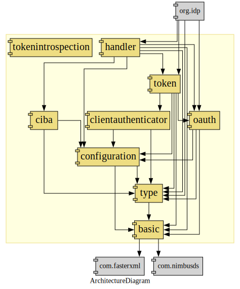

# idp-server

## Overview

This library provides java api supported OAuth2.0 and OIDC spec.

## Features

| Category        | SubCategory                           | Supported | Description                                                                                                                                                                                                                                             |
|-----------------|---------------------------------------|-----------|---------------------------------------------------------------------------------------------------------------------------------------------------------------------------------------------------------------------------------------------------------|
| Authentication  | Password                              | ❌         | username/password.                                                                                                                                                                                                                                      |
|                 | Multi-Factor (MFA)                    | ❌         | Adds extra security layers via SMS, TOTP, push notifications, etc.                                                                                                                                                                                      |
|                 | Passwordless                          | ❌         | Enables login via FIDO-UAF, FIDO2 or Passkey.                                                                                                                                                                                                           |
|                 | Social Login                          | ❌         | Supports authentication via Google, Facebook, GitHub, LinkedIn, and more.                                                                                                                                                                               |
|                 | Enterprise Federation                 | ❌         | Allows login via external IdPs (SAML, OIDC, LDAP, Azure AD, Google Workspace).                                                                                                                                                                          |
|                 | User Federation                       | ❌         | Connects multiple identity sources for authentication.                                                                                                                                                                                                  |
|                 | Identity Provider (IdP) Integration   | ❌         | Supports federated authentication with third-party IdPs.                                                                                                                                                                                                |
|                 | Customizable Login Pages              | ❌         | Provides branding options for login UI via Universal Login or Lock.js.                                                                                                                                                                                  |
| Authorization   | Role-Based Access Control (RBAC)      | ❌         | Assigns roles and permissions to users based on their identity.                                                                                                                                                                                         |
|                 | Fine-Grained Permissions              | ❌         | Manages user access at a granular level.                                                                                                                                                                                                                |
|                 | API Authorization                     | ✅         | Secures APIs and issues JWT-based access tokens using OAuth 2.0.                                                                                                                                                                                        |
|                 | Machine-to-Machine Authentication     | ✅         | Enables authentication for services using client credentials.                                                                                                                                                                                           |
|                 | Secure Session Management             | ✅         | Supports token expiration, refresh tokens, and logout mechanisms.                                                                                                                                                                                       |
| Security        | Authentication Flows with Actions     | ❌         | Enables custom authentication flows using serverless functions.                                                                                                                                                                                         |
|                 | Extensible Identity Workflows         | ❌         | Supports custom rules and hooks for advanced identity management.                                                                                                                                                                                       |
|                 | User Consent & Privacy Compliance     | ❌         | Ensures GDPR, CCPA, and other regulatory compliance.                                                                                                                                                                                                    |
|                 | Secure Token Storage                  | ❌         | Manages access tokens securely to prevent leaks.                                                                                                                                                                                                        |
|                 | Financial-Grade API (FAPI) Compliance | ✅         | Meets security standards for financial institutions.                                                                                                                                                                                                    |
| Management      | Organizations                         | ❌         | Organizations is a centralized management platform that enables organizations to oversee multiple tenants, manage team members, enforce SSO, control tenant creation, and handle billing, with feature availability depending on the subscription type. |
|                 | Tenants                               | ❌         | Provides centralized visibility and control over multiple tenants.                                                                                                                                                                                      |
|                 | SSO Enforcement for Organizations     | ❌         | Enforces Single Sign-On (SSO) for teams using an organization's IdP.                                                                                                                                                                                    |
|                 | Tenant Creation Control               | ❌         | Manages permissions for creating new tenants.                                                                                                                                                                                                           |
|                 | Tenant Member Administration          | ❌         | Controls access levels and membership within tenants.                                                                                                                                                                                                   |
|                 | Subscription and Billing              | ❌         | Provides tools for managing subscription and billing.                                                                                                                                                                                                   |
|                 | Applications                          | ❌         | Allows applications creation, modification, and deletion.                                                                                                                                                                                               |
|                 | Users                                 | ❌         | Allows user creation, modification, and deletion.                                                                                                                                                                                                       |
| Monitoring      | Audit Logging & Monitoring            | ❌         | Tracks authentication events and logs security activities.                                                                                                                                                                                              |
|                 | Security Alerts                       | ❌         | Notifies administrators of suspicious login attempts or breaches.                                                                                                                                                                                       |
|                 | Integration with SIEM                 | ❌         | Supports integration with security monitoring tools.                                                                                                                                                                                                    |
| Developer Tools | SDKs & Libraries                      | ❌         | Provides SDKs for React, Angular, Vue, Node.js, .NET, Java, and more.                                                                                                                                                                                   |
|                 | Custom Hooks & Rules                  | ❌         | Allows developers to implement custom business logic.                                                                                                                                                                                                   |
|                 | Custom Branding                       | ❌         | Enables UI customization for authentication pages, emails, and error messages.                                                                                                                                                                          |

## Architecture



## supported spec

1. RFC6749 The OAuth 2.0 Authorization Framework
    1. authorization code grant
    2. implicit grant
    3. resource owner password credentials grant
    4. client credentials grant
2. OpenID Connect Core 1.0 incorporating errata set 1
    1. authorization code flow
    2. implicit flow
    3. hybrid flow
    4. request object
        1. signature
        2. encryption
        3. signature none
    5. userinfo
3. OpenID Connect Discovery 1.0 incorporating errata set 1
4. OpenID Connect Client-Initiated Backchannel Authentication Flow - Core 1.0
    1. poll mode
    2. ping mode
    3. push mode
5. RFC7009 OAuth 2.0 Token Revocation
6. RFC7636 Proof Key for Code Exchange by OAuth Public Clients
7. RFC7662 OAuth 2.0 Token Introspection
8. Financial-grade API Security Profile 1.0 - Part 1: Baseline
9. Financial-grade API Security Profile 1.0 - Part 2: Advanced

## supported client authentication

1. client_secret_post
2. client_secret_basic
3. client_secret_jwt
4. private_key_jwt
5. tls_client_auth
6. self_signed_tls_client_auth

## License

Apache License, Version 2.0

# verifiable-credentials

## pre setup

1. create wallet
    1. https://metamask.io/
2. create alchemy account
    1. https://www.alchemy.com/
3. create apikey of sepolia at alchemy
4. send eth to wallet
    1. https://sepoliafaucet.com/

## sample server

### docker-compose

c. fix your configuration

```shell
export ADDRESS=0xf1232f840f3ad7d23fcdaa84d6c66dac24efb198
export PRIVATE_KEY=d8b595680851765f38ea5405129244ba3cbad84467d190859f4c8b20c1ff6c75
export WEB3_URL=wss://eth-sepolia.g.alchemy.com/v2/xxx
export VERIFICATION_Method=did:web:assets.dev.trustid.sbi-fc.com#key-2
export CHAIN=ethereum_sepolia

docker-compose up -d
```

```shell
cd database
./gradlew flywayClean flywayMigrate
```

### bootRun

```shell
./gradlew bootRun
```

```shell
./init.sh
```

### e2e

```shell
cd e2e
npm test
```