# idp-server

[](https://github.com/hirokazu-kobayashi-koba-hiro/idp-server)
[](https://github.com/hirokazu-kobayashi-koba-hiro/idp-server/issues)
[](https://github.com/hirokazu-kobayashi-koba-hiro/idp-server/blob/main/LICENSE)

## Overview

This project is a flexible and extensible Identity Provider (IdP) implementation that fully supports the OAuth 2.0 and
OpenID Connect specifications.

It can be used as:

- A **standalone server** for managing authentication and authorization flows out of the box
- A **Java library** that can be embedded into your own applications to add OAuth2/OIDC functionality programmatically

Built with modularity and customization in mind, it provides robust APIs for handling users, clients, grants, MFA, and
hooks, while remaining lightweight and easy to integrate into any Java-based ecosystem.

## 🗂 System Architecture (Container Level)

```mermaid
graph TD
subgraph UserSide
browser[🧑‍💻 Web Browser]
end

subgraph Frontend
frontend[🌐 React / Next.js]
end

subgraph RpBackend
rp-backend[🎯 RP Backend]
end

subgraph Backend
backend[🔧 Spring Boot API]
hook[📡 Hook Executors]
mfa[🛡️ MFA Interactors]
ssf[📬 SSF Notifier]
db[(PostgreSQL)]
end

subgraph External
slack[🔔 Slack Webhook]
webhook[🔄 Generic Webhook Endpoint]
oidc[🌍 External OIDC Provider]
end

browser --> frontend
frontend --> backend
rp-backend --> backend
backend --> db

backend --> hook
backend --> mfa
backend --> ssf
backend --> oidc

hook --> slack
hook --> webhook
ssf --> rp-backend

subgraph MFA
passkey[🔐 Passkey Authenticator]
email[📧 Email Authenticator]
end

mfa --> passkey
mfa --> email

```



### 🗂 System Architecture (Container Level)

This diagram illustrates the core container-level architecture of the IdP service.  
The system consists of a frontend built with React / Next.js and a backend powered by Spring Boot, accessed via a web
browser by end users.

- The **Backend API** is responsible for core logic such as authentication, authorization, and client management.
- **MFA Interactors** handle multi-factor authentication mechanisms, supporting both Passkey-based authentication and
  Email verification flows.
- **Hook Executors** are triggered during authentication or administrative events and send notifications to external
  systems such as Slack or generic Webhook endpoints.
- The service integrates with external **OIDC Providers** to support federation and identity brokering use cases.
- **PostgreSQL** is used as the primary data store to persist user, client, and configuration data.

This architecture balances **security**, **extensibility**, and **integration flexibility**, enabling a robust
foundation for modern identity management.

## Features

* ✅ - Supported
* ❌ - Unsupported
* ⚠️ - Implementing

| Category            | SubCategory                           | Supported | Free | Basic | Professional | Description                                                                                                                                                                               |
|---------------------|---------------------------------------|-----------|------|-------|--------------|-------------------------------------------------------------------------------------------------------------------------------------------------------------------------------------------|
| **Authentication**  | Password                              | ✅         | ✅    | ✅     | ✅            | Username/password authentication.                                                                                                                                                         |
|                     | Multi-Factor (MFA)                    | ✅         | ❌    | ✅     | ✅            | Adds extra security layers via SMS, Email, push notifications, etc.                                                                                                                       |
|                     | Passwordless                          | ✅         | ❌    | ❌     | ✅            | Enables login via FIDO2, or Passkey.                                                                                                                                                      |
|                     | Social Login                          | ✅         | ✅    | ✅     | ✅            | Supports authentication via Google, Facebook and more.                                                                                                                                    |
|                     | Enterprise Federation                 | ⚠️        | ❌    | ❌     | ✅            | Allows login via external IdPs (SAML, OIDC, LDAP, Azure AD, Google Workspace).                                                                                                            |
|                     | Identity Provider (IdP) Integration   | ❌         | ✅    | ✅     | ✅            | Supports federated authentication with third-party IdPs.                                                                                                                                  |
|                     | Customizable Login Pages              | ❌         | ❌    | ❌     | ✅            | Provides branding options for login UI via Universal Login or Lock.js.                                                                                                                    |
| **Authorization**   | Role-Based Access Control (RBAC)      | ✅         | ✅    | ✅     | ✅            | Assigns roles and permissions to users based on their identity.                                                                                                                           |
|                     | Fine-Grained Permissions              | ✅         | ✅    | ✅     | ✅            | Manages user access at a granular level.                                                                                                                                                  |
|                     | API Authorization                     | ✅         | ✅    | ✅     | ✅            | Secures APIs and issues JWT-based access tokens using OAuth 2.0.                                                                                                                          |
|                     | Machine-to-Machine Authentication     | ✅         | ✅    | ✅     | ✅            | Enables authentication for services using client credentials.                                                                                                                             |
|                     | Secure Session Management             | ✅         | ✅    | ✅     | ✅            | Supports token expiration, refresh tokens, and logout mechanisms.                                                                                                                         |
| **Security**        | Authentication Flows with Hooks       | ✅         | ✅    | ✅     | ✅            | Supports executing multiple custom hooks in a specific order for each authentication event, based on tenant-configurable settings.                                                        |
|                     | Extensible Identity Workflows         | ❌         | ❌    | ❌     | ✅            | Supports custom rules and hooks for advanced identity management.                                                                                                                         |
|                     | User Consent & Privacy Compliance     | ✅         | ✅    | ✅     | ✅            | Ensures GDPR, CCPA, and other regulatory compliance based on fapi grant management.                                                                                                       |
|                     | Secure Token Storage                  | ✅         | ✅    | ✅     | ✅            | Manages access tokens securely to prevent leaks.                                                                                                                                          |
|                     | Financial-Grade API (FAPI) Compliance | ✅         | ✅    | ✅     | ✅            | Meets security standards for financial institutions.                                                                                                                                      |
|                     | Shared signal framework(SSF)          | ✅         | ✅    | ✅     | ✅            | Share Security Events to Relaying Party.                                                                                                                                                  |
| **Management**      | Organization                          | ⚠️        | ✅    | ✅     | ✅            | Organizations is a centralized management platform that enables organizations to oversee multiple tenants, manage team members, enforce SSO, control tenant creation, and handle billing. |
|                     | Organization Member Administration    | ❌         | ❌    | ✅     | ✅            | Controls access levels and membership within tenants.                                                                                                                                     |
|                     | Tenant                                | ⚠️        | ✅    | ✅     | ✅            | Provides centralized visibility and control over multiple tenants.                                                                                                                        |
|                     | SSO Enforcement for Organizations     | ❌         | ❌    | ✅     | ✅            | Enforces Single Sign-On (SSO) for teams using an organization's IdP.                                                                                                                      |
|                     | Multi Tenant Creation Control         | ❌         | ❌    | ✅     | ✅            | Manages permissions for creating new tenants.                                                                                                                                             |
|                     | Subscription and Billing              | ⚠️        | ❌    | ✅     | ✅            | Provides tools for managing subscription and billing.                                                                                                                                     |
|                     | Applications                          | ⚠️        | ✅    | ✅     | ✅            | Allows application creation, modification, and deletion.                                                                                                                                  |
|                     | Users                                 | ⚠️        | ✅    | ✅     | ✅            | Allows user creation, modification, and deletion.                                                                                                                                         |
| **Monitoring**      | Audit Logging                         | ✅         | ❌    | ✅     | ✅            | Tracks authentication events and logs security activities.                                                                                                                                |
|                     | Monitoring                            | ✅         | ❌    | ✅     | ✅            | Integrate to logging service.                                                                                                                                                             |
|                     | Security Alerts                       | ❌         | ❌    | ❌     | ✅            | Notifies administrators of suspicious login attempts or breaches.                                                                                                                         |
|                     | Integration with SIEM                 | ❌         | ❌    | ❌     | ✅            | Supports integration with security monitoring tools.                                                                                                                                      |
| **Developer Tools** | SDKs & Libraries                      | ❌         | ✅    | ✅     | ✅            | Provides SDKs for React, Angular, Vue, Node.js, .NET, Java, and more.                                                                                                                     |
|                     | Custom Hooks & Rules                  | ❌         | ❌    | ❌     | ✅            | Allows developers to implement custom business logic.                                                                                                                                     |
|                     | Custom Branding                       | ❌         | ❌    | ❌     | ✅            | Enables UI customization for authentication pages, emails, and error messages.                                                                                                            |

## Getting Started

### preparation

* set up

※ fix your configuration

```shell
export ADDRESS=0xf1232f840f3ad7d23fcdaa84d6c66dac24efb198
export PRIVATE_KEY=d8b595680851765f38ea5405129244ba3cbad84467d190859f4c8b20c1ff6c75
export WEB3_URL=wss://eth-sepolia.g.alchemy.com/v2/xxx
export VERIFICATION_Method=did:web:assets.dev.trustid.sbi-fc.com#key-2
export CHAIN=ethereum_sepolia

docker-compose up -d
```

* init table

```shell
./gradlew flywayClean flywayMigrate
```

* generate api-key and api-secret

```shell
./init.sh
```

* set variable

```shell
export IDP_SERVER_DOMAIN=http://localhost:8080/
export IDP_SERVER_API_KEY=xxx
export IDP_SERVER_API_SECRET=xxx
export ENCRYPTION_KEY=xxx
```

### bootRun

```shell
./gradlew bootRun
```

### setup configuration

```shell
./setup.sh
```

### e2e

```shell
cd e2e
npm install
npm test
```

## supported spec

1. RFC6749 The OAuth 2.0 Authorization Framework
    1. authorization code grant
    2. implicit grant
    3. resource owner password credentials grant
    4. client credentials grant
2. OpenID Connect Core 1.0 incorporating errata set 1
    1. authorization code flow
    2. implicit flow
    3. hybrid flow
    4. request object
        1. signature
        2. encryption
        3. signature none
    5. userinfo
3. OpenID Connect Discovery 1.0 incorporating errata set 1
4. OpenID Connect RP-Initiated Logout 1.0
5. OpenID Connect Client-Initiated Backchannel Authentication Flow - Core 1.0
    1. poll mode
    2. ping mode
    3. push mode
6. RFC7009 OAuth 2.0 Token Revocation
7. RFC7636 Proof Key for Code Exchange by OAuth Public Clients
8. RFC7662 OAuth 2.0 Token Introspection
9. Financial-grade API Security Profile 1.0 - Part 1: Baseline
10. Financial-grade API Security Profile 1.0 - Part 2: Advanced

## supported client authentication

1. client_secret_post
2. client_secret_basic
3. client_secret_jwt
4. private_key_jwt
5. tls_client_auth
6. self_signed_tls_client_auth

## License

Apache License, Version 2.0

# verifiable-credentials

## pre setup

1. create wallet
    1. https://metamask.io/
2. create alchemy account
    1. https://www.alchemy.com/
3. create apikey of sepolia at alchemy
4. send eth to wallet
    1. https://sepoliafaucet.com/

### library

* jwt
    * https://connect2id.com/products/nimbus-jose-jwt
* webauthn
    * https://github.com/webauthn4j/webauthn4j
