# idp-server

[](https://github.com/hirokazu-kobayashi-koba-hiro/idp-server)
[](https://github.com/hirokazu-kobayashi-koba-hiro/idp-server/issues)
[](https://github.com/hirokazu-kobayashi-koba-hiro/idp-server/blob/main/LICENSE)

## What is `idp-server`?

`idp-server` is not just an identity provider —  
**it is a full-featured, extensible identity framework** designed for modern, multi-tenant SaaS environments.  
It supports OAuth 2.0, OpenID Connect, CIBA, FAPI, and verifiable credentials.

Designed with a clear separation of concerns, `idp-server` is built as a **framework-agnostic core** —  
capable of integrating into any application stack while keeping protocol logic, authentication flows, and session
control modular and customizable.

### Key Features

- Framework-independent core logic
- Fully pluggable authentication and authorization flows
- Dynamic, per-tenant configuration
- Built-in support for session control, hooks, and federation
- Production-ready support for multi-tenancy and database isolation

Yes — **idp-server is a framework**.  
It empowers developers to build enterprise-grade identity platforms with flexibility, structure, and control.

## 🗂 System Architecture (Container Level)

```mermaid
graph TD
subgraph UserSide
browser[🧑‍💻 Web Browser]
end

subgraph Frontend
frontend[🌐 React / Next.js]
end

subgraph RpBackend
rp-backend[🎯 RP Backend]
end

subgraph Backend
backend[🔧 Spring Boot API]
idp-engine[🔥🚀 IdP Engine]
authz-provider[AuthZProvider]
hook[📡 Hook Executors]
authentication[🛡️ Authentication Interactors]
credential-issuers[🏷️ Credential Issuers]
federatable-oidc-providers[🌐 Federatable OIDC Providers]
ssf[📬 SSF Notifier]
datasource[🗄 DataSource]
end

subgraph External
slack[🔔 Slack Webhook]
webhook[🔄 Generic Webhook Endpoint]
oidc[🌍 External OIDC Provider]
credential-issuer[🌟 Public Credential Issuer]
end

browser --> frontend
frontend --> backend
rp-backend --> backend
backend --> idp-engine

idp-engine --> datasource
idp-engine --> authz-provider
idp-engine --> hook
idp-engine --> authentication
idp-engine --> credential-issuers
idp-engine --> federatable-oidc-providers
idp-engine --> ssf

authz-provider --> idp-server
authz-provider --> external

subgraph AuthZProvider
idp-server[Idp-Server]
external[External Authorization Server]
end

hook --> slack
hook --> webhook
credential-issuers --> credential-issuer
federatable-oidc-providers --> oidc
ssf --> rp-backend

subgraph Authentication
password[Password Interactor]
webauthn[🔐 Webauthn Interactor]
email[📧 Email Interactor]
legacy[LegacyID Interactor]
end

authentication --> password
authentication --> webauthn
authentication --> email
authentication --> legacy

subgraph DataSource
postgresql[(🗄️ PostgreSQL)]
mysql[(🗄️ MySQL)]
end

datasource --> postgresql
datasource --> mysql

```



### 🗂 System Architecture (Container Level)

This diagram illustrates the container-level architecture of the idp-server, a modular and extensible Identity Provider
built with Java and React.

* The Frontend is implemented with React / Next.js and handles user interactions for login, consent.
* The Backend API is built with Spring Boot and exposes REST endpoints for OIDC/OAuth flows, client management, tenant
  operations, and hook configuration.
* The IdP Engine encapsulates the core logic for authentication, authorization, grant handling, and token issuance.
* Authentication Interactors are pluggable components that support various methods such as Password, Email OTP,
  WebAuthn (Passkey), and Legacy system login.
* SecurityEventHook Executors trigger external actions such as Slack notifications and generic Webhooks based on
  security events and authentication lifecycle.
* Federatable OIDC Providers enable enterprise federation with external identity providers using OIDC or SAML protocols.
* SSF Notifier streams security events (Shared Signal Framework) to relying parties for audit or incident response.
* PostgreSQL serves as the primary database, with support for MySQL.
* The architecture supports multi-tenant deployments and allows per-tenant databaseType and configuration control.
* Redis or Memory Cache is optionally used for caching ServerConfig, ClientConfig, and Grant data to improve performance
  and scalability.

This architecture is designed to deliver high security, customization flexibility, and developer-friendly extensibility,
making it suitable for real-world enterprise deployments and Verifiable Credential issuance.

## 🔥 Technical Highlights

### ⚙️ Modular & Composable Architecture

Each core capability—Authorization, Authentication, MFA, Consent, VC Issuance, Hooks—is implemented as independent,
composable modules.  
You can disable or replace modules without breaking the entire system.

> 🧩 Easy to maintain, easy to embed.

---

### 🔌 Plug-and-Play

Built-in extensibility via interfaces

1. `AuthenticationInteractor`
2. `SecurityEventHookExecutor`
3. `OAuthProtocol` etc

Swap out mechanisms with minimal code.

## Features

* ✅ - Supported
* ❌ - Unsupported
* ⚠️ - Implementing

| Category            | SubCategory                                 | Supported | Free | Basic | Professional | Description                                                                                                                                                                                                                                                                                             |
|---------------------|---------------------------------------------|-----------|------|-------|--------------|---------------------------------------------------------------------------------------------------------------------------------------------------------------------------------------------------------------------------------------------------------------------------------------------------------|
| **Authentication**  | Password                                    | ✅         | ✅    | ✅     | ✅            | Username/password authentication.                                                                                                                                                                                                                                                                       |
|                     | Multi-Factor (MFA)                          | ✅         | ❌    | ✅     | ✅            | Adds extra security layers via SMS, Email, push notifications, etc.                                                                                                                                                                                                                                     |
|                     | WebAuthn（Passkey, FIDO2)                    | ✅         | ❌    | ❌     | ✅            | Enables login via FIDO2, or Passkey.                                                                                                                                                                                                                                                                    |
|                     | FIDO-UAF                                    | ✅         | ❌    | ❌     | ✅            | Enables login via FIDO-UAF.                                                                                                                                                                                                                                                                             |
|                     | Social Login                                | ✅         | ✅    | ✅     | ✅            | Supports authentication via Google, Facebook and more.                                                                                                                                                                                                                                                  |
|                     | Enterprise Federation                       | ⚠️        | ❌    | ❌     | ✅            | Allows login via external IdPs (SAML, OIDC, LDAP, Azure AD, Google Workspace).                                                                                                                                                                                                                          |
|                     | Identity Provider (IdP) Integration         | ⚠️        | ✅    | ✅     | ✅            | Supports federated authentication with third-party IdPs.                                                                                                                                                                                                                                                |
|                     | MFA Rules                                   | ✅         | ❌    | ✅     | ✅            | Define custom mfa rules.                                                                                                                                                                                                                                                                                |
|                     | Customizable Login Pages                    | ⚠️        | ❌    | ❌     | ✅            | Provides branding options for login UI via Universal Login or Lock.js.                                                                                                                                                                                                                                  |
| **Authorization**   | Role-Based Access Control (RBAC)            | ✅         | ✅    | ✅     | ✅            | Assigns roles and permissions to users based on their identity.                                                                                                                                                                                                                                         |
|                     | Fine-Grained Permissions                    | ✅         | ✅    | ✅     | ✅            | Manages user access at a granular level.                                                                                                                                                                                                                                                                |
|                     | API Authorization                           | ✅         | ✅    | ✅     | ✅            | Secures APIs and issues JWT-based access tokens using OAuth 2.0.                                                                                                                                                                                                                                        |
|                     | Machine-to-Machine Authentication           | ✅         | ✅    | ✅     | ✅            | Enables authentication for services using client credentials.                                                                                                                                                                                                                                           |
|                     | Secure Session Management                   | ✅         | ✅    | ✅     | ✅            | Supports token expiration, refresh tokens, and logout mechanisms.                                                                                                                                                                                                                                       |
|                     | Selectable Authorization Provider           | ✅         | ✅    | ✅     | ✅            | Provide selectable custom authorization providers.                                                                                                                                                                                                                                                      |
| **Trust Framework** | Credentials Application & Issuance Workflow | ✅️        | ❌    | ❌     | ✅            | Provides a complete workflow for Verified Credentials—from user application and eligibility screening to credential issuance.　Enables trusted organizations to review, approve, or reject applications based on customizable criteria, ensuring credentials are issued with integrity and traceability. |
|                     | Multi eKYC Integration                      | ✅         | ❌    | ❌     | ✅            | Seamlessly integrates with multiple eKYC providers to verify user identity based on tenant-specific policies. Enables flexible onboarding across jurisdictions, use cases, or levels of assurance by dynamically selecting the appropriate eKYC flow.                                                   |
| **Security**        | Authentication Flows with Hooks             | ✅         | ❌    | ❌     | ✅            | Supports executing multiple custom hooks in a specific order for each authentication securityEvent, based on tenant-configurable settings.                                                                                                                                                              |
|                     | Extensible Identity Workflows               | ✅️        | ❌    | ❌     | ✅            | Supports custom rules and hooks for advanced identity management.                                                                                                                                                                                                                                       |
|                     | User Consent & Privacy Compliance           | ✅         | ✅    | ✅     | ✅            | Ensures GDPR, CCPA, and other regulatory compliance based on fapi grant management.                                                                                                                                                                                                                     |
|                     | Secure Token Storage                        | ✅         | ✅    | ✅     | ✅            | Manages access tokens securely to prevent leaks.                                                                                                                                                                                                                                                        |
|                     | Financial-Grade API (FAPI) Compliance       | ✅         | ✅    | ✅     | ✅            | Meets security standards for financial institutions.                                                                                                                                                                                                                                                    |
|                     | Shared signal framework(SSF)                | ✅         | ✅    | ✅     | ✅            | Share Security Events to Relaying Party.                                                                                                                                                                                                                                                                |
| **Management**      | Organization                                | ⚠️        | ✅    | ✅     | ✅            | Organizations is a centralized management platform that enables organizations to oversee multiple tenants, manage team members, enforce SSO, control tenant creation, and handle billing.                                                                                                               |
|                     | Organization Member Administration          | ✅         | ❌    | ✅     | ✅            | Controls access levels and membership within tenants.                                                                                                                                                                                                                                                   |
|                     | Tenant                                      | ✅         | ✅    | ✅     | ✅            | Provides centralized visibility and control over multiple tenants.                                                                                                                                                                                                                                      |
|                     | SSO Enforcement for Organizations           | ⚠️        | ❌    | ✅     | ✅            | Enforces Single Sign-On (SSO) for teams using an organization's IdP.                                                                                                                                                                                                                                    |
|                     | Multi Tenant Creation Control               | ✅         | ❌    | ✅     | ✅            | Manages permissions for creating new tenants.                                                                                                                                                                                                                                                           |
|                     | Subscription and Billing                    | ⚠️        | ❌    | ✅     | ✅            | Provides tools for managing subscription and billing.                                                                                                                                                                                                                                                   |
|                     | Applications                                | ✅         | ✅    | ✅     | ✅            | Allows application creation, modification, and deletion.                                                                                                                                                                                                                                                |
|                     | Users                                       | ✅         | ✅    | ✅     | ✅            | Allows user creation, modification, and deletion.                                                                                                                                                                                                                                                       |
|                     | Authentication Config                       | ✅         | ✅    | ✅     | ✅            | Allows IdentityVerification Config creation, modification, and deletion.                                                                                                                                                                                                                                |
|                     | IdentityVerification Config                 | ✅         | ✅    | ✅     | ✅            | Allows user creation, modification, and deletion.                                                                                                                                                                                                                                                       |
|                     | Cleanup transaction data                    | ⚠️        | ✅    | ✅     | ✅            | Automatically removes expired or unused transaction data—such as authorization requests, MFA challenges, and SAML sessions—based on a configurable schedule.Keeps the system clean and prevents unnecessary data accumulation without manual intervention.                                              |
| **Monitoring**      | Audit Logging                               | ✅         | ❌    | ✅     | ✅            | Tracks authentication events and logs security activities.                                                                                                                                                                                                                                              |
|                     | Monitoring                                  | ✅         | ❌    | ✅     | ✅            | Integrate to logging service.                                                                                                                                                                                                                                                                           |
|                     | Security Alerts                             | ⚠️        | ❌    | ❌     | ✅            | Notifies administrators of suspicious login attempts or breaches.                                                                                                                                                                                                                                       |
|                     | Integration with SIEM                       | ⚠️        | ❌    | ❌     | ✅            | Supports integration with security monitoring tools.                                                                                                                                                                                                                                                    |
| **Developer Tools** | SDKs & Libraries                            | ⚠️        | ✅    | ✅     | ✅            | Provides SDKs for React, Angular, Vue, Node.js, .NET, Java, and more.                                                                                                                                                                                                                                   |
|                     | Custom Hooks & Rules                        | ⚠️        | ❌    | ❌     | ✅            | Allows developers to implement custom business logic.                                                                                                                                                                                                                                                   |
|                     | Custom Branding                             | ⚠️        | ❌    | ❌     | ✅            | Enables UI customization for authentication pages, emails, and error messages.                                                                                                                                                                                                                          |
| **Infra**           | Multi Database                              | ✅         | ❌    | ❌     | ✅            | Supports databaseType routing per tenant. now is supported PostgreSQL, MySQL                                                                                                                                                                                                                            |


## Getting Started

### preparation

* set up generate api-key and api-secret

```shell
./init.sh
```

※ fix your configuration

```shell
export ADDRESS=0xf1232f840f3ad7d23fcdaa84d6c66dac24efb198
export IDP_SERVER_DOMAIN=http://localhost:8080/
export IDP_SERVER_API_KEY=xxx
export IDP_SERVER_API_SECRET=xxx
export ENCRYPTION_KEY=xxx
export ENV=local or develop or ...

docker-compose up -d
```

* init table

```shell
./gradlew flywayClean flywayMigrate
```

### setup configuration

```shell
./setup.sh
```

```shell
./sample-config/test-data.sh \
-e "local" \
-u ito.ichiro@gmail.com \
-p successUserCode \
-t 67e7eae6-62b0-4500-9eff-87459f63fc66 \
-b http://localhost:8080 \
-c clientSecretPost \
-s clientSecretPostPassword1234567890123456789012345678901234567890123456789012345678901234567890 \
-d false
 ```

### debug access token

```shell
./sample-config/get-access-token.sh \
-u ito.ichiro@gmail.com \
-p successUserCode \
-t 67e7eae6-62b0-4500-9eff-87459f63fc66 \
-e http://localhost:8080 \
-c clientSecretPost \
-s clientSecretPostPassword1234567890123456789012345678901234567890123456789012345678901234567890
```

### e2e

```shell
cd e2e
npm install
npm test
```

### docker 

```shell
docker build -t idp-server .
```

```shell
docker run -p 8080:8080 \
  -e IDP_SERVER_API_KEY=local-key \
  -e IDP_SERVER_API_SECRET=local-secret \
  -e ENCRYPTION_KEY=supersecret \
  -e DB_WRITE_URL=jdbc:postgresql://host.docker.internal:5432/idpserver \
  -e DB_READ_URL=jdbc:postgresql://host.docker.internal:5432/idpserver \
  -e REDIS_HOST=host.docker.internal \
  idp-server:latest
```

## License

Apache License, Version 2.0

## Contributing

Please read our [Contributing Guidelines](./CONTRIBUTING.md) before submitting changes.

## Security Policy

If you discover a security vulnerability, please refer to our [Security Policy](./SECURITY.md)  
or report it privately via [GitHub Security Advisories](https://github.com/hirokazu-kobayashi-koba-hiro/idp-server/security/advisories).

## Contributing

Contributions are welcome – whether it's code, feedback, or questions!

Before participating, please check out our [Code of Conduct](./CODE_OF_CONDUCT.md) to help keep our community open, safe, and respectful.
