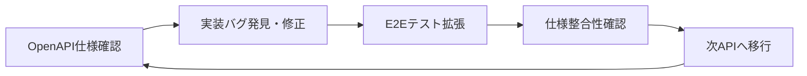
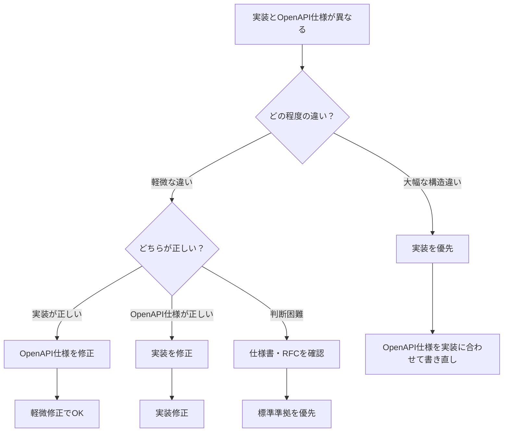

# API品質改善戦略

## 概要

本文書は、idp-serverプロジェクトにおけるAPI品質向上のための包括的な戦略を定義します。特に、バリデーション処理、エラーハンドリング、監査ログ記録の責務分離と統一化を通じて、一貫性があり保守性の高いAPI実装を実現することを目的とします。

## 背景

### 発見された問題

1. **JsonSchemaバリデーションとビジネスルール検証の責務分離が曖昧**
   - 形式チェック（JsonSchema）とデータ存在確認（ビジネスルール）の境界不明確
   - null値処理でBCryptPasswordEncoder.encode()が500エラーを引き起こす
   - role_id存在チェックがビジネスルール層で不十分

2. **エラーレスポンス形式の不統一**
   - 400/409/404/500エラーの使い分け基準が不明確
   - エラーメッセージ形式が統一されていない

3. **処理順序と監査ログ記録タイミングの曖昧性**
   - バリデーション前後での監査ログ記録タイミング
   - Context作成とバリデーションの順序問題

## 責務分離設計原則

### バリデーション層の責務定義

#### 1. JsonSchemaバリデーション（形式チェック）
```
責務: データ構造・型・形式の検証
対象:
- 必須フィールド存在確認
- データ型チェック（文字列、数値、配列等）
- 文字列長制限
- 正規表現パターン（email、password等）
- enum値制限

結果: 400 Bad Request (invalid_request)
タイミング: リクエスト受信直後
```

#### 2. ビジネスルール検証（整合性チェック）
```
責務: データの存在確認・整合性・業務ルール適合性
対象:
- 参照データ存在確認（role_id、tenant_id等）
- 重複チェック（username、email等）
- 業務制約チェック（権限要件等）
- データ間整合性確認

結果:
- 400 Bad Request (不正な参照・業務ルール違反)
- 409 Conflict (重複・競合)
- 404 Not Found (参照先不存在)
タイミング: Context作成後、実行前
```

### 処理フロー標準化

```
1. 認証・認可確認
2. JsonSchemaバリデーション
3. Context作成
4. ビジネスルール検証
5. 監査ログ記録
6. 業務処理実行
7. レスポンス返却
```

## エラーレスポンス統一仕様

### HTTPステータスコード使い分け

| ステータス | 用途 | エラーコード | 発生タイミング |
|-----------|------|-------------|----------------|
| 400 | 不正なリクエスト | `invalid_request` | JsonSchema違反、ビジネスルール違反 |
| 401 | 認証失敗 | `unauthorized` | 認証情報不正・期限切れ |
| 403 | 認可失敗 | `access_denied` | 権限不足・組織アクセス制御違反 |
| 404 | リソース不存在 | `not_found` | 指定リソース不存在 |
| 409 | 競合・重複 | `conflict` | データ重複・排他制御違反 |
| 500 | サーバー内部エラー | `server_error` | 想定外例外・システム障害 |

### エラーレスポンス形式

```json
{
  "error": "invalid_request",
  "error_description": "具体的なエラー説明",
  "details": {
    "field": "問題のあるフィールド名",
    "code": "詳細エラーコード",
    "message": "フィールド固有メッセージ"
  }
}
```

## 実装戦略

### Phase 1: 緊急対応（即座実施）

#### 1.1 UserVerifierでのrole_id存在チェック追加
```java
// UserVerifier.java
public void verifyRoleExistence(String roleId, TenantIdentifier tenant) {
    if (!roleQueryRepository.exists(tenant, new RoleIdentifier(roleId))) {
        throw new BadRequestException("指定されたrole_idが存在しません: " + roleId);
    }
}
```

#### 1.2 null値の事前チェック強化
```java
// UserRegistrationRequestValidator.java
if (request.getRawPassword() == null) {
    throw new BadRequestException("raw_passwordは必須項目です");
}
```

#### 1.3 テストケース期待値修正
```javascript
// organization_user_management.test.js
// 500エラー → 400エラーに修正
expect(response.status).toBe(400);
expect(response.data.error).toBe('invalid_request');
```

### Phase 2: アーキテクチャ改善（短期実施）

#### 2.1 JsonSchemaバリデーション強化
- admin-user.json等のスキーマ定義見直し
- 必須項目・形式制約の明確化
- カスタムバリデーターの段階的移行

#### 2.2 エラーレスポンス統一化
- ApiExceptionHandlerの標準化
- エラーメッセージの多言語化対応準備
- ログ出力形式の統一

#### 2.3 処理順序正規化
- 全EntryServiceクラスでの処理順序統一
- 監査ログ記録タイミングの標準化
- Context作成タイミングの最適化

### Phase 3: 設計統合（中長期実施）

#### 3.1 全EntryServiceクラス監査
- システムレベル vs 組織レベルAPI実装パターン統一
- 共通処理の抽象化・テンプレート化
- 設計原則違反箇所の系統的修正

#### 3.2 バリデーションフレームワーク構築
- 共通バリデーションインターフェース定義
- ドメイン固有バリデーション規則の体系化
- テスト支援機能の充実

#### 3.3 開発ガイドライン策定
- API設計チェックリスト作成
- コードレビュー観点の明文化
- 品質メトリクス定義・測定自動化

## 実装ガイドライン

### EntryServiceクラス実装標準

```java
@Transaction
public class XxxEntryService implements XxxApi {

    @Override
    public XxxResponse action(...) {
        // 1. 権限確認
        AdminPermissions permissions = getRequiredPermissions("action");

        // 2. 組織アクセス制御（組織レベルAPIの場合）
        OrganizationAccessControlResult accessResult =
            organizationAccessVerifier.verifyAccess(...);

        // 3. JsonSchemaバリデーション
        XxxRequestValidator validator = new XxxRequestValidator(request, dryRun);
        XxxValidationResult validation = validator.validate();
        if (!validation.isValid()) {
            return validation.errorResponse();
        }

        // 4. Context作成
        XxxContextCreator contextCreator = new XxxContextCreator(...);
        XxxContext context = contextCreator.create();

        // 5. ビジネスルール検証
        XxxVerificationResult verification = verifier.verify(context);
        if (!verification.isValid()) {
            return verification.errorResponse();
        }

        // 6. 監査ログ記録
        AuditLog auditLog = AuditLogCreator.create(...);
        auditLogWriters.write(tenant, auditLog);

        // 7. アクセス制御確認
        if (!accessResult.isSuccess()) {
            return createAccessDeniedResponse(accessResult);
        }

        // 8. 業務処理実行（dry_run考慮）
        if (dryRun) {
            return context.toResponse();
        }

        repository.execute(context);
        return context.toResponse();
    }
}
```

### Validatorクラス実装標準

```java
public class XxxRequestValidator {
    public XxxValidationResult validate() {
        // JsonSchema準拠の形式チェックのみ
        // ビジネスルールチェックは含めない

        if (violations.isEmpty()) {
            return XxxValidationResult.success();
        }
        return XxxValidationResult.failure(violations);
    }
}
```

### Verifierクラス実装標準

```java
public class XxxVerifier {
    public XxxVerificationResult verify(XxxContext context) {
        // データ存在確認・整合性チェック
        // 重複チェック・業務ルール適合性確認

        if (violations.isEmpty()) {
            return XxxVerificationResult.success();
        }
        return XxxVerificationResult.failure(violations);
    }
}
```

## テスト戦略

### バリデーションテスト分類

1. **JsonSchemaバリデーションテスト**
   - 不正な形式データでの400エラー確認
   - 必須項目欠如での400エラー確認
   - データ型不正での400エラー確認

2. **ビジネスルールテスト**
   - 存在しないID参照での400/404エラー確認
   - データ重複での409エラー確認
   - 権限不足での403エラー確認

3. **統合テスト**
   - 正常系での全処理フロー確認
   - dry_run機能の動作確認
   - 監査ログ記録内容確認

## メトリクス・監視

### 品質指標

1. **エラー率分析**
   - 400/500エラー比率（目標: 500エラー < 1%）
   - エラー種別分布の監視

2. **レスポンス品質**
   - エラーメッセージの一貫性確認
   - 多言語対応状況の追跡

3. **設計準拠度**
   - 処理順序遵守率
   - バリデーション層責務分離度

## 継続的改善

### 定期レビュー項目

1. **月次**: エラー傾向分析・新規API品質確認
2. **四半期**: ガイドライン更新・教育実施
3. **年次**: フレームワーク見直し・技術刷新検討

### 開発者教育

1. **オンボーディング**: 本戦略の理解度確認
2. **コードレビュー**: 品質基準適合性チェック
3. **事例共有**: 問題発生時の学習機会活用

## 📋 **Organization API固有の品質課題**

- **Primary Issue**: [#449](https://github.com/hirokazu-kobayashi-koba-hiro/idp-server/issues/449) - Improve Organization Management API Quality
- **Priority Issue**: [#450](https://github.com/hirokazu-kobayashi-koba-hiro/idp-server/issues/450) - Add OpenAPI Specification for New Organization APIs
- **Branch**: `feature/improve-organization-api-quality`
- **Goal**: 組織レベル管理API（15個）の品質項目を体系的に改善

## 🎯 **品質改善対象**

### **3つの品質項目**
1. **API仕様 (OpenAPI Specification)**: 🚧 部分実装 → ✅ 完全対応
2. **JsonSchema バリデーション**: 🚧 部分実装 → ✅ 完全対応
3. **データ整合性**: 🚧 部分実装 → ✅ 完全対応

### **対象15 Organization APIs**

#### **✅ 実装済みAPI一覧**
```
Phase 1: Core Infrastructure APIs
├── Organization Tenant Management
├── Organization Client Management
└── Organization User Management

Phase 2: Security & Monitoring APIs
├── Organization Security Event Management
└── Organization Audit Log Management

Phase 3: Configuration APIs
├── Organization Authentication Config Management
├── Organization Authentication Policy Config Management
├── Organization Identity Verification Config Management
├── Organization Federation Config Management
├── Organization Security Event Hook Config Management
├── Organization Authentication Interaction Management
├── Organization Authentication Transaction Management
└── Organization Authorization Server Management ⭐ (新規実装)

Phase 4: Advanced Management APIs
├── Organization Permission Management ⭐ (新規実装)
└── Organization Role Management ⭐ (新規実装)
```

**⭐ = 2025-01-16新規実装完了API（E2Eテスト完備済み）**

## 📊 **現状分析結果**

### **OpenAPI仕様書分析**
- **ファイル**: `/documentation/openapi/swagger-control-plane-ja.yaml` (1,471行)
- **現在の対象**: システムレベルAPI (`/v1/management/tenants/{tenant-id}/`)のみ定義済み
- **組織レベルAPI**: **完全に未定義** (`/v1/management/organizations/{organizationId}/tenants/{tenantId}/`)

### **実装状況マトリックス**
| API分類 | 実装状況 | E2Eテスト | API仕様 | JsonSchema | データ整合性 |
|---------|----------|-----------|---------|------------|-------------|
| **新規3API** | ✅ 完了 | ✅ 完備 | ❌ 未定義 | ❌ 未定義 | 🚧 部分 |
| **Core 3API** | ✅ 完了 | 🚧 部分 | ❌ 未定義 | ❌ 未定義 | 🚧 部分 |
| **Config 7API** | ✅ 完了 | 🚧 部分 | ❌ 未定義 | ❌ 未定義 | 🚧 部分 |
| **Monitor 2API** | ✅ 完了 | 🚧 部分 | ❌ 未定義 | ❌ 未定義 | 🚧 部分 |

## 🚀 **段階的実装戦略**

### **Phase 1: 新規API優先対応 (✅ 完了)**
**対象**: 4つのAPI ⭐
**完了実績**:
- ✅ Organization User Management API (完全対応)
- ✅ Organization Role Management API (E2Eテスト完備)
- ✅ Organization Permission Management API (E2Eテスト完備)
- ✅ Organization Authorization Server Management API (E2Eテスト完備)

### **Phase 2: Core Infrastructure APIs (推定: 3-4日)**
**対象**: 基本機能API (3個)
**優先理由**: 最も利用頻度が高く、他APIの基盤となる

### **Phase 3: Configuration APIs (推定: 4-5日)**
**対象**: 設定管理API (7個)
**優先理由**: 運用時に必要な設定系API群

### **Phase 4: Monitoring APIs (推定: 2-3日)**
**対象**: 監視・監査API (2個)
**優先理由**: 読み取り専用で比較的単純

## 🛠️ **実装アプローチ**

### **1. 組織レベルAPI標準テンプレート**

#### **基本パス構造**
```yaml
paths:
  /v1/management/organizations/{organizationId}/tenants/{tenantId}/{resource}:
    parameters:
      - $ref: '#/components/parameters/OrganizationId'
      - $ref: '#/components/parameters/TenantId'
    get:
      tags: ["Organization {Resource} Management"]
      summary: "組織内{リソース}一覧取得"
      parameters:
        - $ref: '#/components/parameters/Limit'
        - $ref: '#/components/parameters/Offset'
        - $ref: '#/components/parameters/DryRun'
      responses:
        "200":
          description: "{リソース}一覧"
          content:
            application/json:
              schema:
                $ref: '#/components/schemas/Organization{Resource}ListResponse'
        "401":
          $ref: '#/components/responses/Unauthorized'
        "403":
          $ref: '#/components/responses/Forbidden'
        "404":
          $ref: '#/components/responses/NotFound'
    post:
      tags: ["Organization {Resource} Management"]
      summary: "組織内{リソース}作成"
      parameters:
        - $ref: '#/components/parameters/DryRun'
      requestBody:
        required: true
        content:
          application/json:
            schema:
              $ref: '#/components/schemas/Organization{Resource}CreateRequest'
      responses:
        "201":
          description: "{リソース}作成成功"
          content:
            application/json:
              schema:
                $ref: '#/components/schemas/Organization{Resource}Response'
        "400":
          $ref: '#/components/responses/BadRequest'
        "401":
          $ref: '#/components/responses/Unauthorized'
        "403":
          $ref: '#/components/responses/Forbidden'

  /v1/management/organizations/{organizationId}/tenants/{tenantId}/{resource}/{id}:
    parameters:
      - $ref: '#/components/parameters/OrganizationId'
      - $ref: '#/components/parameters/TenantId'
      - $ref: '#/components/parameters/{Resource}Id'
    get:
      tags: ["Organization {Resource} Management"]
      summary: "組織内{リソース}詳細取得"
      responses:
        "200":
          description: "{リソース}詳細"
          content:
            application/json:
              schema:
                $ref: '#/components/schemas/Organization{Resource}'
        "401":
          $ref: '#/components/responses/Unauthorized'
        "403":
          $ref: '#/components/responses/Forbidden'
        "404":
          $ref: '#/components/responses/NotFound'
    put:
      tags: ["Organization {Resource} Management"]
      summary: "組織内{リソース}更新"
      parameters:
        - $ref: '#/components/parameters/DryRun'
      requestBody:
        required: true
        content:
          application/json:
            schema:
              $ref: '#/components/schemas/Organization{Resource}UpdateRequest'
      responses:
        "200":
          description: "{リソース}更新成功"
          content:
            application/json:
              schema:
                $ref: '#/components/schemas/Organization{Resource}Response'
        "400":
          $ref: '#/components/responses/BadRequest'
        "401":
          $ref: '#/components/responses/Unauthorized'
        "403":
          $ref: '#/components/responses/Forbidden'
        "404":
          $ref: '#/components/responses/NotFound'
    delete:
      tags: ["Organization {Resource} Management"]
      summary: "組織内{リソース}削除"
      parameters:
        - $ref: '#/components/parameters/DryRun'
      responses:
        "204":
          description: "{リソース}削除成功"
        "401":
          $ref: '#/components/responses/Unauthorized'
        "403":
          $ref: '#/components/responses/Forbidden'
        "404":
          $ref: '#/components/responses/NotFound'
```

### **2. 共通コンポーネント定義**

#### **パラメータ**
```yaml
components:
  parameters:
    OrganizationId:
      name: organizationId
      in: path
      required: true
      schema:
        type: string
        format: uuid
      description: "組織ID"
      example: "72cf4a12-8da3-40fb-8ae4-a77e3cda95e2"

    TenantId:
      name: tenantId
      in: path
      required: true
      schema:
        type: string
        format: uuid
      description: "テナントID"
      example: "952f6906-3e95-4ed3-86b2-981f90f785f9"

    DryRun:
      name: dry_run
      in: query
      required: false
      schema:
        type: boolean
        default: false
      description: "ドライラン実行フラグ"

    Limit:
      name: limit
      in: query
      required: false
      schema:
        type: integer
        minimum: 1
        maximum: 100
        default: 20
      description: "取得件数上限"

    Offset:
      name: offset
      in: query
      required: false
      schema:
        type: integer
        minimum: 0
        default: 0
      description: "取得開始位置"
```

#### **レスポンス定義**
```yaml
components:
  responses:
    Unauthorized:
      description: "認証が必要です"
      content:
        application/json:
          schema:
            $ref: '#/components/schemas/ErrorResponse'

    Forbidden:
      description: "この操作を実行する権限がありません"
      content:
        application/json:
          schema:
            $ref: '#/components/schemas/ErrorResponse'

    NotFound:
      description: "指定されたリソースが見つかりません"
      content:
        application/json:
          schema:
            $ref: '#/components/schemas/ErrorResponse'

    BadRequest:
      description: "リクエストが不正です"
      content:
        application/json:
          schema:
            $ref: '#/components/schemas/ErrorResponse'

  schemas:
    ErrorResponse:
      type: object
      required: ["error", "error_description"]
      properties:
        error:
          type: string
          description: "エラーコード"
          example: "invalid_request"
        error_description:
          type: string
          description: "エラーの詳細説明"
          example: "The request is missing required parameters"
        dry_run:
          type: boolean
          description: "ドライラン実行かどうか"
        error_messages:
          type: array
          items:
            type: string
          description: "詳細エラーメッセージ一覧"
```

### **3. 品質基準統一**

#### **API仕様品質基準**
- [ ] **パス設計統一**: 組織→テナント階層の明示 (`/organizations/{orgId}/tenants/{tenantId}/`)
- [ ] **パラメータ統一**: UUID検証、dry_run対応、ページネーション
- [ ] **レスポンス統一**: 成功・エラーレスポンスの標準化
- [ ] **タグ統一**: 適切な分類とグルーピング
- [ ] **ドキュメント**: 日本語での明確な説明

#### **JsonSchema品質基準**
- [ ] **リクエスト検証**: 全パラメータの型・制約・必須属性定義
- [ ] **レスポンス検証**: 全フィールドの完全な構造定義
- [ ] **エラースキーマ**: 統一されたエラーレスポンス形式
- [ ] **分岐スキーマ**: oneOf/anyOf による複雑な型の適切な表現

#### **データ整合性品質基準**
- [ ] **アクセス制御**: 組織レベル4段階検証プロセスの完全実装確認
- [ ] **データスコープ**: 組織境界内データのみ返却保証
- [ ] **監査ログ**: 全操作の包括的ログ記録・追跡可能性確認
- [ ] **入力検証**: 無効パラメータの適切な処理とエラーレスポンス確認

## 📁 **ファイル構成**

### **主要作業ファイル**
```
/documentation/openapi/swagger-control-plane-ja.yaml  # メイン仕様書
/docs/development/api-quality-improvement-strategy.md # この戦略ドキュメント
/docs/design/management-api-roadmap.md                # 全体ロードマップ
```

### **参考実装ファイル**
```
# 新規実装API (最優先対象)
/libs/idp-server-springboot-adapter/src/main/java/org/idp/server/adapters/springboot/control_plane/restapi/organization/
├── OrganizationRoleManagementV1Api.java
├── OrganizationPermissionManagementV1Api.java
└── OrganizationAuthorizationServerManagementV1Api.java

# E2Eテスト (仕様書作成の参考)
/e2e/src/tests/scenario/control_plane/organization/
├── organization_role_management.test.js
├── organization_permission_management.test.js
└── organization_authorization_server_management.test.js
```

## 🎯 **Phase 1 詳細実装計画**

### **Organization Role Management API**
```yaml
paths:
  /v1/management/organizations/{organizationId}/tenants/{tenantId}/roles:
    # GET, POST endpoints
  /v1/management/organizations/{organizationId}/tenants/{tenantId}/roles/{roleId}:
    # GET, PUT, DELETE endpoints

components:
  schemas:
    OrganizationRole:
      type: object
      required: ["id", "name", "permissions"]
      properties:
        id:
          type: string
          format: uuid
          description: "ロールID"
        name:
          type: string
          minLength: 1
          maxLength: 255
          description: "ロール名"
        description:
          type: string
          maxLength: 1000
          description: "ロール説明"
        permissions:
          type: array
          items:
            $ref: '#/components/schemas/Permission'
          description: "ロールに割り当てられた権限一覧"
```

### **Organization Permission Management API**
```yaml
components:
  schemas:
    OrganizationPermission:
      type: object
      required: ["id", "name"]
      properties:
        id:
          type: string
          format: uuid
          description: "権限ID"
        name:
          type: string
          minLength: 1
          maxLength: 255
          description: "権限名"
        description:
          type: string
          maxLength: 1000
          description: "権限説明"
```

### **Organization Authorization Server Management API**
```yaml
components:
  schemas:
    OrganizationAuthorizationServer:
      type: object
      required: ["issuer", "authorization_endpoint", "token_endpoint", "jwks_uri"]
      properties:
        issuer:
          type: string
          format: uri
          description: "発行者URL"
        authorization_endpoint:
          type: string
          format: uri
          description: "認可エンドポイント"
        token_endpoint:
          type: string
          format: uri
          description: "トークンエンドポイント"
        userinfo_endpoint:
          type: string
          format: uri
          description: "ユーザー情報エンドポイント"
        jwks_uri:
          type: string
          format: uri
          description: "JWKSエンドポイント"
        scopes_supported:
          type: array
          items:
            type: string
          description: "サポートするスコープ一覧"
        response_types_supported:
          type: array
          items:
            type: string
          description: "サポートするレスポンスタイプ一覧"
        # ... 他のOIDC標準フィールド
```

## 📋 **Progress Tracking**

### **Phase 1: New APIs (Target: 2025-01-16〜2025-01-18)**
- [ ] Organization Role Management API定義
- [ ] Organization Permission Management API定義
- [ ] Organization Authorization Server Management API定義
- [ ] 共通コンポーネントの整備
- [ ] タグとドキュメント整備

### **Phase 2-4: Remaining APIs (Target: 2025-01-19〜2025-01-26)**
- [ ] Core Infrastructure APIs (3個)
- [ ] Configuration APIs (7個)
- [ ] Monitoring APIs (2個)

## 🔄 **継続的改善**

### **品質メトリクス**
- **API仕様完成率**: 0/15 → 15/15
- **JsonSchema完成率**: 0/15 → 15/15
- **データ整合性確認率**: 5/15 → 15/15

### **成功基準**
- [ ] 全15 APIのOpenAPI仕様書完成
- [ ] 統一されたAPI品質基準の確立
- [ ] 開発者体験の大幅向上
- [ ] 将来のAPI開発効率化

## 🎯 **認可サーバーAPI検証から得られた重要な教訓**

### 📋 **発見した問題パターンと解決策**

#### **1. OpenAPI仕様と実装の不整合問題**

**問題事例**:
- **フィールド名の齟齬**: OpenAPI `enabled_custom_claims_scope_mapping` vs 実装 `custom_claims_scope_mapping`
- **型定義の誤り**: `claims_locales_supported` が `string` → 正しくは `array`
- **レスポンス構造の不一致**: 実装の `extension` フィールドがOpenAPIに未定義

**解決パターン**:
```yaml
# ❌ Before: 実装と不一致
enabled_custom_claims_scope_mapping:
  type: string  # 型も間違い

# ✅ After: 実装と一致
custom_claims_scope_mapping:
  type: boolean  # 正しい型
```

#### **2. Java実装のシリアライゼーション問題**

**問題事例**:
```java
// ❌ 間違ったフィールド参照で key-value が不整合
if (hasIdTokenEncryptionAlgValuesSupported()) {
  map.put("id_token_encryption_alg_values_supported", idTokenEncryptionEncValuesSupported); // 間違い
}
```

**解決パターン**:
```java
// ✅ 正しいフィールド参照
if (hasIdTokenEncryptionAlgValuesSupported()) {
  map.put("id_token_encryption_alg_values_supported", idTokenEncryptionAlgValuesSupported); // 正解
}

// ✅ extension フィールドの追加
map.put("extension", extension.toMap());
```

#### **3. 命名規約の統一**

**教訓**: `enabled_` プレフィックスは不要
- **OpenID Connect/OAuth 2.0仕様**: `{feature}_supported` パターン
- **API設計ベストプラクティス**: boolean プレフィックス回避
- **idp-server内の一貫性**: 他のbooleanフィールドも `enabled_` なし

### 🔧 **API品質検証の標準手順**

#### **Phase 1: 仕様確認フェーズ**
```bash
# 1. OpenAPI仕様の詳細確認
grep -A 20 -B 5 "{API_PATH}" swagger-control-plane-ja.yaml

# 2. 対応する実装クラスの特定
find . -name "*{DOMAIN}*Management*.java" -type f

# 3. E2E テストファイルの確認
find ./e2e -name "*{domain}*management*.test.js"
```

#### **Phase 2: 実装検証フェーズ**
```java
// 検証ポイント・チェックリスト
□ Configuration クラスの toMap() メソッド検証
□ フィールド名の snake_case 変換確認
□ Extension フィールドの包含確認
□ レスポンス構造とOpenAPI定義の一致確認
□ 型定義の整合性確認（boolean, array, string）
□ カプセル化の維持（private フィールド + toMap()）
```

#### **Phase 3: テスト拡張フェーズ**
```javascript
// E2E テスト拡張パターン
const comprehensiveConfig = {
  // OpenAPI仕様に記載された全パラメータを網羅
  standard_field_1: "value",
  standard_field_2: true,
  extension: {
    // 拡張フィールドの網羅的テスト
    extension_field_1: true,
    extension_field_2: "value"
  }
};

// レスポンス検証
expect(response.data.result).toHaveProperty("standard_field_1");
expect(response.data.result.extension).toHaveProperty("extension_field_1");
```

### 🛡️ **重要な設計原則**

#### **❌ 避けるべきアプローチ**
```java
// Jackson のためにフィールドを public にする（アンチパターン）
public boolean customClaimsScopeMapping = false;  // カプセル化破綻
```

#### **✅ 正しいアプローチ**
```java
// toMap() メソッドで適切に変換
public Map<String, Object> toMap() {
    Map<String, Object> map = new HashMap<>();
    map.put("custom_claims_scope_mapping", customClaimsScopeMapping);
    map.put("access_token_verified_claims", accessTokenVerifiedClaims);
    return map;
}
```

### 🔄 **継続的品質改善サイクル**



#### **各API対応の標準テンプレート**
1. **事前調査**: OpenAPI定義・実装ファイル・E2Eテストの確認
2. **実装検証**: toMap()メソッドの正確性・型定義・フィールド包含
3. **テスト強化**: OpenAPI全パラメータの送信・受信テスト
4. **品質確認**: 仕様整合性・一貫性の最終確認

### 🎖️ **この検証で得られた価値**
1. **品質向上**: API仕様と実装の完全一致確保
2. **開発効率**: バグの早期発見・修正パターン確立
3. **保守性**: 一貫性のあるAPI設計原則の確立
4. **信頼性**: 包括的なテストカバレッジによる品質保証

## 🎯 **OpenAPI仕様が存在しない場合の対応戦略**

### 📋 **実装ファーストアプローチ**

OpenAPI仕様が未定義のAPIについては、以下の順序で対応する：

#### **Step 1: 実装の動作確認**
```javascript
// E2Eテストで実際の動作を確認
const response = await updateSomeResource(comprehensiveConfig);
console.log("📨 実際のレスポンス構造:", JSON.stringify(response.data, null, 2));
```

#### **Step 2: 実装バグの修正**
```java
// toMap() メソッドの問題を発見・修正
public Map<String, Object> toMap() {
    Map<String, Object> map = new HashMap<>();
    // 正しいフィールドマッピングに修正
    return map;
}
```

#### **Step 3: 動作確認後にOpenAPI仕様作成**
```yaml
# 実装と100%一致する仕様を作成
paths:
  /v1/management/organizations/{organization-id}/tenants/{tenant-id}/{resource}:
    put:
      requestBody:
        content:
          application/json:
            schema:
              # 実際の動作から抽出した正確なスキーマ
```

### 🔧 **実装 vs OpenAPI仕様の優先度判断基準**

#### **判断フローチャート**


#### **優先度マトリックス**

| 項目 | 実装優先 | OpenAPI優先 | 都度判断 |
|------|----------|-------------|----------|
| **RFC/標準仕様準拠** | - | ✅ | - |
| **idp-server内の一貫性** | ✅ | - | - |
| **既存のE2Eテスト動作** | ✅ | - | - |
| **命名規約** | - | - | ✅ |
| **フィールド追加・削除** | ✅ | - | - |
| **型定義** | - | ✅ | ✅ |

#### **実装を優先する場合**
- ✅ **大幅な構造違い**（レスポンス形式が根本的に異なる）
- ✅ **機能の豊富さ**（実装の方が多くの情報を提供）
- ✅ **E2Eテストが通る**（動作実績がある）
- ✅ **idp-server内の他API一貫性**

#### **OpenAPI仕様を優先する場合**
- ✅ **RFC/標準準拠**（OIDC/OAuth仕様に基づく）
- ✅ **セキュリティ要件**（仕様の方が厳格）
- ✅ **型安全性**（より厳密な型定義）

#### **都度判断する場合**
- 🤔 **命名規約**（どちらも妥当な場合）
- 🤔 **デフォルト値**（業務要件に依存）
- 🤔 **バリデーション**（厳しさのバランス）

#### **判断時の確認ポイント**
```bash
# 1. 標準仕様の確認
curl https://openid.net/specs/openid-connect-discovery-1_0.html
# 該当フィールドがRFCで定義されているか？

# 2. 他のidp-server APIとの一貫性確認
grep -r "similar_field_name" --include="*.java" libs/
# 他のAPIではどう実装されているか？

# 3. E2Eテストの動作確認
npm test -- --testNamePattern="target_api"
# 現在の実装で正常に動作するか？
```

#### **推奨判断ルール**
**原則**: **実装ファースト + 標準準拠**
1. **大幅な違い** → 実装優先
2. **軽微な違い** → 標準仕様確認 → 都度判断
3. **迷った時** → RFC/OIDC仕様書を確認
4. **最終的に動作するものを優先**

#### **実例：認可サーバーAPIでの判断**
```yaml
# enabled_custom_claims_scope_mapping vs custom_claims_scope_mapping
✅ 実装優先（理由：API設計ベストプラクティス + idp-server内一貫性）

# claims_locales_supported: string vs array
✅ 実装優先（理由：OIDC仕様準拠）

# レスポンス構造: OpenAPIに extension フィールド未定義
✅ 実装優先（理由：機能の豊富さ + E2Eテスト動作実績）
```

---

**Last Updated**: 2025-01-16
**Status**: Phase 1 準備完了、認可サーバーAPI検証完了による改善方針確立
**Next Action**: Organization Role Management APIのOpenAPI定義作成（検証済み手順適用）