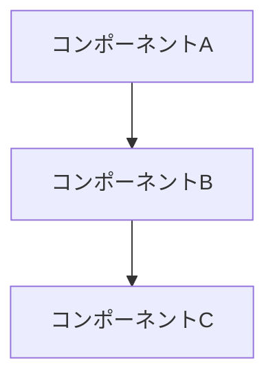

# 分析文書：{分析対象}

## 📋 分析概要

### 分析目的
- なぜこの分析を行うか
- 何を明らかにしたいか
- 分析結果をどう活用するか

### 分析対象
- 調査対象のシステム・技術・製品
- 分析範囲・境界
- 調査期間

### 分析方法
- 使用した調査手法
- 情報収集方法
- 検証方法

## 🔍 調査結果

### 主要な発見事項
1. **発見1**: 詳細説明
2. **発見2**: 詳細説明
3. **発見3**: 詳細説明

### 詳細分析

#### 技術的側面
- アーキテクチャの特徴
- 使用技術・フレームワーク
- パフォーマンス特性
- セキュリティ機能

#### 機能的側面
- 提供機能一覧
- 機能の特徴・制約
- ユーザビリティ
- 拡張性

#### 運用的側面
- デプロイ・運用の容易さ
- 監視・ログ機能
- スケーラビリティ
- メンテナンス性

## 📊 比較分析（競合分析の場合）

### 比較対象
| 項目 | 対象A | 対象B | idp-server | 備考 |
|------|-------|-------|-------------|------|
| 機能1 | ○ | × | ○ | 詳細 |
| 機能2 | ○ | ○ | △ | 詳細 |
| パフォーマンス | 高 | 中 | 高 | 詳細 |

### 強み・弱み分析

#### 対象Aの特徴
**強み**:
- 強み1
- 強み2

**弱み**:
- 弱み1
- 弱み2

#### 対象Bの特徴
**強み**:
- 強み1
- 強み2

**弱み**:
- 弱み1
- 弱み2

## 💡 技術的考察

### アーキテクチャ分析


### 実装パターン分析
- 使用されている設計パターン
- アーキテクチャの特徴
- 技術選択の理由

### パフォーマンス分析
| メトリクス | 対象A | 対象B | 基準値 |
|-----------|-------|-------|--------|
| レスポンス時間 | XXXms | XXXms | <100ms |
| スループット | XXX/sec | XXX/sec | >1000/sec |

## 🎯 idp-serverへの適用可能性

### 適用可能な技術・手法
1. **技術1**: 適用方法と期待効果
2. **技術2**: 適用方法と期待効果
3. **技術3**: 適用方法と期待効果

### 適用時の課題・制約
- 技術的制約
- リソース制約
- 時間的制約

### 実装優先度
| 項目 | 優先度 | 理由 | 実装難易度 |
|------|--------|------|-----------|
| 改善項目1 | High | 理由 | Medium |
| 改善項目2 | Medium | 理由 | High |

## 📈 定量的分析（パフォーマンス分析の場合）

### 測定環境
- ハードウェア仕様
- ソフトウェア環境
- 測定条件

### 測定結果
#### レスポンス時間
```
平均: XXXms
P95: XXXms
P99: XXXms
最大: XXXms
```

#### スループット
```
平均: XXX req/sec
最大: XXX req/sec
```

### ボトルネック分析
1. **ボトルネック1**: 原因と対策
2. **ボトルネック2**: 原因と対策

## 🔒 セキュリティ分析（セキュリティ分析の場合）

### セキュリティ機能
- 認証機能
- 認可機能
- データ保護機能
- 監査機能

### 脆弱性分析
| 脆弱性 | 影響度 | 対策状況 | 推奨対応 |
|--------|--------|----------|----------|
| 脆弱性1 | High | 未対応 | 対策内容 |

### セキュリティベストプラクティス
- 推奨セキュリティ設定
- セキュリティ運用手順

## 💡 結論・推奨事項

### 主要な結論
1. **結論1**: 根拠と詳細
2. **結論2**: 根拠と詳細
3. **結論3**: 根拠と詳細

### 推奨アクション
#### 短期（1-3ヶ月）
- [ ] アクション1
- [ ] アクション2

#### 中期（3-6ヶ月）
- [ ] アクション3
- [ ] アクション4

#### 長期（6ヶ月以上）
- [ ] アクション5
- [ ] アクション6

### 次のステップ
- 追加調査が必要な項目
- 検証すべき仮説
- 実装計画への反映事項

## 📚 参考資料

### 調査対象の公式資料
- [公式ドキュメント](https://example.com)
- [技術仕様書](https://example.com)

### 関連技術資料
- [関連論文](https://example.com)
- [技術記事](https://example.com)

### 内部関連文書
- [関連設計文書](../design/related-design.md)
- [関連分析文書](./related-analysis.md)

## 📝 調査詳細ログ

### 調査手順
1. 手順1: 実施内容と結果
2. 手順2: 実施内容と結果
3. 手順3: 実施内容と結果

### 測定データ（生データ）
```
測定日時: YYYY-MM-DD HH:MM:SS
測定条件: 詳細条件
測定結果:
- データ1
- データ2
```

### 注意事項・制限事項
- 調査時の制限事項
- 結果解釈時の注意点
- 再現性に関する考慮事項