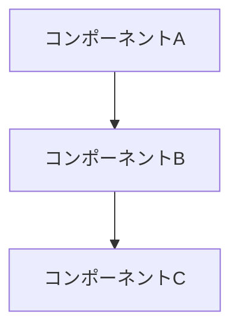
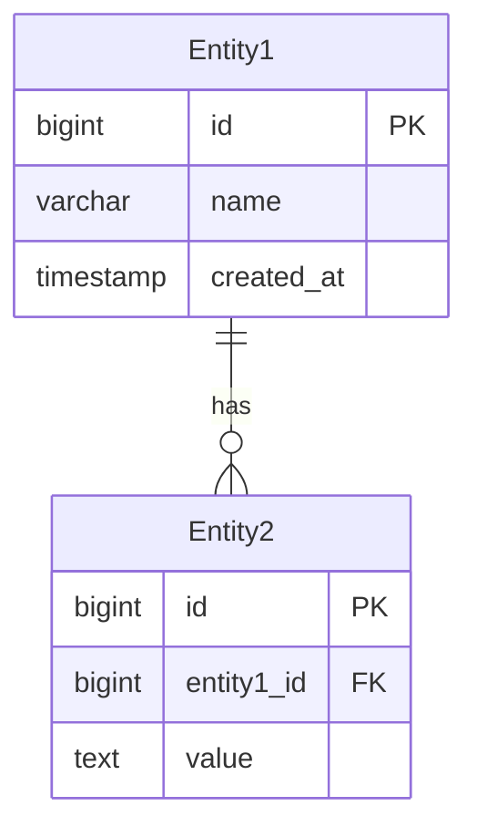

# 設計文書：{機能名}

## 📋 概要

この設計文書では、{機能名}の実装について詳細に定義します。

### 背景・動機
- なぜこの機能が必要か
- 現在の課題・制限事項
- ビジネス価値・技術的価値

### 目標
- 解決したい課題
- 達成したい状態
- 成功指標

## 🎯 要件

### 機能要件
1. 必須機能1
2. 必須機能2
3. オプション機能

### 非機能要件
- **パフォーマンス**: レスポンス時間、スループット要件
- **セキュリティ**: 認証・認可・データ保護要件
- **スケーラビリティ**: 拡張性要件
- **可用性**: アップタイム要件
- **保守性**: メンテナンス・拡張の容易さ

### 制約事項
- 技術的制約
- リソース制約
- 時間的制約

## 🏗️ アーキテクチャ設計

### システム全体図


### 主要コンポーネント
#### コンポーネント1
- **責務**: 何を担当するか
- **入力**: 何を受け取るか
- **出力**: 何を返すか
- **依存関係**: 他のコンポーネントとの関係

#### コンポーネント2
- **責務**:
- **入力**:
- **出力**:
- **依存関係**:

### データフロー
1. ステップ1: 処理内容
2. ステップ2: 処理内容
3. ステップ3: 処理内容

## 🗄️ データ設計

### エンティティ定義
#### Entity1
```sql
CREATE TABLE entity1 (
    id BIGSERIAL PRIMARY KEY,
    name VARCHAR(255) NOT NULL,
    created_at TIMESTAMP WITH TIME ZONE DEFAULT NOW()
);
```

#### Entity2
```sql
CREATE TABLE entity2 (
    id BIGSERIAL PRIMARY KEY,
    entity1_id BIGINT REFERENCES entity1(id),
    value TEXT
);
```

### データ関係図


## 🔌 API設計

### エンドポイント一覧
| HTTP Method | Path | 説明 |
|-------------|------|------|
| GET | `/api/v1/resources` | リソース一覧取得 |
| POST | `/api/v1/resources` | リソース作成 |
| GET | `/api/v1/resources/{id}` | リソース詳細取得 |

### API仕様例
#### POST /api/v1/resources
**リクエスト**:
```json
{
  "name": "リソース名",
  "description": "説明"
}
```

**レスポンス** (201):
```json
{
  "id": "123",
  "name": "リソース名",
  "description": "説明",
  "created_at": "2024-01-15T10:00:00Z"
}
```

## 🔒 セキュリティ考慮事項

### 認証・認可
- 使用する認証方式
- 必要な権限・スコープ
- アクセス制御の実装方法

### データ保護
- 機密データの暗号化
- 入力値検証
- SQLインジェクション対策

### セキュリティリスク分析
| リスク | 影響度 | 対策 |
|--------|--------|------|
| リスク1 | High | 対策内容 |
| リスク2 | Medium | 対策内容 |

## ⚡ パフォーマンス設計

### パフォーマンス目標
- レスポンス時間: P95 < XXXms
- スループット: XXX req/sec
- リソース使用量: CPU XX%, Memory XXX MB

### 最適化戦略
- キャッシュ戦略
- データベースインデックス
- 非同期処理

## 🧪 テスト戦略

### テストレベル
- **ユニットテスト**: 各コンポーネントの単体テスト
- **統合テスト**: コンポーネント間の連携テスト
- **E2Eテスト**: エンドツーエンドの動作確認

### テストケース
| テストケース | 期待結果 | 優先度 |
|-------------|----------|--------|
| 正常系1 | 期待する動作 | High |
| 異常系1 | エラーハンドリング | High |

## 📚 実装計画

### マイルストーン
- [ ] **Phase 1** (Week 1-2): 基本機能実装
- [ ] **Phase 2** (Week 3-4): API実装・テスト
- [ ] **Phase 3** (Week 5): パフォーマンス最適化

### タスク分解
#### Phase 1
- [ ] データベースマイグレーション作成
- [ ] エンティティクラス実装
- [ ] リポジトリ層実装

#### Phase 2
- [ ] サービス層実装
- [ ] API層実装
- [ ] ユニットテスト作成

## 🚨 リスク・課題

### 技術的リスク
| リスク | 影響 | 対策 |
|--------|------|------|
| 技術リスク1 | 影響内容 | 対策内容 |

### 運用リスク
| リスク | 影響 | 対策 |
|--------|------|------|
| 運用リスク1 | 影響内容 | 対策内容 |

## 🔗 参考資料

### 関連文書
- [関連設計文書](../design/related-design.md)
- [分析文書](../analysis/related-analysis.md)

### 外部参考資料
- [RFC XXXX - 標準仕様](https://tools.ietf.org/html/rfcXXXX)
- [技術記事・論文](https://example.com)

### 関連Issue・PR
- Issue #XXX: 関連するIssue
- PR #XXX: 実装PR

## 📝 変更履歴

| 日付 | 変更者 | 変更内容 |
|------|--------|----------|
| YYYY-MM-DD | 作成者 | 初版作成 |
| YYYY-MM-DD | レビュー者 | レビューフィードバック反映 |

## ✅ レビューチェックリスト

### 技術レビュー
- [ ] アーキテクチャは適切か
- [ ] セキュリティ要件を満たしているか
- [ ] パフォーマンス要件を満たしているか
- [ ] 既存システムとの整合性はあるか

### ビジネスレビュー
- [ ] 要件を満たしているか
- [ ] 実装可能な計画か
- [ ] リスクは適切に管理されているか