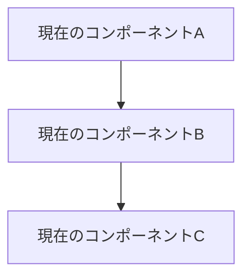
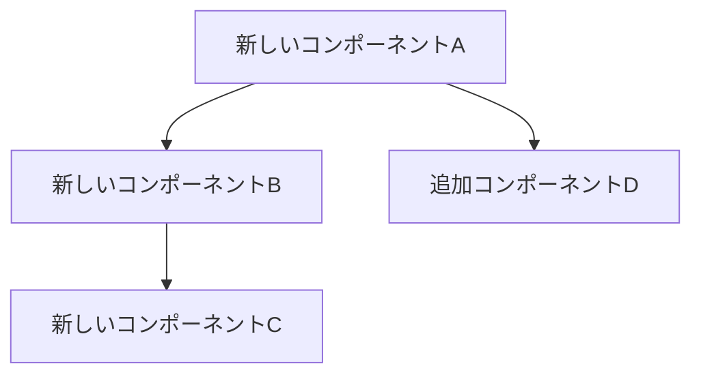

# RFC-XXX: {提案タイトル}

## 📋 概要

この提案は、{提案の簡潔な説明}について定義します。

### 提案の背景
- 現在の課題・問題点
- 改善の必要性
- ビジネス・技術的価値

### 提案の目標
- 解決したい問題
- 達成したい状態
- 成功指標

## 🎯 問題定義

### 現在の状況
- 既存システムの問題点
- 制限事項・制約
- ユーザーへの影響

### 問題の具体例
```
具体的な問題事例やエラーケース
```

### 影響範囲
- 影響を受けるユーザー・システム
- 影響の大きさ・頻度
- 放置した場合のリスク

## 💡 提案内容

### 解決アプローチ
提案する解決方法の概要説明

### 主要な変更点
1. **変更点1**: 詳細説明
2. **変更点2**: 詳細説明
3. **変更点3**: 詳細説明

### アーキテクチャ変更
#### 現在のアーキテクチャ


#### 提案後のアーキテクチャ


## 🔧 詳細設計

### API変更
#### 新規API
```http
POST /api/v1/new-endpoint
Content-Type: application/json

{
  "parameter1": "value1",
  "parameter2": "value2"
}
```

#### 既存API変更
| API | 変更内容 | 影響 | 互換性 |
|-----|----------|------|--------|
| GET /api/v1/existing | パラメータ追加 | 軽微 | 後方互換 |

### データモデル変更
#### 新規テーブル
```sql
CREATE TABLE new_table (
    id BIGSERIAL PRIMARY KEY,
    name VARCHAR(255) NOT NULL,
    created_at TIMESTAMP WITH TIME ZONE DEFAULT NOW()
);
```

#### 既存テーブル変更
```sql
-- 既存テーブルにカラム追加
ALTER TABLE existing_table
ADD COLUMN new_column VARCHAR(100);

-- インデックス追加
CREATE INDEX idx_existing_table_new_column
ON existing_table(new_column);
```

### 設定変更
```json
{
  "new_feature": {
    "enabled": true,
    "parameter1": "default_value",
    "parameter2": 100
  }
}
```

## 🔄 実装計画

### マイルストーン
- **Phase 1** (Week 1-2): 基盤実装
  - [ ] データベースマイグレーション
  - [ ] 基本API実装

- **Phase 2** (Week 3-4): 機能実装
  - [ ] メイン機能実装
  - [ ] テスト実装

- **Phase 3** (Week 5): 統合・リリース
  - [ ] 統合テスト
  - [ ] ドキュメント更新

### 必要なリソース
- **開発**: X人週
- **テスト**: X人週
- **レビュー**: X人週

### 依存関係
- 他のRFC・機能への依存
- 外部ライブラリ・サービスへの依存
- インフラ変更の必要性

## 🔍 代替案の検討

### 代替案1: {代替案名}
**概要**: 代替案の説明

**メリット**:
- メリット1
- メリット2

**デメリット**:
- デメリット1
- デメリット2

**採用しない理由**: 理由の説明

### 代替案2: {代替案名}
**概要**: 代替案の説明

**メリット**:
- メリット1
- メリット2

**デメリット**:
- デメリット1
- デメリット2

**採用しない理由**: 理由の説明

### 何もしない場合
**影響**: 現状維持した場合の影響・リスク

## ⚖️ トレードオフ分析

### メリット
1. **メリット1**: 詳細説明
2. **メリット2**: 詳細説明
3. **メリット3**: 詳細説明

### デメリット・リスク
1. **リスク1**: 詳細説明と軽減策
2. **リスク2**: 詳細説明と軽減策
3. **リスク3**: 詳細説明と軽減策

### 技術的負債
- 発生する可能性のある技術的負債
- 長期的メンテナンスの考慮事項

## 🧪 テスト戦略

### テスト範囲
- **ユニットテスト**: 新規・変更コンポーネント
- **統合テスト**: 既存システムとの連携
- **E2Eテスト**: エンドツーエンドのシナリオ
- **パフォーマンステスト**: 性能劣化の確認

### テストケース例
| テストケース | 期待結果 | 優先度 |
|-------------|----------|--------|
| 正常系1 | 正常に動作する | High |
| 異常系1 | 適切にエラーハンドリング | High |
| 境界値1 | 境界値で正常動作 | Medium |

### 回帰テスト
- 既存機能への影響確認
- パフォーマンス回帰の確認

## 📊 影響分析

### システムへの影響
| コンポーネント | 影響度 | 変更内容 | 対応必要性 |
|---------------|--------|----------|-----------|
| コンポーネント1 | High | 大幅変更 | 要対応 |
| コンポーネント2 | Low | 設定変更のみ | 軽微 |

### ユーザーへの影響
- エンドユーザーへの影響
- 管理者への影響
- 開発者への影響

### 運用への影響
- デプロイ手順の変更
- 監視項目の追加
- トラブルシューティング手順の更新

## 🔒 セキュリティ考慮事項

### セキュリティリスク分析
| リスク | 影響度 | 対策 |
|--------|--------|------|
| リスク1 | High | 対策内容 |
| リスク2 | Medium | 対策内容 |

### セキュリティ要件
- 認証・認可の要件
- データ保護の要件
- 監査ログの要件

## 🎯 成功指標

### 定量的指標
- パフォーマンス改善: XX%向上
- エラー率削減: XX%削減
- 機能利用率: XX%以上

### 定性的指標
- ユーザビリティの向上
- 開発者体験の改善
- 運用負荷の軽減

### 測定方法
- 指標の測定方法
- 測定タイミング
- 評価基準

## 🚀 ロールアウト計画

### フェーズ別リリース
1. **Alpha**: 内部テスト環境での検証
2. **Beta**: 限定ユーザーでの検証
3. **GA**: 全ユーザーへのリリース

### フィーチャーフラグ
- 段階的有効化の計画
- ロールバック戦略

### 監視・アラート
- 新機能の監視項目
- アラート設定
- ダッシュボード更新

## 📚 参考資料

### 関連RFC・提案
- RFC-XXX: 関連する提案
- ADR-XXX: アーキテクチャ決定記録

### 技術資料
- [技術仕様](https://example.com)
- [ベストプラクティス](https://example.com)

### 類似事例
- 他プロジェクトでの実装例
- 業界のトレンド・標準

## 📝 議論・レビュー履歴

### 主要な論点
1. **論点1**: 議論内容と結論
2. **論点2**: 議論内容と結論

### レビューコメント対応
| コメント | 対応内容 | 対応者 |
|----------|----------|--------|
| コメント1 | 対応内容1 | 対応者名 |

### 意思決定記録
| 日付 | 決定事項 | 決定者 |
|------|----------|--------|
| YYYY-MM-DD | 決定内容 | 決定者名 |

## ✅ 承認・実装トラッキング

### 承認状況
- [ ] 技術レビュー承認
- [ ] セキュリティレビュー承認
- [ ] プロダクトオーナー承認
- [ ] アーキテクト承認

### 実装進捗
- [ ] Phase 1実装完了
- [ ] Phase 2実装完了
- [ ] Phase 3実装完了
- [ ] ドキュメント更新完了

### 関連Issue・PR
- Implementation Issue: #XXX
- Implementation PR: #XXX
- Documentation Update: #XXX