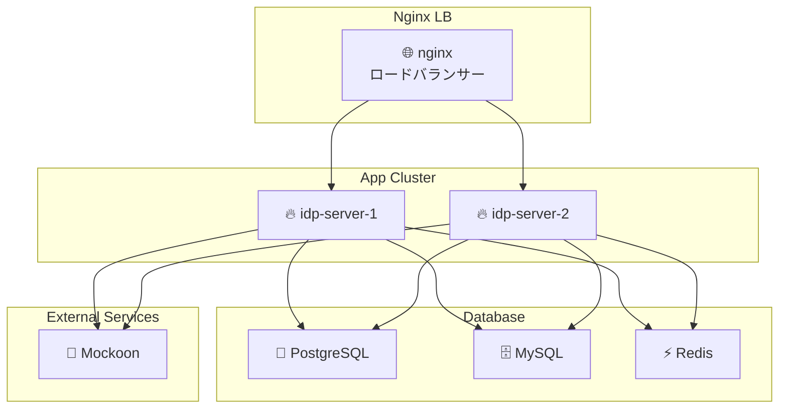

# Getting-Started

このガイドでは、**idp-server** を初めてセットアップして実行する手順を説明します。

## 前提条件

以下のツールが事前にインストールされている必要があります：

- Java 21 以上
- PostgreSQL または MySQL
- Node.js
- Docker

## ローカル環境構成

この図は、docker-compose を使って構築される idp-server のローカル開発環境の全体構成を示しています。



### 各コンポーネントの役割

| コンポーネント               | 説明                                                                    |
|-----------------------|-----------------------------------------------------------------------|
| 🌐 **nginx**          | `idp-server-1`, `idp-server-2` にリバースプロキシ／ロードバランサーとしてルーティング（ポート: 8080） |
| 🔥 **idp-server-1/2** | `idp-server` の本体。クラスタ構成でスケーラビリティ・冗長性を確認できるようにしてある（それぞれポート8081 / 8082） |
| 🧠 **PostgreSQL**     | メインの永続化DB。ユーザー情報・セッション・トークンなどの保存に使用                                   |
| 🗄️ **MySQL**         | 将来的なサポートに向けた評価用。PostgreSQLとの切替互換性を想定して導入                              |
| ⚡ **Redis**           | セッション情報や一時データのキャッシュストアとして利用                                           |
| 🧪 **Mockoon**        | 外部サービス連携を模擬するモックサーバー（eKYC / 通知サービスなどのテストに使用）                          |


### 特徴
- 複数台構成（HAテスト可）：2台の idp-server をクラスタで起動し、nginx 経由でルーティング
- 柔軟なDB接続：PostgreSQLメイン、MySQLも選択可能な構成
- Redisによる高速キャッシュ：パフォーマンステストやセッション管理に最適
- モック環境完備：Mockoon による外部連携模擬でE2E試験も可能

## インストール手順

### 1. リポジトリのクローン

```bash
git clone https://github.com/hirokazu-kobayashi-koba-hiro/idp-server.git
cd idp-server
```

### 初期準備

* APIキーとシークレットの生成

```shell
./init.sh
```

※ init.shで生成した値に変更してください

```shell
export IDP_SERVER_DOMAIN=http://localhost:8080/
export IDP_SERVER_API_KEY=xxx
export IDP_SERVER_API_SECRET=xxx
export ENCRYPTION_KEY=xxx
export ENV=local または develop など
```

* Dockerビルド

```shell
docker build -t idp-server:latest .
```

```shell
docker compose up -d
docker compose logs -f idp-server
```

* テーブル初期化

```shell
./gradlew flywayClean flywayMigrate
```

### health check

```shell
curl -v http://localhost:8080/actuator/health
```

### 設定の適用

```shell
./setup.sh
```

* admin-tenant

```shell
./sample-config/test-data.sh \
-e "local" \
-u ito.ichiro \
-p successUserCode001 \
-t 67e7eae6-62b0-4500-9eff-87459f63fc66 \
-b http://localhost:8080 \
-c clientSecretPost \
-s clientSecretPostPassword1234567890123456789012345678901234567890123456789012345678901234567890 \
-d false
 ```

* test-tenant

```shell
./sample-config/test-tenant-data.sh \
-e "local" \
-u ito.ichiro \
-p successUserCode001 \
-t 67e7eae6-62b0-4500-9eff-87459f63fc66 \
-b http://localhost:8080 \
-c clientSecretPost \
-s clientSecretPostPassword1234567890123456789012345678901234567890123456789012345678901234567890 \
-n 1e68932e-ed4a-43e7-b412-460665e42df3 \
-l clientSecretPost \
-m clientSecretPostPassword1234567890123456789012345678901234567890123456789012345678901234567890 \
-d false
 ```

### エンドツーエンドテスト（E2E）

```shell
cd e2e
npm install
npm test
```

---