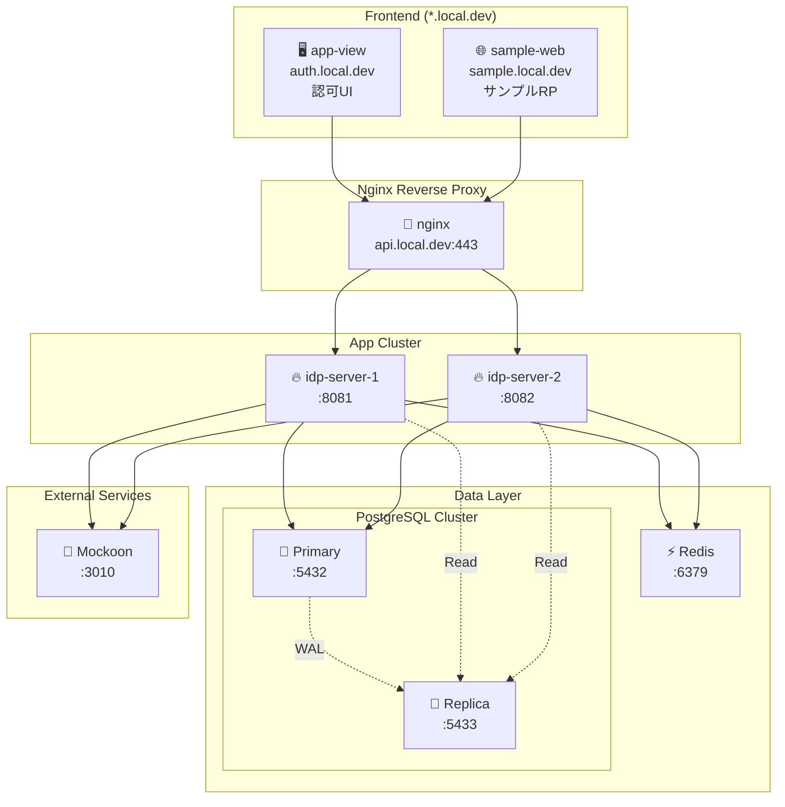

# Getting-Started

このガイドでは、**idp-server** を初めてセットアップして実行する手順を説明します。

## 前提条件

| ツール | 必須バージョン | 推奨 | 備考 |
|-------|-------------|------|------|
| **Java** | 21+ | Java 21 | |
| **データベース** | PostgreSQL 14+ または MySQL 8.0+ | **PostgreSQL 14+** | Primary/Replica 構成対応 |
| **Node.js** | 18.0+ | 20.x LTS | E2E テスト実行に必要 |
| **Docker** | 20.10+ | Docker Desktop 最新版 | Compose V2 対応 |

### データベース選択ガイド
- **PostgreSQL**: ✅ 推奨（Primary/Replica 対応、本番環境向け）
- **MySQL**: ⚠️ 基本機能のみ（開発・検証環境向け）

## ローカル環境構成

この図は、docker-compose を使って構築される idp-server のローカル開発環境の全体構成を示しています。



### サブドメイン構成

| サブドメイン | サービス | 説明 |
|------------|---------|------|
| `api.local.dev` | nginx → idp-server | IDP Server API エンドポイント |
| `auth.local.dev` | app-view | 認可UI（ログイン画面等） |
| `sample.local.dev` | sample-web | サンプルRPアプリケーション |

### 各コンポーネントの役割

| コンポーネント | 説明 |
|---------------|------|
| 🔀 **nginx** | リバースプロキシ。`api.local.dev` へのリクエストを idp-server クラスタにルーティング |
| 🔥 **idp-server-1/2** | idp-server 本体。クラスタ構成でスケーラビリティ・冗長性を確認（ポート 8081/8082） |
| 🖥️ **app-view** | Next.js製の認可UI。ログイン・同意画面などを提供 |
| 🌐 **sample-web** | サンプルRPアプリ。OIDC連携のデモ・テスト用 |
| 🧠 **PostgreSQL Primary** | メインDB（プライマリ）。書き込み・読み込み操作を処理（ポート: 5432） |
| 📖 **PostgreSQL Replica** | 読み取り専用レプリカDB。ストリーミングレプリケーションで同期（ポート: 5433） |
| ⚡ **Redis** | セッション情報・キャッシュストア（ポート: 6379） |
| 🧪 **Mockoon** | 外部サービス連携を模擬するモックサーバー（eKYC/通知サービス等） |

### 特徴
- **サブドメイン構成**: 本番環境に近い `*.local.dev` サブドメイン構成
- **複数台構成（HAテスト可）**: 2台の idp-server をクラスタで起動し、nginx 経由でルーティング
- **PostgreSQL Primary/Replica**: ストリーミングレプリケーションによる読み書き分離
- **Redis セッション/キャッシュ**: 高速なセッション管理とキャッシュ
- **フロントエンド統合**: 認可UI（app-view）とサンプルRP（sample-web）を含む
- **モック環境完備**: Mockoon による外部連携模擬でE2E試験も可能

> **Note**: MySQL を使用する場合は `docker-compose-mysql.yaml` を参照してください。

## インストール手順

### 1. リポジトリのクローン

```bash
git clone https://github.com/hirokazu-kobayashi-koba-hiro/idp-server.git
cd idp-server
```

### 2. サブドメイン設定（初回のみ）

ローカル開発環境で `*.local.dev` サブドメインを使用するため、以下のスクリプトを実行します：

```shell
./scripts/setup-local-subdomain.sh
```

このスクリプトは以下を設定します：
- dnsmasq による `*.local.dev` のローカルDNS解決
- mkcert によるローカルSSL証明書の生成

> **Note**: macOS を前提としています。他のOSでは手動設定が必要です（下記参照）。

#### 設定の確認

スクリプト実行後、以下のコマンドでDNS解決が正常に動作しているか確認します：

```shell
# DNS解決の確認
ping -c 1 api.local.dev
ping -c 1 auth.local.dev

# または nslookup で確認
nslookup api.local.dev
```

`127.0.0.1` が返されれば正常です。

#### 手動設定（他のOS / dnsmasqが使えない場合）

dnsmasqを使用できない環境では、`/etc/hosts` に直接追記することで代替できます：

```shell
# Linux / macOS
sudo sh -c 'echo "127.0.0.1 api.local.dev auth.local.dev sample.local.dev" >> /etc/hosts'

# Windows (管理者権限のPowerShell)
Add-Content -Path C:\Windows\System32\drivers\etc\hosts -Value "127.0.0.1 api.local.dev auth.local.dev sample.local.dev"
```

#### トラブルシューティング

| 問題 | 原因 | 解決策 |
|------|------|--------|
| `ping api.local.dev` が失敗 | dnsmasq が動作していない | `brew services restart dnsmasq` を実行、または `/etc/hosts` で手動設定 |
| DNS解決が `127.0.0.1` 以外を返す | 他のDNSリゾルバが優先されている | `/etc/resolver/local.dev` ファイルが存在するか確認 |
| SSL証明書エラー | mkcert のルートCAが未インストール | `mkcert -install` を実行 |

### 3. 環境変数の設定

#### シンプルセットアップ（固定ID使用・推奨）

`config/examples/` 配下のサンプル設定と互換性のある固定IDを使用する場合：

```shell
# サンプル環境変数ファイルをコピー
cp ./.env.example .env

# 必要な値を設定（以下は例）
# IDP_SERVER_API_KEY, IDP_SERVER_API_SECRET, ENCRYPTION_KEY,
# POSTGRES_PASSWORD, DB_OWNER_PASSWORD, IDP_DB_ADMIN_PASSWORD, IDP_DB_APP_PASSWORD
# などを設定してください
```

#### カスタムセットアップ（新しいIDを生成）

新しいランダムIDを生成する場合：

```shell
./init-generate-env.sh postgresql
```

このスクリプトは以下を生成します：
- `.env` ファイル（全ての環境変数）
- `config/secrets/local/` 配下のシークレットファイル

> **注意**: 新しいIDを生成すると、`config/examples/` 配下のサンプル設定との互換性が失われます。

### 4. Docker起動

```shell
# 全サービスをビルド
docker compose build

# 全サービスを起動（データベース初期化も自動実行）
docker compose up -d
```

セットアップには以下が含まれます：
- PostgreSQL Primary/Replicaレプリケーション構成
- データベースマイグレーション実行
- 全サービスのヘルスチェック

### 5. セットアップ確認

サービスの健全性をチェック：

```shell
curl -v https://api.local.dev/actuator/health
```

PostgreSQLレプリケーションの確認：

```shell
./scripts/verify-replication.sh
```

このスクリプトは以下のテストを実行します：
- プライマリとレプリカの状態確認
- レプリケーションスロットの確認
- データ同期テスト（プライマリに書き込み、レプリカから読み取り）
- レプリカへの書き込み制限確認
- 接続テスト（ポート 5432: プライマリ、ポート 5433: レプリカ）

### ステップバイステップセットアップ（デバッグ用）

トラブルシューティングが必要な場合は、サービスを個別に開始：

```shell
# 1. まずデータベースを起動
docker compose up -d postgres-primary postgres-replica redis

# 2. データベースマイグレーション実行
docker compose up flyway-migrator

# 3. アプリケーションサービスを起動
docker compose up -d idp-server-1 idp-server-2 nginx app-view sample-web
```

### 6. 設定の適用

#### admin-tenant の初期化

admin-tenant の設定ファイルを生成：

```shell
./init-admin-tenant-config.sh
```

admin-tenant を初期化：

```shell
./setup.sh
```

#### E2Eテスト用データの設定

E2Eテストを実行するためのテストデータを設定：

```shell
./config/scripts/e2e-test-data.sh
```

### 7. エンドツーエンドテスト（E2E）

設定の適用が完了したら、E2Eテストを実行してIdPサーバーが正常に動作しているかを確認できます。

#### テスト構成

テストスイートは3つのカテゴリーに分かれています：

| カテゴリー | 説明 |
|-----------|------|
| 📘 **scenario/** | 現実的なユーザーとシステムの動作（ユーザー登録、SSOログイン、CIBAフロー、MFA登録など） |
| 📕 **spec/** | OpenID Connect、FAPI、JARM、Verifiable Credentialsに基づく仕様準拠テスト |
| 🐒 **monkey/** | 障害注入とエッジケースの検証（意図的に無効なシーケンス、パラメータ、プロトコル違反） |

#### 実行

```shell
cd e2e
npm install
npm test
```

約800ケースのテストが実行され、正常に動作することが確認できます。

## 次のステップ

クイックスタートはこれで完了です。次のステップとして以下を参照してください：

- [コンセプト](../content_03_concepts/) - idp-server の設計思想と主要概念
- [チュートリアル](../content_04_tutorials/) - 具体的なユースケース別の実装ガイド
- [開発者ガイド](../content_06_developer-guide/) - 詳細な実装リファレンス
