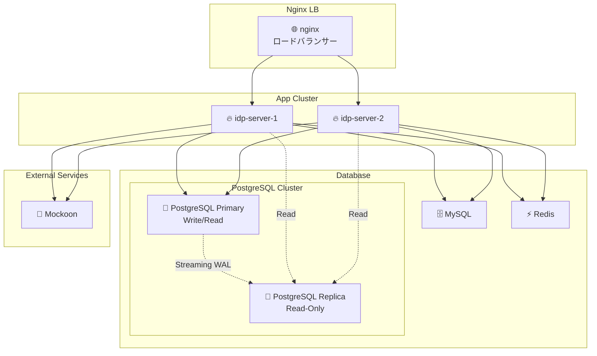

# Getting-Started

このガイドでは、**idp-server** を初めてセットアップして実行する手順を説明します。

## 前提条件

| ツール | 必須バージョン | 推奨 | 備考 |
|-------|-------------|------|------|
| **Java** | 21+ | Java 21 | |
| **データベース** | PostgreSQL 14+ または MySQL 8.0+ | **PostgreSQL 14+** | Primary/Replica 構成対応 |
| **Node.js** | 18.0+ | 20.x LTS | E2E テスト実行に必要 |
| **Docker** | 20.10+ | Docker Desktop 最新版 | Compose V2 対応 |

### データベース選択ガイド
- **PostgreSQL**: ✅ 推奨（Primary/Replica 対応、本番環境向け）
- **MySQL**: ⚠️ 基本機能のみ（開発・検証環境向け）

## ローカル環境構成

この図は、docker-compose を使って構築される idp-server のローカル開発環境の全体構成を示しています。



### 各コンポーネントの役割

| コンポーネント               | 説明                                                                    |
|-----------------------|-----------------------------------------------------------------------|
| 🌐 **nginx**          | `idp-server-1`, `idp-server-2` にリバースプロキシ／ロードバランサーとしてルーティング（ポート: 8080） |
| 🔥 **idp-server-1/2** | `idp-server` の本体。クラスタ構成でスケーラビリティ・冗長性を確認できるようにしてある（それぞれポート8081 / 8082） |
| 🧠 **PostgreSQL Primary** | メインの永続化DB（プライマリ）。書き込み・読み込み操作を処理（ポート: 5432） |
| 📖 **PostgreSQL Replica** | 読み取り専用レプリカDB。ストリーミングレプリケーションによってプライマリと同期（ポート: 5433） |
| 🗄️ **MySQL**         | 将来的なサポートに向けた評価用。PostgreSQLとの切替互換性を想定して導入                              |
| ⚡ **Redis**           | セッション情報や一時データのキャッシュストアとして利用                                           |
| 🧪 **Mockoon**        | 外部サービス連携を模擬するモックサーバー（eKYC / 通知サービスなどのテストに使用）                          |


### 特徴
- 複数台構成（HAテスト可）：2台の idp-server をクラスタで起動し、nginx 経由でルーティング
- PostgreSQL Primary/Replica構成：ストリーミングレプリケーションによる読み書き分離でパフォーマンステスト可能
- 柔軟なDB接続：PostgreSQL Primary/Replicaメイン、MySQLも選択可能な構成
- Redisによる高速キャッシュ：パフォーマンステストやセッション管理に最適
- モック環境完備：Mockoon による外部連携模擬でE2E試験も可能

## インストール手順

### 1. リポジトリのクローン

```bash
git clone https://github.com/hirokazu-kobayashi-koba-hiro/idp-server.git
cd idp-server
```

### シンプルセットアップ（推奨）

idp-serverをたった2つのコマンドで起動できます：

```shell
# 全サービスをビルド
docker compose build

# 全サービスを起動（データベース初期化も自動実行）
docker compose up -d
```

これで完了です！セットアップには以下が含まれます：
- ✅ 自動イメージビルド
- ✅ PostgreSQL Primary/Replicaレプリケーション構成
- ✅ データベースマイグレーション実行
- ✅ 全サービスのヘルスチェック
- ✅ サンプル設定用の固定ID（テナントID: `67e7eae6-62b0-4500-9eff-87459f63fc66`）

**注意:** このシンプルセットアップでは、`config/examples/` 配下のサンプル設定ファイルと一致する固定IDを使用します。`./init.sh` を実行すると新しいランダムIDが生成されるため、サンプル設定との互換性が失われます。

### セットアップ確認

サービスの健全性をチェック：

```shell
curl -v http://localhost:8080/actuator/health
```

PostgreSQLレプリケーションの確認：

```shell
./scripts/verify-replication.sh
```

このスクリプトは以下のテストを実行します：
- プライマリとレプリカの状態確認
- レプリケーションスロットの確認
- データ同期テスト（プライマリに書き込み、レプリカから読み取り）
- レプリカへの書き込み制限確認
- 接続テスト（ポート 5432: プライマリ、ポート 5433: レプリカ）

### ステップバイステップセットアップ（デバッグ用）

トラブルシューティングが必要な場合は、サービスを個別に開始：

```shell
# 1. まずデータベースを起動
docker compose up -d postgres-primary postgres-replica mysql redis

# 2. データベースマイグレーション実行
docker compose up flyway-migrator

# 3. アプリケーションサービスを起動
docker compose up -d idp-server-1 idp-server-2 nginx
```

### 設定の適用

**サンプルのサーバー設定ファイルを配置する**

```shell
cp ./.env.example .env
```

**サンプルのサーバー設定でセットアップ**

* admin-tenant

```shell
./setup.sh
```

* test-tenant

```shell
./config/scripts/test-data.sh
```

```shell
./config/scripts/test-tenant-data.sh -t 1e68932e-ed4a-43e7-b412-460665e42df3
```

### エンドツーエンドテスト（E2E）

設定の適用が完了したら、すぐにE2Eテストを実行してIdPサーバーが正常に動作しているかを確認できます。

#### テスト構成
テストスイートは3つのカテゴリーに分かれています：

* 📘 scenario/: 現実的なユーザーとシステムの動作 — ユーザー登録、SSOログイン、CIBAフロー、MFA登録など
* 📕 spec/: OpenID Connect、FAPI、JARM、Verifiable Credentialsに基づく仕様準拠テスト
* 🐒 monkey/: 障害注入とエッジケースの検証 — 意図的に無効なシーケンス、パラメータ、プロトコル違反

#### 実行

```shell
cd e2e
npm install
npm test
```

約800ケースのテストが実行され、正常に動作することが確認できます。

クイックスタートはこれで完了です。
