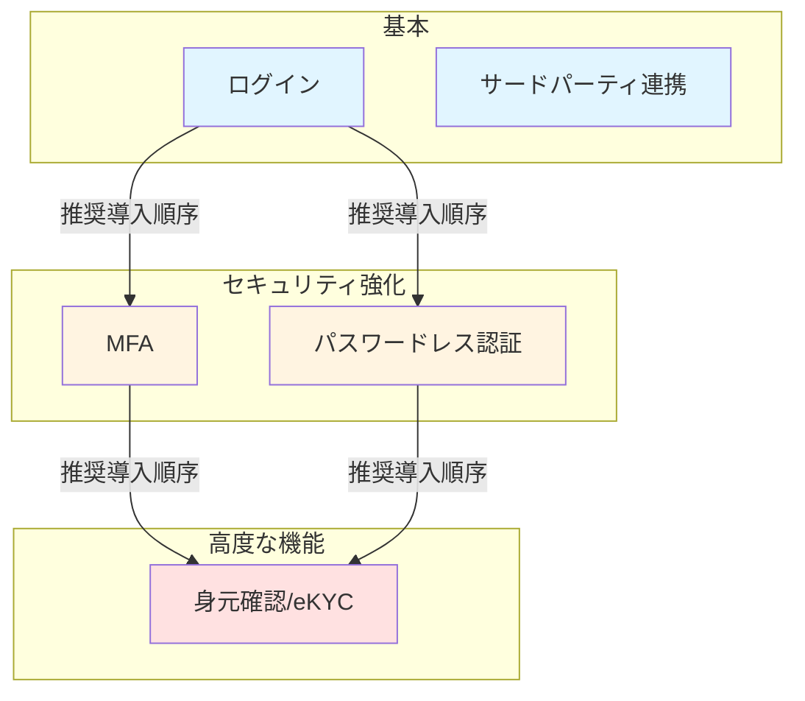

# 主要ユースケース

このガイドでは、**idp-server** を使って実現できる代表的なユースケースを紹介します。

---

## 全体像



**矢印の意味**: 推奨される導入順序を表しています。
- まずログインを実装
- 次にMFAまたはパスワードレスでセキュリティ強化
- 最後に身元確認/eKYCで高度な機能を追加

**サードパーティ連携**: 独立した機能なので、任意のタイミングで導入可能

### 導入の流れ

```
Phase 1: 基本機能
  - ログイン（パスワード認証、Socialログイン）
  - サードパーティ連携（外部アプリへのAPI提供）
  ↓
Phase 2: セキュリティ強化
  - MFA（多要素認証）
  - パスワードレス認証
  ↓
Phase 3: 高度な機能
  - 身元確認/eKYC
```

---

## ユースケース一覧

| ユースケース | できること | 詳細 |
|------------|-----------|------|
| **[ログイン](./quickstart-04-login.md)** | パスワード認証、Socialログイン、エンタープライズ連携 | [詳細へ →](./quickstart-04-login.md) |
| **[MFA](./quickstart-05-mfa.md)** | SMS/メール認証でセキュリティ強化 | [詳細へ →](./quickstart-05-mfa.md) |
| **[パスワードレス認証](./quickstart-06-passwordless.md)** | 生体認証、セキュリティキー、モバイル承認 | [詳細へ →](./quickstart-06-passwordless.md) |
| **[身元確認/eKYC](./quickstart-07-ekyc.md)** | 本人確認書類検証、確認済み情報の活用 | [詳細へ →](./quickstart-07-ekyc.md) |
| **[サードパーティ連携](./quickstart-08-third-party-integration.md)** | 第三者アプリへのデータアクセス許可 | [詳細へ →](./quickstart-08-third-party-integration.md) |

---

## ユースケースの組み合わせ例

### ECサイト

| 段階 | 機能 |
|------|------|
| **基本** | ログイン（パスワード + Socialログイン） |
| **強化** | パスワードレス推奨（Passkey） |

### 金融サービス（ネット銀行）

| 段階 | 機能 |
|------|------|
| **口座開設** | eKYC（本人確認書類 + 顔写真） |
| **通常ログイン** | パスワードレス（生体認証） |
| **高額送金** | MFA（SMS） + eKYC確認 |

### 社内業務システム

| 段階 | 機能 |
|------|------|
| **一般社員** | ログイン（パスワード + MFA任意） |
| **管理者** | MFA必須（パスワード + SMS） |

### 決済サービス

| 段階 | 機能 |
|------|------|
| **会員登録** | ログイン（メールアドレス + パスワード） |
| **少額決済** | パスワードレス（生体認証） |
| **高額決済** | eKYC + モバイル承認（FIDO UAF + CIBA） |

---

## 次のステップ

- [How-to ガイド](../content_05_how-to/) - 各機能の設定手順

---

**最終更新**: 2026-01-27
**対象**: idp-server導入検討者、プロジェクトマネージャー、ビジネス担当者
