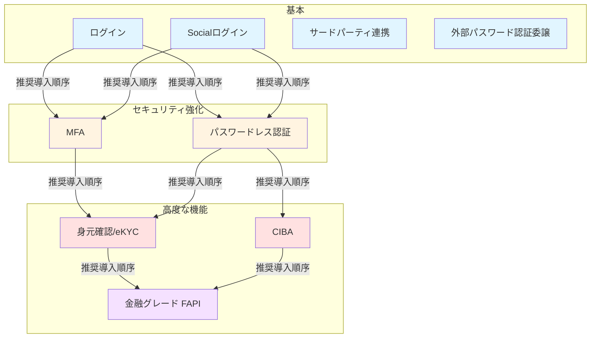

# ユースケース一覧

このガイドでは、**idp-server** を使って実現できる代表的なユースケースを紹介します。
各ユースケースにはテンプレートが用意されており、`setup.sh` で即座に環境構築できます。

---

## 全体像


```mermaid
graph TB
    subgraph 基本
        A[ログイン]
        A2[Socialログイン]
        E[サードパーティ連携]
        F[外部パスワード認証委譲]
    end

    subgraph セキュリティ強化
        B[MFA]
        C[パスワードレス認証]
    end

    subgraph 高度な機能
        D[身元確認/eKYC]
        G[CIBA]
        H[金融グレード FAPI]
    end

    A -->|推奨導入順序| B
    A -->|推奨導入順序| C
    A2 -->|推奨導入順序| B
    A2 -->|推奨導入順序| C
    B -->|推奨導入順序| D
    C -->|推奨導入順序| D
    C -->|推奨導入順序| G
    D -->|推奨導入順序| H
    G -->|推奨導入順序| H

    style A fill:#e1f5ff
    style A2 fill:#e1f5ff
    style E fill:#e1f5ff
    style B fill:#fff4e1
    style C fill:#fff4e1
    style F fill:#e1f5ff
    style D fill:#ffe1e1
    style G fill:#ffe1e1
    style H fill:#f5e1ff
```

**矢印の意味**: 推奨される導入順序を表しています。
- まずログインを実装
- 次にMFAまたはパスワードレスでセキュリティ強化
- 身元確認/eKYC、CIBAで高度な機能を追加
- 金融グレード（FAPI）で最高セキュリティレベルに到達

**サードパーティ連携・外部パスワード認証委譲**: 独立した機能なので、任意のタイミングで導入可能

### 導入の流れ

```
Phase 1: 基本機能
  - ログイン（パスワード認証）
  - Socialログイン（Google等の外部サービス連携）
  - サードパーティ連携（外部アプリへのAPI提供）
  - 外部パスワード認証委譲（既存認証基盤の活用）
  ↓
Phase 2: セキュリティ強化
  - MFA（多要素認証）
  - パスワードレス認証
  ↓
Phase 3: 高度な機能
  - 身元確認/eKYC
  - CIBA（モバイル承認）
  ↓
Phase 4: エンタープライズ
  - 金融グレード（FAPI Advanced + CIBA）
```

---

## ユースケースとテンプレート

| ユースケース | テンプレート | できること |
|------------|------------|-----------|
| **[ログイン](./quickstart-04-login.md)** | `login-password-only` | パスワード認証、アカウントロック、セッション管理 |
| **[Socialログイン](./quickstart-04-login-social.md)** | `login-social` | Google等の外部サービスアカウントでログイン |
| **[MFA](./quickstart-05-mfa.md)** | `mfa-email` | SMS/メール認証でセキュリティ強化 |
| **[パスワードレス認証](./quickstart-06-passwordless.md)** | `passwordless-fido2` | 生体認証、セキュリティキー、Passkey |
| **[身元確認/eKYC](./quickstart-07-ekyc.md)** | `ekyc` | 本人確認書類検証、verified_claims発行 |
| **[サードパーティ連携](./quickstart-08-third-party-integration.md)** | `third-party` | 第三者アプリへのOAuth 2.0連携 |
| **[外部パスワード認証委譲](./quickstart-10-external-password-auth.md)** | `external-password-auth` | 既存認証基盤（LDAP、社内API等）にOIDCを追加 |
| **[CIBA](./quickstart-11-ciba.md)** | `ciba` | モバイル承認（PCでログイン開始、スマホで生体認証） |
| **[金融グレード（FAPI）](./quickstart-12-financial-grade.md)** | `financial-grade` | 不正送金・なりすまし・改ざん防止、金融規制準拠 |

---

## テンプレートの使い方

`config/templates/use-cases/` にユースケース別のテンプレートとセットアップスクリプトが用意されています。
テンプレートを使うことで、Organization・テナント・認証設定・クライアントを一括作成し、すぐに動作確認できます。

> **templates vs examples**: テンプレート（`config/templates/`）はゼロからの完全セットアップ用です。既存テナントへの追加設定には `config/examples/` を使用してください。

### 前提条件

- idp-server が起動済み（[Getting Started](./quickstart-01-getting-started.md) のステップ1〜6が完了）
- `.env` に管理者認証情報が設定済み

### 実行

```bash
# テンプレートディレクトリに移動して実行
cd config/templates/use-cases/<テンプレート名>
./setup.sh

# ドライラン（実際には作成しない）
./setup.sh --dry-run

# 環境変数でカスタマイズ
PASSWORD_MIN_LENGTH=12 SESSION_TIMEOUT_SECONDS=3600 ./setup.sh
```

### 動作確認

各テンプレートには `VERIFY.md` が用意されています。セットアップ後にcurlコマンドで動作確認できます。

```bash
# VERIFY.md の手順に従って確認
cat VERIFY.md
```

### 削除・更新

```bash
# リソースの削除
./delete.sh

# リソースの更新（設定変更後）
./update.sh
```

> Claude Code を使用している場合は `/use-case-setup` スキルでヒアリング付きの対話型セットアップが利用できます。

---

## ユースケース選択ガイド

### シナリオ別

| シナリオ | 推奨テンプレート |
|---------|---------------|
| まず動かしたい | `login-password-only` |
| Socialログインも使いたい | `login-social` |
| セキュリティを強化したい | `mfa-email` → `passwordless-fido2` |
| 本人確認が必要 | `ekyc` |
| 外部アプリにAPI提供したい | `third-party` |
| 既存認証基盤を活かしたい | `external-password-auth` |
| モバイル承認が必要 | `ciba` |
| 金融グレードが必要 | `financial-grade` |

### 業種別

| 業種 | 推奨構成 |
|------|---------|
| ECサイト | `login-password-only` + `login-social` |
| 社内システム | `login-password-only` + `mfa-email` |
| 金融サービス | `financial-grade` |
| 決済サービス | `passwordless-fido2` + `ciba` + `ekyc` |
| APIプラットフォーム | `third-party` |
| 既存システム移行 | `external-password-auth` |

---

## ユースケースの組み合わせ例

### ECサイト

| 段階 | 機能 |
|------|------|
| **基本** | ログイン（パスワード + Socialログイン） |
| **強化** | パスワードレス推奨（Passkey） |

### 金融サービス（ネット銀行）

| 段階 | 機能 |
|------|------|
| **口座開設** | eKYC（本人確認書類 + 顔写真） |
| **通常ログイン** | パスワードレス（生体認証） |
| **高額送金** | CIBA（モバイル承認） + eKYC確認 |
| **API連携** | 金融グレード（FAPI Advanced + mTLS） |

### 社内業務システム

| 段階 | 機能 |
|------|------|
| **一般社員** | ログイン（パスワード + MFA任意） |
| **管理者** | MFA必須（パスワード + SMS） |

### 既存認証基盤を持つ組織

| 段階 | 機能 |
|------|------|
| **移行フェーズ** | 外部パスワード認証委譲（既存LDAPやAPIをそのまま利用） |
| **セキュリティ強化** | MFA追加（SMS/メール） |

### 決済サービス

| 段階 | 機能 |
|------|------|
| **会員登録** | ログイン（メールアドレス + パスワード） |
| **少額決済** | パスワードレス（生体認証） |
| **高額決済** | eKYC + CIBA（モバイル承認） |
| **金融規制対応** | 金融グレード（FAPI Advanced） |

---

## 次のステップ

- [How-to ガイド](../content_05_how-to/) - 各機能の詳細な設定手順
- [コンセプト](../content_03_concepts/01-foundation/concept-01-multi-tenant.md) - idp-server の設計思想と主要概念

---

**最終更新**: 2026-03-13
**対象**: idp-server導入検討者、プロジェクトマネージャー、ビジネス担当者
