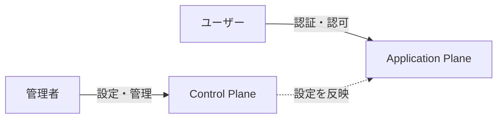

# アプリケーションプレーン

idp-serverのアプリケーションプレーンの概念と役割について説明します。

> **参考**: コントロールプレーンとアプリケーションプレーンの一般的な概念については、[AWS SaaS アーキテクチャの基礎 - コントロールプレーンとアプリケーションプレーン](https://docs.aws.amazon.com/ja_jp/whitepapers/latest/saas-architecture-fundamentals/control-plane-vs.-application-plane.html)を参照してください。

## アプリケーションプレーンとは

**アプリケーションプレーン（Application Plane）** は、エンドユーザーやクライアントアプリケーションが直接利用する**認証・認可のランタイム層**です。

コントロールプレーンが「どう動くかを決める層」なら、アプリケーションプレーンは「実際に動く層」です。



### コントロールプレーンとの違い

| 層 | 役割 | 利用者 | 例 |
|:---|:---|:---|:---|
| **Application Plane** | 認証・認可実行 | エンドユーザー、クライアントアプリ | ログイン、トークン発行、ユーザー情報取得 |
| **Control Plane** | 設定・管理 | 管理者 | テナント作成、クライアント登録、認証設定 |

詳細: [コントロールプレーン](./concept-02-control-plane.md)

---

## 何を担うのか

アプリケーションプレーンは、以下の4つの責務を担います。

### 1. 認証（Authentication）

**「このユーザーは誰か？」を確認する**

ユーザーがログインする際、設定された[認証ポリシー](../03-authentication-authorization/concept-01-authentication-policy.md)に基づいて本人確認を行います。パスワード、SMS OTP、FIDO2/Passkey、外部IdP連携など、テナントごとに異なる認証方式を実行します。

### 2. 認可（Authorization）

**「このアプリに何を許可するか？」を制御する**

クライアントアプリケーションが要求するスコープに対して、ユーザーの同意を取得し、認可コードを発行します。FAPI準拠の高セキュリティな認可フローにも対応しています。

### 3. トークン発行（Token Issuance）

**「認証・認可の結果を安全に伝える」**

認可コードと引き換えにアクセストークン・IDトークン・リフレッシュトークンを発行します。トークンの有効期限、署名アルゴリズム、含まれるクレームはすべてコントロールプレーンの設定に従います。

詳細: [トークン管理](../04-tokens-claims/concept-02-token-management.md)

### 4. ユーザー情報提供（User Information）

**「認証済みユーザーの属性情報を返す」**

アクセストークンを持つクライアントに対して、ユーザー属性（氏名、メール等）や身元確認済み情報（verified_claims）を提供します。

---

## 設計思想

### プロトコル準拠

アプリケーションプレーンは、OAuth 2.0 / OpenID Connect の仕様に厳密に準拠しています。

| プロトコル | 役割 |
|:---|:---|
| **OAuth 2.0** (RFC 6749) | 認可フレームワーク |
| **OpenID Connect Core 1.0** | 認証レイヤー |
| **CIBA** | ブラウザを介さないバックチャネル認証 |
| **FAPI 1.0** Baseline / Advanced | 金融グレードセキュリティ |
| **PKCE** (RFC 7636) | 認可コード横取り攻撃の防止 |
| **PAR** (RFC 9126) | 認可リクエストの事前登録 |

プロトコルに準拠することで、標準的なOAuthクライアントライブラリからそのまま接続できます。

### テナント分離

すべてのリクエストはテナントIDをパスに含み、テナントごとに完全に独立した認証・認可処理を行います。

```
/{tenant-id}/v1/authorizations   ← テナントAの認可
/{tenant-id}/v1/tokens           ← テナントAのトークン発行
```

同じidp-serverインスタンスでも、テナントが異なれば認証方式、トークン有効期限、スコープ、JWKsなど、すべてが独立しています。

詳細: [マルチテナント](./concept-03-multi-tenant.md)

### 設定駆動

アプリケーションプレーン自体にはビジネスロジックの固定的な振る舞いはほとんどありません。**どう動くかは、コントロールプレーンで設定された内容によって決まります。**

```
コントロールプレーンで設定                  アプリケーションプレーンでの動作
──────────────────────────              ────────────────────────────
認証ポリシー: パスワード + SMS OTP   →   ログイン時に2段階認証を実行
トークン有効期限: 3600秒            →   アクセストークンの有効期限が1時間
スコープ: openid, profile, email   →   UserInfoで返すクレームが決まる
FAPI: Advanced                    →   PAR必須、JARM応答、mTLS検証
```

この設計により、コードを変更せずに設定だけで認証・認可の振る舞いを変えることができます。

---

## 処理フローの全体像

アプリケーションプレーンが処理する代表的なフローです。

### 認可コードフロー

最も基本的なフローです。ブラウザリダイレクトを使ってユーザーを認証し、トークンを発行します。

```
ユーザー        クライアントアプリ        idp-server (Application Plane)
  │                   │                    │
  │  ログインクリック   │                    │
  │ ────────────────→ │                    │
  │                   │  認可リクエスト      │
  │                   │ ─────────────────→ │
  │                   │                    │ ← 認証ポリシーを参照
  │  ログイン画面      │                    │
  │ ←─────────────────────────────────── │
  │                   │                    │
  │  認証情報入力      │                    │ ← 認証方式に応じた
  │ ──────────────────────────────────→ │   インタラクションを実行
  │                   │                    │
  │                   │  認可コード発行      │
  │                   │ ←───────────────── │
  │                   │                    │
  │                   │  トークンリクエスト   │
  │                   │ ─────────────────→ │ ← トークン設定に従い発行
  │                   │                    │
  │                   │  AT + IDT + RT     │
  │                   │ ←───────────────── │
```

詳細: [認可コードフロー](../../content_04_protocols/protocol-01-authorization-code-flow.md)

### CIBAフロー

ブラウザリダイレクトを使わず、別デバイス（スマホ等）での認証承認を行うフローです。

```
サービス              idp-server              モバイルアプリ
  │                      │                        │
  │  CIBA認証リクエスト    │                        │
  │ ────────────────────→│                        │
  │                      │  プッシュ通知            │
  │                      │ ──────────────────────→│
  │  auth_req_id         │                        │
  │ ←────────────────────│                        │
  │                      │                        │
  │  ポーリング           │  デバイス認証            │
  │ ────────────────────→│ ←──────────────────────│
  │                      │                        │
  │  トークン発行         │                        │
  │ ←────────────────────│                        │
```

詳細: [CIBAフロー](../../content_04_protocols/protocol-02-ciba-flow.md)

---

## セキュリティの考え方

### 攻撃面の分離

管理API（コントロールプレーン）と認証API（アプリケーションプレーン）を分離することで、攻撃面を最小化しています。アプリケーションプレーンがインターネットに公開されていても、コントロールプレーンは内部ネットワークに閉じた構成が可能です。

### ステートレス検証

トークンのイントロスペクション・失効により、発行済みトークンのライフサイクルを適切に管理します。JWTベースのトークンはJWKSエンドポイント経由で公開鍵を提供し、リソースサーバーがステートレスに検証できます。

### ディスカバリ

`/.well-known/openid-configuration` エンドポイントにより、クライアントアプリケーションはテナントの設定（エンドポイントURL、対応スコープ、署名アルゴリズム等）を自動的に取得できます。手動設定の誤りを防ぎ、設定変更時の追従も容易になります。

---

## 関連ドキュメント

- [コントロールプレーン](./concept-02-control-plane.md) - 設定・管理を行う制御層
- [クライアント](./concept-04-client.md) - アプリケーションの種類と設定
- [認証ポリシー](../03-authentication-authorization/concept-01-authentication-policy.md) - 認証方式の組み合わせルール
- [トークン管理](../04-tokens-claims/concept-02-token-management.md) - トークンのライフサイクル
- [セッション管理](../03-authentication-authorization/concept-03-session-management.md) - SSO・セッション制御
- [認可コードフロー](../../content_04_protocols/protocol-01-authorization-code-flow.md) - プロトコル詳細
- [CIBAフロー](../../content_04_protocols/protocol-02-ciba-flow.md) - バックチャネル認証
- [API Reference](../../content_07_reference/api-reference.md) - エンドポイント仕様

---

**最終更新**: 2026-03-13
