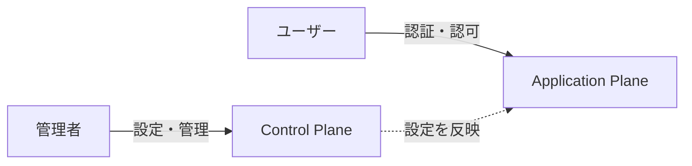

# コントロールプレーン

idp-serverのコントロールプレーンの概念と役割について説明します。

> **参考**: コントロールプレーンとアプリケーションプレーンの一般的な概念については、[AWS SaaS アーキテクチャの基礎 - コントロールプレーンとアプリケーションプレーン](https://docs.aws.amazon.com/ja_jp/whitepapers/latest/saas-architecture-fundamentals/control-plane-vs.-application-plane.html)を参照してください。

## コントロールプレーンとは

**コントロールプレーン（Control Plane）** とは、システムの設定・管理を行う制御層です。認証・認可処理を実行するアプリケーションプレーンとは明確に責務が分離されています。



### アプリケーションプレーンとの違い

| 層 | 役割 | 利用者 | 例 |
|:---|:---|:---|:---|
| **Control Plane** | 設定・管理 | 管理者 | テナント作成、クライアント登録、認証設定 |
| **Application Plane** | 認証・認可実行 | 一般ユーザー | ログイン、トークン発行、ユーザー情報取得 |

### なぜ分離するのか

- **セキュリティ**: 管理操作と認証処理の攻撃面を分離
- **スケーラビリティ**: アプリケーションプレーンを認証負荷に応じて独立スケール可能
- **責務分離**: 管理者権限と一般ユーザー権限を明確に分離

---

## idp-serverにおけるコントロールプレーン

idp-serverでは、コントロールプレーンを**APIの契約定義層**として設計しています。

### 設計思想

```
idp-server-control-plane (契約定義)
  ↓ 実装
idp-server-use-cases (EntryService)
```

- **`idp-server-control-plane`**: Management APIの契約定義（インターフェース）のみを提供
- **`idp-server-use-cases`**: EntryServiceパターンで実装

この設計により：
- **契約と実装の分離**: API仕様と実装を独立して管理
- **拡張性**: 新しい管理機能を契約として定義し、後から実装
- **テスト容易性**: 契約に基づいたテスト設計

---

## 管理できること

idp-serverのコントロールプレーンでは、以下の設定・管理が可能です。

### 1. テナント管理
- テナントの作成・更新・削除
- テナント属性の管理
- 詳細: [マルチテナント](concept-01-multi-tenant.md)

### 2. 組織管理
- 組織の作成・更新・削除
- 組織階層の管理
- 組織-テナント関係の管理
- 詳細: [マルチテナント](concept-01-multi-tenant.md)

### 3. クライアント設定
- OAuth/OIDCクライアントの登録
- リダイレクトURI、スコープ等の設定
- クライアント認証方式の設定

### 4. 認可サーバー設定
- トークン有効期限の設定
- サポートするスコープの設定
- OIDC Discovery メタデータの設定
- 詳細: [トークン管理](../04-tokens-claims/concept-13-token-management.md)

### 5. フェデレーション設定
- 外部IdP（Google, Azure AD等）との連携設定
- 属性マッピングの定義
- 詳細: [ID管理](../02-identity-management/concept-04-id-management.md)

### 6. 認証設定
- 認証方式（パスワード、MFA、FIDO2等）の有効化・無効化
- 認証ポリシーの設定
- 詳細: [認証ポリシー](../03-authentication-authorization/concept-06-authentication-policy.md), [MFA](../03-authentication-authorization/concept-07-mfa.md)

### 7. セキュリティイベントフック
- Slack、Email、Webhook等の通知設定
- セキュリティイベントのトリガー条件設定

### 統一された有効/無効機能

すべての設定エンティティは`Configurable`インターフェースを実装し、統一された有効/無効機能を持ちます：

- **`enabled`列**: 設定の論理的な有効/無効状態
- **削除せずに無効化**: 設定を保持したまま一時的に無効化可能
- **即座に反映**: 無効化された設定は即座にアプリケーションプレーンに反映

---

## 使い方の概要

idp-serverは2種類の管理APIを提供します。

### Management API（システムレベル）

**目的**: システム全体の管理

**利用シーン**:
- 新しいテナントの作成
- システム全体の設定変更
- すべてのテナントの一覧取得

**エンドポイント例**:
```
POST /v1/management/tenants
GET  /v1/management/tenants
PUT  /v1/management/tenants/{tenantId}
```

**認証**: システム管理者権限が必要

### Organization Management API（組織レベル）

**目的**: 組織内のテナント・ユーザー管理

**利用シーン**:
- 組織内の新しいテナント作成
- 組織メンバーの管理
- 組織内テナントの設定変更

**エンドポイント例**:
```
POST /v1/management/organizations/{orgId}/tenants
GET  /v1/management/organizations/{orgId}/tenants
PUT  /v1/management/organizations/{orgId}/tenants/{tenantId}/users
```

**認証**: 組織管理者権限が必要

### Dry-run機能

すべての変更系APIは`dry_run`パラメータをサポートしています：

- **`dry_run=true`**: 変更を実行せず、検証のみ実施
- **`dry_run=false`**: 実際に変更を実行

これにより、変更前に影響範囲を確認できます。

---

## アクセス制御

### システムレベル vs 組織レベル

| レベル | 管理範囲 | 必要な権限 | 典型的な操作 |
|:---|:---|:---|:---|
| **システムレベル** | すべてのテナント | システム管理者 | テナント作成、システム設定 |
| **組織レベル** | 組織内のテナント | 組織管理者 | 組織内テナント管理、メンバー管理 |

### 権限モデル

idp-serverでは、以下の権限モデルを採用しています：

- **システムレベル権限**: `DefaultAdminPermission`（40以上の細かい権限）
- **組織レベル権限**: `OrganizationAdminPermissions`（組織内操作の権限）

詳細な権限設定については、[設定管理API](../../content_06_developer-guide/04-implementation-guides/impl-11-configuration-management-api.md)を参照してください。

---

## 関連ドキュメント

- [設定管理API](../../content_06_developer-guide/04-implementation-guides/impl-11-configuration-management-api.md) - 実装詳細
- [組織初期化ガイド](../../content_05_how-to/how-to-02-organization-initialization.md) - 実践例
- [マルチテナント](concept-01-multi-tenant.md) - テナント・組織の概念
- [認証ポリシー](../03-authentication-authorization/concept-06-authentication-policy.md) - 認証制御
- [トークン管理](../04-tokens-claims/concept-13-token-management.md) - トークン設定
- [API Reference](../../content_07_reference/api-reference.md) - API仕様書

---

## 参考仕様

- [RFC 7591 - OAuth 2.0 Dynamic Client Registration Protocol](https://datatracker.ietf.org/doc/html/rfc7591)
- [OpenID Connect Discovery 1.0](https://openid.net/specs/openid-connect-discovery-1_0.html)
