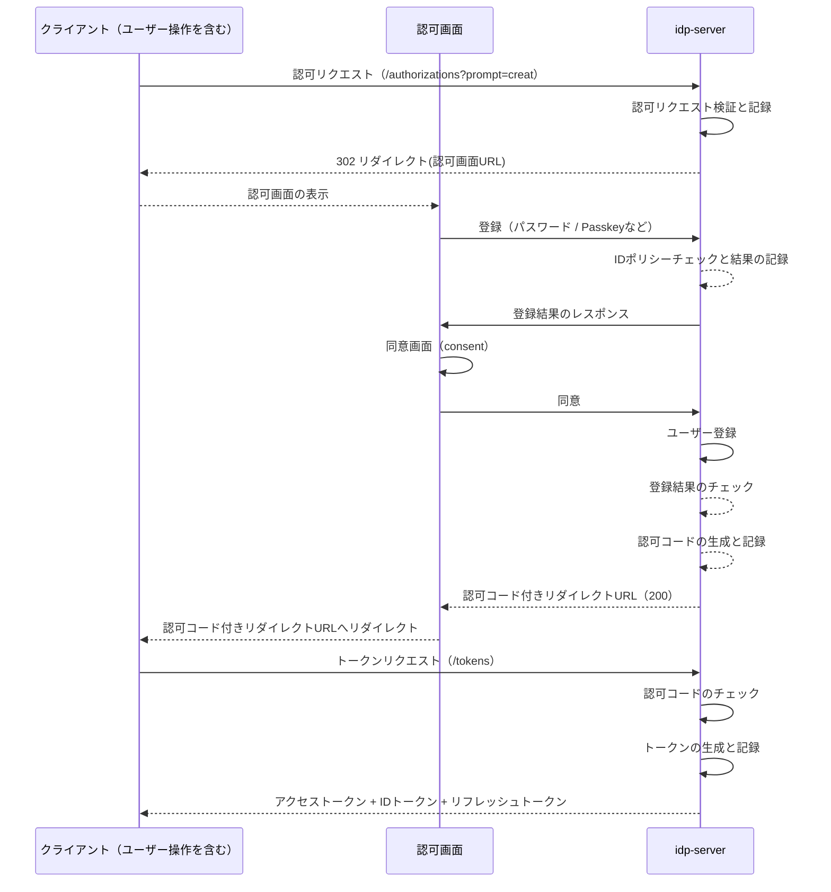
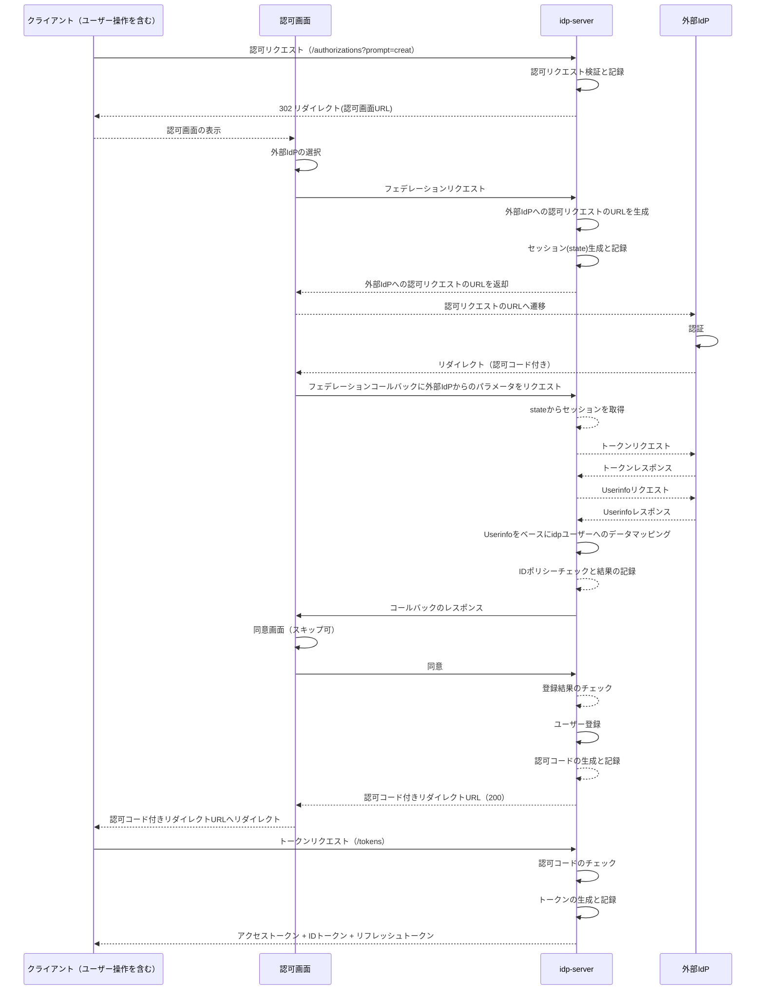

# ID（ユーザー）管理

## 概要

`idp-server` はテナント単位で **ID（ユーザー）** を管理します。

ID（ユーザー）を複数テナントで所持することはできません。別テナントで作成したID（ユーザー）を利用したい場合は、フェデレーションを実施します。

---

## 登録

`idp-server` はOIDCの認可コードフローをベースに、2つのユーザー登録機能を提供します。

1. `idp-server` へのユーザー登録
2. `外部IdP`とのフェデレーションによるユーザー登録

### 登録シーケンス

#### `idp-server` へのユーザー登録



#### `外部IdP`とのフェデレーションによるユーザー登録



## データ構造

### ユーザーID（`sub`）

- 各ユーザーには一意（UUID）な `ユーザーID`（`sub`）が割り当てられます。
- テナントごとにID空間を分離する（tenant_id + sub）

### 外部ID（`provider_id`）とのマッピング

- 外部IdP（Google, AzureADなど）との連携時には `provider_id` に基づく一意性を保持
- 内部IDと外部IDをペアで管理し、**Federated Account Mapping** を実現

---

## IDポリシー（Identity Policy）

### 概要

**IDポリシー**は、テナントごとに「どのユーザー属性を一意識別子・ログイン認証情報として使用するか」を制御します。

このポリシーに基づき、ユーザー作成時に自動的に `preferred_username` が設定されます。

### ポリシータイプ

| ポリシータイプ                    | 一意性の基準               | 用途・ユースケース                             |
|------------------------------|----------------------|----------------------------------------|
| `USERNAME`                   | `name`（ユーザー名）       | 社内システム（従業員IDベース）                      |
| `USERNAME_OR_EXTERNAL_USER_ID` | `name` または `external_user_id` | 社内システム + 外部IdP連携                      |
| `EMAIL`                      | `email`（メールアドレス）    | 一般向けWebサービス・SaaS                       |
| `EMAIL_OR_EXTERNAL_USER_ID`  | `email` または `external_user_id` | **デフォルト**。一般向け + 外部IdP連携（Google等）     |
| `PHONE`                      | `phone_number`（電話番号） | モバイルアプリ・SMS認証ベースサービス                  |
| `PHONE_OR_EXTERNAL_USER_ID`  | `phone_number` または `external_user_id` | モバイルアプリ + 外部IdP連携                     |
| `EXTERNAL_USER_ID`           | `external_user_id`   | 完全フェデレーション（外部IdPのみでユーザー管理）            |

### デフォルトポリシー

テナント作成時のデフォルトは **`EMAIL_OR_EXTERNAL_USER_ID`** です。

- **idp-server直接登録**: `email` が `preferred_username` に設定される
- **外部IdP連携**: `external_user_id` が `preferred_username` に設定される

### preferred_username の自動設定

ユーザー作成時（Initial Registration / Management API）、IDポリシーに従って **自動的に** `preferred_username` が設定されます。

#### 設定の仕組み

- **USERNAME系ポリシー**: `name` が `preferred_username` に設定される
- **EMAIL系ポリシー**: `email` が `preferred_username` に設定される
- **PHONE系ポリシー**: `phone_number` が `preferred_username` に設定される
- **EXTERNAL_USER_ID**: `external_user_id` が `preferred_username` に設定される

**フォールバック動作**（`_OR_EXTERNAL_USER_ID` ポリシー）:
- 主要属性（email/phone/name）が設定されていない場合、`external_user_id` にフォールバックします

### Password Grant との関係

Password Grant でのユーザー検索には **`preferred_username`** が使用されます。

つまり、トークンリクエストの `username` パラメータには、IDポリシーで設定された `preferred_username` の値を指定する必要があります。

#### 例: EMAIL_OR_EXTERNAL_USER_ID ポリシーの場合

| ユーザー作成方法        | preferred_username に設定される値 | Password Grant での username パラメータ |
|-----------------|----------------------------|-----------------------------------|
| Initial Registration | `email` (例: user@example.com) | `user@example.com`                |
| Google連携       | `external_user_id` (例: google-sub-12345) | `google-sub-12345`                |

### ポリシー変更時の注意事項

⚠️ **既存ユーザーへの影響**

- IDポリシー変更は **新規登録ユーザーのみ** に適用されます
- 既存ユーザーの `preferred_username` は変更されません
- 既存ユーザーのログインに影響を与えないよう、慎重に変更してください

---

### ユーザー属性

| 項目                               | 型       | 説明                                          | 取得用スコープ                              |
|----------------------------------|---------|---------------------------------------------|---------------------------------------|
| `sub`                            | string  | Subject - Issuer における End-User の識別子         | `openid` (必須)                         |
| `provider_id`                    | string  | 外部IdPと連携した場合のID識別子                          | `claims:provider_id`                  |
| `external_user_id`               | string  | 外部IdPのユーザーID(sub)                           | `claims:ex_sub`                       |
| `external_user_original_payload` | object  | 外部IdPのユーザークレーム   （JSONオブジェクト）               | `claims:external_user_original_payload` |
| `name`                           | string  | End-User の表示用フルネーム。肩書きや称号 (suffix) を含むこともある | `profile`                             |
| `given_name`                     | string  | 名（Given Name）                               | `profile`                             |
| `family_name`                    | string  | 姓（Family Name）                              | `profile`                             |
| `middle_name`                    | string  | ミドルネーム                                      | `profile`                             |
| `nickname`                       | string  | ニックネーム                                      | `profile`                             |
| `preferred_username`             | string  | End-User の選好するユーザー名（例：janedoe）<br/>**Password Grantでのログイン識別子として使用** | `profile`                             |
| `profile`                        | string  | プロフィールページのURL                               | `profile`                             |
| `picture`                        | string  | プロフィール画像のURL                                | `profile`                             |
| `website`                        | string  | End-User のWebサイトURL                         | `profile`                             |
| `email`                          | string  | End-User の選好するEmailアドレス                     | `email`                               |
| `email_verified`                 | boolean | Emailアドレスが検証済みかどうか                          | `email`                               |
| `gender`                         | string  | 性別（例：male, female）                          | `profile`                             |
| `birthdate`                      | string  | 生年月日（例：1990-01-01）                          | `profile`                             |
| `zoneinfo`                       | string  | タイムゾーン情報                                    | `profile`                             |
| `locale`                         | string  | ロケール（例：ja-JP）                               | `profile`                             |
| `phone_number`                   | string  | 電話番号（E.164形式が推奨）                            | `phone`                               |
| `phone_number_verified`          | boolean | 電話番号が検証済みかどうか                               | `phone`                               |
| `address`                        | object  | 郵送先住所（JSONオブジェクト）                           | `address`                             |
| `status`                         | string  | アカウントの状態（ACTIVE, LOCKEDなど）                  | `claims:status`                       |
| `custom_properties`              | object  | カスタムのユーザークレーム（JSONオブジェクト）                   | `claims:custom_properties`            |
| `credentials`                    | object  | 資格情報   （JSON配列）                             | `claims:credentials`                  |
| `hashed_password`                | object  | ハッシュ化済みのパスワード                               | - (セキュリティ上取得不可)                     |
| `authentication_devices`         | object  | FIDO認証などが実施可能な認証デバイス（JSON配列）                | `claims:authentication_devices`       |
| `verified_claims`                | object  | 身元確認済みのクレーム                                 | `verified_claims:*`                   |
| `roles`                          | array   | ユーザーの役割一覧（JSON配列） ← 追加                        | `claims:roles`                        |
| `permissions`                    | array   | ユーザーの権限一覧（JSON配列） ← 追加                        | `claims:permissions`                  |
| `current_tenant_id`              | string  | 現在選択中のテナントID ← 追加                             | `claims:current_tenant_id`            |
| `assigned_tenants`               | array   | アクセス可能なテナントID一覧（JSON配列） ← 追加                   | `claims:assigned_tenants`             |
| `current_organization_id`        | string  | 現在選択中の組織ID ← 追加                               | `claims:current_organization_id`      |
| `assigned_organizations`         | array   | 所属組織ID一覧（JSON配列） ← 追加                          | `claims:assigned_organizations`       |
| `created_at`                     | string  | アカウント作成日時（ISO 8601形式） ← 追加                    | `profile`                             |
| `updated_at`                     | number  | 最終更新日時（UNIXタイムスタンプ）                         | `profile`                             |

#### スコープによる属性取得について

**OIDC標準スコープ**
- `openid`: 必須。`sub`クレームを含む
- `profile`: 基本プロフィール情報（`name`, `given_name`, `family_name`等）
- `email`: メールアドレス関連（`email`, `email_verified`）
- `phone`: 電話番号関連（`phone_number`, `phone_number_verified`）
- `address`: 住所情報（`address`）

**idp-server独自スコープ**
- `claims:<属性名>`: 特定の属性を個別に取得（例：`claims:roles`, `claims:permissions`）
- `verified_claims:*`: 身元確認済みクレーム取得

**使用例**
```
scope=openid profile email claims:roles claims:assigned_tenants
```
この場合、標準プロフィール＋メール＋ロール情報＋所属テナント一覧が取得可能になります。

**注意事項**
- `claims:`スコープは`custom_claims_scope_mapping=true`の設定が必要
- セキュリティ上、`hashed_password`は取得できません
- 管理者権限が必要な属性もあります

---

### ステータス

| ステータス                            | 説明                                           |
|----------------------------------|----------------------------------------------|
| `UNREGISTERED`                   | アカウント未作成                                     |
| `INITIALIZED`                    | ユーザーがアカウントを初期化した状態                           |
| `FEDERATED`                      | 外部IdPとフェデレーション済み                             |
| `REGISTERED`                     | 登録済み                                         |
| `IDENTITY_VERIFICATION_REQUIRED` | 身元確認（eKYC）が必要な状態                             |
| `IDENTITY_VERIFIED`              | 身元確認済み                                       |
| `LOCKED`                         | 失敗により一時的にロックされた状態                            |
| `DISABLED`                       | ユーザーまたは管理者により無効化された状態                        |
| `SUSPENDED`                      | ポリシー違反により停止された状態                             |
| `DEACTIVATED`                    | 無効化リクエスト済み、猶予期間中                             |
| `DELETED_PENDING`                | 猶予期間後に削除予定                                   |
| `DELETED`                        | 完全削除済み                                       |
| `UNKNOWN`                        | 不明                                           |

#### ステータス遷移例

```plaintext
UNREGISTERED
   ↓ 初期化
INITIALIZED
   ↓ 登録
REGISTERED
   ↓ 身元確認完了
IDENTITY_VERIFIED
   ↓ ポリシー違反
SUSPENDED
   ↓ 無効化リクエスト
DEACTIVATED
   ↓ 猶予期間経過
DELETED_PENDING
   ↓ 削除実行
DELETED
```

#### ステータスによるアクセス制御

ユーザーステータスは、各種エンドポイントでのアクセス制御に使用されます。

##### アクティブと判定されるステータス

以下のステータスのユーザーのみがアクティブとして扱われます：

| ステータス | 説明 |
|-----------|------|
| `INITIALIZED` | アカウント初期化済み |
| `FEDERATED` | 外部IdP連携済み |
| `REGISTERED` | 登録完了 |
| `IDENTITY_VERIFICATION_REQUIRED` | 身元確認待ち |
| `IDENTITY_VERIFIED` | 身元確認済み |

##### 非アクティブと判定されるステータス

以下のステータスのユーザーはアクセスが拒否されます：

| ステータス | 説明 | 影響 |
|-----------|------|------|
| `LOCKED` | 認証失敗によるロック | トークン発行・更新・Userinfo不可 |
| `DISABLED` | 管理者による無効化 | トークン発行・更新・Userinfo不可 |
| `SUSPENDED` | ポリシー違反による停止 | トークン発行・更新・Userinfo不可 |
| `DEACTIVATED` | 退会申請による無効化 | トークン発行・更新・Userinfo不可 |
| `DELETED_PENDING` | 削除処理中 | トークン発行・更新・Userinfo不可 |
| `DELETED` | 完全削除済み | 全アクセス不可 |

##### エンドポイント別のステータスチェック

| エンドポイント | Grant Type | ステータスチェック | 理由 |
|--------------|------------|----------------|------|
| Token Endpoint | `authorization_code` | なし | 認可時点でユーザー認証済みのため |
| Token Endpoint | `refresh_token` | あり | 長期間有効なトークンのため、更新時に再検証 |
| Token Endpoint | `password` | あり | ユーザー認証を含むため |
| Token Introspection Endpoint | - | あり | トークン有効性検証時にユーザー状態も検証 |
| Userinfo Endpoint | - | あり | ユーザー情報取得時に検証 |

##### エラーレスポンス

非アクティブなユーザーでアクセスした場合、以下のエラーが返されます：

**Token Endpoint（refresh_token / password）**
```json
{
  "error": "invalid_grant",
  "error_description": "user is not active (id: user-123, status: LOCKED)"
}
```

**Token Introspection Endpoint**

RFC 7662に準拠し、非アクティブなユーザーのトークンは`active: false`として返されます（HTTPステータスは200）。
```json
{
  "active": false
}
```

**Userinfo Endpoint**
```json
{
  "error": "invalid_token",
  "error_description": "user is not active (id: user-123, status: DISABLED)"
}
```

---

## 削除

ユーザー削除は物理的にデータを削除します。

以下のデータを削除：

* 発行済みトークン／認可情報（grant, token）
* 認証情報（FIDO, Password 等）
