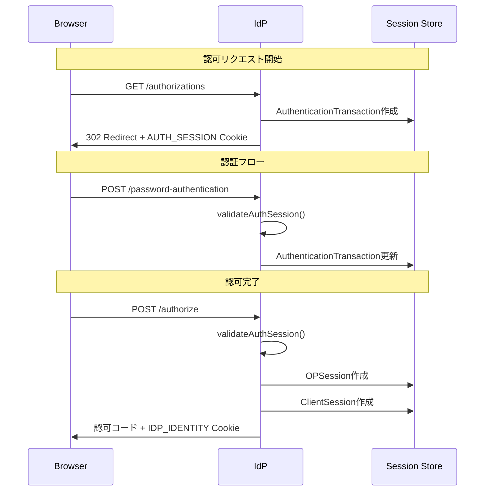

# セッション管理セキュリティ分析

このドキュメントでは、idp-serverのセッション管理におけるセキュリティ対策の現状を記載します。

## セッションライフサイクル概要

```
┌─────────────────────────────────────────────────────────────────────────────┐
│                          セッションライフサイクル                              │
├─────────────────────────────────────────────────────────────────────────────┤
│                                                                             │
│  【フェーズ1: 認可リクエスト開始】                                          │
│  ┌──────────────────┐                                                      │
│  │ GET /authorizations │                                                    │
│  └──────────────────┘                                                      │
│         │                                                                   │
│         ▼                                                                   │
│  ┌──────────────────┐     ┌──────────────────┐                             │
│  │ AuthSession       │     │ Authentication    │                             │
│  │ Cookie生成        │     │ Transaction作成   │                             │
│  │ (CSRF対策)        │     │ (認可リクエスト   │                             │
│  └──────────────────┘     │  に紐付く)        │                             │
│                            └──────────────────┘                             │
│                                                                             │
├─────────────────────────────────────────────────────────────────────────────┤
│                                                                             │
│  【フェーズ2: 認証完了】                                                    │
│  ┌──────────────────────────────────────────────────────────────┐          │
│  │ POST /password-authentication (+ TOTP等)                     │          │
│  └──────────────────────────────────────────────────────────────┘          │
│         │                                                                   │
│         ▼                                                                   │
│  ┌──────────────────┐                                                      │
│  │ validateAuthSession() │  ← AUTH_SESSION Cookie検証                       │
│  └──────────────────┘                                                      │
│         │                                                                   │
│         ▼                                                                   │
│  ┌──────────────────┐                                                      │
│  │ Authentication    │  認証情報を更新                                      │
│  │ Transaction更新   │  - user, acr, amr, authTime                         │
│  └──────────────────┘                                                      │
│                                                                             │
│  ※ この時点ではOPSessionは作成されない                                      │
│  ※ MFA途中離脱の場合、ここで止まる                                          │
│                                                                             │
├─────────────────────────────────────────────────────────────────────────────┤
│                                                                             │
│  【フェーズ3: 認可完了】                                                    │
│  ┌──────────────────┐                                                      │
│  │ POST /authorize   │                                                      │
│  └──────────────────┘                                                      │
│         │                                                                   │
│         ▼                                                                   │
│  ┌──────────────────┐                                                      │
│  │ validateAuthSession() │  ← AUTH_SESSION Cookie検証                       │
│  └──────────────────┘                                                      │
│         │                                                                   │
│         ▼                                                                   │
│  ┌──────────────────┐     ┌──────────────────┐                             │
│  │ OPSession作成     │     │ ClientSession作成 │                             │
│  │ (SSO用)          │     │ (per-client)     │                             │
│  │ acr, amr, authTime│     │ sid for ID Token │                             │
│  └──────────────────┘     └──────────────────┘                             │
│         │                                                                   │
│         ▼                                                                   │
│  ┌──────────────────┐                                                      │
│  │ IDP_IDENTITY      │  OPSession ID (HttpOnly)                            │
│  │ IDP_SESSION       │  SHA256(OPSession ID) (for iframe)                  │
│  │ Cookie設定        │                                                      │
│  └──────────────────┘                                                      │
│                                                                             │
└─────────────────────────────────────────────────────────────────────────────┘

┌─────────────────────────────────────────────────────────────────────────────┐
│                          SSO時のライフサイクル                               │
├─────────────────────────────────────────────────────────────────────────────┤
│                                                                             │
│  【前提: OPSession が既に存在する】                                          │
│  ┌──────────────────┐                                                      │
│  │ IDP_IDENTITY      │  既存のOPSession ID                                  │
│  │ Cookie あり       │                                                      │
│  └──────────────────┘                                                      │
│                                                                             │
├─────────────────────────────────────────────────────────────────────────────┤
│                                                                             │
│  【SSO方式1: prompt=none】                                                  │
│  ┌──────────────────┐                                                      │
│  │ GET /authorizations │  prompt=none                                       │
│  │                    │  + IDP_IDENTITY Cookie                             │
│  └──────────────────┘                                                      │
│         │                                                                   │
│         ▼                                                                   │
│  ┌──────────────────┐                                                      │
│  │ OPSession検証     │  - 有効期限チェック                                  │
│  │                   │  - max_ageチェック                                  │
│  │                   │  - AuthorizationGrantedチェック                     │
│  └──────────────────┘                                                      │
│         │                                                                   │
│         ▼                                                                   │
│  ┌──────────────────┐                                                      │
│  │ 302 Redirect      │  認可コード直接発行                                  │
│  │ + 認可コード      │  （認証・認可画面スキップ）                          │
│  └──────────────────┘                                                      │
│                                                                             │
├─────────────────────────────────────────────────────────────────────────────┤
│                                                                             │
│  【SSO方式2: authorize-with-session】                                       │
│  ┌──────────────────┐                                                      │
│  │ GET /authorizations │  prompt指定なし                                    │
│  └──────────────────┘                                                      │
│         │                                                                   │
│         ▼                                                                   │
│  ┌──────────────────┐     ┌──────────────────┐                             │
│  │ AuthSession       │     │ Authentication    │                             │
│  │ Cookie生成        │     │ Transaction作成   │                             │
│  └──────────────────┘     └──────────────────┘                             │
│         │                                                                   │
│         ▼                                                                   │
│  ┌──────────────────┐                                                      │
│  │ GET /view-data    │  session_enabled: true を返す                        │
│  └──────────────────┘                                                      │
│         │                                                                   │
│         ▼                                                                   │
│  ┌─────────────────────────────────────┐                                   │
│  │ POST /authorize-with-session         │                                   │
│  │ + AUTH_SESSION Cookie               │                                   │
│  │ + IDP_IDENTITY Cookie               │                                   │
│  └─────────────────────────────────────┘                                   │
│         │                                                                   │
│         ▼                                                                   │
│  ┌──────────────────┐     ┌──────────────────┐                             │
│  │ validateAuthSession() │  │ OPSession検証     │                             │
│  │ AUTH_SESSION検証  │     │ IDP_IDENTITY検証  │                             │
│  └──────────────────┘     └──────────────────┘                             │
│         │                                                                   │
│         ▼                                                                   │
│  ┌──────────────────┐                                                      │
│  │ OPSessionの認証   │  既存OPSessionのacr/amr/authTimeで認可               │
│  │ 情報で認可        │                                                      │
│  └──────────────────┘                                                      │
│                                                                             │
└─────────────────────────────────────────────────────────────────────────────┘
```

## セッションライフサイクル詳細



## Cookie一覧

| Cookie名 | 用途 | HttpOnly | Secure | SameSite |
|---------|------|----------|--------|----------|
| AUTH_SESSION | 認可フロー固定攻撃対策 | Yes | Yes | Lax |
| IDP_IDENTITY | OPSession識別（SSO用） | Yes | Yes | Lax |
| IDP_SESSION | OIDC Session Management iframe用 | No | Yes | Lax |

## 攻撃と対策マトリクス

| 攻撃 | 対策 | 備考 |
|------|------|------|
| セッション固定攻撃 (Session Fixation) | AUTH_SESSION Cookie検証 | `validateAuthSession()` |
| 認可フローハイジャック (authorize-with-session経由) | AUTH_SESSION Cookie検証 | `authorizeWithSession()`に追加 |
| ACRダウングレード攻撃 | acr_values検証 | `isSessionEnabled()`, `authorizeWithSession()` |
| CSRF攻撃 | SameSite=Lax + POST only | Cookie設定 |
| XSS経由のセッション窃取 | HttpOnly | IDP_IDENTITY Cookie |

## 対策：認可フローハイジャック

### 攻撃シナリオ

```
1. 攻撃者が認可リクエストを開始 → id=abc123, AUTH_SESSION=xyz789 を取得
2. 攻撃者がURL (id=abc123) を被害者に送信
3. 被害者が認証を完了
4. 攻撃者が authorize-with-session を呼ぶ
```

### 対策

`authorizeWithSession()` で AUTH_SESSION Cookieの一致を検証。認可フローを開始したブラウザと完了するブラウザが同一であることを保証。

### 結果

- AUTH_SESSION Cookie不一致 → 401 `auth_session_mismatch`
- AUTH_SESSION Cookie欠落 → 401 `auth_session_mismatch`

## 対策：ACRダウングレード攻撃

### 攻撃シナリオ

```
1. ユーザーがloa1（パスワードのみ）でログイン → OPSession(acr=loa1)作成
2. 新しい認可リクエスト（acr_values=loa2, MFA必要）
3. セッションが有効なためauthorize-with-sessionが使用可能に見える
4. authorize-with-session → loa1で認可される（MFAバイパス）
```

### 対策

acr_valuesとセッションのacrの整合性を検証。セッションのacrが要求されたacr_valuesに含まれない場合、セッション再利用を拒否。

### 結果

- セッションにacrがない → session_enabled=false, 400エラー
- セッションのacrがacr_valuesに含まれない → session_enabled=false, 400エラー
- セッションのacrがacr_valuesに含まれる → session_enabled=true, 認可成功

## E2Eテスト

| テスト | ファイル |
|-------|---------|
| AUTH_SESSION Cookie missing | `scenario-13-sso-session-management.test.js` |
| AUTH_SESSION Cookie mismatch | `scenario-13-sso-session-management.test.js` |
| ACR downgrade prevention (reject) | `scenario-13-sso-session-management.test.js` |
| ACR match (allow) | `scenario-13-sso-session-management.test.js` |

## 参考

- [OIDC Session Management](https://openid.net/specs/openid-connect-session-1_0.html)
- [Keycloak Session Management](https://www.keycloak.org/docs/latest/server_admin/#_user-session-management)
