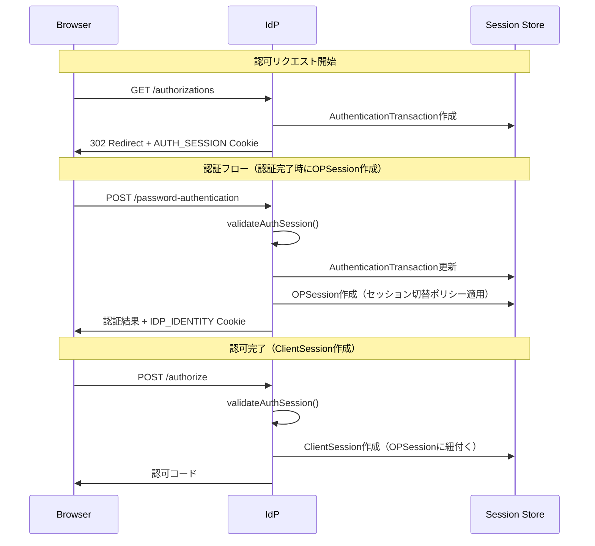

# セッション管理セキュリティ分析

このドキュメントでは、idp-serverのセッション管理におけるセキュリティ対策の現状を記載します。

## セッションライフサイクル概要

### 初回認証フロー

```
認可リクエスト ────→ 認証完了 ────→ 認可完了 ────→ SSO可能
      │                │              │              │
      ▼                ▼              ▼              ▼
┌───────────┐   ┌───────────┐   ┌───────────┐   ┌───────────┐
│AuthSession│   │ OPSession │   │ClientSession│  │  再利用    │
│  Cookie   │   │  Cookie   │   │  作成      │   │  可能     │
└───────────┘   └───────────┘   └───────────┘   └───────────┘
```

### セッション種類と役割

| セッション | Cookie | 役割 | ライフサイクル |
|-----------|--------|------|---------------|
| AuthenticationTransaction | AUTH_SESSION | 認可フローの保護 | 認可リクエスト〜認可完了 |
| OPSession | IDP_IDENTITY | SSO | 認証完了〜ログアウト/期限切れ |
| ClientSession | - | クライアント別セッション管理 | 認可完了〜ログアウト/期限切れ |

### SSO時の検証

```
SSO認可リクエスト ────→ セッション検証 ────→ ポリシー検証 ────→ 認可
        │                     │                   │
        ▼                     ▼                   ▼
   AUTH_SESSION          OPSession有効?      認証ポリシー
     + OPSession          acr一致?          条件を満たす?
```

## セッションライフサイクル詳細

### 初回認証フロー詳細

```
┌─────────────────────────────────────────────────────────────────────────────┐
│                          セッションライフサイクル                              │
├─────────────────────────────────────────────────────────────────────────────┤
│                                                                             │
│  【フェーズ1: 認可リクエスト開始】                                          │
│  ┌──────────────────┐                                                      │
│  │ GET /authorizations │                                                    │
│  └──────────────────┘                                                      │
│         │                                                                   │
│         ▼                                                                   │
│  ┌──────────────────┐     ┌──────────────────┐                             │
│  │ AuthSession       │     │ Authentication    │                             │
│  │ Cookie生成        │     │ Transaction作成   │                             │
│  │ (CSRF対策)        │     │ (認可リクエスト   │                             │
│  └──────────────────┘     │  に紐付く)        │                             │
│                            └──────────────────┘                             │
│                                                                             │
├─────────────────────────────────────────────────────────────────────────────┤
│                                                                             │
│  【フェーズ2: 認証完了】                                                    │
│  ┌──────────────────────────────────────────────────────────────┐          │
│  │ POST /password-authentication (+ TOTP等)                     │          │
│  └──────────────────────────────────────────────────────────────┘          │
│         │                                                                   │
│         ▼                                                                   │
│  ┌──────────────────┐                                                      │
│  │ validateAuthSession() │  ← AUTH_SESSION Cookie検証                       │
│  └──────────────────┘                                                      │
│         │                                                                   │
│         ▼                                                                   │
│  ┌──────────────────┐                                                      │
│  │ Authentication    │  認証情報を更新                                      │
│  │ Transaction更新   │  - user, acr, amr, authTime                         │
│  └──────────────────┘                                                      │
│         │                                                                   │
│         ▼                                                                   │
│  ┌──────────────────┐     ┌──────────────────┐                             │
│  │ OPSession作成     │     │ IDP_IDENTITY      │                             │
│  │ (SSO用)          │     │ IDP_SESSION       │                             │
│  │ acr, amr, authTime│     │ Cookie設定        │                             │
│  │ interactionResults│     │                   │                             │
│  └──────────────────┘     └──────────────────┘                             │
│                                                                             │
│  ※ 認証成功時にOPSessionを作成（セッション切替ポリシー適用）                │
│  ※ 同一ユーザー再認証時は既存セッションを再利用                              │
│  ※ MFA途中離脱の場合、OPSessionは作成されない                               │
│                                                                             │
├─────────────────────────────────────────────────────────────────────────────┤
│                                                                             │
│  【フェーズ3: 認可完了】                                                    │
│  ┌──────────────────┐                                                      │
│  │ POST /authorize   │                                                      │
│  └──────────────────┘                                                      │
│         │                                                                   │
│         ▼                                                                   │
│  ┌──────────────────┐                                                      │
│  │ validateAuthSession() │  ← AUTH_SESSION Cookie検証                       │
│  └──────────────────┘                                                      │
│         │                                                                   │
│         ▼                                                                   │
│  ┌──────────────────┐                                                      │
│  │ ClientSession作成 │  クライアント固有のセッション                         │
│  │ (per-client)     │  sid for ID Token                                    │
│  │ scope, claims    │  OPSessionに紐付く                                   │
│  └──────────────────┘                                                      │
│                                                                             │
└─────────────────────────────────────────────────────────────────────────────┘
```

### SSO時のライフサイクル詳細

```
┌─────────────────────────────────────────────────────────────────────────────┐
│                          SSO時のライフサイクル                               │
├─────────────────────────────────────────────────────────────────────────────┤
│                                                                             │
│  【前提: OPSession が既に存在する】                                          │
│  ┌──────────────────┐                                                      │
│  │ IDP_IDENTITY      │  既存のOPSession ID                                  │
│  │ Cookie あり       │                                                      │
│  └──────────────────┘                                                      │
│                                                                             │
├─────────────────────────────────────────────────────────────────────────────┤
│                                                                             │
│  【SSO方式1: prompt=none】                                                  │
│  ┌──────────────────┐                                                      │
│  │ GET /authorizations │  prompt=none                                       │
│  │                    │  + IDP_IDENTITY Cookie                             │
│  └──────────────────┘                                                      │
│         │                                                                   │
│         ▼                                                                   │
│  ┌──────────────────┐                                                      │
│  │ OPSession検証     │  - 有効期限チェック                                  │
│  │                   │  - max_ageチェック                                  │
│  │                   │  - AuthorizationGrantedチェック                     │
│  └──────────────────┘                                                      │
│         │                                                                   │
│         ▼                                                                   │
│  ┌──────────────────┐                                                      │
│  │ 302 Redirect      │  認可コード直接発行                                  │
│  │ + 認可コード      │  （認証・認可画面スキップ）                          │
│  └──────────────────┘                                                      │
│                                                                             │
├─────────────────────────────────────────────────────────────────────────────┤
│                                                                             │
│  【SSO方式2: authorize-with-session】                                       │
│  ┌──────────────────┐                                                      │
│  │ GET /authorizations │  prompt指定なし                                    │
│  └──────────────────┘                                                      │
│         │                                                                   │
│         ▼                                                                   │
│  ┌──────────────────┐     ┌──────────────────┐                             │
│  │ AuthSession       │     │ Authentication    │                             │
│  │ Cookie生成        │     │ Transaction作成   │                             │
│  └──────────────────┘     └──────────────────┘                             │
│         │                                                                   │
│         ▼                                                                   │
│  ┌──────────────────┐                                                      │
│  │ GET /view-data    │  session_enabled: true を返す                        │
│  └──────────────────┘                                                      │
│         │                                                                   │
│         ▼                                                                   │
│  ┌─────────────────────────────────────┐                                   │
│  │ POST /authorize-with-session         │                                   │
│  │ + AUTH_SESSION Cookie               │                                   │
│  │ + IDP_IDENTITY Cookie               │                                   │
│  └─────────────────────────────────────┘                                   │
│         │                                                                   │
│         ▼                                                                   │
│  ┌──────────────────┐     ┌──────────────────┐                             │
│  │ validateAuthSession() │  │ OPSession検証     │                             │
│  │ AUTH_SESSION検証  │     │ IDP_IDENTITY検証  │                             │
│  └──────────────────┘     └──────────────────┘                             │
│         │                                                                   │
│         ▼                                                                   │
│  ┌──────────────────┐                                                      │
│  │ OPSessionの認証   │  既存OPSessionのacr/amr/authTimeで認可               │
│  │ 情報で認可        │                                                      │
│  └──────────────────┘                                                      │
│                                                                             │
└─────────────────────────────────────────────────────────────────────────────┘
```

### シーケンス図



## Cookie一覧

| Cookie名 | 用途 | HttpOnly | Secure | SameSite |
|---------|------|----------|--------|----------|
| AUTH_SESSION | 認可フロー固定攻撃対策 | Yes | Yes | Lax |
| IDP_IDENTITY | OPSession識別（SSO用） | Yes | Yes | Lax |
| IDP_SESSION | OIDC Session Management iframe用 | No | Yes | Lax |

## 攻撃と対策マトリクス

| 攻撃 | 対策 | 備考 |
|------|------|------|
| セッション固定攻撃 (Session Fixation) | AUTH_SESSION Cookie検証 | `validateAuthSession()` |
| 認可フローハイジャック | AUTH_SESSION Cookie検証（認証時） | 被害者が認証できない |
| ACRダウングレード攻撃 | acr_values検証 | `isSessionEnabled()`, `authorizeWithSession()` |
| 認証ポリシーバイパス攻撃 | interactionResults検証 | `authorizeWithSession()`で再評価 |
| CSRF攻撃 | SameSite=Lax + POST only | Cookie設定 |
| XSS経由のセッション窃取 | HttpOnly | IDP_IDENTITY Cookie |
| 孤立セッション蓄積 | セッション切替ポリシー | `SWITCH_ALLOWED`で同一ユーザー再認証時に再利用 |
| 別ユーザーへのなりすまし | セッション切替ポリシー | `STRICT`で別ユーザー認証を拒否 |

## 対策：認可フローハイジャック

### 攻撃シナリオ

```
1. 攻撃者が認可リクエストを開始 → id=abc123, AUTH_SESSION=xyz789 を取得
2. 攻撃者がURL (id=abc123) を被害者に送信
3. 被害者がそのURLにアクセスして認証しようとする
4. 被害者のブラウザにはAUTH_SESSION Cookieがない（または別の値）
5. 認証時に validateAuthSession() が失敗
```

### 対策

認証エンドポイント（POST /password-authentication 等）で `validateAuthSession()` を実行。AUTH_SESSION CookieがAuthenticationTransactionのauthSessionIdと一致することを検証。

**検証タイミング**:
- POST /password-authentication（パスワード認証）
- POST /totp-authentication（TOTP認証）
- POST /authorize（認可）
- POST /authorize-with-session（SSO認可）

### 結果

- AUTH_SESSION Cookie欠落 → 401 `auth_session_mismatch`（被害者が認証できない）
- AUTH_SESSION Cookie不一致 → 401 `auth_session_mismatch`（被害者が認証できない）

### ポリシーによる制御

認証ポリシーで `auth_session_binding_required` を設定可能：

```json
{
  "auth_session_binding_required": true  // デフォルト: true（有効）
}
```

- `true`: AUTH_SESSION検証を実施（推奨）
- `false`: AUTH_SESSION検証をスキップ（特殊なユースケース向け）

**注意**: CIBA等のnon-browserフローでは自動的にスキップされます。

## 対策：ACRダウングレード攻撃

### 攻撃シナリオ

```
1. ユーザーがloa1（パスワードのみ）でログイン → OPSession(acr=loa1)作成
2. 新しい認可リクエスト（acr_values=loa2, MFA必要）
3. セッションが有効なためauthorize-with-sessionが使用可能に見える
4. authorize-with-session → loa1で認可される（MFAバイパス）
```

### 対策

acr_valuesとセッションのacrの整合性を検証。セッションのacrが要求されたacr_valuesに含まれない場合、セッション再利用を拒否。

### 結果

- セッションにacrがない → session_enabled=false, 400エラー
- セッションのacrがacr_valuesに含まれない → session_enabled=false, 400エラー
- セッションのacrがacr_valuesに含まれる → session_enabled=true, 認可成功

## 対策：認証ポリシーバイパス攻撃

### 攻撃シナリオ

ACRダウングレード攻撃とは異なり、**同じACRでも異なる認証ポリシー**が適用される場合の攻撃です。

```
【クライアント設定】
- ssoPasswordOnlyClient: acr=loa1, 認証ポリシー=パスワードのみ
- ssoMfaRequiredClient:  acr=loa1, 認証ポリシー=パスワード+TOTP必須

【攻撃シナリオ】
1. ユーザーがssoPasswordOnlyClientでログイン
   └─ パスワード認証のみ → OPSession作成（acr=loa1）

2. ユーザーがssoMfaRequiredClientにアクセス
   └─ OPSessionが有効、acr=loa1で一致

3. authorize-with-session を実行
   └─ [対策なし] acr一致のためMFAをバイパスして認可される ❌
   └─ [対策あり] 認証ポリシーのsuccessConditionsを再評価して拒否 ✓
```

### 対策

OPSessionに認証結果（interactionResults）を保存し、authorize-with-session時に認証ポリシーのsuccessConditionsを再評価。

**仕組み**:

```
┌─────────────────────────────────────────────────────────────┐
│ OPSession                                                    │
├─────────────────────────────────────────────────────────────┤
│ id: "op-session-123"                                         │
│ acr: "loa1"                                                  │
│ amr: ["password"]                                            │
│ interactionResults: {                                        │
│   "password": { "status": "success", ... },                  │
│   // TOTPの結果がない = MFA未実施                            │
│ }                                                            │
└─────────────────────────────────────────────────────────────┘
                          │
                          ▼
┌─────────────────────────────────────────────────────────────┐
│ authorize-with-session                                       │
├─────────────────────────────────────────────────────────────┤
│ 1. OPSession取得（acr, amr, interactionResults）            │
│ 2. 現在のリクエストの認証ポリシーを取得                      │
│ 3. successConditions を interactionResults で評価            │
│ 4. 条件を満たさない場合 → セキュリティイベント発行、拒否     │
└─────────────────────────────────────────────────────────────┘
```

### 結果

- 認証ポリシーのsuccessConditionsを満たす → 認可成功
- 認証ポリシーのsuccessConditionsを満たさない → 400エラー + セキュリティイベント `AUTHENTICATION_POLICY_MISMATCH`

### ACRダウングレード攻撃との違い

| 観点 | ACRダウングレード攻撃 | 認証ポリシーバイパス攻撃 |
|------|----------------------|------------------------|
| ACR | 異なる（loa1 vs loa2） | 同じ（loa1 = loa1） |
| 検証対象 | acr_values | successConditions |
| 検証タイミング | isSessionEnabled() | authorizeWithSession() |
| 保存データ | OPSession.acr | OPSession.interactionResults |

## 対策：セッション切替ポリシー

### 概要

同一ブラウザで別ユーザーが認証しようとした場合の動作を制御します。

### ポリシー

| ポリシー | 動作 | セキュリティレベル |
|----------|------|------------------|
| `STRICT` | エラーを返す（ログアウト必須） | 高 |
| `SWITCH_ALLOWED` | 古いセッション削除→新規作成 (デフォルト) | 中 |
| `MULTI_SESSION` | 新規作成（古いのは残る） | 低 |

### 動作フロー

```
同一ユーザーが再認証
└── 既存セッションを再利用（lastAccessedAt更新）
    → 孤立セッションを防止

別ユーザーが認証（既存セッションあり）
├── STRICT         → DifferentUserAuthenticatedException（403）
├── SWITCH_ALLOWED → 古いセッション終了（USER_SWITCH）→ 新規作成
└── MULTI_SESSION  → 新規作成（古いのはTTL満了まで残存）
```

### セキュリティ上の考慮

| 観点 | STRICT | SWITCH_ALLOWED | MULTI_SESSION |
|------|--------|----------------|---------------|
| 孤立セッション | なし | なし | あり |
| 共有PC対応 | × | ○ | ○ |
| セッション管理 | 厳格 | バランス | 緩い |
| 推奨環境 | 金融、エンタープライズ | 一般Webアプリ | 後方互換性 |

### テナント設定

```json
{
  "session": {
    "timeout_seconds": 3600,
    "switch_policy": "STRICT"
  }
}
```

## E2Eテスト

| テスト | ファイル |
|-------|---------|
| AUTH_SESSION Cookie missing | `scenario-13-sso-session-management.test.js` |
| AUTH_SESSION Cookie mismatch | `scenario-13-sso-session-management.test.js` |
| ACR downgrade prevention (reject) | `scenario-13-sso-session-management.test.js` |
| ACR match (allow) | `scenario-13-sso-session-management.test.js` |
| Authentication policy bypass prevention (reject) | `scenario-13-sso-session-management.test.js` |
| Same policy SSO (allow) | `scenario-13-sso-session-management.test.js` |
| Same user re-authentication (session reuse) | `scenario-13-sso-session-management.test.js` |

## 参考

- [OIDC Session Management](https://openid.net/specs/openid-connect-session-1_0.html)
- [Keycloak Session Management](https://www.keycloak.org/docs/latest/server_admin/#_user-session-management)
