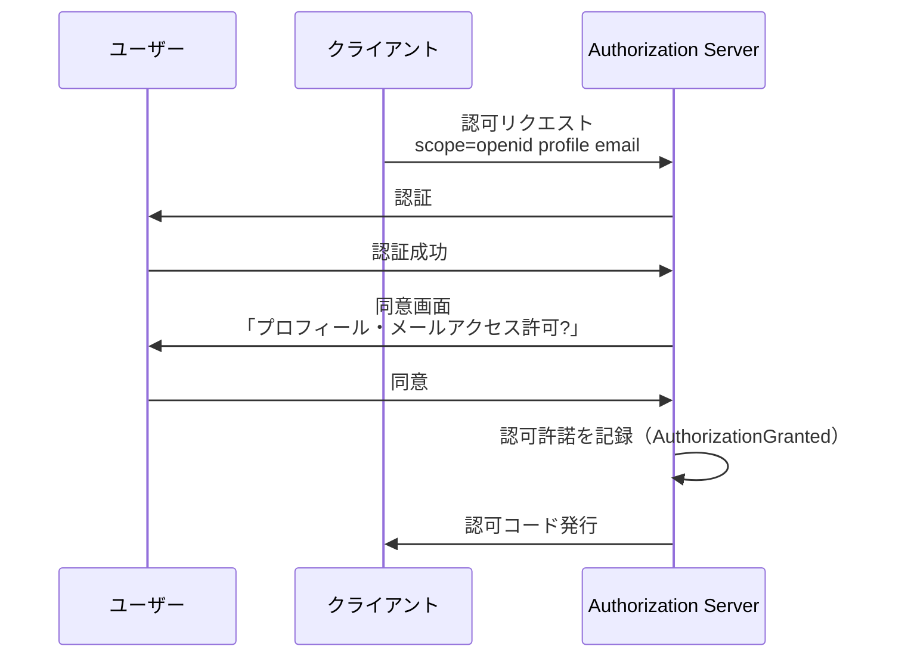
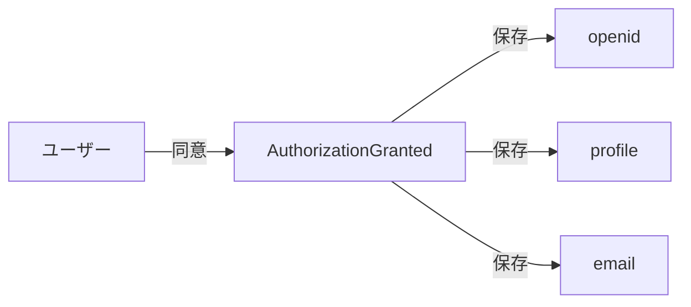
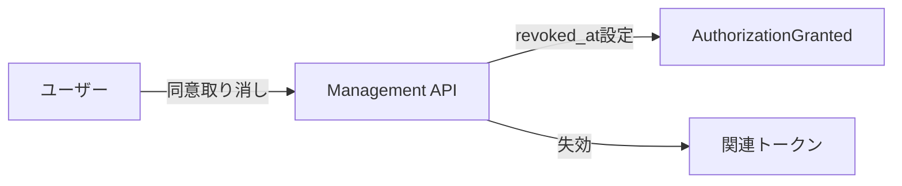
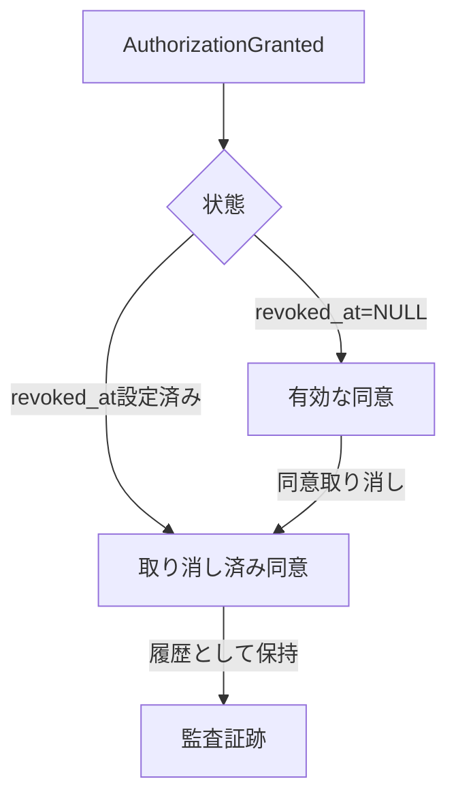

# 認可許諾管理

---

## 前提知識

このドキュメントを理解するには、以下の基礎知識が役立ちます：

- [OAuth 2.0の基本](../basic/basic-06-oauth2-authorization.md) - OAuth 2.0の認可の仕組み
- [認可](concept-04-authorization.md) - 認可サーバーの概要
- [監査ログ](../07-operations/concept-01-audit-compliance.md) - 監査証跡の保持

---

## 概要

idp-serverは、OAuth 2.0/OpenID Connectにおける**認可許諾（Authorization Grant）** と**同意（Consent）** を管理します。

**認可許諾**とは、ユーザーがクライアント（アプリケーション）に対して与えた権限の記録です。



idp-serverでは以下のような用途に対応できます：

* ユーザーの同意を記録し、次回以降の同意画面をスキップ
* ユーザーによる同意の取り消し
* 同意履歴の監査証跡としての保持

---

## idp-serverにおける認可許諾管理の設計思想

### 1. スコープ単位の同意記録

idp-serverは、**スコープ単位で同意を記録**します。



**同意内容**:
- 誰が（ユーザーID）
- どのクライアントに（クライアントID）
- どのスコープを（スコープ一覧）
- いつ許可したか（付与日時）

**メリット**:
- 次回以降、同じスコープであれば同意画面をスキップ
- 新しいスコープが追加された場合のみ同意画面を表示
- ユーザー体験の向上

### 2. 同意の取り消し

ユーザーは、過去に与えた同意を取り消すことができます。



**取り消しの効果**:
- 論理削除（`revoked_at`設定）で履歴保持
- 関連するアクセストークン・リフレッシュトークンの失効
- 次回アクセス時に再度同意画面を表示

**履歴保持の理由**:
- 監査証跡として保持
- 統計・分析用途
- 法的証拠

### 3. 同意履歴の永続化

同意の記録は、論理削除で履歴を保持します。



**3つの状態**:

| 状態 | revoked_at | 意味 | 動作 |
|:---|:---|:---|:---|
| **有効** | NULL | 同意が有効 | 同意画面スキップ |
| **取り消し済み** | 設定済み | 同意が取り消された | 再度同意画面を表示 |
| **ユーザー削除後** | 設定済み | ユーザーは削除されたが履歴は保持 | 監査証跡として保持 |

詳細は [concept-13: 監査ログ](../07-operations/concept-01-audit-compliance.md) を参照。

### 4. ユーザー削除時の扱い

ユーザーが削除された場合、認可許諾は**論理削除**されます。

**なぜ物理削除しないのか**:
- 監査証跡として保持が必要
- 「誰が、いつ、どのクライアントに、何のスコープを許可したか」の記録
- コンプライアンス要件

**ユーザー削除フロー**:
```
1. DELETE /users/{userId}
2. UserLifecycleEvent(DELETE)発行
3. idp_user を物理削除
4. authorization_granted は論理削除（revoked_at設定）
5. 関連トークンを失効
```


---

## ユースケース

### 1. 同意のスキップ: 2回目以降のログイン

初回ログイン時に同意を記録し、次回以降はスキップ。

- **初回**: 同意画面を表示 → ユーザーが承認 → AuthorizationGranted記録
- **2回目以降**: 同じスコープなら同意画面をスキップ
- **効果**: ユーザー体験の向上、スムーズなログイン

### 2. 同意の取り消し: ユーザーによるアクセス権限の撤回

ユーザーがクライアントへのアクセス権限を取り消し。

- **操作**: ユーザーが同意を取り消し
- **処理**: revoked_at設定、関連トークン失効
- **効果**: 次回アクセス時に再度同意画面を表示

### 3. スコープ追加時の再同意

クライアントが新しいスコープを要求した場合、追加スコープのみ同意。

- **既存同意**: openid, profile（スキップ）
- **新規スコープ**: email（同意画面を表示）
- **効果**: 必要最小限の同意プロセス

---

## プライバシー規制対応

### GDPR対応

idp-serverは、GDPR主要条項に対応しています。

**Article 7（同意）**:
- 同意取得の証明: AuthorizationGrantedレコード
- 同意の容易な取り消し: Management API提供
- 同意履歴の記録: 論理削除（revoked_at）で履歴保持

**Article 17（忘れられる権利）**:
- ユーザーデータの物理削除
- 同意記録の論理削除（履歴保持）
- 監査ログは保持（法的義務）

**Article 20（データポータビリティ）**:
- ユーザーの同意履歴をエクスポート可能
- JSON形式での提供

### その他の規制

- **個人情報保護法**: 同意取得の記録
- **CCPA**: 消費者の削除権（同意記録の論理削除）

---

## セキュリティ考慮事項

### 同意の確実な記録

- **同意画面の表示**: スコープの意味を明確に説明
- **同意の永続化**: データベースに確実に記録
- **同意のタイムスタンプ**: いつ同意したかを記録

### 同意の取り消しの確実性

- **論理削除**: revoked_atで取り消し記録
- **トークン失効**: 関連するすべてのトークンを失効
- **再同意の要求**: 次回アクセス時に同意画面を表示

### 同意記録の保護

- **改ざん防止**: 監査ログと同様のアクセス制御
- **履歴の保持**: 取り消し後も履歴として保持
- **監査証跡**: 同意・取り消し操作をAuditLogに記録

---

## 関連ドキュメント

- [認可](concept-04-authorization.md) - 認可サーバー、スコープベースアクセス制御
- [監査ログ](../07-operations/concept-01-audit-compliance.md) - 監査証跡、データ保持ポリシー
- [カスタムクレーム](../04-tokens-claims/concept-03-custom-claims.md) - スコープとクレームの関係

---

## 参考仕様

- [RFC 6749: The OAuth 2.0 Authorization Framework](https://datatracker.ietf.org/doc/html/rfc6749) - OAuth 2.0基本仕様
- [OpenID Connect Core 1.0](https://openid.net/specs/openid-connect-core-1_0.html) - OIDC基本仕様
- [GDPR - General Data Protection Regulation](https://gdpr-info.eu/) - EU一般データ保護規則
