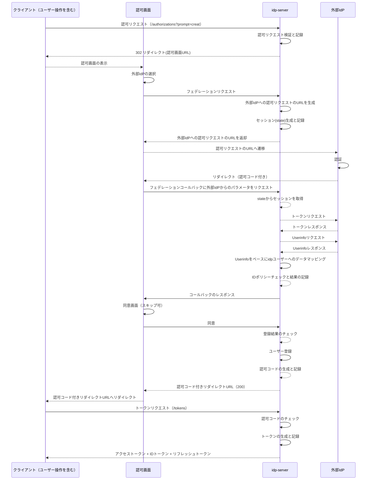

# フェデレーション（外部IdP連携）

---

## 前提知識

このドキュメントを理解するには、以下の基礎知識が役立ちます：

- [認証ポリシー](concept-01-authentication-policy.md) - 認証方式の設定
- [OpenID Connectの基礎](../basic/basic-11-oauth-oidc-basics.md) - OIDCの概要
- [ID管理](../02-identity-management/concept-01-id-management.md) - ユーザー管理

---

## 概要

idp-serverは、**フェデレーション**（外部IdP連携）をサポートします。

**フェデレーション**とは、外部のアイデンティティプロバイダー（IdP）と連携し、ユーザーが外部サービスのアカウントでログインできる機能です。

```
ユーザー ──[ログイン]──> idp-server ──[リダイレクト]──> 外部IdP (Google/Azure AD等)
                                                            │
    ┌───────────────────[IDトークン]────────────────────────┘
    │
    v
idp-server ──[セッション作成]──> ユーザー
```

idp-serverでは以下のような用途に対応できます：

* **ソーシャルログイン**: Google、GitHub、LINE等でのログイン
* **エンタープライズSSO**: Azure AD、Okta、Auth0等との連携
* **B2B連携**: 取引先企業のIdPとの連携

---

## なぜフェデレーションが必要か

### ユーザー視点のメリット

| メリット | 説明 |
|:---|:---|
| **利便性** | 既存アカウントでログイン、新規登録不要 |
| **パスワード管理不要** | サービスごとのパスワードを覚える必要がない |
| **信頼性** | 大手IdPのセキュリティを活用 |

### サービス提供者視点のメリット

| メリット | 説明 |
|:---|:---|
| **登録率向上** | ログインの手間が減り、登録率が向上 |
| **セキュリティ向上** | 大手IdPのMFA、不正検知を活用 |
| **運用コスト削減** | パスワード管理、リセット対応の負荷軽減 |

### エンタープライズ視点のメリット

| メリット | 説明 |
|:---|:---|
| **SSO実現** | 社内システム間のシングルサインオン |
| **ID管理の一元化** | 入退社時のアカウント管理を一元化 |
| **コンプライアンス** | 企業のセキュリティポリシーを適用 |

---

## idp-serverにおけるフェデレーション

### シーケンス



### 対応プロトコル

| プロトコル | 用途 | 対応IdP例 |
|:---|:---|:---|
| **OpenID Connect** | 標準的なフェデレーション | Google, Azure AD, Okta, Auth0 |
| **OAuth 2.0** | アクセストークン取得 | GitHub, Twitter |

**設定方法**: [フェデレーション設定ガイド](../../content_05_how-to/how-to-11-federation-setup.md)

---

## ユーザー管理

### アカウント紐付け

外部IdPのアカウントとidp-serverのユーザーを紐付ける方法：

```
外部IdP認証
     │
     v
ユーザー存在？
     │
     ├──[存在]──> アカウント紐付け ──┐
     │                              │
     └──[新規]──> ユーザー作成 ─────┤
                                    │
                                    v
                              セッション作成
```

**紐付けの種類**:
- **自動作成**: 初回ログイン時に自動でユーザー作成
- **事前紐付け**: 管理者が事前にユーザーと外部アカウントを紐付け
- **ユーザー紐付け**: ユーザーが自分で既存アカウントと紐付け

### 属性マッピング

外部IdPから取得した属性をidp-serverのユーザー属性にマッピングします。

**マッピングの目的**:
- 外部IdPのユーザー情報（UserInfo/IDトークン）をidp-serverのユーザー属性に変換
- JSONPathによる柔軟なマッピングで、ネストした属性も対応可能

**主要なマッピング対象**:
| 属性 | 用途 |
|:---|:---|
| **sub** | 外部IdPでのユーザー識別子（統合キーとして使用） |
| **email** | メールアドレス（統合キーとして使用可能） |
| **name** | 表示名 |
| **picture** | プロフィール画像URL |
| **カスタム属性** | 部署、従業員IDなどIdP固有の属性 |

### ユーザー統合戦略

フェデレーション時に、外部IdPのユーザーをidp-serverのユーザーとどう紐付けるかを決定します。

```
外部IdP認証
     │
     v
ユーザー検索（統合キーで検索）
     │
     ├──[一致]──> 既存ユーザーと紐付け
     │
     └──[不一致]──> 新規ユーザー作成
```

**統合戦略の種類**:
| 戦略 | 統合キー | ユースケース |
|:---|:---|:---|
| **メールアドレス統合** | email | 一般的なソーシャルログイン |
| **外部ID統合** | sub（外部IdPのユーザーID） | エンタープライズSSO、厳密な紐付け |

**設定方法**: [フェデレーション設定ガイド](../../content_05_how-to/how-to-11-federation-setup.md#ユーザー統合戦略)

---

## セキュリティ考慮事項

### トークン検証

外部IdPから受け取るIDトークンは必ず検証します：

- **署名検証**: IdPの公開鍵で署名を検証
- **issuer検証**: 期待するIdPからのトークンか確認
- **audience検証**: 自分のclient_id宛のトークンか確認
- **有効期限検証**: トークンが有効期限内か確認

### セキュリティリスクと対策

| リスク | 対策 |
|:---|:---|
| **アカウント乗っ取り** | メール検証済みの属性のみ信頼 |
| **IdP偽装** | issuer、署名の厳密な検証 |
| **トークンリプレイ** | nonce、stateパラメータの使用 |

### 信頼できるIdPの選定

IdP選定時の考慮事項：
- **email_verified属性**: メール検証済みの属性のみ信頼
- **許可ドメイン**: 特定のドメインのみ許可（エンタープライズ用途）
- **IdPの信頼性**: 大手IdPまたは検証済みのIdPを使用

---

## ユースケース

### 1. ソーシャルログイン

一般消費者向けサービスでGoogle、LINE等でのログインを提供。

**メリット**:
- 登録率の向上
- パスワード管理不要

### 2. エンタープライズSSO

企業内システムでAzure ADとのSSOを実現。

**メリット**:
- 社員は一度のログインで複数システムにアクセス
- IT部門はID管理を一元化

### 3. B2B連携

取引先企業のIdPと連携し、取引先社員がアクセス可能に。

**メリット**:
- 取引先のID管理ポリシーを尊重
- アカウント発行の手間を削減

---

## 関連ドキュメント

### 設定
- [フェデレーション設定](../../content_06_developer-guide/05-configuration/federation.md)
- [認証ポリシー設定](../../content_06_developer-guide/05-configuration/authentication-policy.md)

### How-to
- [フェデレーション設定ガイド](../../content_05_how-to/how-to-11-federation-setup.md)

### 実装
- [フェデレーションプロバイダー実装](../../content_06_developer-guide/04-implementation-guides/impl-08-federation-provider.md)

---

## 参考仕様

- [OpenID Connect Core 1.0](https://openid.net/specs/openid-connect-core-1_0.html) - OIDC基本仕様
- [OpenID Connect Discovery 1.0](https://openid.net/specs/openid-connect-discovery-1_0.html) - IdP検出仕様
