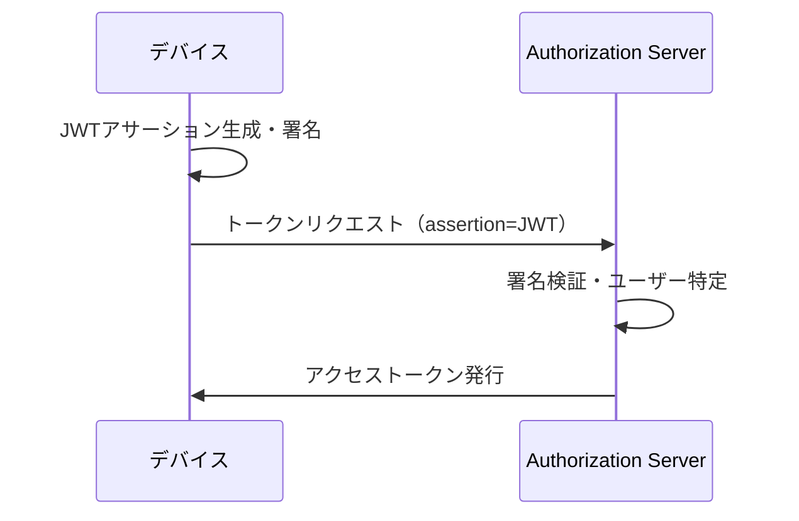

# JWT認可グラント（JWT Bearer Grant）

## 概要

**JWT認可グラント**は、RFC 7523で定義されたOAuth 2.0の拡張グラントタイプです。クライアントがJWTアサーションを提示することで、ユーザーの操作なしにアクセストークンを取得できます。

```
Grant Type: urn:ietf:params:oauth:grant-type:jwt-bearer
```



---

## ユースケース

### 1. デバイス認証

モバイルアプリやIoTデバイスが、事前登録されたデバイスクレデンシャル（対称鍵/非対称鍵）でJWTに署名し、トークンを取得します。

- モバイルアプリのサイレント認証
- IoTデバイスのM2M認証
- パスワードレス認証フロー

### 2. 外部IdP連携

外部のアイデンティティプロバイダーが発行したJWTを使用してトークンを取得します。

- B2B連携でパートナー企業のIdPを信頼
- 既存IdPからの移行

---

## デバイスクレデンシャル

認証デバイスに紐づく署名用の資格情報です。

### 取得方法

| 方法 | 説明 |
|-----|------|
| **FIDO-UAF登録時に自動発行** | テナントポリシーで`issue_device_secret: true`を設定すると、FIDO-UAF登録時にシークレットが自動発行される（推奨） |
| **手動登録** | ユーザー登録時にデバイスクレデンシャルを一緒に登録 |

> **推奨**: FIDO-UAF登録時の自動発行を使用してください。詳細は[デバイスクレデンシャル管理](concept-10-device-credential.md)を参照。

### 対応アルゴリズム

- 対称鍵: HS256, HS384, HS512
- 非対称鍵: RS256, ES256, PS256

### FIDO-UAF登録時の自動発行レスポンス

```json
{
  "status": "success",
  "device_id": "device_abc123",
  "device_secret": "base64url-encoded-random-secret",
  "device_secret_algorithm": "HS256",
  "device_secret_jwt_issuer": "device:device_abc123"
}
```

`device_secret_jwt_issuer`の値をJWTの`iss`クレームに使用します。

---

## JWTアサーション

デバイスが生成するJWTの必須クレーム:

- `iss`: イシュアー（デバイス認証の場合は `device:{deviceId}`）
- `sub`: サブジェクト（ユーザーIDまたはデバイスID）
- `aud`: オーディエンス（認可サーバーのissuer）
- `exp`: 有効期限
- `iat`: 発行時刻

```json
{
  "iss": "device:550e8400-e29b-41d4-a716-446655440000",
  "sub": "user-123",
  "aud": "https://auth.example.com/tenant-456",
  "exp": 1704067200,
  "iat": 1704063600
}
```

---

## ユーザー解決（Subject Claim Mapping）

`sub`クレームからユーザーを特定する方法を`subject_claim_mapping`で設定します。

- `sub`: subクレームをユーザーIDとして使用（デフォルト）
- `device_id`: subクレームをデバイスIDとして使用し、そのデバイスの所有者を検索
- `email`: subクレームをメールアドレスとして使用（外部IdP連携）

`device_id`マッピングを使うと、JWTの`sub`にデバイスIDを入れるだけで、そのデバイスの所有者ユーザーに対してトークンが発行されます。

---

## クライアント設定

JWT Bearer Grantを使用するには、クライアントに以下の設定が必要です。

```json
{
  "grant_types": ["urn:ietf:params:oauth:grant-type:jwt-bearer"],
  "extension": {
    "available_federations": [
      {
        "type": "device",
        "issuer": "device",
        "subject_claim_mapping": "sub",
        "jwt_bearer_grant_enabled": true
      }
    ]
  }
}
```

---

## セキュリティ考慮事項

- **有効期限**: JWTアサーションの有効期限は短く設定（推奨: 5分以内）
- **jti**: リプレイ攻撃防止のためJWT IDを使用
- **鍵タイプの選択**: 対称鍵（HS256）は導入が簡単、非対称鍵（ES256）はサーバーに公開鍵のみ登録するため鍵管理が容易

---

## 関連ドキュメント

- [デバイスクレデンシャル管理](concept-10-device-credential.md)
- [フェデレーション](concept-08-federation.md)
- [認可](concept-04-authorization.md)

## 参考仕様

- [RFC 7523: JWT Profile for OAuth 2.0 Authorization Grants](https://datatracker.ietf.org/doc/html/rfc7523)
- [RFC 7521: Assertion Framework for OAuth 2.0](https://datatracker.ietf.org/doc/html/rfc7521)
