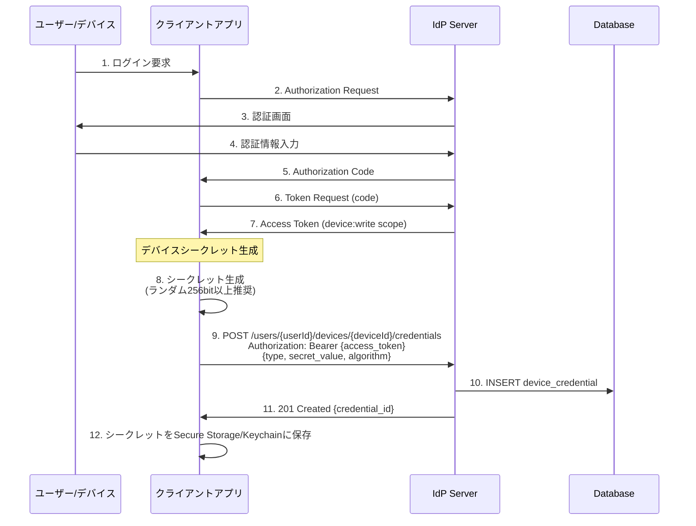
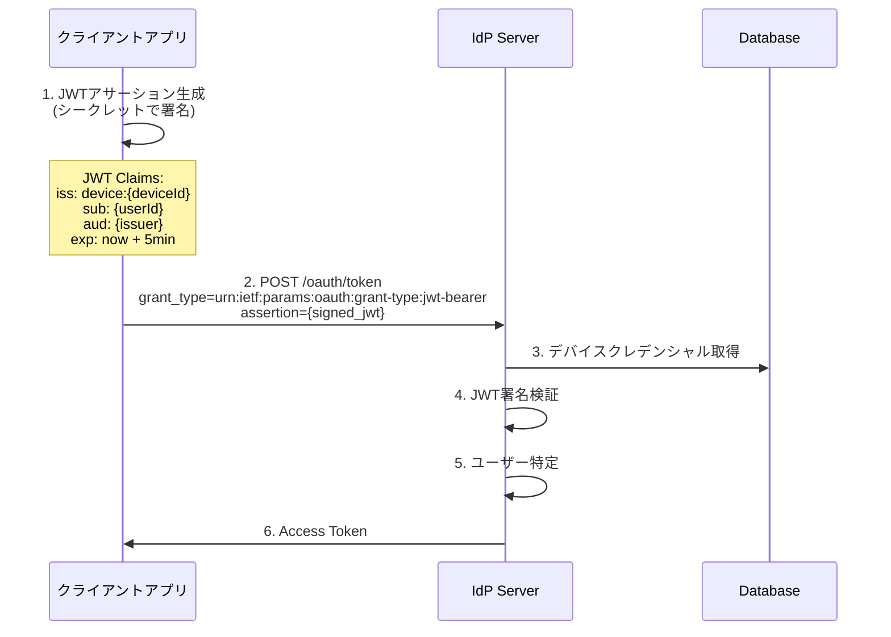
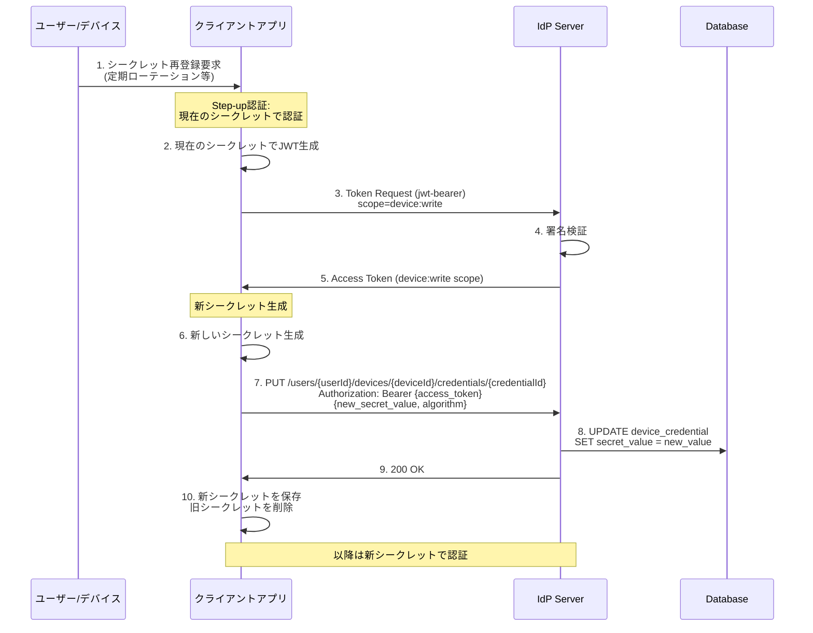
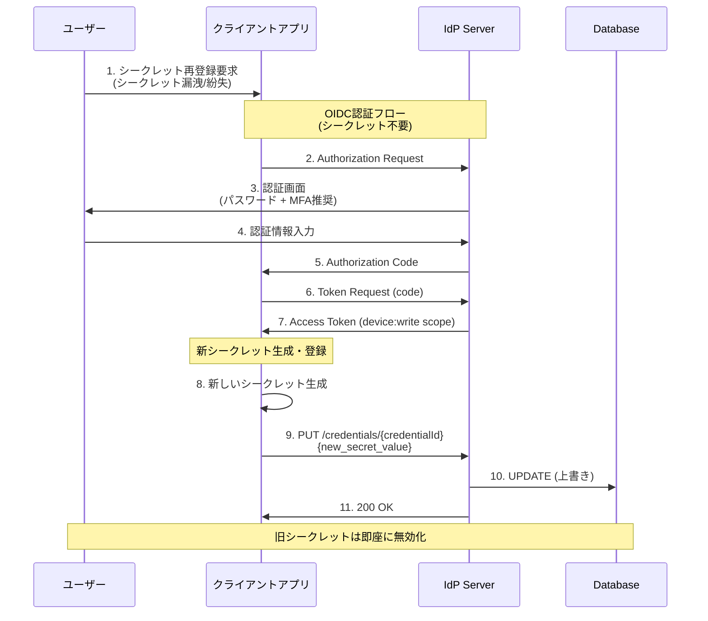
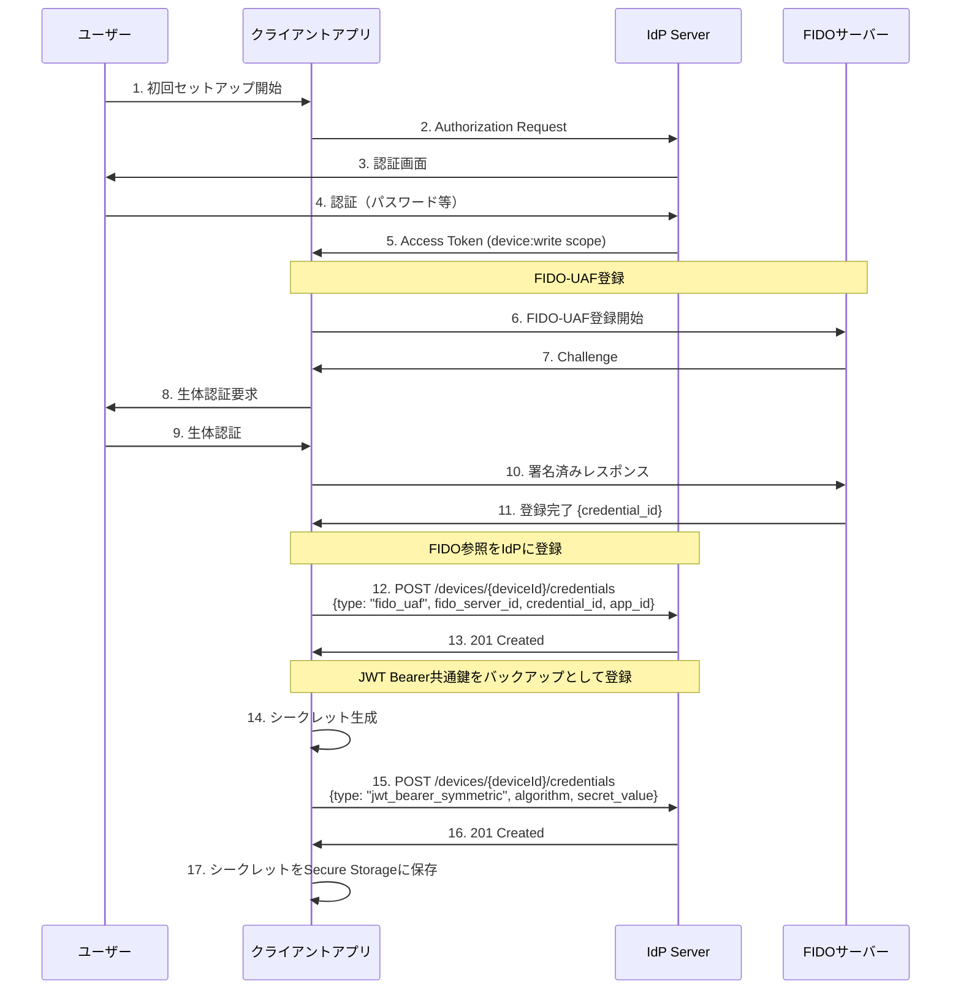
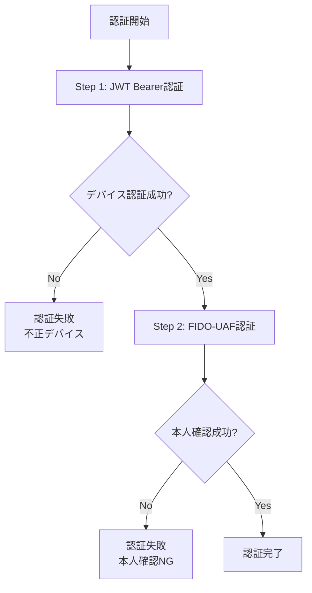
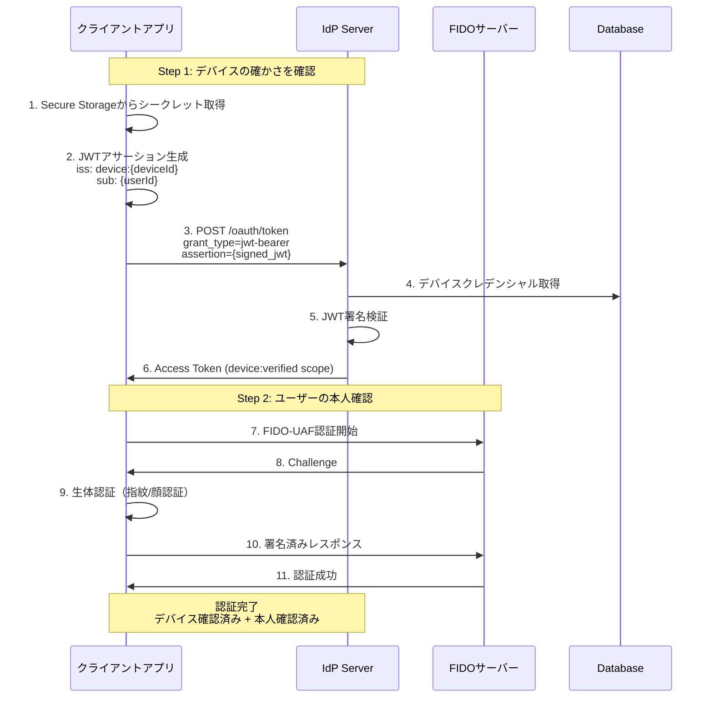

# デバイスクレデンシャル管理

## 概要

**デバイスクレデンシャル**は、モバイルアプリやIoTデバイスがJWT Bearer Grantを使用してトークンを取得するための署名鍵です。本ドキュメントでは、デバイスクレデンシャルの登録から再登録までのライフサイクルを説明します。

---

## クレデンシャルタイプ

| タイプ | 説明 | データ管理 | ユースケース |
|--------|------|-----------|-------------|
| **jwt_bearer_symmetric** | 対称鍵（共有シークレット） | IdPが直接管理 | シンプルな導入、HS256/HS384/HS512 |
| **jwt_bearer_asymmetric** | 非対称鍵（公開鍵） | IdPが直接管理 | セキュリティ重視、RS256/ES256/PS256 |
| **fido2** | FIDO2/WebAuthn/Passkey | FIDOサーバーへの参照 | パスワードレス認証 |
| **fido_uaf** | FIDO UAF | FIDOサーバーへの参照 | モバイルアプリ認証 |

### FIDO クレデンシャルの特徴

FIDO2/FIDO UAFクレデンシャルは、実際の認証データ（公開鍵、署名カウンタ等）をFIDOサーバーが管理します。
`device_credentials`テーブルはFIDOサーバーへの**参照情報のみ**を保持します。

```
┌─────────────────────────────┐         ┌─────────────────────────────┐
│ device_credentials          │         │ FIDOサーバー                 │
├─────────────────────────────┤         ├─────────────────────────────┤
│ credential_type: "fido2"    │         │ 内部: webauthn_credentials  │
│ type_specific_data:         │  ─ ─ ─ ▶│ 外部: External FIDO Server  │
│   fido_server_id: "internal"│         │                             │
│   credential_id: "abc123"   │         │ ← 実際のクレデンシャルデータ  │
│   rp_id: "example.com"      │         │   (公開鍵, sign_count等)     │
└─────────────────────────────┘         └─────────────────────────────┘
```

**メリット:**
- 内部/外部FIDOサーバーどちらでも同じ構造
- FIDOサーバーの入れ替えが容易
- IdPはFIDO認証の詳細を意識しない

---

## ライフサイクル

```
┌─────────────┐     ┌─────────────┐     ┌─────────────┐
│   初回登録   │ ──▶ │    利用     │ ──▶ │   再登録    │
│  (register) │     │ (jwt-bearer)│     │  (update)   │
└─────────────┘     └─────────────┘     └──────┬──────┘
                                               │
                                               ▼
                                        ┌─────────────┐
                                        │    利用     │
                                        │ (jwt-bearer)│
                                        └─────────────┘
```

---

## 初回登録フロー

ユーザーがOIDC認証を完了後、デバイスクレデンシャルを登録します。



### リクエスト例

```http
POST /api/v1/users/{userId}/devices/{deviceId}/credentials
Authorization: Bearer {access_token}
Content-Type: application/json

{
  "credential_type": "jwt_bearer_symmetric",
  "type_specific_data": {
    "algorithm": "HS256",
    "secret_value": "base64url-encoded-random-secret"
  },
  "expires_at": "2025-12-31T23:59:59Z"
}
```

### レスポンス例

```json
{
  "id": "cred_abc123",
  "credential_type": "jwt_bearer_symmetric",
  "created_at": "2024-01-15T10:00:00Z",
  "expires_at": "2025-12-31T23:59:59Z"
}
```

---

## JWT Bearer Grantによるトークン取得

登録したクレデンシャルを使用してアクセストークンを取得します。



### リクエスト例

```http
POST /oauth/token
Content-Type: application/x-www-form-urlencoded

grant_type=urn:ietf:params:oauth:grant-type:jwt-bearer
&assertion=eyJhbGciOiJIUzI1NiIsInR5cCI6IkpXVCJ9...
&scope=openid profile
```

---

## 再登録フロー（Update方式）

シークレットのローテーションや漏洩時に、新しいクレデンシャルで上書き更新します。

### 通常の再登録（現在のシークレットが有効な場合）



### リクエスト例

```http
PUT /api/v1/users/{userId}/devices/{deviceId}/credentials/{credentialId}
Authorization: Bearer {access_token}
Content-Type: application/json

{
  "type_specific_data": {
    "algorithm": "HS256",
    "secret_value": "new-base64url-encoded-secret"
  },
  "expires_at": "2026-12-31T23:59:59Z"
}
```

---

## シークレット漏洩時のリカバリ

現在のシークレットが漏洩または紛失した場合、通常のOIDC認証で再登録します。



---

## FIDO-UAF + JWT Bearer 併用フロー

FIDO-UAF認証の前段階として、JWT Bearer認証でデバイスの正当性を確認するパターンです。

### 2段階認証の目的

```
┌─────────────────────────────────────────────────────────────┐
│ Step 1: JWT Bearer認証                                      │
│   目的: デバイスの確かさを確認                                │
│   検証: このデバイスは正規に登録されたものか？                 │
└─────────────────────────────────────────────────────────────┘
                           ↓
┌─────────────────────────────────────────────────────────────┐
│ Step 2: FIDO-UAF認証                                        │
│   目的: ユーザーの本人確認                                    │
│   検証: このデバイスを持っている人は本人か？（生体認証）        │
└─────────────────────────────────────────────────────────────┘
```

### ユースケース

| シナリオ | 説明 |
|---------|------|
| **不正デバイス防止** | FIDO認証前にデバイス自体の正当性を確認 |
| **デバイス紐付け確認** | ユーザーアカウントに紐付いた正規デバイスかを検証 |
| **多層防御** | デバイス認証 + 本人認証の2段階で安全性向上 |

### クレデンシャル構成

1台のデバイスに複数のクレデンシャルを登録できます。

```
┌─────────────────────────────────────────────────────────┐
│ device: device_001                                       │
├─────────────────────────────────────────────────────────┤
│ credential[0]                                            │
│   type: fido_uaf                                         │
│   type_specific_data:                                    │
│     fido_server_id: "internal"                           │
│     credential_id: "fido_abc123"                         │
│     app_id: "com.example.app"                            │
│   status: active                                         │
├─────────────────────────────────────────────────────────┤
│ credential[1]                                            │
│   type: jwt_bearer_symmetric                             │
│   type_specific_data:                                    │
│     algorithm: "HS256"                                   │
│     secret_value: "..."                                  │
│   status: active (fallback)                              │
└─────────────────────────────────────────────────────────┘
```

### 初回登録フロー（両方のクレデンシャル）



### 2段階認証フロー



### 認証シーケンス



### クライアントアプリ実装例

```swift
// iOS Swift例
class DeviceAuthenticator {

    func authenticate() async throws -> AuthResult {
        // Step 1: デバイスの確かさを確認
        let deviceToken = try await verifyDevice()

        // Step 2: ユーザーの本人確認
        try await verifyUser()

        return AuthResult(deviceVerified: true, userVerified: true)
    }

    private func verifyDevice() async throws -> AccessToken {
        // Keychainからシークレット取得
        let secret = try Keychain.get("device_secret")

        // JWTアサーション生成
        let jwt = JWTBuilder()
            .issuer("device:\(deviceId)")
            .subject(userId)
            .audience(tokenEndpoint)
            .expiresIn(minutes: 5)
            .sign(with: secret, algorithm: .hs256)

        // トークンリクエスト
        return try await tokenClient.requestToken(
            grantType: "urn:ietf:params:oauth:grant-type:jwt-bearer",
            assertion: jwt,
            scope: "device:verified"
        )
    }

    private func verifyUser() async throws {
        // FIDO-UAF認証（生体認証）
        try await fidoClient.authenticate()
    }
}
```

### 運用上の考慮事項

| 項目 | 推奨 |
|------|------|
| **JWT Bearerの用途** | FIDO認証の前段階でデバイスの正当性を確認 |
| **認証順序** | 必ずJWT Bearer → FIDO-UAFの順で実行 |
| **シークレット管理** | Secure Storage/Keychainに保存、定期ローテーション推奨 |
| **監査ログ** | デバイス認証・本人認証それぞれの結果を記録 |
| **レート制限** | JWT Bearer認証には厳格なレート制限を適用 |

---

## セキュリティ考慮事項

### シークレット生成

- **最小エントロピー**: 256bit以上のランダム値を使用
- **生成方法**: `SecureRandom`等の暗号論的に安全な乱数生成器を使用

```java
// 推奨される生成方法
SecureRandom random = new SecureRandom();
byte[] secret = new byte[32]; // 256bit
random.nextBytes(secret);
String secretValue = Base64.getUrlEncoder().withoutPadding().encodeToString(secret);
```

### シークレット保存

| プラットフォーム | 推奨保存先 |
|-----------------|-----------|
| iOS | Keychain Services |
| Android | Android Keystore |
| Web | 非推奨（サーバーサイドで管理） |

### ローテーション

- **定期ローテーション**: 90日〜1年を推奨
- **即座の無効化**: Update方式により旧シークレットは即座に無効化
- **監査ログ**: 再登録イベントは監査ログに記録

---

## API一覧

| メソッド | エンドポイント | 説明 |
|---------|---------------|------|
| POST | `/users/{userId}/devices/{deviceId}/credentials` | クレデンシャル登録 |
| GET | `/users/{userId}/devices/{deviceId}/credentials` | クレデンシャル一覧取得 |
| PUT | `/users/{userId}/devices/{deviceId}/credentials/{id}` | クレデンシャル更新（再登録） |
| DELETE | `/users/{userId}/devices/{deviceId}/credentials/{id}` | クレデンシャル削除 |

---

## 関連ドキュメント

- [JWT Bearer Grant](concept-09-jwt-bearer-grant.md)
- [認証ポリシー](concept-01-authentication-policy.md)
- [パスワードレス認証](concept-07-passwordless.md)

## 参考仕様

- [RFC 7523: JWT Profile for OAuth 2.0 Authorization Grants](https://datatracker.ietf.org/doc/html/rfc7523)
