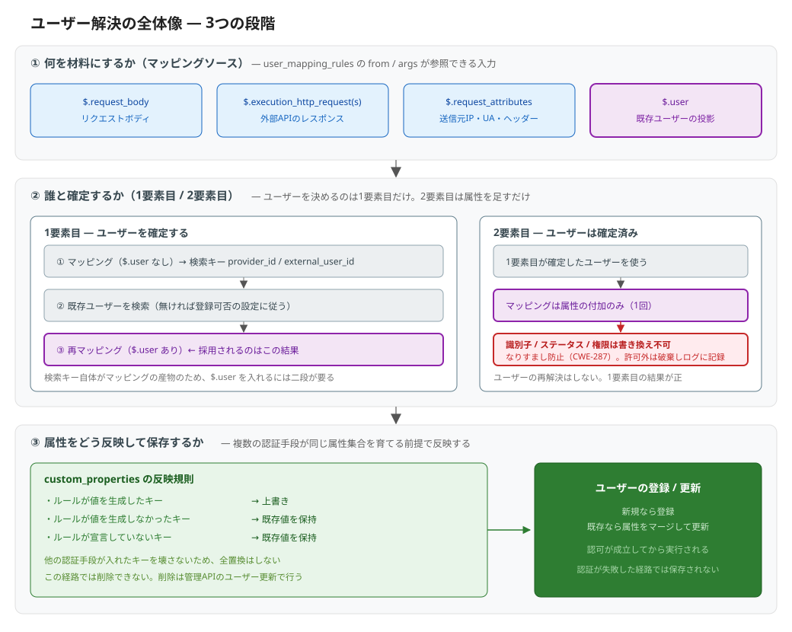

# ユーザー解決

**ユーザー解決（User Resolution）** は、認証の結果を「**誰の、どんな属性か**」に変換して保存する仕組みです。

認証が成功しただけでは、まだ利用者は確定していません。パスワード認証は「このユーザー名とパスワードの組み合わせが正しい」ことしか知らず、外部API認証は「連携先が OK を返した」ことしか知りません。そこから idp-server 上の利用者を特定し、得られた属性を反映するまでがユーザー解決です。

## 前提: ユーザーデータの正は外部にあることが多い

外部IdPとのフェデレーション、外部API認証、外部パスワード認証といった構成では、**利用者の情報を持っているのは連携先**です。会員基盤や人事システムが正であり、idp-server はそこから受け取った情報で認証を完了させます。

このとき idp-server 側のユーザーレコードは、放っておくと古くなります。氏名が変わった、ランクが上がった、部署が異動した。連携先では更新されていても、idp-server は知りません。

そこでユーザー解決は、**認証のたびに連携先の最新の情報を idp-server へ取り込む同期の機会**として働きます。ログインするたびに、その時点の情報が反映されます。

連携先ごとにレスポンスの形は違うため、その変換を設定で記述できるようにしたのが `user_mapping_rules` です。「連携先の `user_id` を `external_user_id` に、`department` を `custom_properties.department` に」といった対応づけを、コードを書かずに定義します。

:::info 「同期」といっても全置換ではありません
連携先が返さなくなった属性は、idp-server 側から消えるわけではありません。同じ属性集合を複数の認証手段が分担して書き込むため、全置換にすると他の手段が入れた属性まで消えてしまうからです。詳しくは後述の「③ 属性をどう反映して保存するか」を参照してください。
:::

## なぜ独立した概念なのか

1回のログインで複数の認証手段が動くためです。

たとえば「メール認証 → パスワード認証 → 外部リスク判定」という構成では、ユーザーを決めるのは最初の1つだけで、残りは属性を持ち寄る側に回ります。それぞれの手段は**自分が扱う情報しか知りません**。

- 最初の認証は「誰か」を決めるが、その人が過去にどんな属性を持っているかは知らない
- 2つ目以降は「誰か」を知っているが、ユーザーを決め直してはいけない
- どの手段も、他の手段がどんな属性を書いたかは知らない

この非対称をどう扱うかが、ユーザー解決の設計の中身です。

## この図の読み方

ユーザー解決は分岐が多く、**概念語だけで説明すると何も言っていないのと同じ**になります。「手がかりから利用者を探す」と書いても、何が手がかりで、いつ探すのかが分からなければ設計を追えません。

そのため以下の図は、設定ファイルに実際に書くキーワードをそのまま載せています。概念との対応は次のとおりです。

| 概念 | 設定・実装でのキーワード |
|:---|:---|
| 材料（何をもとに決めるか） | `$.request_body` / `$.execution_http_request(s)` / `$.request_attributes` / `$.user` |
| ユーザーを特定するキー | `provider_id` / `external_user_id` |
| ユーザーの確定・属性の付加を書く場所 | `user_resolve.user_mapping_rules` |
| 分担して育てる属性 | `custom_properties` |

## ① 何を材料にするか

`user_mapping_rules` が参照できる入力です。認証手段が外部APIを呼ぶかどうかで、使える材料が変わります。

`$.user` だけは性質が違い、**今回の認証で得た情報ではなく、すでに保存されているその利用者の属性**です。「前回までの値に積み増す」「既存の属性から別の属性を導出する」といったマッピングは、これがないと書けません。

`$.user` に見えるのは許可された属性だけです。認証情報（パスワードハッシュ等）や身元確認済みデータは含まれません。外部APIへ送る際の投影と同じものを使っているため、`body_mapping_rules` と `user_mapping_rules` で `$.user` の形は一致します。

## ② 誰と確定するか

### 1要素目 — ユーザーを確定する

まだ利用者が確定していない段階です。マッピングの結果から特定キーを取り出し、そのキーで既存の利用者を探します。見つからなければ、その認証ステップが新規登録を許す設定かどうかに従います。

ここでマッピングが**二度実行される**理由は、順序の制約にあります。

1. 利用者を探すためのキー（`provider_id` / `external_user_id`）は、マッピングの結果として得られる
2. つまりキーを得る時点では、まだ誰か分かっていない = `$.user` を材料にできない
3. 探し当てたあとで、その属性を材料に加えてもう一度マッピングする

採用されるのは2回目の結果です。マッピング関数はすべて値の変換のみで副作用がないため、二度実行しても安全です。ただし `uuid4` / `now` / `random_string` のような毎回異なる値を返す関数は2回とも実行され、**採用されるのは2回目の値**になります。

ユーザーを特定するキーは1回目の値で固定されます。2回目のマッピングが `$.user` からキーを組み立てるような書き方をしても、「探したキー」と「保存するキー」が食い違うことはありません。

### 2要素目の照合には `$.user` を使えません

外部API認証の2要素目は、外部APIが返したユーザーが認証済みユーザーと一致するかを `identity_match_field` で照合します。この照合の被検体になるマッピングには `$.user` が入りません。

入れてしまうと、たとえば `{"from": "$.user.email", "to": "email"}` と書いたときに照合が「認証済みユーザーと認証済みユーザー」の比較になり、外部APIが何を返しても一致してしまうためです。1要素目で「ユーザーを特定するキーは `$.user` から作らない」としているのと同じ理由です。

### 2要素目以降 — 属性を足すだけ

ユーザーはすでに確定しています。この段階で**ユーザーを決め直すことはしません**。決め直せてしまうと、2つ目の認証に細工することで別人にすり替えられるためです。

書き換えが許されるのは、氏名・生年月日・住所といった記述的な属性と `custom_properties` だけです。識別子（`sub` / `preferred_username` / `email` / `phone_number`）、ステータス、権限（`roles` / `permissions` / 認証デバイス）は対象外で、これらを狙ったマッピングは破棄され、警告としてログに記録されます。

## ③ 属性をどう反映して保存するか

`custom_properties` は、フェデレーション・外部API認証・2要素目・身元確認が**同じキー集合に書き込む共有の場所**です。各手段は自分が宣言したキーしか知らないため、全置換にすると最後に通った手段が他の手段のキーを消してしまいます。

そのためキー単位でマージします。

| 対象 | 挙動 |
|:---|:---|
| ルールが値を生成したキー | 上書き |
| ルールに書いてあるが値が生成されなかったキー | 既存値を保持 |
| ルールが宣言していないキー | 既存値を保持 |

この帰結として、**認証フローの中で属性を削除することはできません**。外部IdPが返さなくなった属性は残り続けます。削除が必要な場合は管理APIのユーザー更新を使います。

保存されるのは認可が成立したあとです。認証の途中で失敗した経路では、マッピング結果は永続化されません。

## 関連ドキュメント

- [多要素認証（MFA）](concept-02-mfa.md) - Email/SMS OTP に固有のユーザー解決ロジック
- [フェデレーション（外部IdP連携）](concept-08-federation.md) - 外部IdP経由でのユーザー確立
- [ID（ユーザー）管理](../02-identity-management/concept-01-id-management.md) - ユーザーの登録とIDポリシー
- [外部API認証の設定](../../content_06_developer-guide/05-configuration/authn/external-api.md) - `user_resolve` の設定リファレンス
