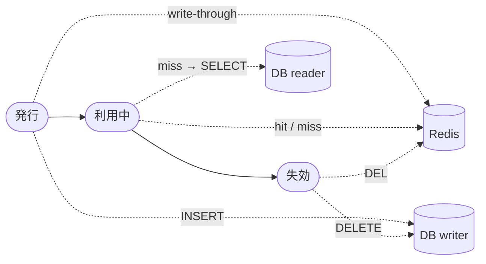

# トークン管理

idp-serverにおけるトークン管理の概念を説明します。

> **基礎知識**: OAuth 2.0のトークンの種類については [OAuth 2.0のトークンの種類と用途](../../content_11_learning/03-oauth-tokens/oauth2-token-types.md)) を参照してください。

## idp-serverのトークン管理でできること

idp-serverでは、以下のトークン管理機能を提供します：

- **トークン形式の選択**: 識別子型（Opaque）とJWT型の使い分け(テナント単位の既定＋クライアント単位で上書き可)
- **トークン有効期限**: アクセストークンとリフレッシュトークンの有効期限をクライアント単位で設定可能
- **Refresh Token Rotation**: 使用のたびに新しいトークンを発行(テナント単位で設定)

## トークン形式の選択

トークン形式はテナント単位で既定を設定し、クライアント単位で上書きできます。クライアント設定が優先され、未設定の場合はテナント設定が適用されます。

| 要件 | 推奨形式 | 理由 |
|:---|:---|:---|
| **即座にトークン失効したい** | 識別子型 | DB削除で即座に無効化可能 |
| **スケーラビリティ重視** | JWT | リソースサーバー側で自己完結検証 |
| **ネットワーク分離** | JWT | イントロスペクション不要 |
| **セキュリティ最優先** | 識別子型 | サーバー側で完全制御 |
| **短命トークン（< 5分）** | JWT | 自然失効を待てる |

## トークン有効期限の設計

idp-serverでは、テナント単位およびクライアント単位でトークンの有効期限を設定できます。クライアント設定が優先され、未設定の場合はテナント設定が適用されます。

| トークン種類 | 有効期限の考え方 | 設計ポイント |
|:---|:---|:---|
| Access Token（識別子型） | 5分〜1時間 | 検証コストと利便性のバランス |
| Access Token（JWT） | 5分〜15分 | 失効困難のため短命化 |
| Refresh Token | 30分〜1日 | ユーザー体験とセキュリティのバランス |
| ID Token | 5分〜1時間 | 認証情報の鮮度保持 |

### Refresh Tokenの有効期限戦略

Refresh Tokenの有効期限には2つの戦略があります。

| 戦略 | 設定値 | 動作 |
|------|--------|------|
| **期限固定** | 固定の秒数（例: 86400秒 = 1日） | 発行から1日後に必ず期限切れ |
| **期限延長** | 延長モード有効 + 最大期限 | 使用するたびに延長、ただし最大期限まで |

## Refresh Token Rotation

idp-serverでは、Refresh Tokenを使用のたびに新しいトークンを発行し、古いトークンを無効化する**Refresh Token Rotation**をサポートしています。

これにより、トークン盗難のリスクを軽減し、セキュリティを強化します。

| 設定 | 動作 | ユースケース |
|------|------|-------------|
| **Rotation有効** | 使用のたびに新しいRefresh Tokenを発行 | セキュリティ重視（推奨） |
| **Rotation無効** | 同じRefresh Tokenを使い続ける | レガシーシステム対応 |

**注意点**

- **クライアント実装**: 新しいRefresh Tokenを毎回保存する必要がある
- **並行リクエスト**: 複数のリクエストが同時にRefresh Tokenを使うと、1つ以外は失敗する

## トークンのライフサイクル

識別子型（Opaque）アクセストークンのライフサイクルを示します。

トークンのフェーズ（発行 → 利用 → 失効）と永続層（Redis / DB writer / DB reader）の関係を整理すると以下になります。



**要点**:
- **発行** は writer に INSERT すると同時に Redis にも write-through するため、直後の introspection が必ず Redis hit になる（reader のレプリケーション遅延を踏まない）
- **利用** は Redis hit を優先し、miss なら reader を引いて再格納する cache-aside
- **失効** は writer の DELETE と Redis の DEL を必ずペアで実行する

```
1. 発行（Token Endpoint）
   └─→ DB INSERT（oauth_tokenテーブル、writer接続）
       └─→ INSERT と並行に組み立てた行マップを Redis にも書き込み（TTL 60秒）
           ※ 追加 SELECT は発生しない（OAuthTokenRowBuilder が INSERT パラメータと
             同じ値を Map に積む）。これにより発行直後のイントロスペクションが
             reader 接続のレプリケーション遅延を踏むことなく Redis から即返却される

2. イントロスペクション（Introspection Endpoint）
   └─→ キャッシュ確認（TOKEN_CACHE_ENABLED=true時）
       ├─ Hit  → キャッシュから返却（発行直後は 1. の write-through により必ず Hit）
       └─ Miss → DB SELECT（reader）→ キャッシュ格納（TTL 60秒）→ 返却
                ※ Miss は TTL 経過後の再アクセス時に発生

3. トークン失効（Revocation Endpoint）
   └─→ DB DELETE + キャッシュ削除
       ※ キャッシュとDBの不整合を防止

4. 認可グラント削除（管理API）
   └─→ GrantRevocationService
       ├─ グラント削除（authorization_grantテーブル）
       └─ 関連トークン一括削除（deleteByUserAndClient）
           ├─ 対象トークンのハッシュ値をSELECT
           ├─ 各トークンのキャッシュを削除
           └─ DB DELETE

5. ユーザー単位の一括失効（ログアウト等）
   └─→ 対象トークンのハッシュ値をSELECT
       → 各トークンのキャッシュを削除
       → DB DELETE

6. 有効期限切れ
   ├─ DB: 期限切れレコードは定期バッチで削除
   └─ キャッシュ: TTL（60秒）で自動削除
```

### キャッシュ格納タイミング

| トリガー | 経路 | 備考 |
|:---|:---|:---|
| **発行 (register)** | writer での INSERT 直後に write-through | Read replica の遅延を踏まずに直後のイントロスペクションを Redis hit にする |
| **イントロスペクション miss → DB hit** | reader での SELECT 後に cache-aside で put | TTL 経過後の再格納パス |

### キャッシュ削除タイミング

| トリガー | 削除対象 |
|:---|:---|
| **明示的失効** (`/v1/tokens/revoke`) | 対象トークン 1 件 |
| **認可グラント削除 / ユーザー単位失効** | `deleteByUserAndClient` 配下の全トークン |
| **TTL 経過** | Redis 側で自動 (60秒) |

**設計ポイント**:
- 発行時に **write-through で Redis に書き込む**（OAuthTokenCommandDataSource）。初回イントロスペクションが必ず Redis hit になり、reader のレプリケーション遅延の影響を受けない
- 失効時には必ずキャッシュも削除（整合性保証）
- キャッシュのTTLは60秒（短命のため、万一の不整合も短時間で解消）
- 既知の制約: write-through はDBトランザクション内で実行されるため、INSERT後にトランザクションがロールバックした場合、DBに存在しないトークンのキャッシュが最大TTL（60秒）残る。トークン値はクライアントに渡る前なので実害はなく、TTLで自己解消する
- **デフォルト有効（opt-out 方式）**: 未設定時はキャッシュ有効。明示的に `TOKEN_CACHE_ENABLED=false` を設定した場合のみ `NoOperationCacheStore` に切り替わり、register 時の書き込みも実質スキップされる。Redis 無効（`CACHE_ENABLE=false`）環境では自動的に no-op に縮退するため、デフォルト有効でも影響はない
- レプリカ構成では replication lag（Aurora で典型 10〜20ms、書き込みピーク時に増加。非 Aurora レプリカでは秒単位もあり得る）により、キャッシュ無効だと発行直後のイントロスペクションが NOT_FOUND になるリスクがある。性能だけでなく正しさの観点からデフォルト有効としている

## イントロスペクション vs 自己完結型検証

| 観点 | イントロスペクション（識別子型） | 自己完結型検証（JWT） |
|:---|:---|:---|
| **検証方法** | API呼び出し | 署名検証 |
| **ネットワーク** | 必要 | 不要 |
| **パフォーマンス** | 遅い（デフォルト有効のRedisキャッシュにより改善） | 速い |
| **失効** | 即座に可能 | 困難 |
| **トークンサイズ** | 小さい | 大きい |
| **セキュリティ** | サーバー制御 | クライアント依存 |

## 関連ドキュメント

- [トークン有効期限パターン](../../content_05_how-to/phase-2-security/02-token-strategy.md) - 具体的な設定例
- [イントロスペクション](../../content_04_protocols/protocol-03-introspection.md) - イントロスペクション仕様
- [セッション管理](../03-authentication-authorization/concept-03-session-management.md) - セッションとトークンの関係

## 参考仕様

- [RFC 6749 - OAuth 2.0 Authorization Framework](https://datatracker.ietf.org/doc/html/rfc6749)
- [RFC 7519 - JSON Web Token (JWT)](https://datatracker.ietf.org/doc/html/rfc7519)
- [RFC 9068 - JSON Web Token (JWT) Profile for OAuth 2.0 Access Tokens](https://www.rfc-editor.org/rfc/rfc9068.html)
- [RFC 7662 - OAuth 2.0 Token Introspection](https://datatracker.ietf.org/doc/html/rfc7662)
- [RFC 7009 - OAuth 2.0 Token Revocation](https://datatracker.ietf.org/doc/html/rfc7009)
