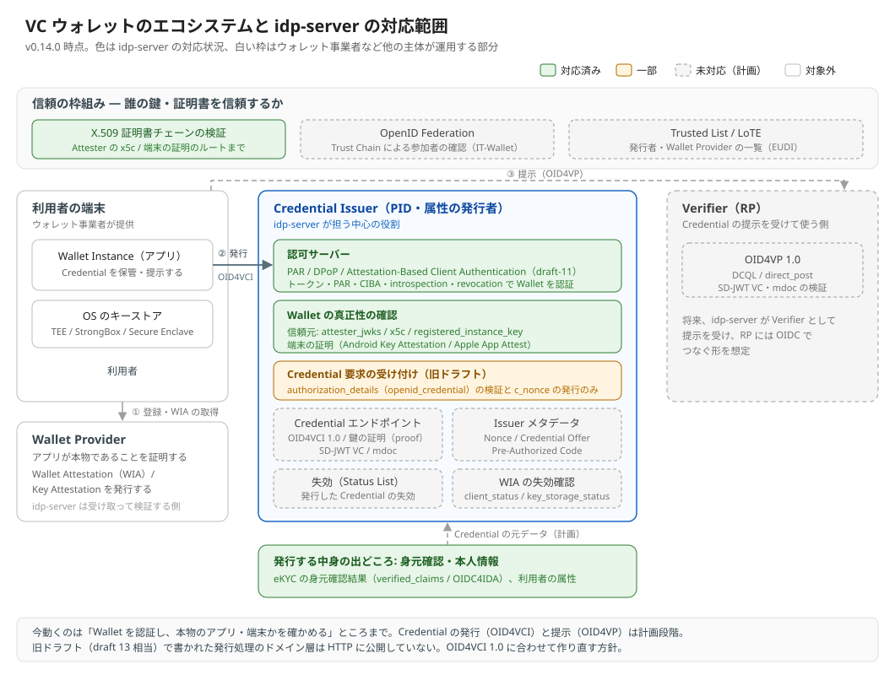

# VC ウォレットのサポート

---

## 前提知識

- [VC 入門](../../content_11_learning/17-verifiable-credentials/vc-introduction.md) - Verifiable Credential の考え方
- [EUDI Wallet のエコシステム](../../content_11_learning/17-verifiable-credentials/eu-wallet-ecosystem.md) / [IT-Wallet](../../content_11_learning/17-verifiable-credentials/it-wallet.md) - ウォレットを中心にした制度とシステムの全体像
- [Wallet Attestation](../../content_11_learning/17-verifiable-credentials/wallet-attestation.md) - ウォレットが本物であることの証明
- [OID4VCI](../../content_11_learning/16-oauth-oidc-rfc/advanced-identity/oid4vci.md) / [OID4VP](../../content_11_learning/16-oauth-oidc-rfc/advanced-identity/oid4vp.md) - 発行と提示のプロトコル

---

## 概要

利用者のスマートフォンのウォレットに、本人情報や資格を Verifiable Credential（VC）として発行し、必要な場面で提示してもらう。EUDI Wallet や IT-Wallet は、この仕組みを国の制度として運用しています。

このエコシステムで `idp-server` が担うのは、**Credential Issuer**（本人情報や資格を VC として発行する側）です。発行に先立って、ウォレットを OAuth のクライアントとして認証し、本物のアプリ・端末から来たリクエストかを確かめます。将来は、提示を受ける **Verifier** も担う想定です。

| 登場人物 | 役割 | idp-server |
|---|---|---|
| Wallet Instance | 利用者の端末のアプリ。VC を保管し、提示する | 対象外（ウォレット事業者が提供） |
| Wallet Provider | アプリが本物であることを証明する（Wallet Attestation を発行） | 対象外。発行された証明を受け取って検証する |
| **Credential Issuer** | 本人確認のうえで VC を発行する | **中心の役割** |
| Verifier | VC の提示を受けて、サービスに使う | 将来の役割 |

---

## エコシステムの全体像

v0.14.0 で動くのは、**ウォレットを認証し、本物のアプリ・端末かを確かめる**ところまでです。VC の発行（OID4VCI）と提示（OID4VP）は、これからの対応になります。

---

## 対応状況（v0.14.0）

### ウォレットの認証と真正性の確認

| 機能 | 状態 | 補足 |
|---|---|---|
| Attestation-Based Client Authentication（`attest_jwt_client_auth`） | 対応 | draft-11 準拠。トークン・PAR・CIBA・introspection・revocation で使える（→ [解説](../../content_04_protocols/protocol-08-attestation-based-client-authentication.md)） |
| 信頼元の切り替え | 対応 | `attester_jwks`（Wallet Provider の鍵）/ `x5c`（証明書チェーン）/ `registered_instance_key`（登録したインスタンスの鍵） |
| 端末の証明によるインスタンス登録 | 対応 | Android Key Attestation / Apple App Attest。登録は利用者のログインで認証する |
| Challenge エンドポイント | 対応 | サーバーが発行した Challenge を PoP に入れさせる |
| DPoP | 対応 | トークン・リフレッシュ・introspection |
| PAR | 対応 | |
| X.509 証明書チェーンの検証 | 対応 | 発行者の CA 制約まで検証する（→ [証明書チェーンの信頼](../06-security-extensions/concept-05-certificate-chain-trust.md)） |
| Wallet Attestation の失効確認（`client_status` / `key_storage_status`） | 未対応 | EUDI の Wallet Unit Attestation（TS3）で必須の確認 |

### VC の発行（OID4VCI）

| 機能 | 状態 | 補足 |
|---|---|---|
| `authorization_details`（`openid_credential`）の検証 | 一部 | 認可リクエストで型と、クライアントに許された型かを検証する |
| トークン応答の `c_nonce` | 一部 | 認可コードのトークン応答に載る。旧ドラフトの形 |
| Credential / Batch / Deferred エンドポイント | 未対応 | 旧ドラフト（draft 13 相当）で書かれた処理はあるが、HTTP には公開していない |
| Credential Issuer メタデータ、Nonce エンドポイント | 未対応 | |
| Credential Offer / Pre-Authorized Code | 未対応 | |
| 鍵の証明（`proof`） | 未対応 | |
| 形式: SD-JWT VC / mdoc | 未対応 | |
| 発行した VC の失効（Token Status List） | 未対応 | |

### VC の提示（OID4VP）と信頼の枠組み

| 機能 | 状態 |
|---|---|
| OID4VP（DCQL / `direct_post`）、SD-JWT VC・mdoc の検証 | 未対応 |
| OpenID Federation（IT-Wallet） | 未対応 |
| Trusted List / LoTE（EUDI） | 未対応 |

---

## システムの方針

### 標準仕様を基準にし、制度ごとの違いは設定で吸収する

OID4VCI 1.0・OID4VP 1.0・HAIP 1.0・Attestation-Based Client Authentication を基準にします。EUDI や IT-Wallet の違い（信頼の枠組み、必須の確認、使うグラント）は、テナントとクライアントの設定で選べる形にし、制度ごとの専用実装は作りません。

### ウォレットの認証は Wallet Provider を信頼する形が基本

ウォレットは、Wallet Provider が発行した Attestation で認証します（`attester_jwks` / `x5c`）。登録したインスタンスの鍵で認証する `registered_instance_key` は、自社アプリ向けです。HAIP がウォレットにインスタンス固有の識別子を持ち込ませないことを求めており、インスタンスごとに登録する方式はウォレットには使いません。

### 信頼の起点は差し替えられるようにする

今は、Wallet Provider の鍵（JWKS）と X.509 のルート証明書を設定で持ちます。OpenID Federation や Trusted List も、同じ「誰の鍵を信頼するか」の選択肢として足します。

### 確かめられないものは通さない

検証器が読み込まれていない、知らない証明の種類、設定で求めた確認ができない。いずれも拒否します。ウォレットの真正性は、発行の前提になる確認だからです。

### 発行する中身は、身元確認の結果から作る

`idp-server` は、eKYC の結果を検証済みの本人情報（`verified_claims`、OIDC4IDA）として持てます（→ [身元確認済みID](concept-01-id-verified.md)）。VC に載せる本人情報は、ここから作ります。身元確認と発行を一つのサーバーでつなげられることが、`idp-server` を Credential Issuer にする利点です。

### 仕様への準拠は、版を明示してテストで追う

ドラフトの仕様は、準拠する版を明記します。仕様準拠の E2E テストは章立てと文言を仕様どおりにし、未対応の要件も `xit` で残して、何に対応していないかを一覧できるようにします。旧ドラフトで書かれた発行処理は、OID4VCI 1.0 に合わせて作り直します。

---

## ロードマップ

段階ごとに、前の段階を土台にして積み上げます。対応するバージョンは決まり次第記載します。

| 段階 | 内容 | 状態 |
|---|---|---|
| 1. ウォレットの認証 | Attestation-Based Client Authentication、端末の証明によるインスタンス登録、DPoP、PAR | v0.14.0 |
| 2. 発行の基本（OID4VCI 1.0） | Credential Issuer メタデータ、Nonce エンドポイント、Credential エンドポイント、鍵の証明（JWT）、SD-JWT VC、身元確認の結果を元データにした発行 | 計画 |
| 3. 高保証（HAIP） | Wallet Attestation・Key Attestation の失効確認、Token Status List、Credential Offer と Pre-Authorized Code、mdoc | 計画 |
| 4. 提示（OID4VP 1.0） | Verifier として提示を受け、RP には OIDC でつなぐ。SD-JWT VC・mdoc の検証 | 計画 |
| 5. 信頼の枠組み | OpenID Federation、Trusted List。EUDI / IT-Wallet のプロファイル | 計画 |

---

## 関連ドキュメント

- [Attestation-Based Client Authentication](../../content_04_protocols/protocol-08-attestation-based-client-authentication.md)
- [証明書チェーンの検証](../../content_04_protocols/protocol-09-certificate-chain-verification.md)
- [身元確認済みID](concept-01-id-verified.md)
- [IT-Wallet を動かす設定](../../content_11_learning/17-verifiable-credentials/it-wallet-configuration.md)
