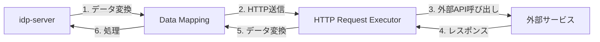
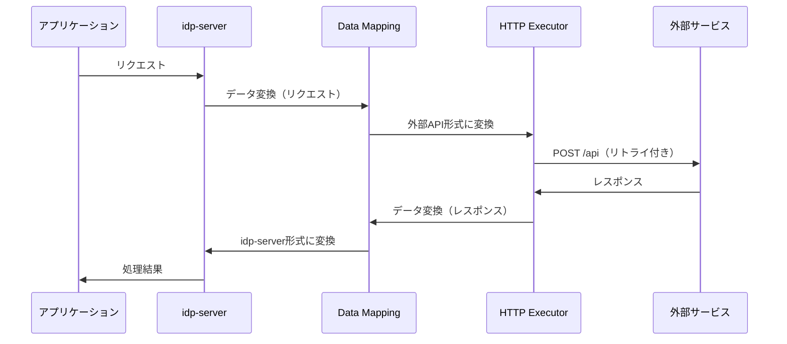
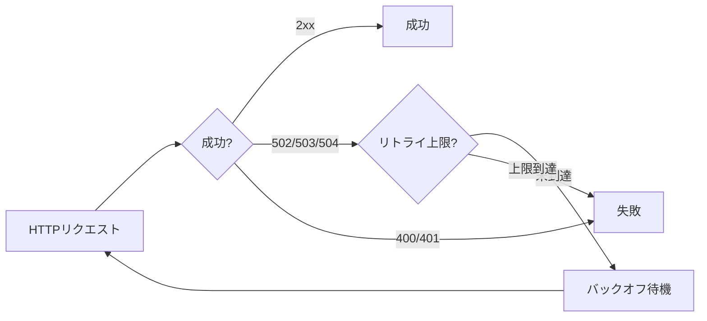

# 外部サービス連携

---

## 前提知識

このドキュメントを理解するには、以下の基礎知識が役立ちます：

- [身元確認済みID](../05-advanced-id/concept-15-id-verified.md) - eKYC連携の概要
- [セキュリティイベント](concept-17-security-events.md) - Webhook連携の概要

---

## 概要

idp-serverは、外部サービスとの連携を強力にサポートします。

**外部サービス連携**とは、idp-serverが外部のAPIやサービスと通信し、データを送受信する仕組みです。



idp-serverでは以下のような用途に対応できます：

* 身元確認申込み: eKYCサービスとの連携
* Security Event Hook: SIEM、Slackへのイベント通知
* 認証連携: 外部SMS/Email認証サービスとの連携

---

## idp-serverにおける外部サービス連携の設計思想

### 1. HTTP Request Executor + Data Mapping

idp-serverは、**HTTP Request Executor**（HTTP通信基盤）と**Data Mapping**（データ変換）を組み合わせて外部サービス連携を実現します。



**なぜ2つを分離するのか**:
- **HTTP Executor**: 通信の信頼性（リトライ、認証、エラーハンドリング）
- **Data Mapping**: データ形式の柔軟性（JSONPath、変換関数）
- **疎結合**: 外部サービスの仕様変更に強い

### 2. リトライメカニズム

外部サービスとの通信失敗に対して、自動的にリトライします。



**リトライ戦略**:
- **再試行可能なエラー**: 502, 503, 504（サーバー一時エラー）
- **バックオフ遅延**: 指数バックオフ（例: 1秒 → 2秒 → 4秒）
- **最大リトライ回数**: デフォルト3回（設定可能）
- **冪等性制御**: Idempotency-Keyヘッダーで重複防止

**Retry-After対応**:
- サーバーが`Retry-After`ヘッダーを返す場合、その時間だけ待機
- 動的な再試行制御

詳細は [HTTP Request Executor](../../content_06_developer-guide/04-implementation-guides/impl-16-http-request-executor.md) を参照。

### 3. データマッピング

外部サービスとidp-server間でデータ形式を変換します。

**Mapping Rulesの構造**:
```json
{
  "from": "$.user.email",
  "to": "contact.email",
  "functions": [
    {
      "name": "convert_type",
      "args": {"type": "string"}
    }
  ],
  "condition": {
    "field": "$.user.email_verified",
    "operator": "eq",
    "value": true
  }
}
```

**主要フィールド**:
- **from**: JSONPathでデータ抽出元を指定（例: `$.user.email`）
- **static_value**: 固定値を設定（fromと排他）
- **to**: マッピング先のフィールド名（ネスト可能: `contact.email`）
- **functions**: 変換関数のリスト（複数指定可能）
- **condition**: 条件付き実行（オプション）

**主な利用可能なMapping Functions**:
- **format**: 文字列フォーマット（テンプレート）
- **random_string**: ランダム文字列生成
- **now**: 現在日時の生成・フォーマット
- **convert_type**: データ型変換
- **exists**: 値の存在チェック
- **uuid4/uuid5/uuid_short**: UUID生成
- **trim**: 前後の空白削除
- **substring**: 文字列の部分抽出
- **replace/regex_replace**: 文字列置換
- **split/join**: 文字列の分割・結合
- **filter/map**: 配列操作
- **case/if/switch**: 条件分岐
- **その他**: カスタム関数を追加可能

詳細は [Mapping Functions](../../content_06_developer-guide/04-implementation-guides/impl-20-mapping-functions.md) を参照。

### 4. 認証統合

外部APIへのアクセスに必要な認証を統合します。

**サポートする認証方式**:

| 認証方式 | 用途 | 設定 |
|:---|:---|:---|
| **OAuth 2.0** | 外部API認証 | `oauth_authorization`設定 |
| **HMAC** | 署名ベース認証 | `hmac_authentication`設定 |

**OAuth 2.0連携の例**:
```
1. Client Credentials Grantでトークン取得
2. アクセストークンをAuthorizationヘッダーに設定
3. 外部APIを呼び出し
4. トークン期限切れ時は自動再取得
```

### 5. エラーハンドリング

外部サービスのエラーを適切に処理します。

**エラー分類**:
- **リトライ可能**: 502, 503, 504（一時的なサーバーエラー）
- **リトライ不可**: 400, 401, 403（クライアントエラー）
- **成功**: 200-299（正常）

**エラーレスポンスのマッピング**:
```
外部サービスのエラー → mapping_rules → idp-serverのエラー
```

**ステータス遷移**:
- 成功レスポンス → `approved`
- エラーレスポンス → `rejected`
- リトライ上限 → `cancelled`

---

## 適用領域

idp-serverでは、3つの主要領域で外部サービス連携を使用します。

### 1. 身元確認申込み（Identity Verification）

外部eKYCサービスと連携し、身元確認を実施。

**連携フロー**:
```
アプリ → idp-server → Data Mapping → HTTP Executor → eKYCサービス
→ レスポンス → Data Mapping → verified_claims更新
```

**マッピング例**:
- リクエスト: ユーザー情報 → eKYC申込み形式
- レスポンス: eKYC審査結果 → verified_claims形式

詳細は [concept-03: 身元確認済みID](../05-advanced-id/concept-15-id-verified.md) を参照。

### 2. Security Event Hook

セキュリティイベントを外部システムに通知。

**連携フロー**:
```
SecurityEvent発行 → Data Mapping → HTTP Executor → 外部SIEM/Slack
```

**マッピング例**:
- リクエスト: SecurityEvent → Webhook形式/SSF形式
- レスポンス: HTTP status → Hook実行結果

詳細は [concept-11: セキュリティイベント](concept-17-security-events.md) を参照。

### 3. 認証連携

外部SMS/Email認証サービスと連携。

**連携フロー**:
```
認証リクエスト → Data Mapping → HTTP Executor → 外部認証サービス
→ レスポンス → Data Mapping → 認証結果
```

**マッピング例**:
- リクエスト: ユーザー情報 → SMS送信API形式
- レスポンス: 送信結果 → 認証トランザクション

---

## ユースケース

### 1. eKYCサービス連携: 身元確認申込み

外部eKYCサービスで身元確認を実施。

- **Data Mapping**: ユーザー情報 → eKYC申込み形式
- **HTTP Executor**: POST /verify（リトライ3回、バックオフ1s→2s→4s）
- **Data Mapping**: eKYC審査結果 → verified_claims
- **効果**: 外部eKYCサービスとのシームレス連携

### 2. SIEM連携: セキュリティイベント通知

セキュリティイベントをSIEMに送信。

- **Data Mapping**: SecurityEvent → SIEM形式（JSON）
- **HTTP Executor**: POST /events（OAuth 2.0認証、リトライ付き）
- **効果**: リアルタイムセキュリティ監視

### 3. Slack通知: アカウントロック通知

アカウントロックをSlackに通知。

- **Data Mapping**: SecurityEvent(user_lock) → Slack Webhook形式
- **HTTP Executor**: POST https://hooks.slack.com/...（リトライ付き）
- **効果**: 運用チームへの即時アラート

---

## セキュリティ考慮事項

### 外部APIの認証

- **OAuth 2.0**: Client Credentials Grantでトークン取得、自動更新
- **HMAC署名**: リクエストの改ざん防止
- **TLS必須**: すべての外部通信はHTTPS

### リトライ時の冪等性

- **Idempotency-Key**: リトライ時に同じキーを使用
- **重複防止**: 外部サービス側での重複処理防止
- **idempotency_required設定**: 冪等性が必要な操作で有効化

### データマッピングの安全性

- **JSONPath検証**: 不正なパス指定を検出
- **データ型変換**: convert_typeで型安全性を保証
- **エラーハンドリング**: マッピング失敗時の適切なエラー処理

---

## 関連ドキュメント

- [身元確認済みID](../05-advanced-id/concept-15-id-verified.md) - eKYC連携、verified_claims
- [セキュリティイベント](concept-17-security-events.md) - Webhook、SSF連携
- [HTTP Request Executor](../../content_06_developer-guide/04-implementation-guides/impl-16-http-request-executor.md) - 実装詳細
- [Mapping Functions](../../content_06_developer-guide/04-implementation-guides/impl-20-mapping-functions.md) - マッピング関数開発ガイド
- [身元確認申込みガイド](../../content_05_how-to/how-to-16-identity-verification-application.md) - 設定例

---

## 参考仕様

- [RFC 7231: HTTP/1.1 Semantics - Retry-After](https://datatracker.ietf.org/doc/html/rfc7231#section-7.1.3) - Retry-Afterヘッダー
- [RFC 6750: OAuth 2.0 Bearer Token Usage](https://datatracker.ietf.org/doc/html/rfc6750) - Bearer認証
- [Jayway JsonPath](https://github.com/json-path/JsonPath) - JSONPathライブラリ（idp-serverで使用）
