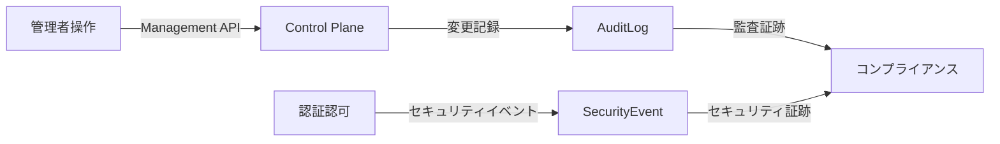
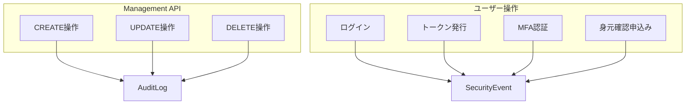
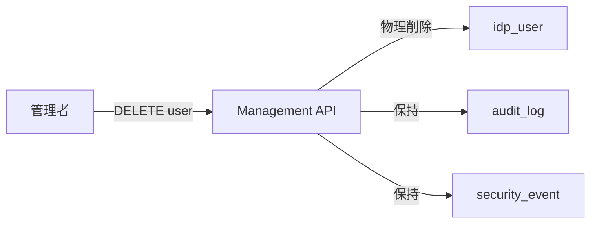
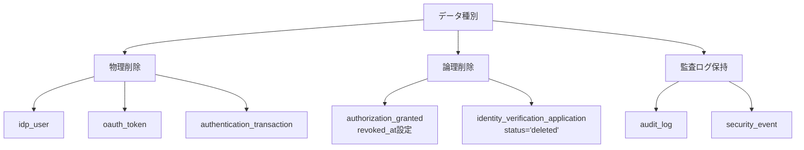

# 監査ログ

---

## 前提知識

このドキュメントを理解するには、以下の基礎知識が役立ちます：

- [セキュリティイベント](../06-security-extensions/concept-17-security-events.md) - SecurityEventログの基礎
- [コントロールプレーン](../01-foundation/concept-02-control-plane.md) - Management APIの概要
- [マルチテナント](../01-foundation/concept-01-multi-tenant.md) - テナント分離の仕組み

---

## 概要

idp-serverは、監査要件を満たすための包括的な監査ログ機能を提供します。

**監査ログ（Audit Log）** とは、システムで行われたすべての重要な操作を記録し、追跡可能にする仕組みです。

idp-serverでは以下のような用途に対応できます：

* コンプライアンス監査での「全設定変更履歴の提示」
* インシデント調査での「不正な操作の追跡」
* 定期監査での「管理者アクセスログのレビュー」

---

## idp-serverにおける監査ログの設計思想

### 1. 二重の監査証跡アーキテクチャ

idp-serverは、2種類の監査証跡を提供します。

**1. AuditLog（操作監査ログ）**

**目的**: Management APIの操作を記録

**対象**: 設定変更操作（CREATE/UPDATE/DELETE）

**特徴**:
- **変更前後の差分記録**: before/after payloadで変更内容を追跡
- **Dry-run対応**: 実行前のシミュレーション結果も記録
- **詳細なコンテキスト**: IP address, User Agent, 操作者ID

**2. SecurityEvent（セキュリティイベントログ）**

**目的**: ユーザー操作のセキュリティイベントを記録

**対象**: 認証・認可（ログイン、トークン発行、MFA等）、身元確認申込み等

詳細は [concept-11: セキュリティイベント](../06-security-extensions/concept-17-security-events.md) を参照。

**使い分け**:

| ログ種別 | 対象操作 | 用途 | 例 |
|:---|:---|:---|:---|
| **AuditLog** | Management API操作 | 設定変更の追跡、コンプライアンス監査 | クライアント設定変更、ユーザー削除 |
| **SecurityEvent** | ユーザー操作 | セキュリティ監視、不正アクセス検知 | ログイン失敗、トークン発行、身元確認申込み |

### 2. 変更不可の監査ログ（Append-Only）

**設計原則**:
- **追記のみ**: 監査ログは追記のみ、更新・削除不可
- **ユーザー削除後も保持**: UserLifecycleEvent(DELETE)実行後も監査ログは保持
- **改ざん防止**: 監査ログテーブルへのUPDATE/DELETE権限は制限

**なぜ監査ログは削除しないのか**:
監査ログは法的義務（コンプライアンス要件）のため、ユーザーデータ削除後も保持します。

### 3. データ保持ポリシー

idp-serverでは、データを3種類に分類して管理します。

**3種類のデータ管理**:

| データ種別 | 保持ポリシー | 例 | 理由 |
|:---|:---|:---|:---|
| **物理削除** | ユーザー削除時に即座削除 | `idp_user`, `oauth_token`, `authentication_transaction` | ユーザーの削除権 |
| **論理削除** | ステータス更新で履歴保持 | `authorization_granted` (revoked_at), `identity_verification_application` (status='deleted') | 監査証跡・統計分析 |
| **監査ログ保持** | ユーザー削除後も保持（アーカイブ対象） | `audit_log`, `security_event` | 法的義務・コンプライアンス |

---

## ユースケース

### 1. コンプライアンス監査: 全操作ログのレビュー

年次監査で過去1年間のすべての管理操作を確認。

- **対象**: 全AuditLog
- **確認**: 不正な設定変更、権限外アクセスの有無
- **効果**: コンプライアンス監査への対応

### 2. インシデント調査: 不正な設定変更の追跡

クライアント設定の不正変更を調査。

- **対象**: クライアント設定変更のAuditLog
- **確認**: before/after payloadで変更内容、操作者を特定
- **効果**: 不正変更の検出と復元

### 3. 定期監査: 管理者操作のレビュー

毎月、管理者アクセスログをレビュー。

- **対象**: 管理者によるAuditLog
- **効果**: 管理者操作の可視化、不正アクセスの早期検知

---

## セキュリティ考慮事項

### 監査ログの保護

- **Append-Only**: 追記のみ、更新・削除不可
- **改ざん防止**: データベース権限でUPDATE/DELETE操作を制限
- **ユーザー削除後も保持**: 法的義務のため削除しない（アーカイブ対象）
- **監査ログへのアクセスも記録**: 監査ログにアクセスした操作自体も監査対象

### データ削除の確実性

- **物理削除と論理削除の明確な分離**: 削除対象を明確化
- **外部サービスへの削除通知**: FIDO認証器、VC発行者等への通知
- **監査ログに削除記録**: before/after payloadでデータ削除を追跡可能

---

## 関連ドキュメント

- [セキュリティイベント](../06-security-extensions/concept-17-security-events.md) - SecurityEventログ、6種類のフック
- [マルチテナント](../01-foundation/concept-01-multi-tenant.md) - テナント単位の監査分離、RLS
- [コントロールプレーン](../01-foundation/concept-02-control-plane.md) - Management API、権限管理

---

## 参考

### 監査標準
- [ISO/IEC 27001](https://www.iso.org/isoiec-27001-information-security.html) - 情報セキュリティマネジメント
- [SOC 2](https://us.aicpa.org/interestareas/frc/assuranceadvisoryservices/aicpasoc2report) - セキュリティ・可用性・機密性の監査
- [PCI DSS](https://www.pcisecuritystandards.org/) - クレジットカード業界データセキュリティ基準
