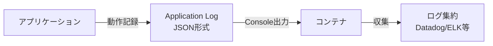
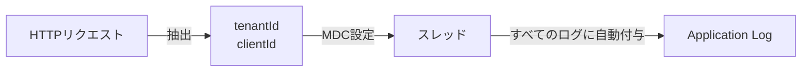
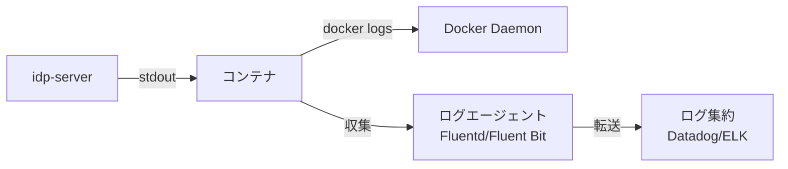

# アプリケーションログ

---

## 前提知識

このドキュメントを理解するには、以下の基礎知識が役立ちます：

- [監査ログ](concept-20-audit-compliance.md) - AuditLog、SecurityEventとの違い
- [運用・保守](concept-23-operations.md) - 運用における位置づけ

---

## 概要

idp-serverは、システムの動作を記録するアプリケーションログを出力します。

**アプリケーションログ（Application Log）** とは、システムの動作状態、エラー、警告等を記録するログです。



idp-serverでは以下のような用途に対応できます：

* トラブルシューティング: エラー原因の特定
* パフォーマンス分析: スロークエリの検出
* セキュリティ監視: 異常なアクセスパターンの検出

---

## 3種類のログの違い

idp-serverでは、目的に応じて3種類のログを使い分けます。

| ログ種別 | 目的 | 対象 | 形式 | 保持期間 | 用途 |
|:---|:---|:---|:---|:---|:---|
| **Application Log** | システム動作記録 | エラー、警告、情報 | JSON（Console） | 短期（数日〜数週間） | トラブルシューティング、デバッグ |
| **AuditLog** | 操作監査 | Management API操作 | Database | 長期（アーカイブ対象） | コンプライアンス監査 |
| **SecurityEvent** | セキュリティ監視 | ユーザー操作 | Database | 長期（アーカイブ対象） | 不正アクセス検知 |

**使い分けの基準**:
- **Application Log**: 開発者・運用担当者向け、一時的な記録
- **AuditLog/SecurityEvent**: コンプライアンス・監査向け、永続的な記録

詳細は [concept-13: 監査ログ](concept-20-audit-compliance.md) を参照。

---

## idp-serverにおけるアプリケーションログの設計思想

### 1. JSON構造化ログ

idp-serverは、**JSON形式の構造化ログ** を出力します。

```json
{
  "timestamp": "2025-01-15T10:30:00.123Z",
  "level": "INFO",
  "thread": "http-nio-8080-exec-1",
  "logger": "org.idp.server.core.openid.token.TokenHandler",
  "message": "Access token issued",
  "tenantId": "67e7eae6-62b0-4500-9eff-87459f63fc66",
  "clientId": "my-web-app"
}
```

**なぜJSON形式か**:
- **ログ集約システムとの連携**: Datadog、Elasticsearch、Splunk等で即座に検索・分析可能
- **フィールド単位の検索**: `tenantId`、`clientId`等で絞り込み可能
- **構造化データ**: 機械可読、パース不要

**実装**: Logback + LogstashEncoder

### 2. MDCによるコンテキスト情報

idp-serverは、**MDC（Mapped Diagnostic Context）** でコンテキスト情報をログに自動付与します。



**記録されるコンテキスト**:
- **tenantId**: テナント識別子（マルチテナント対応）
- **clientId**: クライアント識別子（アプリケーション追跡）

**メリット**:
- **テナント単位のフィルタリング**: 特定テナントのログのみ抽出
- **クライアント単位の追跡**: 特定アプリケーションの動作を追跡

### 3. ログレベル戦略

idp-serverは、適切なログレベルで情報を記録します。

**ログレベルの使い分け**:

| レベル | 用途 | 例 | 対応 |
|:---|:---|:---|:---|
| **ERROR** | システムエラー | Failed to get DB connection、Redis接続失敗 | 即座に対応が必要 |
| **WARN** | 警告 | 通知失敗、プラグイン未ロード、トークン期限切れ | 注意が必要 |
| **INFO** | 重要な動作 | 認証成功、トークン発行、ユーザー作成 | 正常動作の記録 |
| **DEBUG** | デバッグ情報 | SQL実行、外部HTTPリクエスト/レスポンスボディ | 開発時のみ有効化 |
| **TRACE** | 詳細デバッグ情報 | メソッド呼び出し、変数の値 | トラブルシューティング時のみ |

**デフォルト設定**: INFO（本番環境）

**環境別の推奨**:
- **本番**: INFO
- **ステージング**: INFO または DEBUG
- **開発**: DEBUG または TRACE

### 4. Console出力（コンテナ対応）

idp-serverは、**Console（stdout）** にログを出力します。



**なぜConsole出力か**:
- **12 Factor App**: ログはイベントストリームとして扱う
- **コンテナ環境に最適**: `docker logs`で即座に確認可能
- **ログ集約システムとの連携**: Fluentd、Fluent Bit等で収集

**ファイル出力は不要**:
- コンテナ環境ではファイル管理が複雑
- ログローテーション不要（ログエージェントが管理）

---

## ユースケース

### 1. トラブルシューティング: DB接続エラーの原因特定

DB接続エラーが発生した場合の調査。

- **ログ確認**: `level=ERROR`、`message="Failed to get DB connection"`
- **コンテキスト**: `tenantId`、スタックトレース
- **効果**: エラー原因の迅速な特定、環境変数の確認

### 2. セキュリティ監視: 認証失敗の多発検知

認証失敗が多発している場合の検知。

- **ログ確認**: `level=INFO`、`message="Authentication failed"`、`ip_address`
- **フィルタ**: 特定IPアドレスからの頻度
- **効果**: ブルートフォース攻撃の検知

### 3. パフォーマンス分析: ログ集約システムでの分析

ログ集約システムでレスポンス時間を分析。

- **ログ収集**: Datadog、Elasticsearch等
- **分析**: `response_time`、`query_execution_time`等
- **効果**: ボトルネックの特定、パフォーマンス改善

---

## セキュリティ考慮事項

### 機密情報の出力禁止

- **パスワード**: 絶対に出力しない
- **クライアントシークレット**: 出力しない
- **トークン**: 出力しない（最初の数文字のみ）
- **PII**: 個人識別情報のマスキング

### ログアクセス制御

- **ログ集約システム**: 権限ベースのアクセス制御
- **テナント分離**: テナント管理者は自テナントのログのみアクセス
- **監査**: ログへのアクセス自体も記録

---

## 関連ドキュメント

- [監査ログ](concept-20-audit-compliance.md) - AuditLog、SecurityEvent、3種類のログの違い
- [セキュリティイベント](../06-security-extensions/concept-17-security-events.md) - SecurityEvent詳細
- [運用・保守](concept-23-operations.md) - ヘルスチェック、メトリクス
- [運用ガイダンス](../../content_08_ops/commercial-deployment/05-operational-guidance.md) - ログパターン、トラブルシューティング

---

## 参考

### ロギングフレームワーク
- [Logback](https://logback.qos.ch/) - ログ出力フレームワーク
- [LogstashEncoder](https://github.com/logfellow/logstash-logback-encoder) - JSON構造化ログエンコーダー

### ベストプラクティス
- [The Twelve-Factor App: Logs](https://12factor.net/logs) - ログをイベントストリームとして扱う
