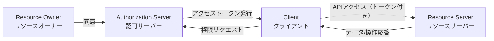

# OAuth 2.0の詳細  
## 4つの役割（Resource Owner / Client / Authorization Server / Resource Server）

---

## OAuth 2.0で登場する「4つの役割」

OAuth 2.0では、サービス連携の安全性を保つために、関係者を4つの役割に分けて考えます。  
この仕組み、めっちゃ大事やで！

---

### 1. リソースオーナー（Resource Owner）

- **意味：** データの“持ち主”（＝ユーザー本人）
- **例：** Googleカレンダーの予定データを持ってる本人
- **役割：** 自分のデータを“どこまで、誰に”使わせてOKか決める権限を持つ

---

### 2. クライアント（Client）

- **意味：** 外部サービスやアプリ、つまり“使わせてもらう側”
- **例：** カレンダー連携アプリ、ECサイト、業務システムなど
- **役割：** リソースオーナーから「○○の権限ちょうだい」とお願いする

---

### 3. 認可サーバー（Authorization Server）

- **意味：** 権限管理の司令塔
- **例：** GoogleやLINEのOAuth認可サーバー
- **役割：** リソースオーナーの同意を確認し、クライアントに“アクセストークン”を発行  
  → 誰が、どんな権限を持っているかを証明する中心的存在

---

### 4. リソースサーバー（Resource Server）

- **意味：** 実際にデータや機能を持ってる本体
- **例：** GoogleカレンダーAPI、LINEのメッセージAPIなど
- **役割：** アクセストークンを持つクライアントだけに、許可された操作をさせる  
  → 「このトークンなら閲覧だけOKやで！」と細かくチェックする番人

---

## 関係図イメージ（Mermaid記法）

---

## まとめ

- OAuth 2.0の安全な権限連携は「4役そろってナンボ」！
- この分業があるから、パスワードを預けずに“便利×安全”が両立できるんや

---

> 次は、この4役が連携する「認可フロー（グラントタイプ）」について、より具体的に見ていくで！