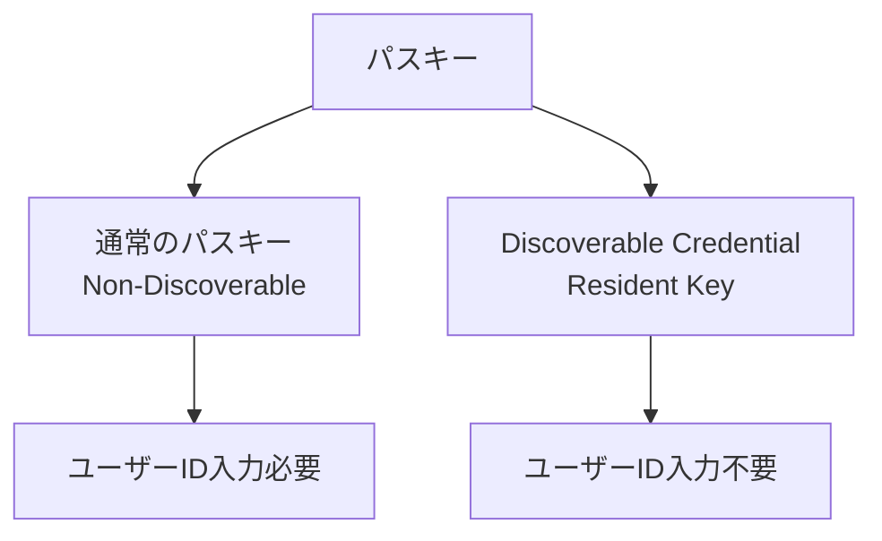
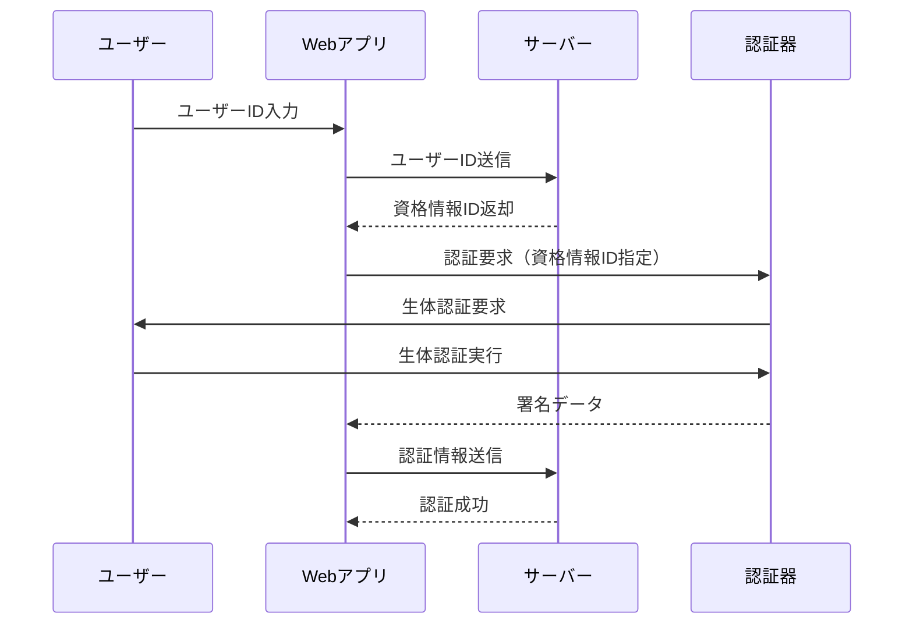
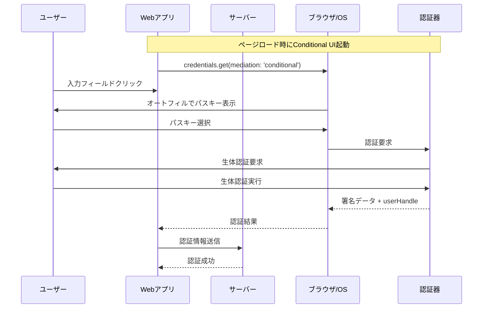
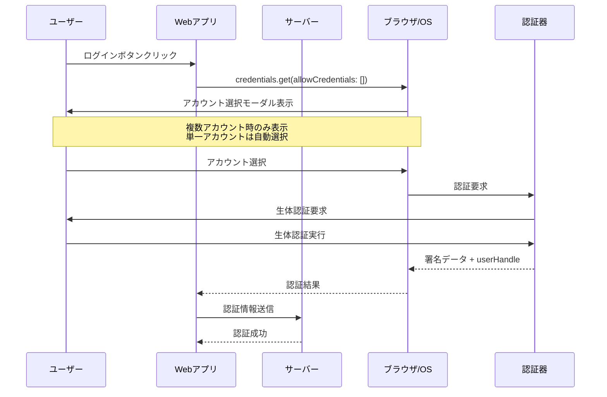
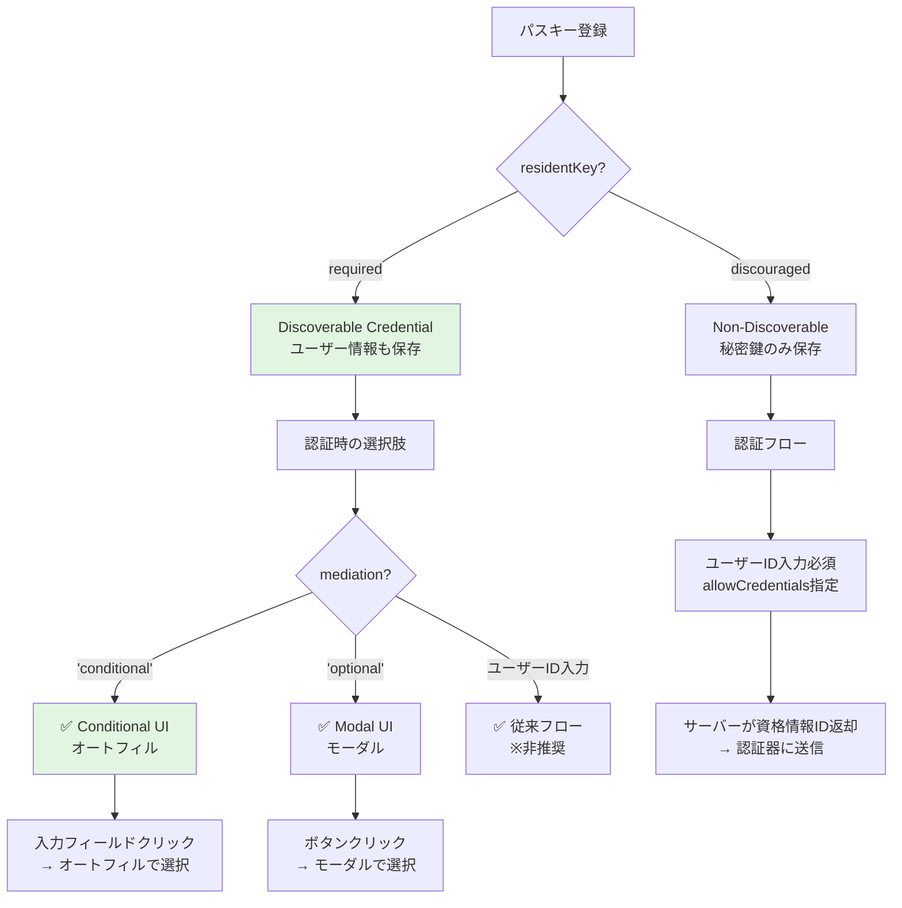

# FIDO2・パスキー・Discoverable Credentialの基本

---

## 概要

FIDO2におけるパスキーとDiscoverable Credentialは、しばしば混同されがちですが、技術的には異なる概念です。

このドキュメントでは、**パスキーとDiscoverable Credentialの正確な定義**、**認証フローの違い**、**実装時のパラメータ選択**について詳細に解説します。

---

## FIDO2とは

### FIDO2の構成要素

FIDO2は以下の2つの標準で構成されています：

- **WebAuthn (Web Authentication API)**: Webブラウザ向けのAPI仕様
- **CTAP (Client to Authenticator Protocol)**: 認証器とクライアント間の通信プロトコル

### パスワードレス認証の実現

FIDO2により、従来のパスワード認証を以下の方式で置き換えることができます：

- **公開鍵暗号方式**: サーバーに秘密情報を保存しない
- **生体認証**: 指紋認証、顔認証、PIN等による本人確認
- **フィッシング耐性**: Origin Bindingによる偽サイト対策

---

## パスキーとは

### 技術的定義

パスキーは、**FIDO2/WebAuthn技術を使用した認証資格情報の総称**です。



### パスキーの共通特徴

- **公開鍵暗号方式**: サイトごとに異なるキーペアを生成
- **フィッシング耐性**: 登録したOriginでのみ動作
- **生体認証対応**: Touch ID、Face ID、Windows Hello等
- **デバイス間同期**: プラットフォーム提供者による同期機能（Apple ID、Googleアカウント等）

---

## Discoverable Credentialとは

### 技術的定義

Discoverable Credential（**Resident Key**とも呼ばれる）は、**認証器内にユーザー情報も含めて保存される特別なパスキー**です。

### 主な特徴

- **認証器内保存**: ユーザーID、表示名、アカウント情報を認証器に保存
- **ユーザーID入力不要**: 生体認証のみでログイン可能
- **アカウント選択**: 複数アカウントがある場合はユーザーが選択
- **容量制限**: 認証器の保存容量に制限あり

### WebAuthn仕様におけるパラメータ

WebAuthn仕様では、Discoverable Credentialの制御に以下のパラメータが定義されています：

#### 標準仕様（WebAuthn Level 2以降）

```javascript
// 標準的なresidentKeyパラメータ（WebAuthn Level 2以降）
const publicKeyCredentialCreationOptions = {
  authenticatorSelection: {
    residentKey: "required",     // 標準パラメータ
    userVerification: "required"
  }
};
```

#### `residentKey`パラメータの値（WebAuthn標準）

| 値 | 意味 | 動作 |
|---|------|------|
| `"required"` | Discoverable Credential必須 | 作成できない場合は`NotAllowedError`で失敗 |
| `"preferred"` | Discoverable Credential強く推奨 | 可能ならDiscoverable、不可能ならNon-Discoverable作成 |
| `"discouraged"` | Non-Discoverable推奨 | 可能ならNon-Discoverable、Discoverableも許容 |

**注意**: `"discouraged"`でもDiscoverable Credentialが作成される可能性があります（認証器の実装依存）。

#### レガシーパラメータ（WebAuthn Level 1）

```javascript
// 後方互換性のためのレガシーパラメータ
const publicKeyCredentialCreationOptions = {
  authenticatorSelection: {
    requireResidentKey: true,    // レガシーパラメータ（boolean型）
    userVerification: "required"
  }
};
```

---

## 通常のパスキーとDiscoverable Credentialの違い

### 認証フロー比較

#### サイドバイサイド比較

```mermaid
flowchart TD
    subgraph Non-Discoverable ["通常のパスキー（Non-Discoverable）"]
        A1[ユーザーID入力] --> A2[サーバーに送信]
        A2 --> A3[資格情報ID取得]
        A3 --> A4[認証器に認証要求]
        A4 --> A5[生体認証]
        A5 --> A6[署名生成]
        A6 --> A7[認証完了]
    end

    subgraph Conditional ["Discoverable (Conditional UI)"]
        B1[入力フィールドクリック] --> B2[オートフィルで<br/>パスキー表示]
        B2 --> B3[パスキー選択]
        B3 --> B4[生体認証]
        B4 --> B5[署名生成]
        B5 --> B6[認証完了]
    end

    subgraph Modal ["Discoverable (Modal)"]
        C1[ログインボタン] --> C2[アカウント選択<br/>モーダル表示]
        C2 --> C3[アカウント選択]
        C3 --> C4[生体認証]
        C4 --> C5[署名生成]
        C5 --> C6[認証完了]
    end
```



**注意**:
- **Conditional UI**: 最新の推奨方式（idp-server実装済み）
- **Modal**: 従来型、複数アカウント時に選択UI表示
- **アカウント選択**: 単一アカウントの場合はスキップ

#### 詳細シーケンス図

##### 通常のパスキー（Non-Discoverable Credential）



##### Discoverable Credential（Conditional UI モード）



##### Discoverable Credential（Modal モード）



### ユースケース比較表

#### Non-Discoverable vs Discoverable

| 特徴 | 通常のパスキー<br/>(Non-Discoverable) | Discoverable Credential |
|------|---------------|------------------------|
| **ユーザーID入力** | 必要 | 不要（Conditional UI）<br/>または最小限（Modal） |
| **UX** | ユーザーID + 生体認証 | 生体認証のみ |
| **認証器の容量** | 影響なし | 保存数に制限あり |
| **適用シーン** | 2要素認証の2要素目 | パスワードレスログイン |
| **実装複雑度** | 標準的 | やや複雑（アカウント管理） |
| **セキュリティ** | 高い | 高い |

#### Conditional UI vs Modal（両方Discoverable Credential）

| 特徴 | Conditional UI | Modal |
|------|---------------|-------|
| **起動方法** | 入力フィールドクリック | ログインボタンクリック |
| **UI表示** | オートフィルドロップダウン | モーダルダイアログ |
| **ユーザー体験** | 非常にスムーズ | やや侵入的 |
| **ブラウザ対応** | Chrome 108+, Safari 16+ | 全対応ブラウザ |
| **実装** | `mediation: 'conditional'` | `mediation: 'optional'` |
| **推奨度** | ⭐⭐⭐⭐⭐ 最新推奨 | ⭐⭐⭐ 従来型 |
| **idp-server** | ✅ 実装済み | ✅ 対応可能 |

### Conditional UI（オートフィル）の標準化状況

#### W3C公式仕様

Conditional UIは**WebAuthn Level 3**の公式仕様に含まれています：

- **公式仕様**: [W3C WebAuthn Level 3](https://www.w3.org/TR/webauthn-3/)
- **Explainer**: [W3C WebAuthn Conditional UI Explainer](https://github.com/w3c/webauthn/wiki/Explainer:-WebAuthn-Conditional-UI)
- **Status**: W3C Working Draft（現行標準）

#### 公式定義

> "A new mode for WebAuthn that displays a credential selection UI only if the user has a discoverable credential registered with the Relying Party on their authenticator, with the credential displayed alongside autofilled passwords."
>
> — W3C WebAuthn Conditional UI Explainer

#### 公式用語

以下の用語はすべてW3C/標準仕様で使用されています：

| 用語 | 使用箇所 | 意味 |
|------|---------|------|
| **Conditional UI** | W3C仕様 | 公式機能名称 |
| **Conditional Mediation** | API仕様 | `mediation: 'conditional'` パラメータ |
| **Autofill** | ユーザー向け説明 | オートフィル統合の表現 |
| **Passkey Autofill** | マーケティング | 一般向け説明 |

#### ブラウザサポート状況

| ブラウザ | サポート開始 | 状況 | 備考 |
|----------|------------|------|------|
| **Chrome** | 108+ (2022年10月) | ✅ フルサポート | [公式ガイド](https://developer.chrome.com/docs/identity/webauthn-conditional-ui) |
| **Safari** | 16+ (2022年9月) | ✅ フルサポート | iOS/macOS両対応 |
| **Edge** | Chromiumベース | ✅ フルサポート | Chrome同等 |
| **Firefox** | - | ❌ 未サポート | 2024年時点 |

**MDN Baseline**: 2023年10月から「[Baseline 2023](https://developer.mozilla.org/en-US/docs/Web/API/PublicKeyCredential/isConditionalMediationAvailable_static)」認定（主要ブラウザで利用可能）

#### 実装リファレンス

- **MDN**: [PublicKeyCredential.isConditionalMediationAvailable()](https://developer.mozilla.org/en-US/docs/Web/API/PublicKeyCredential/isConditionalMediationAvailable_static)
- **Chrome**: [Passwordless sign-in with WebAuthn passkey autofill](https://developer.chrome.com/docs/identity/webauthn-conditional-ui)
- **Yubico**: [Passkey Autofill Implementation Guidance](https://developers.yubico.com/WebAuthn/Concepts/Passkey_Autofill/)

---

## Discoverable CredentialとConditional UIの関係

### 重要な概念の違い

この2つは**異なる概念**であり、混同しやすいため明確に区別する必要があります：

| 概念 | 分類 | 決定タイミング | 制御パラメータ | 説明 |
|------|------|-------------|--------------|------|
| **Discoverable Credential** | 保存形式 | **登録時** | `residentKey: "required"` | 認証器に何を保存するか |
| **Conditional UI** | 使用方法 | **認証時** | `mediation: 'conditional'` | どうやってパスキーを選択するか |

### 1. Discoverable Credential = パスキーの「保存形式」

認証器（Touch ID等）に**何を保存するか**の違い：

#### Discoverable Credential（登録時）

```javascript
// 登録時の設定
authenticatorSelection: {
  residentKey: "required",        // Discoverable作成
  userVerification: "required"
}

// ✅ 認証器内に保存される情報
// - 秘密鍵（Private Key）
// - ユーザーID（user.id）
// - 表示名（user.displayName）
// - RP ID（example.com）
```

#### Non-Discoverable Credential（登録時）

```javascript
// 登録時の設定
authenticatorSelection: {
  residentKey: "discouraged",     // Non-Discoverable作成
  userVerification: "required"
}

// ⚠️ 認証器内に保存される情報
// - 秘密鍵（Private Key）
// - RP ID（example.com）
// ❌ ユーザーID（保存されない）
// ❌ 表示名（保存されない）
```

### 2. Conditional UI = パスキーの「使用方法」

認証時に**どうやってパスキーを選択するか**の違い：

#### Conditional UI（認証時）

```javascript
// 認証時の設定
navigator.credentials.get({
  publicKey: {
    challenge: ...,
    allowCredentials: []  // 空 = Discoverable検索
  },
  mediation: 'conditional'  // オートフィルで表示
});

// ✅ ユーザー体験
// 1. 入力フィールドをクリック
// 2. オートフィルドロップダウンでパスキー表示
// 3. パスキー選択
// 4. 生体認証
```

#### Modal UI（認証時）

```javascript
// 認証時の設定
navigator.credentials.get({
  publicKey: {
    challenge: ...,
    allowCredentials: []  // 空 = Discoverable検索
  },
  mediation: 'optional'  // モーダルで表示
});

// ✅ ユーザー体験
// 1. ログインボタンをクリック
// 2. モーダルダイアログでパスキー表示
// 3. パスキー選択
// 4. 生体認証
```

### 3. 関係性の図解



### 4. 組み合わせ可否表

| 登録時（保存形式） | 認証時（使用方法） | 組み合わせ | 説明 |
|-----------------|----------------|---------|------|
| **Discoverable** | Conditional UI | ✅ **推奨** | 最新のベストプラクティス（idp-server実装） |
| **Discoverable** | Modal UI | ✅ 可能 | 従来型の方式 |
| **Discoverable** | ユーザーID入力 | ✅ 可能 | Discoverableでも可能だが非推奨 |
| **Non-Discoverable** | Conditional UI | ❌ **不可** | ユーザー情報がないためオートフィル不可 |
| **Non-Discoverable** | Modal UI | ❌ **不可** | ユーザー情報がないため選択UI不可 |
| **Non-Discoverable** | ユーザーID入力 | ✅ 唯一の方法 | 2要素認証の2要素目向け |

### 5. なぜConditional UIにはDiscoverable Credentialが必須なのか？

#### 理由：オートフィルには「表示する情報」が必要

```javascript
// ❌ Non-Discoverable + Conditional UIは不可
// 問題：認証器に表示名がないため、オートフィルに何を表示すればいいか分からない

navigator.credentials.get({
  publicKey: {
    challenge,
    allowCredentials: []  // 空 = 認証器内を検索
  },
  mediation: 'conditional'  // ← 何を表示する？情報がない！
});
```

```javascript
// ✅ Discoverable + Conditional UIは可能
// 認証器に保存されたユーザー情報をオートフィルで表示

【認証器内の情報】
- displayName: "伊藤一朗"
- name: "itou@example.com"

【オートフィルに表示される内容】
🔐 伊藤一朗 (itou@example.com)
   └ Touch IDで認証
```

### 6. 実際のフロー例（idp-server実装）

#### 登録フロー（Discoverable Credential作成）

```javascript
// app-view/src/pages/signup/fido2/index.tsx
const publicKeyOptions = {
  challenge: base64UrlToBuffer(challenge),
  rp: { name: "IdP Server" },
  user: {
    id: base64UrlToBuffer(user.id),
    name: "user@example.com",        // ← 認証器に保存
    displayName: "ユーザー名"         // ← 認証器に保存（オートフィルで表示される）
  },
  authenticatorSelection: {
    authenticatorAttachment: "platform",
    requireResidentKey: true,        // ← Discoverable作成
    userVerification: "required"
  },
  pubKeyCredParams: [
    { type: "public-key", alg: -7 },   // ES256
    { type: "public-key", alg: -257 }, // RS256
  ],
};

const credential = await navigator.credentials.create({
  publicKey: publicKeyOptions
});
```

#### 認証フロー（Conditional UI使用）

```javascript
// app-view/src/pages/signin/fido2/index.tsx

// ページロード時にConditional UI起動
useEffect(() => {
  if (data && !data.session_enabled) {
    authChallenge(true);  // isConditional = true
  }
}, [data]);

const authChallenge = async (isConditional) => {
  // チャレンジ取得
  const response = await fetch(`${backendUrl}/.../fido2-authentication-challenge`, {
    method: "POST",
    body: JSON.stringify({ username, userVerification: "required" })
  });
  const challengeResponse = await response.json();

  const publicKeyOptions = {
    challenge: base64UrlToBuffer(challengeResponse.challenge),
    timeout: 60000,
    userVerification: "required",
    // allowCredentialsを空にする = Discoverable検索
  };

  // Conditional UI起動
  const credential = await navigator.credentials.get({
    publicKey: publicKeyOptions,
    mediation: 'conditional',  // ← オートフィル起動
  });
};
```

```html
<!-- 入力フィールドにautocomplete属性を追加 -->
<TextField
  fullWidth
  label="Username or Email"
  value={username}
  onChange={(e) => setUsername(e.target.value)}
  autoComplete="username webauthn"  <!-- ← 重要！ -->
  inputProps={{
    autoComplete: "username webauthn",
  }}
/>
```

### 7. まとめ

#### 重要ポイント

1. **Discoverable Credential = 登録時の保存形式**
   - `residentKey: "required"` で作成
   - ユーザー情報を認証器に保存
   - 認証時にユーザーID入力が不要になる

2. **Conditional UI = 認証時の使用方法**
   - `mediation: 'conditional'` で起動
   - オートフィルでパスキーを表示
   - 最新のベストプラクティス

3. **関係性**
   - Conditional UIを使うには**Discoverableが必須**
   - Discoverableを使うのに**Conditional UIは必須ではない**（Modalでも可）
   - **推奨組み合わせ**: Discoverable + Conditional UI ← idp-server実装済み

#### 実装チェックリスト

- [ ] 登録時: `requireResidentKey: true` または `residentKey: "required"` を設定
- [ ] 登録時: `user.displayName` に適切な表示名を設定
- [ ] 認証時: `mediation: 'conditional'` を指定
- [ ] 認証時: `allowCredentials` を空にする（または省略）
- [ ] HTML: 入力フィールドに `autoComplete="username webauthn"` を追加
- [ ] 機能検出: `PublicKeyCredential.isConditionalMediationAvailable()` で確認

---

## 実装における注意点

### 1. `requireResidentKey`と`residentKey`の関係

WebAuthn仕様における新旧パラメータの関係：

#### WebAuthn標準における推奨パラメータ

```javascript
// ✅ WebAuthn Level 2以降の標準パラメータ
authenticatorSelection: {
  residentKey: "required",
  userVerification: "required"
}
```

#### 実装における現実的な選択

多くの実装（idp-serverを含む）では、まだレガシーパラメータが使用されています：

```javascript
// 現在多くの実装で使用されているレガシーパラメータ
authenticatorSelection: {
  requireResidentKey: true,    // boolean型で制御
  userVerification: "required"
}
```

**注意**: 実装環境に応じて適切なパラメータを選択してください。

### 2. ユーザー検証（User Verification）

Discoverable Credentialでは**ユーザー検証が必須**となることが多い：

```javascript
authenticatorSelection: {
  residentKey: "required",
  userVerification: "required"  // 必須に設定
}
```

### 3. 認証器の容量制限

#### セキュリティキー
- **容量**: 通常25〜100個程度のDiscoverable Credentialを保存可能
- **対策**: 企業環境では容量管理が重要

#### プラットフォーム認証器
- **容量**: クラウド同期により実質無制限
- **例**: iCloudキーチェーン、Google Password Manager

### 4. ユーザー情報の設定

Discoverable Credentialでは、認証器に保存するユーザー情報を適切に設定：

```javascript
user: {
  id: new TextEncoder().encode("user123"),     // ユーザーの一意ID
  name: "itou@example.com",                    // ユーザー名（メールアドレス等）
  displayName: "伊藤一朗"                      // 表示名
}
```

**プライバシー考慮事項**:
- `displayName`には個人を特定できる情報を含めない（推奨）
- 必要最小限の情報のみ保存

---

## セキュリティ考慮事項

### よくある誤解と正しい理解

Discoverable Credentialのセキュリティについて、よくある誤解と正しい理解を整理します。

#### 誤解1: 「displayNameに実名を使うとプライバシーリスクがある」

❌ **誤解**:
- 表示名に個人識別情報（実名）を含めてはいけない
- displayNameは匿名化すべき

✅ **正しい理解**:
- **displayNameは実名使用が推奨**される
- プライバシー保護が必要なのは`user.id`（user handle）
- displayNameはユーザーが選択できるべき

**W3C WebAuthn仕様**:
> "The displayName is a human-palatable name for the user account, intended only for display. For example, 'Alex Müller' or '田中倫'. The Relying Party SHOULD let the user choose this, and SHOULD NOT restrict the choice more than necessary."

**正しい実装**:
```javascript
user: {
  id: crypto.randomUUID(),          // ✅ ランダムUUID（PII禁止）
  name: "itou@example.com",         // ✅ メールアドレス可（識別用）
  displayName: "伊藤一朗"           // ✅ 実名推奨（ユーザーフレンドリー）
}
```

#### 誤解2: 「Discoverable Credentialはユーザー列挙攻撃に脆弱」

❌ **誤解**:
- デバイスに保存されたアカウント一覧から簡単にユーザー情報が漏洩する
- サーバー側でユーザー列挙攻撃のリスクが増える

✅ **正しい理解**:
- Discoverable Credentialを使うことで、むしろ**サーバー側でのユーザー列挙攻撃を防げる**
- デバイス内の情報にアクセスするには「物理アクセス + デバイスロック突破 + 生体認証突破」が必要
- 適切なデバイスロック設定で十分なセキュリティを確保できる

**W3C WebAuthn Working Group の見解（Issue #578）**:
- 生体認証やPINで保護された認証器では、displayName等の情報を保存しても問題ない
- 本当のリスクは「認証機能のない認証器」での使用

**推奨対策**:
- Platform Authenticator（Touch ID, Face ID, Windows Hello）の使用
- デバイスロック（パスコード/パスワード）の必須化
- セキュリティキー使用時はPIN設定を推奨

#### 誤解3: 「パスキーは定期的に更新すべき」

❌ **誤解**:
- パスワードのように定期的にクレデンシャルを更新すべき
- アクセス頻度によって自動削除すべき

✅ **正しい理解**:
- パスキーは**永続的に使用する**ことが想定されている
- 公開鍵暗号方式のため、サーバー側に秘密情報は保存されない
- 定期更新は不要であり、ユーザー体験を損なう

**実際のリスクと対策**:
- **リスク**: デバイス紛失時のアクセス不能
- **対策**: 複数デバイスへの登録、バックアップ認証手段の用意

### 実際のセキュリティリスクと対策

#### 1. 物理デバイス紛失・盗難

**リスクシナリオ**:
- デバイス紛失 + デバイスロック未設定 → パスキー不正使用の可能性

**推奨対策**:
- [ ] デバイスロック（パスコード/パスワード）必須化
- [ ] 生体認証の有効化（Touch ID, Face ID等）
- [ ] 複数デバイスへのパスキー登録
- [ ] リモートワイプ機能の有効化（企業環境）
- [ ] バックアップ認証手段の用意

#### 2. 認証器容量制限（セキュリティキー）

**リスクシナリオ**:
- セキュリティキーの容量（25〜100個程度）超過 → 新規登録不可

**推奨対策**:
- [ ] 企業環境での容量管理ポリシー策定
- [ ] 不要なクレデンシャルの定期削除フロー
- [ ] 容量監視とアラート機能（可能であれば）
- [ ] Platform Authenticatorの併用推奨（実質無制限）

#### 3. デバイス紛失時の復旧

**クラウド同期有効時（Platform Authenticator）**:
- **復旧**: 新デバイスでクラウドアカウント設定後、自動的にパスキー復元
- **対象**: iOS（iCloud Keychain）、Android（Google Password Manager）、1Password等
- **メリット**: デバイス紛失時も別デバイスで継続使用可能
- **デメリット**: クラウドアカウント侵害時の影響範囲が大きい

**クラウド同期無効時（セキュリティキー等）**:
- **復旧**: 不可能（デバイス紛失 = パスキー喪失）
- **対策**: 複数デバイスへの事前登録必須
- **推奨**: バックアップ認証手段（パスワード、SMS等）を併用

### プライバシー保護の正しい理解

#### 認証器に保存される情報

```javascript
// Discoverable Credentialで認証器に保存される情報
{
  user: {
    id: "550e8400-e29b-41d4-a716-446655440000",  // ランダムUUID
    name: "itou@example.com",                   // ユーザー名（識別用）
    displayName: "伊藤一朗"                      // 表示名（UI表示用）
  },
  rpId: "example.com",                          // サイト情報
  credentialId: "..."                           // 資格情報ID
}
```

#### 各フィールドのプライバシー考慮事項

| フィールド | プライバシー要件 | 推奨値 | 理由 |
|-----------|----------------|--------|------|
| **user.id** | ❗ PII禁止 | ランダムUUID | 仕様で明示的に禁止 |
| **user.name** | ⚠️ 変更可能性考慮 | メールアドレス可 | 識別用途、変更時は新規登録必要 |
| **user.displayName** | ✅ ユーザーフレンドリー | 実名推奨 | ユーザーが選択、オートフィルで表示 |

**W3C WebAuthn仕様（user.id）**:
> "The user handle MUST NOT contain personally identifying information about the user, such as a username or e-mail address."

**重要なポイント**:
- ✅ **displayNameは実名使用が推奨**（ユーザー体験向上のため）
- ✅ Platform Authenticatorは生体認証で保護されている
- ✅ デバイスロック設定でさらに保護層を追加
- ❌ user.idにPIIを含めてはいけない（唯一の絶対要件）

---

## 仕様参照

### W3C・FIDO仕様
- **[WebAuthn Level 3](https://www.w3.org/TR/webauthn-3/)** - W3C WebAuthn最新仕様
- **[WebAuthn Level 3 - Resident Key](https://www.w3.org/TR/webauthn-3/#dom-authenticatorselectioncriteria-residentkey)** - residentKeyパラメータ詳細
- **[FIDO2 Client to Authenticator Protocol](https://fidoalliance.org/specs/fido-v2.1-ps-20210615/fido-client-to-authenticator-protocol-v2.1-ps-errata-20220621.html)** - CTAP仕様

### 関連ドキュメント
- **[FIDO2・WebAuthn パスワードレス認証](basic-16-fido2-webauthn-passwordless.md)** - FIDO2/WebAuthnの基礎概念
- **[WebAuthn設定](../../content_06_developer-guide/05-configuration/authn/webauthn.md)** - idp-serverでのWebAuthn設定方法

---

## まとめ

### 重要なポイント

1. **Discoverable Credential = 保存形式（登録時）**
   - `residentKey: "required"` でユーザー情報を認証器に保存
   - ユーザーID入力が不要になる
   - 認証器に保存される情報: 秘密鍵、user.id、user.name、user.displayName

2. **Conditional UI = 使用方法（認証時）**
   - `mediation: 'conditional'` でオートフィル起動
   - W3C WebAuthn Level 3の公式機能
   - Chrome 108+, Safari 16+で対応（MDN Baseline 2023）
   - idp-server実装済み（推奨）

3. **関係性**
   - Conditional UIを使うには**Discoverableが必須**
   - Discoverableを使うのに**Conditional UIは必須ではない**（Modalでも可）
   - **推奨組み合わせ**: Discoverable + Conditional UI

### よくある誤解

| 誤解 | 正しい理解 |
|------|-----------|
| displayNameは匿名化すべき | ✅ **実名使用が推奨**（user.idのみPII禁止） |
| ユーザー列挙攻撃に脆弱 | ✅ むしろサーバー側の列挙攻撃を**防げる** |
| 定期的に更新すべき | ✅ **永続的使用が想定**、更新不要 |

### 実装チェックリスト

**登録時（Discoverable Credential作成）**:
- [ ] `residentKey: "required"` または `requireResidentKey: true` を設定
- [ ] `user.id` はランダムUUID（PII禁止、仕様で明示）
- [ ] `user.name` にメールアドレス等の識別子
- [ ] `user.displayName` に実名設定（ユーザーが選択、オートフィルで表示）
- [ ] `authenticatorAttachment: "platform"` 推奨（Touch ID等）

**認証時（Conditional UI使用）**:
- [ ] `mediation: 'conditional'` を指定
- [ ] `allowCredentials` を空にする（または省略）
- [ ] HTML入力フィールドに `autoComplete="username webauthn"` を追加
- [ ] ページロード時に `credentials.get()` を起動
- [ ] 機能検出: `PublicKeyCredential.isConditionalMediationAvailable()` で確認

**セキュリティ対策**:
- [ ] デバイスロック（パスコード/パスワード）必須化
- [ ] 生体認証の有効化
- [ ] 複数デバイスへのパスキー登録推奨
- [ ] バックアップ認証手段の用意

### 参考リソース

- **W3C仕様**: [WebAuthn Level 3](https://www.w3.org/TR/webauthn-3/)
- **Conditional UI**: [W3C Explainer](https://github.com/w3c/webauthn/wiki/Explainer:-WebAuthn-Conditional-UI)
- **実装ガイド**: [Chrome Developers](https://developer.chrome.com/docs/identity/webauthn-conditional-ui)
- **idp-server実装**: [WebAuthn設定ガイド](../../content_06_developer-guide/05-configuration/authn/webauthn.md)

---

> Discoverable CredentialとConditional UIの違いを理解し、適切な実装により、
> セキュアで使いやすいパスワードレス認証システムを構築しましょう！