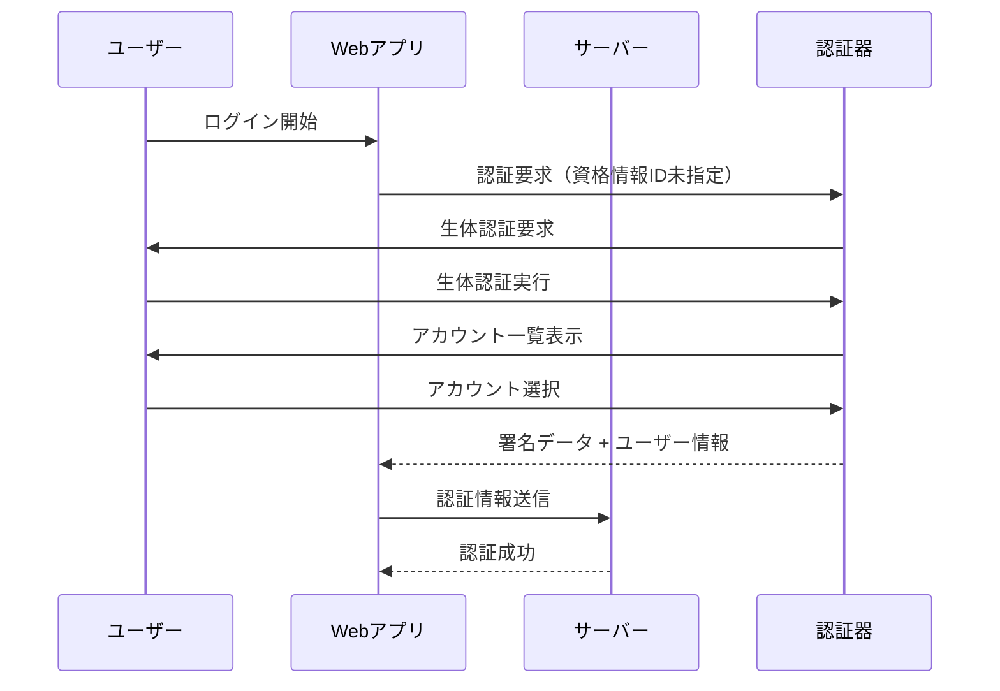
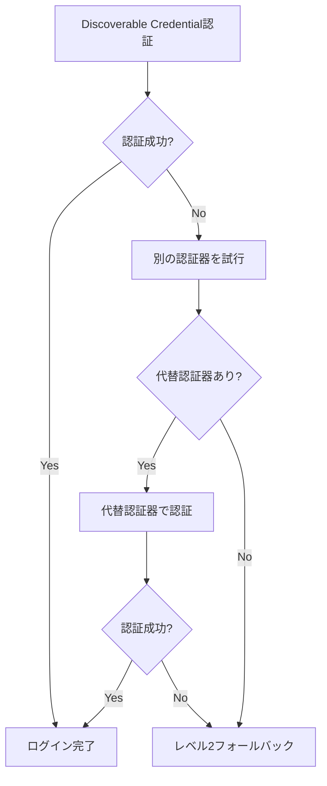
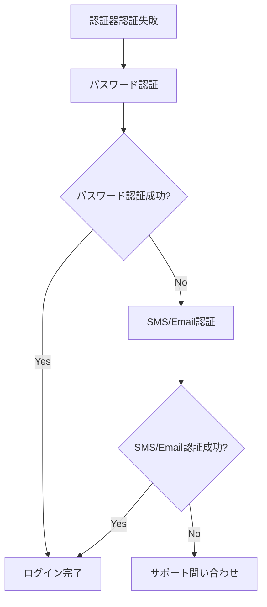

# FIDO2・パスキー・Discoverable Credentialの基本

---

## 概要

FIDO2におけるパスキーとDiscoverable Credentialは、しばしば混同されがちですが、技術的には異なる概念です。

このドキュメントでは、**パスキーとDiscoverable Credentialの正確な定義**、**認証フローの違い**、**実装時のパラメータ選択**について詳細に解説します。

---

## FIDO2とは

### FIDO2の構成要素

FIDO2は以下の2つの標準で構成されています：

- **WebAuthn (Web Authentication API)**: Webブラウザ向けのAPI仕様
- **CTAP (Client to Authenticator Protocol)**: 認証器とクライアント間の通信プロトコル

### パスワードレス認証の実現

FIDO2により、従来のパスワード認証を以下の方式で置き換えることができます：

- **公開鍵暗号方式**: サーバーに秘密情報を保存しない
- **生体認証**: 指紋認証、顔認証、PIN等による本人確認
- **フィッシング耐性**: Origin Bindingによる偽サイト対策

---

## パスキーとは

### 技術的定義

パスキーは、**FIDO2/WebAuthn技術を使用した認証資格情報の総称**です。


### パスキーの共通特徴

- **公開鍵暗号方式**: サイトごとに異なるキーペアを生成
- **フィッシング耐性**: 登録したOriginでのみ動作
- **生体認証対応**: Touch ID、Face ID、Windows Hello等
- **デバイス間同期**: プラットフォーム提供者による同期機能（Apple ID、Googleアカウント等）

---

## Discoverable Credentialとは

### 技術的定義

Discoverable Credential（**Resident Key**とも呼ばれる）は、**認証器内にユーザー情報も含めて保存される特別なパスキー**です。

### 主な特徴

- **認証器内保存**: ユーザーID、表示名、アカウント情報を認証器に保存
- **ユーザーID入力不要**: 生体認証のみでログイン可能
- **アカウント選択**: 複数アカウントがある場合はユーザーが選択
- **容量制限**: 認証器の保存容量に制限あり

### WebAuthn仕様におけるパラメータ

WebAuthn仕様では、Discoverable Credentialの制御に以下のパラメータが定義されています：

#### 標準仕様（WebAuthn Level 2以降）

```javascript
// 標準的なresidentKeyパラメータ（WebAuthn Level 2以降）
const publicKeyCredentialCreationOptions = {
  authenticatorSelection: {
    residentKey: "required",     // 標準パラメータ
    userVerification: "required"
  }
};
```

#### `residentKey`パラメータの値（WebAuthn標準）

| 値 | 意味 | 動作 |
|---|------|------|
| `"required"` | Discoverable Credential必須 | 対応していない認証器では登録失敗 |
| `"preferred"` | 可能ならDiscoverable Credential | 対応していれば作成、未対応でも通常のパスキーとして作成 |
| `"discouraged"` | 通常のパスキー | Discoverable Credentialは作成しない |

#### レガシーパラメータ（WebAuthn Level 1）

```javascript
// 後方互換性のためのレガシーパラメータ
const publicKeyCredentialCreationOptions = {
  authenticatorSelection: {
    requireResidentKey: true,    // レガシーパラメータ（boolean型）
    userVerification: "required"
  }
};
```

---

## 通常のパスキーとDiscoverable Credentialの違い

### 認証フロー比較

#### サイドバイサイド比較

```mermaid
flowchart TD
    subgraph Non-Discoverable ["通常のパスキー（Non-Discoverable）"]
        A1[ユーザーID入力] --> A2[サーバーに送信]
        A2 --> A3[資格情報ID取得]
        A3 --> A4[認証器に認証要求]
        A4 --> A5[生体認証]
        A5 --> A6[署名生成]
        A6 --> A7[認証完了]
    end

    subgraph Discoverable ["Discoverable Credential"]
        B1[ログイン開始] --> B2[認証器に要求]
        B2 --> B3[生体認証]
        B3 --> B4[アカウント一覧表示]
        B4 --> B5[アカウント選択]
        B5 --> B6[署名生成]
        B6 --> B7[認証完了]
    end
```



#### 詳細シーケンス図

##### 通常のパスキー（Non-Discoverable Credential）

```mermaid
sequenceDiagram
    participant User as ユーザー
    participant WebApp as Webアプリ
    participant Server as サーバー
    participant Auth as 認証器

    User->>WebApp: ユーザーID入力
    WebApp->>Server: ユーザーID送信
    Server-->>WebApp: 資格情報ID返却
    WebApp->>Auth: 認証要求（資格情報ID指定）
    Auth->>User: 生体認証要求
    User->>Auth: 生体認証実行
    Auth-->>WebApp: 署名データ
    WebApp->>Server: 認証情報送信
    Server-->>WebApp: 認証成功
```



##### Discoverable Credential



### ユースケース比較表

| 特徴 | 通常のパスキー | Discoverable Credential |
|------|---------------|------------------------|
| **ユーザーID入力** | 必要 | 不要 |
| **UX** | ユーザーID + 生体認証 | 生体認証のみ |
| **認証器の容量** | 影響なし | 保存数に制限あり |
| **適用シーン** | 2要素認証の2要素目 | パスワードレスログイン |
| **実装複雑度** | 標準的 | やや複雑（アカウント管理） |
| **セキュリティ** | 高い | 高い |

---

## 実装における注意点

### 1. `requireResidentKey`と`residentKey`の関係

WebAuthn仕様における新旧パラメータの関係：

#### WebAuthn標準における推奨パラメータ

```javascript
// ✅ WebAuthn Level 2以降の標準パラメータ
authenticatorSelection: {
  residentKey: "required",
  userVerification: "required"
}
```

#### 実装における現実的な選択

多くの実装（idp-serverを含む）では、まだレガシーパラメータが使用されています：

```javascript
// 現在多くの実装で使用されているレガシーパラメータ
authenticatorSelection: {
  requireResidentKey: true,    // boolean型で制御
  userVerification: "required"
}
```

**注意**: 実装環境に応じて適切なパラメータを選択してください。

### 2. ユーザー検証（User Verification）

Discoverable Credentialでは**ユーザー検証が必須**となることが多い：

```javascript
authenticatorSelection: {
  residentKey: "required",
  userVerification: "required"  // 必須に設定
}
```

### 3. 認証器の容量制限

#### セキュリティキー
- **容量**: 通常25〜100個程度のDiscoverable Credentialを保存可能
- **対策**: 企業環境では容量管理が重要

#### プラットフォーム認証器
- **容量**: クラウド同期により実質無制限
- **例**: iCloudキーチェーン、Google Password Manager

### 4. ユーザー情報の設定

Discoverable Credentialでは、認証器に保存するユーザー情報を適切に設定：

```javascript
user: {
  id: new TextEncoder().encode("user123"),     // ユーザーの一意ID
  name: "user@example.com",                    // ユーザー名（メールアドレス等）
  displayName: "田中太郎"                      // 表示名
}
```

**プライバシー考慮事項**:
- `displayName`には個人を特定できる情報を含めない（推奨）
- 必要最小限の情報のみ保存

---

## セキュリティ考慮事項

### Discoverable Credential特有のリスク

#### 1. ユーザー列挙攻撃（User Enumeration）
- **リスク**: デバイスに保存されたアカウント一覧からユーザー情報が露出
- **対策**:
  - 表示名に個人識別情報を含めない
  - 匿名化されたユーザーIDの使用
  - デバイスロック機能の必須化

#### 2. 認証器容量制限
- **リスク**: セキュリティキーの容量制限（25〜100個程度）によるサービス拒否
- **対策**:
  - 容量監視とアラート機能
  - 不要なクレデンシャルの定期削除
  - 企業環境での容量管理ポリシー

#### 3. 認証情報の永続化リスク
- **リスク**: デバイス内に保存された認証情報の長期保持
- **対策**:
  - 定期的なクレデンシャル更新
  - アクセス頻度による自動削除
  - 組織レベルでの認証ポリシー管理

### デバイス紛失時の対応

#### 1. クラウド同期有効時
- **復旧**: 新デバイスでアカウント設定後、自動的にパスキーが復元
- **対象**: iOS（iCloud）、Android（Google）、サードパーティ（1Password等）
- **注意**: クラウドアカウント侵害時の影響範囲が大きい

#### 2. クラウド同期無効時（セキュリティキー等）
- **復旧不可**: デバイス紛失でパスキーも失われる
- **対策**: 複数のバックアップ認証手段を事前準備
- **推奨**: 複数の独立した認証器の登録

### プライバシー保護

#### 認証器に保存される情報
- ユーザーID（暗号化された形）
- 表示名
- アイコンURL（任意）
- サイト情報（Origin）

#### 推奨事項
- **最小限の情報**: 個人を特定できる情報は避ける
- **匿名化**: 可能な限り匿名化された識別子を使用
- **データ最小化**: 必要最小限のユーザー情報のみ保存
- **プライバシーポリシー**: ユーザーへの適切な情報開示

---

## UX考慮事項とフォールバック戦略

### ユーザー体験設計

#### 1. 初回登録時のガイダンス
- **明確な説明**: Discoverable Credentialの利点とリスクの説明
- **ステップバイステップ**: 登録プロセスの視覚的なガイド
- **デバイス選択**: Platform認証器 vs Roaming認証器の選択支援

#### 2. 認証失敗時の対応
- **エラーメッセージ**: わかりやすいエラー説明と対処法
- **段階的フォールバック**: 複数の認証手段への誘導
- **ヘルプガイド**: 認証器トラブルシューティング

#### 3. 複数アカウント管理
- **アカウント識別**: 明確なアカウント表示（アイコン、名前）
- **アカウント切り替え**: 直感的なアカウント選択UI
- **アカウント削除**: 不要なアカウントの安全な削除機能

### フォールバック戦略

#### レベル1: 代替認証器


#### レベル2: 従来の認証方式


#### レベル3: アカウント回復
- **バックアップコード**: 事前に発行されたワンタイムコード
- **管理者による回復**: 企業環境でのアカウント回復
- **身元確認**: 本人確認書類による手動回復

### 認証エラーハンドリング

#### 一般的なエラーと対処法

| エラー | 原因 | ユーザー向け対処法 | システム側対応 |
|--------|------|------------------|----------------|
| **認証器未検出** | デバイス未接続 | デバイス接続確認 | 接続状態監視 |
| **ユーザー検証失敗** | 生体認証失敗 | 再試行・PIN入力 | 試行回数制限 |
| **タイムアウト** | 応答時間超過 | 操作の再実行 | タイムアウト延長 |
| **アカウント未登録** | 認証器に未保存 | 新規登録・代替認証 | 登録状態確認 |

### ブラウザ・デバイス互換性

#### サポート状況

| ブラウザ | Platform認証器 | Roaming認証器 | 制限事項 |
|----------|---------------|---------------|----------|
| **Chrome 67+** | ✅ 完全対応 | ✅ 完全対応 | なし |
| **Safari 14+** | ✅ Touch ID対応 | ✅ 制限あり | iOSのみ完全対応 |
| **Firefox 60+** | ✅ 対応 | ✅ 対応 | 一部機能制限 |
| **Edge 18+** | ✅ Windows Hello | ✅ 対応 | Windows環境推奨 |

#### OS・デバイス対応

| OS | Platform認証器 | 特徴 | 制限事項 |
|----|---------------|------|----------|
| **iOS 16+** | Touch ID, Face ID | iCloud同期 | Safari必須 |
| **Android 9+** | 指紋認証, 顔認証 | Google同期 | Chrome推奨 |
| **Windows 10+** | Windows Hello | Microsoft同期 | Edge/Chrome対応 |
| **macOS** | Touch ID | iCloud同期 | Safari/Chrome対応 |

#### 非対応環境への対応

1. **機能検出**: WebAuthn API対応の事前チェック
2. **代替認証**: パスワード + SMS認証へのフォールバック
3. **ユーザー通知**: 対応ブラウザ・OSへのアップグレード推奨
4. **段階的移行**: 対応環境から順次パスキー導入

---

## idp-serverでのサポート状況

### 基本機能サポート

| 機能 | サポート状況 | 実装方式 |
|-----|-------------|----------|
| **基本認証フロー** | | |
| Discoverable Credential登録 | ✅ 対応済み | `requireResidentKey: true` |
| 通常のパスキー登録 | ✅ 対応済み | `requireResidentKey: false` |
| **認証器タイプ** | | |
| Platform Authenticator | ✅ 対応済み | ブラウザ対応デバイス |
| Roaming Authenticator | ✅ 対応済み | セキュリティキー対応 |
| **パラメータ制御** | | |
| requireResidentKeyパラメータ | ✅ 対応済み | WebAuthn4jConfiguration |
| residentKeyパラメータ | 🚧 今後対応予定 | WebAuthn Level 2準拠予定 |
| userVerification制御 | ✅ 対応済み | 認証強度選択可能 |

> **⚠️ 重要**: idp-serverは現在`requireResidentKey`（boolean型）のみサポート。
> WebAuthn標準の`residentKey`（enum型）は今後のバージョンで対応予定です。

### WebAuthn4j連携

idp-serverは[WebAuthn4j](https://github.com/webauthn4j/webauthn4j)ライブラリを使用してWebAuthn機能を実装：

- **Discoverable Credential対応**: WebAuthn4j 0.9.0以降で完全対応
- **仕様準拠**: WebAuthn Level 3仕様に準拠
- **拡張機能**: カスタム認証ロジックのプラグイン対応

> **📝 実装詳細**: 具体的な設定方法や実装例については、
> [WebAuthn設定ガイド](../../content_06_developer-guide/05-configuration/authn/webauthn.md)を参照してください。

---

## 仕様参照

### W3C・FIDO仕様
- **[WebAuthn Level 3](https://www.w3.org/TR/webauthn-3/)** - W3C WebAuthn最新仕様
- **[WebAuthn Level 3 - Resident Key](https://www.w3.org/TR/webauthn-3/#dom-authenticatorselectioncriteria-residentkey)** - residentKeyパラメータ詳細
- **[FIDO2 Client to Authenticator Protocol](https://fidoalliance.org/specs/fido-v2.1-ps-20210615/fido-client-to-authenticator-protocol-v2.1-ps-errata-20220621.html)** - CTAP仕様

### 関連ドキュメント
- **[FIDO2・WebAuthn パスワードレス認証](basic-16-fido-webauthn-passwordless.md)** - FIDO2/WebAuthnの基礎概念
- **[WebAuthn設定](../../content_06_developer-guide/05-configuration/authn/webauthn.md)** - idp-serverでのWebAuthn設定方法

---

## まとめ

### 重要なポイント

1. **定義の違い**:
   - **パスキー**: FIDO2を使った認証資格情報の総称
   - **Discoverable Credential**: ユーザーID入力不要のパスキー（認証器内に保存）

2. **実装の選択**:
   - **`residentKey: "required"`**: Discoverable Credential必須
   - **`residentKey: "discouraged"`**: 通常のパスキー
   - **`userVerification: "required"`**: 生体認証必須

3. **運用上の考慮事項**:
   - **容量制限**: セキュリティキーは保存数に制限
   - **バックアップ**: デバイス紛失対策としてバックアップ手段を用意
   - **プライバシー**: 認証器に保存する情報は最小限に

### 実装の判断基準

| 要件 | 推奨実装 | 理由 |
|------|----------|------|
| パスワード完全廃止 | Discoverable Credential | ユーザーID入力不要 |
| 2要素認証の2要素目 | 通常のパスキー | 既存ID管理システムとの親和性 |
| 企業セキュリティキー | 通常のパスキー | 容量制限回避 |
| 個人デバイス | Discoverable Credential | UX向上 |

---

> パスキーとDiscoverable Credentialの違いを理解し、適切な実装選択により、
> セキュアで使いやすいパスワードレス認証システムを構築しましょう！