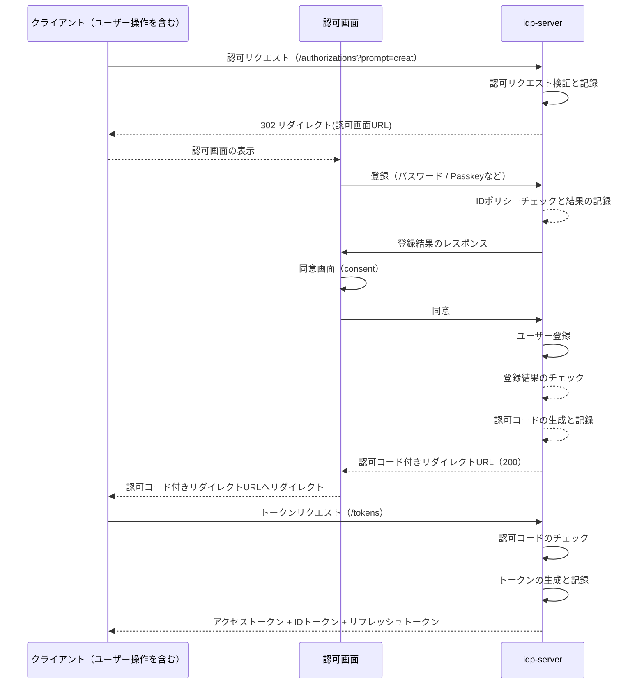
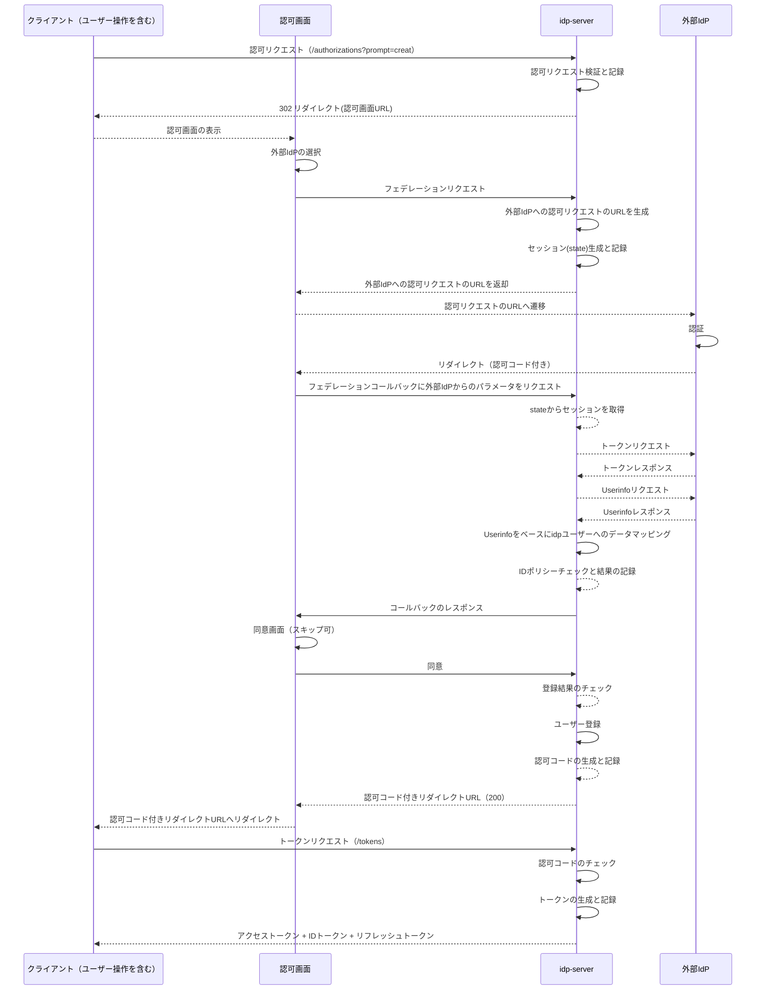

# ID（ユーザー）管理

## 概要

`idp-server` はテナント単位で **ID（ユーザー）** を管理します。

ID（ユーザー）を複数テナントで所持することはできません。別テナントで作成したID（ユーザー）を利用したい場合は、フェデレーションを実施します。

---

## 登録

`idp-server` はOIDCの認可コードフローをベースに、2つのユーザー登録機能を提供します。

1. `idp-server` へのユーザー登録
2. `外部IdP`とのフェデレーションによるユーザー登録

### 登録シーケンス

#### `idp-server` へのユーザー登録



#### `外部IdP`とのフェデレーションによるユーザー登録



## データ構造

### ユーザーID（`sub`）

- 各ユーザーには一意（UUID）な `ユーザーID`（`sub`）が割り当てられます。
- テナントごとにID空間を分離する（tenant_id + sub）

### 外部ID（`provider_id`）とのマッピング

- 外部IdP（Google, AzureADなど）との連携時には `provider_id` に基づく一意性を保持
- 内部IDと外部IDをペアで管理し、**Federated Account Mapping** を実現

---

### ユーザー属性

| 項目                               | 型       | 説明                                          | 取得用スコープ                              |
|----------------------------------|---------|---------------------------------------------|---------------------------------------|
| `sub`                            | string  | Subject - Issuer における End-User の識別子         | `openid` (必須)                         |
| `provider_id`                    | string  | 外部IdPと連携した場合のID識別子                          | `claims:provider_id`                  |
| `external_user_id`               | string  | 外部IdPのユーザーID(sub)                           | `claims:ex_sub`                       |
| `external_user_original_payload` | object  | 外部IdPのユーザークレーム   （JSONオブジェクト）               | `claims:external_user_original_payload` |
| `name`                           | string  | End-User の表示用フルネーム。肩書きや称号 (suffix) を含むこともある | `profile`                             |
| `given_name`                     | string  | 名（Given Name）                               | `profile`                             |
| `family_name`                    | string  | 姓（Family Name）                              | `profile`                             |
| `middle_name`                    | string  | ミドルネーム                                      | `profile`                             |
| `nickname`                       | string  | ニックネーム                                      | `profile`                             |
| `preferred_username`             | string  | End-User の選好するユーザー名（例：janedoe）              | `profile`                             |
| `profile`                        | string  | プロフィールページのURL                               | `profile`                             |
| `picture`                        | string  | プロフィール画像のURL                                | `profile`                             |
| `website`                        | string  | End-User のWebサイトURL                         | `profile`                             |
| `email`                          | string  | End-User の選好するEmailアドレス                     | `email`                               |
| `email_verified`                 | boolean | Emailアドレスが検証済みかどうか                          | `email`                               |
| `gender`                         | string  | 性別（例：male, female）                          | `profile`                             |
| `birthdate`                      | string  | 生年月日（例：1990-01-01）                          | `profile`                             |
| `zoneinfo`                       | string  | タイムゾーン情報                                    | `profile`                             |
| `locale`                         | string  | ロケール（例：ja-JP）                               | `profile`                             |
| `phone_number`                   | string  | 電話番号（E.164形式が推奨）                            | `phone`                               |
| `phone_number_verified`          | boolean | 電話番号が検証済みかどうか                               | `phone`                               |
| `address`                        | object  | 郵送先住所（JSONオブジェクト）                           | `address`                             |
| `status`                         | string  | アカウントの状態（ACTIVE, LOCKEDなど）                  | `claims:status`                       |
| `custom_properties`              | object  | カスタムのユーザークレーム（JSONオブジェクト）                   | `claims:custom_properties`            |
| `credentials`                    | object  | 資格情報   （JSON配列）                             | `claims:credentials`                  |
| `hashed_password`                | object  | ハッシュ化済みのパスワード                               | - (セキュリティ上取得不可)                     |
| `authentication_devices`         | object  | FIDO認証などが実施可能な認証デバイス（JSON配列）                | `claims:authentication_devices`       |
| `verified_claims`                | object  | 身元確認済みのクレーム                                 | `verified_claims:*`                   |
| `roles`                          | array   | ユーザーの役割一覧（JSON配列） ← 追加                        | `claims:roles`                        |
| `permissions`                    | array   | ユーザーの権限一覧（JSON配列） ← 追加                        | `claims:permissions`                  |
| `current_tenant_id`              | string  | 現在選択中のテナントID ← 追加                             | `claims:current_tenant_id`            |
| `assigned_tenants`               | array   | アクセス可能なテナントID一覧（JSON配列） ← 追加                   | `claims:assigned_tenants`             |
| `current_organization_id`        | string  | 現在選択中の組織ID ← 追加                               | `claims:current_organization_id`      |
| `assigned_organizations`         | array   | 所属組織ID一覧（JSON配列） ← 追加                          | `claims:assigned_organizations`       |
| `created_at`                     | string  | アカウント作成日時（ISO 8601形式） ← 追加                    | `profile`                             |
| `updated_at`                     | number  | 最終更新日時（UNIXタイムスタンプ）                         | `profile`                             |

#### スコープによる属性取得について

**OIDC標準スコープ**
- `openid`: 必須。`sub`クレームを含む
- `profile`: 基本プロフィール情報（`name`, `given_name`, `family_name`等）
- `email`: メールアドレス関連（`email`, `email_verified`）
- `phone`: 電話番号関連（`phone_number`, `phone_number_verified`）
- `address`: 住所情報（`address`）

**idp-server独自スコープ**
- `claims:<属性名>`: 特定の属性を個別に取得（例：`claims:roles`, `claims:permissions`）
- `verified_claims:*`: 身元確認済みクレーム取得

**使用例**
```
scope=openid profile email claims:roles claims:assigned_tenants
```
この場合、標準プロフィール＋メール＋ロール情報＋所属テナント一覧が取得可能になります。

**注意事項**
- `claims:`スコープは`enabled_custom_claims_scope_mapping=true`の設定が必要
- セキュリティ上、`hashed_password`は取得できません
- 管理者権限が必要な属性もあります

---

### ステータス

| ステータス                            | 説明                                           |
|----------------------------------|----------------------------------------------|
| `INITIALIZED`                   | アカウントが未作成の状態（初回アクセスや一時的ID）                   |
| `REGISTERED`                     | 登録済だが、メールアドレスなど連絡先が未確認の状態                    |
| `IDENTITY_VERIFICATION_REQUIRED` | サービス利用にあたり本人確認が必要な状態                         |
| `IDENTITY_VERIFIED`              | eKYCなどの本人確認が完了した状態                           |
| `LOCKED`                         | 連続ログイン失敗などにより一時的にロックされた状態（MFA再認証や管理者解除が必要）   |
| `DISABLED`                       | ユーザー自身が無効にした状態                               |
| `DELETED_PENDING`                | 削除予定状態（一定期間後に完全削除が実行される）                     |

#### ステータス遷移例

```plaintext
INITIALIZED
   ↓ 登録
REGISTERED
   ↓ 身元確認完了
IDENTITY_VERIFIED
```

##   

## 削除

ユーザー削除は物理的にデータを削除します。

以下のデータを削除：

* 発行済みトークン／認可情報（grant, token）
* 認証情報（FIDO, Password 等）
