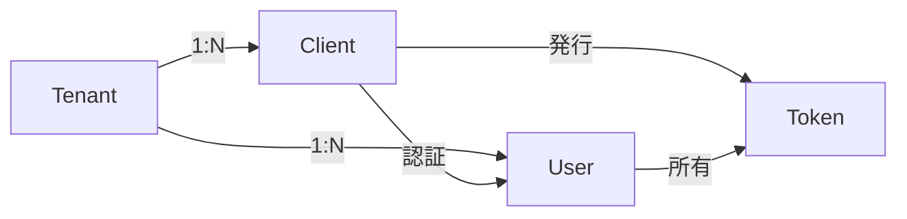

# クライアント（Client）

**Client（クライアント）**は、OAuth 2.0/OIDCプロトコルを使用してリソースにアクセスする**アプリケーション**です。

idp-serverにおけるクライアントは、**テナントに所属し、そのテナントのユーザーに代わって認証・認可を実行する主体**です。

## idp-serverにおけるクライアントの特徴

- **テナント完全分離**: クライアントは必ず1つのテナントに所属し、テナント間での共有なし
- **RFC標準のクライアント設定をサポート**: OAuth 2.0/OpenID Connect仕様に完全準拠
- **拡張機能**: トークン有効期限、Federation制限、CIBA設定等のカスタマイズ

---

## クライアントでできること

クライアントを登録することで、以下のことが可能になります：

- **ユーザー認証の実行**
  ユーザーに代わってOAuth/OIDC認証を実行し、認可を取得

- **アクセストークンの取得**
  認可コードをアクセストークンに交換し、保護されたAPIにアクセス

- **リソースアクセスの委任**
  スコープに応じた権限でユーザーのリソース（プロフィール、メール等）にアクセス

- **M2M通信（Machine-to-Machine）**
  Client Credentials Flowでユーザー認証なしのサービス間通信

- **長期セッション管理**
  Refresh Tokenで再認証なしのトークン更新、UX向上

---

## クライアントの基本概念

OAuth 2.0仕様では、クライアントを**Confidential Client**と**Public Client**の2種類に分類します。

### 1. Confidential Client（秘密クライアント）

**client_secretを安全に保管できる**クライアント。

**特徴**:
- サーバーサイドでclient_secretを保管
- client_secretを使った強固なクライアント認証
- 高いセキュリティレベル

**代表例**:
- Webアプリケーション（サーバーサイドレンダリング）
- バックエンドサービス（M2M通信）

### 2. Public Client（公開クライアント）

**client_secretを安全に保管できない**クライアント。

**特徴**:
- クライアントコードがユーザーに露出
- client_secretを持たない
- PKCE（Proof Key for Code Exchange）必須

**代表例**:
- SPA（Single Page Application）
- モバイルアプリ（iOS/Android）
- ネイティブデスクトップアプリ

### Confidential vs Public 比較

| 項目 | Confidential Client | Public Client |
|-----|---------------------|---------------|
| **client_secret** | ✅ 保持 | ❌ 保持不可 |
| **実行環境** | サーバーサイド | ブラウザ/モバイルアプリ |
| **PKCE** | 任意（推奨） | **必須** |
| **セキュリティレベル** | 高 | 中（PKCE使用時） |
| **認証方法** | `client_secret_basic` `client_secret_post` `private_key_jwt` `tls_client_auth` | `none` |

**RFC準拠**: [RFC 6749 Section 2.1 - Client Types](https://datatracker.ietf.org/doc/html/rfc6749#section-2.1)

---

## 認証方法（Token Endpoint Authentication Methods）

クライアントがトークンエンドポイントで自身を証明する方法。

| 認証方法 | 説明 | セキュリティ | 用途 |
|---------|------|------------|------|
| `client_secret_basic` | HTTPベーシック認証でclient_secret送信 | 中 | Webアプリ（一般的） |
| `client_secret_post` | リクエストボディでclient_secret送信 | 中 | Webアプリ（Basic認証非対応） |
| `client_secret_jwt` | client_secretで署名したJWTを送信 | 高 | セキュリティ要件が高い環境 |
| `private_key_jwt` | 秘密鍵で署名したJWTを送信 | **最高** | 金融グレード（FAPI） |
| `tls_client_auth` | クライアント証明書（mTLS） | **最高** | 金融グレード（FAPI） |
| `none` | 認証なし（PKCEで保護） | 低（PKCE必須） | SPA、モバイルアプリ |

**RFC準拠**:
- [RFC 6749 Section 2.3 - Client Authentication](https://datatracker.ietf.org/doc/html/rfc6749#section-2.3)
- [RFC 7523 - JWT Bearer Client Authentication](https://datatracker.ietf.org/doc/html/rfc7523)
- [RFC 8705 - mTLS Client Authentication](https://datatracker.ietf.org/doc/html/rfc8705)

---

## 主要なユースケース

idp-serverは、RFC標準パラメータの組み合わせで代表的なユースケースに対応します。

### 1. Webアプリケーション（サーバーサイド）

**概念**: サーバー側でclient_secretを安全に保管できるアプリケーション（Confidential Client）

**主なパラメータ**:
- `token_endpoint_auth_method`: `client_secret_basic`
- `grant_types`: `authorization_code`, `refresh_token`
- `application_type`: `web`

**詳細設定**: [Developer Guide: Webアプリケーション設定](../content_06_developer-guide/05-configuration/client.md#1-webアプリケーション標準)

---

### 2. SPA（Single Page Application）

**概念**: ブラウザのみで動作し、client_secretを持たないアプリケーション（Public Client）

**主なパラメータ**:
- `token_endpoint_auth_method`: `none`（PKCE必須）
- `grant_types`: `authorization_code`, `refresh_token`
- `application_type`: `web`

**詳細設定**: [Developer Guide: SPA設定](../content_06_developer-guide/05-configuration/client.md#2-spasingle-page-app)

---

### 3. モバイルアプリ（iOS/Android）

**概念**: ネイティブアプリで長期セッションを維持するアプリケーション（Public Client）

**主なパラメータ**:
- `token_endpoint_auth_method`: `none`（PKCE必須）
- `grant_types`: `authorization_code`, `refresh_token`
- `application_type`: `native`
- `redirect_uris`: カスタムURLスキーム（例: `com.example.myapp://callback`）

**詳細設定**: [Developer Guide: モバイルアプリ設定](../content_06_developer-guide/05-configuration/client.md#3-モバイルアプリiosandroid)

---

### 4. M2M（Machine-to-Machine）

**概念**: ユーザー認証なしのサービス間通信（Confidential Client）

**主なパラメータ**:
- `token_endpoint_auth_method`: `client_secret_basic` / `private_key_jwt`
- `grant_types`: `client_credentials`
- `redirect_uris`: 空配列（不要）
- `scope`: カスタムスコープ（例: `api:read`, `api:write`）

**詳細設定**: [Developer Guide: M2M設定](../content_06_developer-guide/05-configuration/client.md#4-m2mmachine-to-machine)

---

### 5. 金融グレード（FAPI準拠）

**概念**: 最高レベルのセキュリティを要求するアプリケーション（Confidential Client）

**主なパラメータ**:
- `token_endpoint_auth_method`: `private_key_jwt` / `tls_client_auth`
- `grant_types`: `authorization_code`, `refresh_token`
- `require_pushed_authorization_requests`: `true`（PAR必須）
- `jwks_uri`: 公開鍵配置URL

**詳細設定**: [Developer Guide: FAPI設定](../content_06_developer-guide/05-configuration/client.md#5-金融グレードfapi)

**RFC準拠**: [FAPI 1.0 Advanced Profile](https://openid.net/specs/openid-financial-api-part-2-1_0.html)

---

## クライアントと他機能の関係

### Tenant、User、Tokenとの関係

**マルチテナント分離**:
- クライアントは必ず1つのテナントに所属
- テナント間でのクライアント情報共有なし

**委任（Delegation）モデル**:
- クライアントはユーザーの**代理人**として動作
- ユーザーが明示的に同意した範囲でのみリソースアクセス

**トークン発行**:
- Authorization Code Flow: ユーザーに代わってトークン発行
- Client Credentials Flow: クライアント自身の権限でトークン発行（user_id=null）

**詳細**: [Concept 01: マルチテナント](concept-01-multi-tenant.md)

---

### Scopeとの関係

**役割分担**:
- **Client**: 利用可能なスコープを定義（`scope`フィールド）
- **Tenant**: テナント全体で利用可能なスコープを定義（`scopes_supported`）

**検証ルール**: 認証リクエストのスコープは、ClientとTenantの両方の設定範囲内である必要がある

---

## idp-serverにおけるClient管理の特徴

idp-serverは、OAuth 2.0/OIDC仕様に準拠しつつ、エンタープライズ環境での運用を考慮した独自機能を提供します。

### マルチテナント分離

- クライアントは必ず1つのテナントに所属
- Repository層でのTenantIdentifier検証（第一引数パターン）
- Cross-tenant accessの試行は監査ログに記録

**詳細**: [Concept 01: マルチテナント](concept-01-multi-tenant.md)

---

### UUID必須設計

`client_id`は**UUID形式必須**（任意文字列不可）

**理由**: グローバル一意性、予測不可能性、データベース最適化

---

### 拡張機能（extension）

RFC標準に加えて、独自の拡張機能を提供：

| 機能 | 説明 |
|-----|------|
| **トークン有効期限** | クライアント単位でAccess Token/Refresh Tokenの有効期限を設定 |
| **Federation制限** | クライアント固有の利用可能外部IdPを制限 |
| **CIBA設定** | デフォルトの認証インタラクションタイプを指定 |
| **Client ID Alias** | 人間可読なエイリアスを設定（ログ・監査用） |

**詳細設定**: [Developer Guide: Client設定](../content_06_developer-guide/05-configuration/client.md)

---

## まとめ

クライアントは、**OAuth/OIDC認証の起点**となる重要な概念です。

**重要なポイント**:
- Confidential vs Public Clientの適切な選択
- セキュリティとユーザー体験のバランス
- ユースケース別の最適な設定
- Tenant、Scope、Token、Userとの関係理解

**idp-server固有の特徴**:
- マルチテナント完全分離
- UUID必須設計
- Management API / DCRの2つの登録方法
- Dry Run機能
- 柔軟な拡張機能（extension）

---

## 関連ドキュメント

### How-to ガイド
- [How-to 03: クライアント登録](../content_05_how-to/how-to-04-client-registration.md) - 実践的な登録手順

### Developer Guide
- [Developer Guide: Client設定](../content_06_developer-guide/05-configuration/client.md) - シナリオ別設定例、RFC標準パラメータ、extension詳細

### Concepts
- [Concept 01: マルチテナント](concept-01-multi-tenant.md) - Tenant-Client関係
- [Concept 18: IDトークン](concept-12-id-token.md) - IDトークン仕様

### 技術詳細
- [AI開発者向け: Core - OAuth](../content_10_ai_developer/ai-11-core.md#oauth---oauth-20コア) - OAuth 2.0実装詳細
- [AI開発者向け: Control Plane - Client Registration](../content_10_ai_developer/ai-13-control-plane.md#クライアント管理api) - Client Registration API

---

## 参考仕様

### OAuth 2.0 / OpenID Connect
- [RFC 6749: The OAuth 2.0 Authorization Framework](https://datatracker.ietf.org/doc/html/rfc6749) - OAuth 2.0基本仕様
- [RFC 7636: Proof Key for Code Exchange (PKCE)](https://datatracker.ietf.org/doc/html/rfc7636) - PKCE仕様
- [OpenID Connect Core 1.0](https://openid.net/specs/openid-connect-core-1_0.html) - OIDC基本仕様
- [RFC 7591: OAuth 2.0 Dynamic Client Registration](https://datatracker.ietf.org/doc/html/rfc7591) - DCR仕様

### クライアント認証
- [RFC 7523: JSON Web Token (JWT) Profile for OAuth 2.0 Client Authentication](https://datatracker.ietf.org/doc/html/rfc7523)
- [RFC 8705: OAuth 2.0 Mutual-TLS Client Authentication](https://datatracker.ietf.org/doc/html/rfc8705)

### 金融グレード
- [FAPI 1.0 Advanced Profile](https://openid.net/specs/openid-financial-api-part-2-1_0.html)
- [RFC 9126: OAuth 2.0 Pushed Authorization Requests (PAR)](https://datatracker.ietf.org/doc/html/rfc9126)

---
