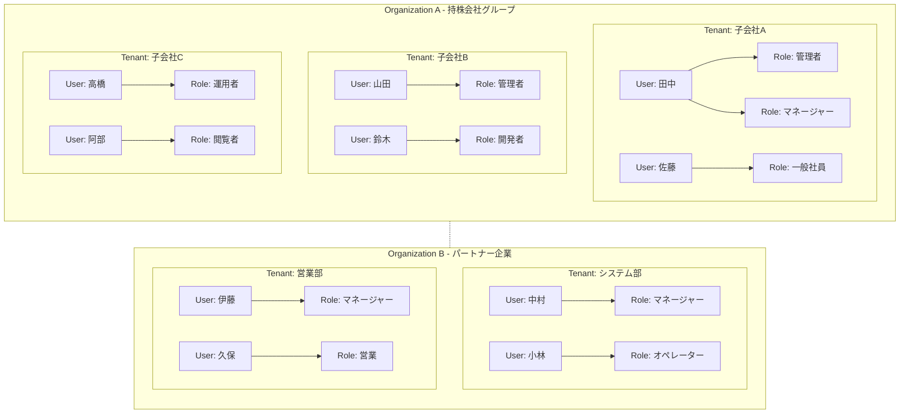

# エンタープライズID

---

## 前提知識

このドキュメントを理解するには、以下の基礎知識が役立ちます：

- [OAuth 2.0の基本](basic/basic-06-oauth2-authorization.md) - OAuth 2.0の認可の仕組み
- [OpenID Connectの基本](basic/basic-11-oauth-oidc-basics.md) - OIDCによる認証
- [マルチテナント](multi-tenant.md) - テナント・組織の階層構造
- [認可コードフロー](../content_04_protocols/authorization-code-flow.md) - エンタープライズSSOの基盤

---

## 概要

idp-serverは、**エンタープライズグレードの包括的アイデンティティプラットフォーム**として設計されています。  
単なるOpenID Connect Providerではなく、企業・組織が求める高度なID管理機能を統合的に提供します。

---

## エンタープライズ機能

idp-serverは、エンタープライズ環境に求められる **複雑な組織構造・厳格なセキュリティ要件・大規模運用** に対応するために設計されています。  
単一テナントのIdPに留まらず、以下の特徴を備えた **統合ID管理基盤** を提供します。

- **マルチテナント・マルチオーガナイゼーション**  
  グループ会社や部門ごとに独立した運営を可能にしつつ、全体を一元的に統制

- **柔軟な権限モデル**  
  RBAC（ロールベース）による権限管理に対応

- **完全なデータ分離とセキュリティ**  
  Row Level Securityによる物理的分離とゼロトラスト前提のアクセス制御

- **規制産業レベルの標準準拠**  
  FAPI、OIDC4IDA、SSFなど国際標準に準拠し、金融・行政など高セキュリティ領域でも利用可能

- **拡張可能なアーキテクチャ**  
  認証方式・外部サービス統合・ワークフローをプラグインやテンプレートで追加可能

- **大規模運用のための可観測性と高可用性**  
  監査証跡、メトリクス監視、マルチノード構成によるスケールとレジリエンス

### マルチテナント運営パターン

**1. グループ会社**
```
グループ会社 (Organization)
├── 子会社A (Tenant_A)
├── 子会社B (Tenant_B)
└── 子会社C (Tenant_C)
```

**2. 部門**
```
企業
├── システム部 (Tenant_A)
└── 営業部 (Tenant_B)
```

企業の複雑な組織構造に対応する柔軟なアーキテクチャを採用しています：



#### アーキテクチャの特徴

- **Organization (組織)**: 企業・グループ単位での独立した管理境界
- **Tenant (テナント)**: 各組織内での事業部・部門単位の運営
- **Role (ロール)**: テナント内での職務・権限レベルの定義
- **User (ユーザー)**: 個人アカウント、複数ロールの割り当て可能
- **疎結合設計**: 組織間は独立、必要に応じて連携
- **完全データ分離**: Row Level Security による物理的分離

#### 権限管理階層
```
Organization → Tenant → Role → Permission → User
```

- **組織レベル**: 横断的管理・レポーティング
- **テナントレベル**: 独立したビジネス運営
- **ロールレベル**: 職務別権限セット
- **ユーザーレベル**: 個人の責任範囲

---

## ✅ 想定するユースケース

### 1. 社内システムの統合認証基盤
- 既存Idサービス連携
- 社員のアカウントを一元管理
- 社内アプリ（グループウェア、SFA、社内ポータル）との統合

### 2. グループ会社・子会社管理
- 持株会社がグループ全体を統制
- 子会社ごとに独立運営しつつ、必要に応じて横断SSO
- M&Aによるテナント追加・統合に柔軟対応

### 3. B2Bパートナー連携
- 取引先や外部パートナーへの限定的アクセス権付与
- フェデレーションで相互接続
- 契約終了時のアカウント停止


---

## 🔧 提供する主な機能

### アクセス管理
- **全社統合SSO**: 社内システムからSaaSまで、IDを一元化しパスワード疲れを解消
- **強固な認証基盤**: パスワードレス（FIDO2/Passkey）や多要素認証で、不正アクセスを根本から防止

### ユーザー & 組織管理
- **グループ会社・部門横断の統制**: 子会社や事業部をまたいだユーザー管理を効率化
- **柔軟な権限設計**: 職務ベース（RBAC）による権限管理で、複雑な現場要件に対応
- **委任による分散管理**: 中央IT部門の負担を減らし、現場管理者に適切な権限を委譲

### セキュリティ & コンプライアンス
- **確実なデータ隔離**: 企業グループや部門ごとの情報を物理的に分離し、誤用や漏洩リスクを回避
- **完全な監査証跡**: 「誰がいつ、どのシステムに、何をしたか」をトレースし、監査対応を簡素化

---

## 参考資料

### 標準仕様
- [RFC 6749: The OAuth 2.0 Authorization Framework](https://datatracker.ietf.org/doc/html/rfc6749) - OAuth 2.0基本仕様
- [OpenID Connect Core 1.0](https://openid.net/specs/openid-connect-core-1_0.html) - OIDC基本仕様
- [Financial-grade API (FAPI)](https://openid.net/specs/openid-financial-api-part-1-1_0.html) - 金融レベルセキュリティ
- [OpenID Connect for Identity Assurance 1.0](https://openid.net/specs/openid-connect-4-identity-assurance-1_0.html) - 身元確認連携

### エンタープライズ認証技術
- [SAML 2.0](https://docs.oasis-open.org/security/saml/v2.0/saml-core-2.0-os.pdf) - エンタープライズフェデレーション
- [WebAuthn](https://www.w3.org/TR/webauthn-2/) - パスワードレス認証
- [FIDO2](https://fidoalliance.org/fido2/) - 強固な認証基盤

### 関連ドキュメント
- [マルチテナント](multi-tenant.md) - 組織・テナント階層の詳細
- [身元確認済みID](id-verified.md) - エンタープライズ身元確認統合
- [認可コードフロー](../content_04_protocols/authorization-code-flow.md) - エンタープライズSSOの基盤技術

---

