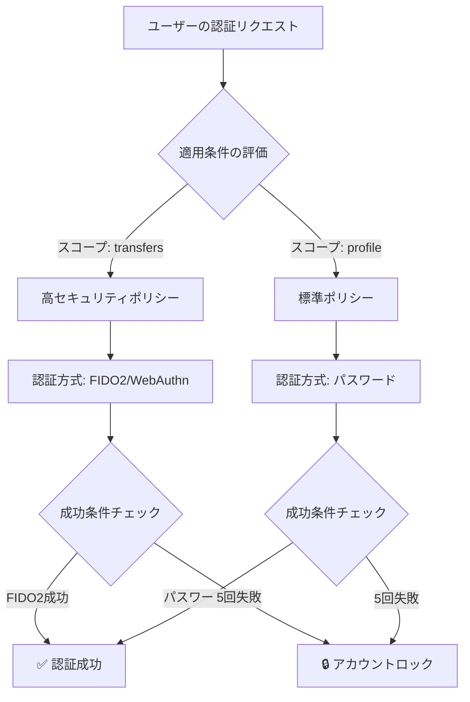

# 認証ポリシー

**認証ポリシー（Authentication Policy）** は、どのユーザーに、どのような認証を要求するかを定義する仕組みです。

## 認証ポリシーでできること

認証ポリシーを使うことで、以下のような認証制御が可能になります：

- **操作の重要度に応じた認証強度の切り替え**
  通常の閲覧はパスワードのみ、送金操作には生体認証を要求

- **標準規格やコンプライアンス要件への準拠**
  多要素認証の必須化、特定のACRレベルの保証

## 認証ポリシーの基本概念

認証ポリシーは、以下の3つの要素で構成されます。

### 1. いつ適用するか（適用条件）

**どのような状況で、このポリシーを適用するか**を定義します。

**主な適用条件**:
- **要求されるスコープ**: 機密情報（`verified_claims`）へのアクセス時
- **ACR値**: 特定の認証レベル（`urn:mace:incommon:iap:gold`）が要求された時
- **クライアントアプリケーション**: モバイルアプリ vs Webアプリで異なる認証

**例**:
「`transfers`（送金）スコープが要求された場合、強固な認証が必要」

### 2. 何を要求するか（認証方式）

**どの認証方式を利用可能にするか**を定義します。

**認証方式の種類**:
- **パスワード認証**: 伝統的な認証
- **Email/SMS認証**: ワンタイムコードによる認証
- **FIDO2/WebAuthn**: 生体認証・セキュリティキー
- **FIDO-UAF**: モバイル生体認証

**認証強度の考え方**:

| レベル | 認証方式 | 用途 |
|:---|:---|:---|
| **低** | パスワードのみ | 一般的な閲覧 |
| **中** | パスワード + Email/SMS | ユーザー情報の変更 |
| **高** | FIDO2/生体認証 | 送金・機密操作 |

### 3. いつ成功・失敗とするか（評価条件）

**どの状態で認証成功/失敗と判定するか**を定義します。

#### 成功条件

「どのような状態になれば認証成功とみなすか」

**例**:
- パスワード認証が1回成功、**または** FIDO2認証が1回成功
- パスワード認証 **かつ** SMS認証の両方が成功（多要素認証）

#### 失敗条件

「どのような状態で警告を発するか」

**例**:
- パスワード認証を3回連続失敗
- 10分以内に認証完了しなかった

#### ロック条件

「どのような状態でアカウントをロックするか」

**例**:
- パスワード認証を5回連続失敗
- 複数のデバイスから同時に認証試行

## 認証ポリシーの動作フロー



## 主要なユースケース

### 1. 段階的認証（Step-up Authentication）

**概念**: 操作の機密度に応じて、追加の認証を要求する

**シナリオ**:
1. ユーザーがパスワードでログイン（プロフィール閲覧可能）
2. 送金操作を試みる
3. システムが追加でFIDO2認証を要求
4. FIDO2認証成功後、送金可能になる

**メリット**:
- 通常操作はスムーズ（低摩擦）
- 重要操作は高セキュリティ

### 2. ACRベースの認証制御

**概念**: OpenID ConnectのACR（Authentication Context Class Reference）に応じて認証方式を変更

**シナリオ**:
- クライアントが `acr_values=urn:mace:incommon:iap:gold` を要求
- 認証ポリシーが「Gold = FIDO2必須」と定義
- ユーザーにFIDO2認証を要求

**用途**: 標準準拠のセキュリティレベル管理

### 3. スコープ別の認証強度制御

**概念**: 要求されるスコープに応じて、必要な認証レベルを変更

**例**:

| 要求スコープ | 必要な認証 |
|:---|:---|
| `openid profile` | パスワード |
| `verified_claims:given_name` | パスワード + Email |
| `verified_claims:*` | FIDO2必須 |
| `transfers` | FIDO2必須 |

### 4. クライアント別の認証ポリシー

**概念**: アプリケーションの種類に応じて認証方式を最適化

**例**:
- **モバイルアプリ**: 生体認証優先（FIDO-UAF、Face ID、Touch ID）
- **Webアプリ**: パスワード + Email/SMS

## 認証ポリシーと他機能の関係

### MFAとの関係


**役割分担**:
- **認証ポリシー**: どのMFA手段を要求するか決定
- **MFA機能**: ユーザーのMFA手段を管理・実行

### ACR（認証コンテキスト）との関係

**ACR**: OpenID Connectで定義された「認証の強度を表す標準URI」

**認証ポリシーの役割**:
- ACR値を受け取り、適切な認証方式を選択
- 認証成功後、達成したACR値をIDトークンに含める

**例**:
```
リクエスト: acr_values=urn:mace:incommon:iap:gold
 ↓
ポリシー適用: FIDO2認証を要求
 ↓
認証成功: IDトークンに acr=urn:mace:incommon:iap:gold
```

### スコープとの関係

**スコープ**: アクセスできる情報の範囲

**認証ポリシーの役割**:
- 要求されたスコープの機密度を判定
- 機密スコープには強い認証を要求

**例**:
- `profile` → パスワード認証
- `verified_claims:*` → FIDO2認証必須

## まとめ

認証ポリシーは、**状況に応じた適切な認証制御**を実現する仕組みです。

**重要なポイント**:
- セキュリティとユーザー体験のバランス
- リスクベースの動的な認証制御
- コンプライアンス対応
- MFA、ACR、スコープとの連携

## 関連ドキュメント

- [多要素認証（MFA）](concept-08-mfa.md) - MFA手段の種類と登録（予定）
- [認証ポリシー設定ガイド](../content_06_developer-guide/04-implementation-guides/impl-05-authentication-policy.md) - 具体的な設定方法
- [マルチテナント](concept-01-multi-tenant.md) - テナントごとの認証ポリシー設定

## 参考仕様

- [NIST SP 800-63B - Digital Identity Guidelines: Authentication](https://pages.nist.gov/800-63-3/sp800-63b.html)
- [OpenID Connect Core 1.0 - acr Claim](https://openid.net/specs/openid-connect-core-1_0.html#acrSemantics)
- [PSD2 Regulatory Technical Standards](https://www.eba.europa.eu/regulation-and-policy/payment-services-and-electronic-money/regulatory-technical-standards-on-strong-customer-authentication-and-secure-communication-under-psd2)
