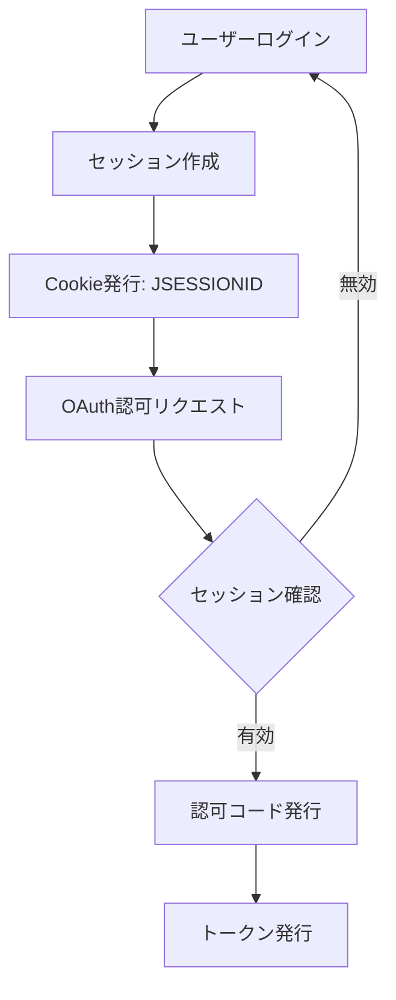
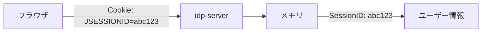
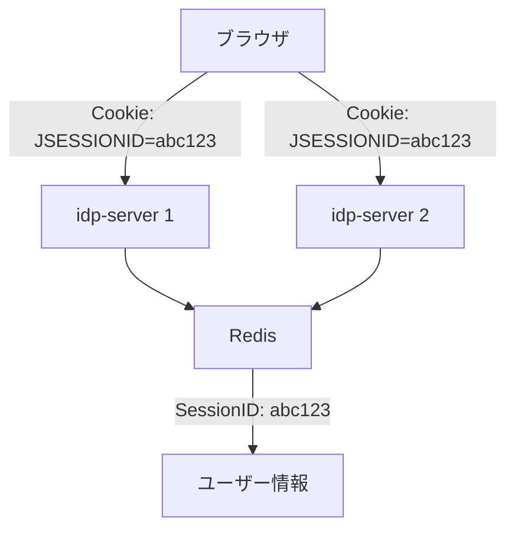
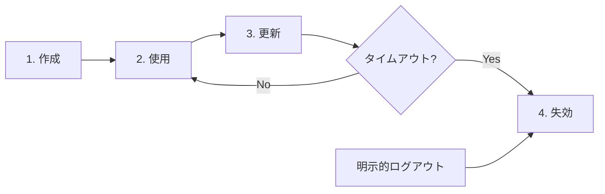

# セッション管理

セッション管理は、ユーザーのログイン状態を維持し、複数のリクエスト間でユーザーを識別するための仕組みです。

## セッションとは

**セッション（Session）** とは、ユーザーの認証状態を一定期間保持する仕組みです。

### セッションの役割

1. **認証状態の保持**: ログイン後、毎回パスワード入力せずにサービス利用可能
2. **ユーザー識別**: 複数のリクエスト間でユーザーを一意に識別
3. **一時データの保存**: ユーザーごとの設定や状態を保持

### セッションとトークンの関係



**区別**:
- **セッション**: ブラウザとIdP間の状態管理（Cookie）
- **トークン**: クライアントとリソースサーバー間の認可情報（Bearer Token）

## セッション管理方式

idp-serverは2つのセッション管理方式をサポートしています。

### 1. ローカルセッション管理

**概要**: アプリケーションサーバーのメモリ上でセッション情報を保持

#### 特徴

| 項目 | 内容 |
|:---|:---|
| **保存先** | サーバーメモリ（JVM Heap） |
| **スケール** | 単一サーバーのみ |
| **永続性** | サーバー再起動で消失 |
| **パフォーマンス** | 高速（メモリアクセス） |
| **適用範囲** | 開発環境、小規模環境 |

#### 動作イメージ



#### メリット・デメリット

**✅ メリット**:
- 設定不要、シンプル
- 高速アクセス
- 外部依存なし

**❌ デメリット**:
- サーバー再起動でセッション消失（ユーザーは再ログイン必要）
- 複数サーバー間でセッション共有不可
- メモリ使用量増加

### 2. 分散セッション管理（Redis）

**概要**: Redisにセッション情報を保存し、複数サーバー間で共有

#### 特徴

| 項目 | 内容 |
|:---|:---|
| **保存先** | Redis |
| **スケール** | 複数サーバー対応 |
| **永続性** | サーバー再起動でも保持 |
| **パフォーマンス** | 高速（Redisキャッシュ） |
| **適用範囲** | 本番環境、冗長構成 |

#### 動作イメージ



#### メリット・デメリット

**✅ メリット**:
- サーバー間でセッション共有可能
- サーバー再起動でもセッション維持
- フェイルオーバー対応（サーバー障害時も継続）
- スケールアウト可能（サーバー追加容易）

**❌ デメリット**:
- Redis環境が必要
- ネットワークレイテンシ（わずか）
- 設定がやや複雑

## Cookie設定の動的解決

idp-serverは、リクエストコンテキストに応じてCookie属性を動的に決定します。

### Cookie属性

| 属性 | 説明 |
|:---|:---|
| **domain** | Cookieの有効ドメイン |
| **path** | Cookieの有効パス |
| **secure** | HTTPS通信時のみCookieを送信 |
| **HttpOnly** | JavaScriptからのアクセス防止 |
| **SameSite** | クロスサイトリクエスト制御（`Lax` / `Strict` / `None`） |
| **Max-Age** | 有効期限（秒） |

### 動的解決が必要な理由

環境やアプリケーションの種類によって、適切なCookie設定が異なります：

- **開発環境 vs 本番環境**: HTTPとHTTPSの違いに応じたsecure属性の設定
- **SPA vs SSR**: クロスドメインか同一ドメインかに応じたSameSite属性の設定
- **マルチテナント**: テナントごとの独自ドメインに応じたdomain属性の設定

## セッションライフサイクル



### 1. セッション作成

**タイミング**: 認証成功時

```java
// OAuthSessionDataSource.register()で自動設定
// テナント設定に基づいてタイムアウトが動的に設定される
HttpSession session = request.getSession(true);
session.setAttribute("user_id", "user123");
session.setAttribute("tenant_id", "tenant-a");
// timeout_seconds はテナント設定から自動適用
session.setMaxInactiveInterval(tenant.sessionConfiguration().timeoutSeconds());
```

### 2. セッション使用

**タイミング**: 各HTTPリクエスト

```java
HttpSession session = request.getSession(false);
String userId = (String) session.getAttribute("user_id");
```

### 3. セッション更新

**タイミング**: アクティビティ検出時

```java
session.setMaxInactiveInterval(3600); // タイムアウトをリセット
```

### 4. セッション失効

**タイミング**:
- タイムアウト（最終アクセスから一定時間経過）
- 明示的ログアウト
- セキュリティイベント（不正検知等）

```java
session.invalidate();
```

## セッションタイムアウト

idp-serverでは、テナント単位でセッションタイムアウトを設定できます。

### テナント別タイムアウト設定

各テナントの要件に応じて、異なるセッションタイムアウトを設定可能です：

| ユースケース | 推奨タイムアウト | 理由 |
|:---|:---|:---|
| **金融機関** | 5-15分 | 高セキュリティ要件（NIST推奨） |
| **一般アプリケーション** | 30分-2時間 | セキュリティと利便性のバランス |
| **低摩擦サービス** | 2-8時間 | ユーザー利便性優先 |
| **長期セッション** | 24時間-7日 | エンタープライズ向け |

### 設定方法

セッションタイムアウトは `SessionConfiguration` の `timeout_seconds` フィールドで設定します：

```json
{
  "session_configuration": {
    "cookie_name": "IDP_SERVER_SESSION",
    "cookie_same_site": "None",
    "use_secure_cookie": true,
    "use_http_only_cookie": true,
    "cookie_path": "/",
    "timeout_seconds": 1800
  }
}
```

**デフォルト値**: 3600秒（1時間）

### 動作仕組み

1. **セッション登録時**: `OAuthSessionDataSource.register()` でテナント設定を読み込み
2. **タイムアウト設定**: `httpSession.setMaxInactiveInterval(tenant.sessionConfiguration().timeoutSeconds())`
3. **動的適用**: テナントごとに異なるタイムアウトが適用される

```java
// 実装例（OAuthSessionDataSource.java）
@Override
public void register(Tenant tenant, OAuthSession oAuthSession) {
  String sessionKey = oAuthSession.sessionKeyValue();
  int timeoutSeconds = tenant.sessionConfiguration().timeoutSeconds();
  httpSession.setMaxInactiveInterval(timeoutSeconds);
  httpSession.setAttribute(sessionKey, oAuthSession);
}
```

### タイムアウトの種類

idp-serverは **アイドルタイムアウト** を採用しています：

- **アイドルタイムアウト**: 最終アクセスから一定時間経過で失効
- **絶対タイムアウト**: ログインから一定時間経過で失効（未サポート）

## セキュリティ機能

idp-serverでは、以下のセッションセキュリティ機能を提供します。

### セッション固定攻撃対策

認証成功時にセッションIDを再生成することで、セッション固定攻撃を防ぎます。

### CSRF対策

SameSite Cookie属性を使用して、クロスサイトリクエストフォージェリ（CSRF）攻撃を防ぎます。

### HttpOnly属性

JavaScriptからのCookieアクセスを防止し、XSS攻撃によるセッション盗難を防ぎます。

## 関連ドキュメント

- [トークン管理](concept-06-token-management.md) - トークンとセッションの使い分け
- [マルチテナント](concept-01-multi-tenant.md) - テナント分離の仕組み
- [Cookie/CORS設定](../content_08_ops/deployment.md) - 本番環境での設定

## 参考資料

- [Spring Session Documentation](https://spring.io/projects/spring-session)
- [OWASP Session Management Cheat Sheet](https://cheatsheetseries.owasp.org/cheatsheets/Session_Management_Cheat_Sheet.html)
- [RFC 6265 - HTTP State Management Mechanism (Cookies)](https://datatracker.ietf.org/doc/html/rfc6265)
