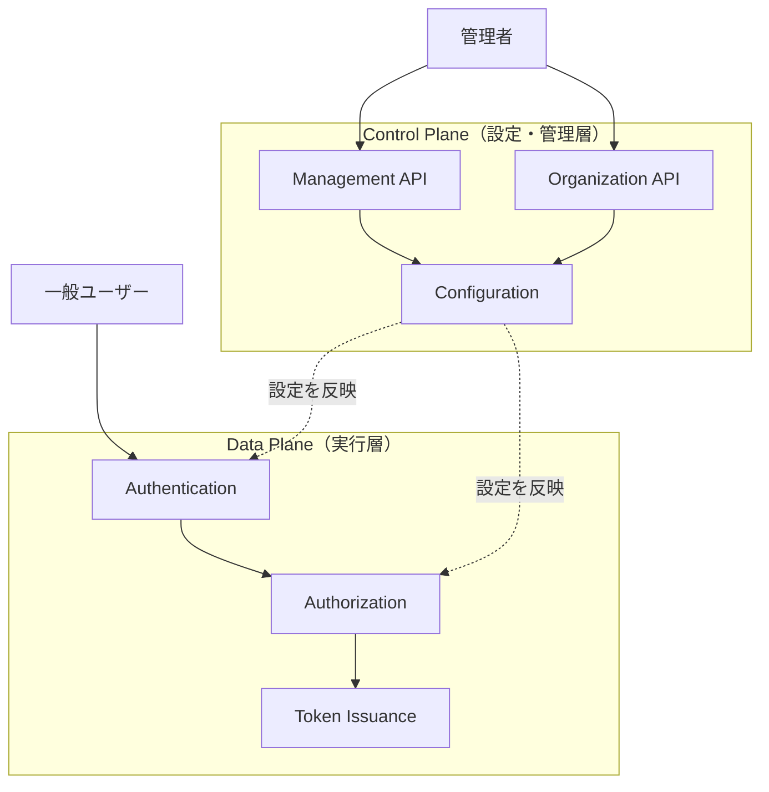
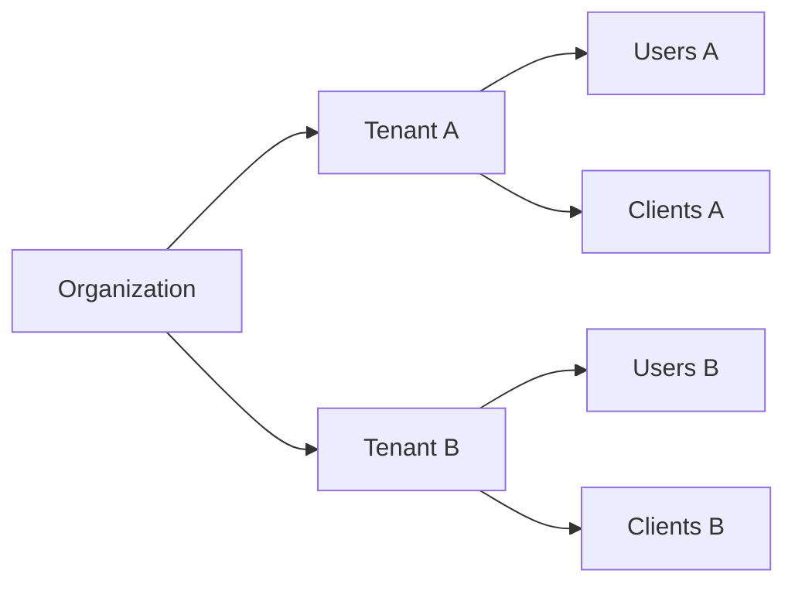
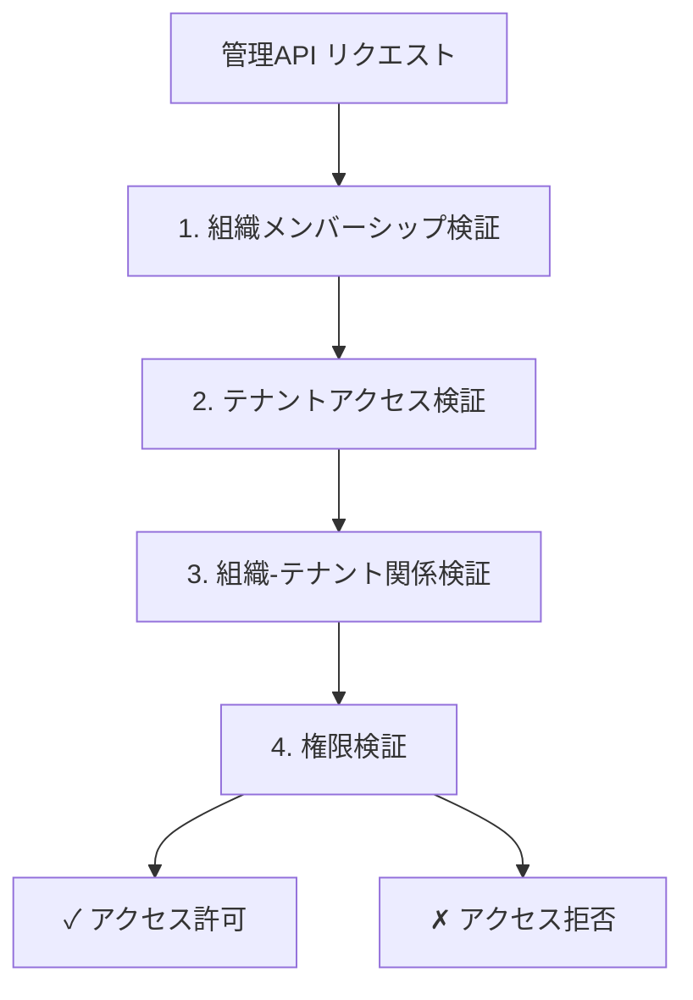

# コントロールプレーン

idp-serverのコントロールプレーンアーキテクチャと管理機能について説明します。

## コントロールプレーンとは

**コントロールプレーン（Control Plane）** とは、idp-serverの設定・管理を行う制御層です。認証・認可フローを実行するデータプレーンとは明確に分離されています。



### 定義

コントロールプレーンは以下の責務を持ちます：

- **設定管理**: テナント、クライアント、認証方式等の設定
- **ユーザー管理**: 管理者・エンドユーザーのライフサイクル管理
- **組織管理**: 組織階層と組織-テナント関係の管理
- **監査**: 管理操作のログ記録と追跡

## データプレーンとの分離

### なぜ分離が必要か

| 観点 | 分離のメリット |
|:---|:---|
| **セキュリティ** | 管理操作と認証処理の攻撃面を分離 |
| **スケーラビリティ** | データプレーンを認証負荷に応じて独立スケール |
| **パフォーマンス** | 管理操作が認証性能に影響しない |
| **責務分離** | 管理者と一般ユーザーの権限を明確に分離 |
| **運用性** | 管理機能のメンテナンスが認証サービスに影響しない |

### 分離の実現方法

idp-serverでは、以下の3つのレイヤーで分離を実現しています：

#### 1. APIレベルの分離

```
データプレーン:
  /oauth2/authorize        # OAuth認可エンドポイント
  /oauth2/token            # トークン発行
  /.well-known/openid-configuration

コントロールプレーン:
  /v1/management/*         # システムレベル管理API
  /v1/management/organizations/* # 組織レベル管理API
```

#### 2. データベースレベルの分離（将来対応）

```
Control Plane DB:
  - 設定データ（テナント、クライアント、認証設定）
  - 管理者情報
  - 監査ログ

Data Plane DB:
  - 認証セッション
  - トークン情報
  - ユーザー認証状態
```

#### 3. 権限レベルの分離

```java
// システムレベル権限
DefaultAdminPermission.TENANT_CREATE
DefaultAdminPermission.CLIENT_UPDATE

// 組織レベル権限
OrganizationAdminPermissions
  - TENANT_READ (組織内テナント参照)
  - USER_UPDATE (組織内ユーザー更新)
```

## 管理対象

コントロールプレーンで管理できる主要な設定対象を説明します。

### 1. テナント管理

**テナント**は、idp-serverにおける最も重要な分離単位です。



**管理操作**:
- テナント作成・更新・削除
- テナント属性設定（トークン有効期限、セッション設定等）
- テナントの有効化・無効化

> **関連**: [マルチテナント](concept-01-multi-tenant.md)を参照

### 2. 組織管理

**組織（Organization）**は、複数のテナントをグループ化する階層構造です。

```
Organization (組織)
  ├── Tenant A (開発環境)
  ├── Tenant B (ステージング環境)
  └── Tenant C (本番環境)
```

**管理操作**:
- 組織作成・更新・削除
- 組織へのテナント割り当て
- 組織管理者の権限設定

### 3. クライアント設定

**OAuth/OIDCクライアント**の登録と管理を行います。

**主要設定項目**:
- `client_id`, `client_secret`
- `grant_types` (認可コードフロー、Client Credentials等)
- `redirect_uris` (リダイレクトURI)
- `scopes` (利用可能スコープ)
- トークン有効期限（クライアント単位）

**管理API**:
```
POST   /v1/management/tenants/{tenant_id}/clients
GET    /v1/management/tenants/{tenant_id}/clients
GET    /v1/management/tenants/{tenant_id}/clients/{client_id}
PUT    /v1/management/tenants/{tenant_id}/clients/{client_id}
DELETE /v1/management/tenants/{tenant_id}/clients/{client_id}
```

### 4. 認可サーバー設定

**テナント全体のOAuth/OIDC動作**を制御します。

**主要設定項目**:
- トークン有効期限（デフォルト値）
- サポートするgrant_type一覧
- スコープ定義
- PKCE必須化設定
- FAPI準拠設定

### 5. フェデレーション設定

**外部IdP連携**の設定を管理します。

**対応プロトコル**:
- OpenID Connect
- SAML 2.0 (予定)
- Facebook Login
- カスタムフェデレーション（拡張実装）

**管理操作**:
- IdP登録（エンドポイント、証明書、スコープ）
- アカウントマッピングルール設定
- 属性マッピング設定

### 6. 認証設定

**認証方式の有効化・無効化**と設定を管理します。

**対応認証方式**:
- パスワード認証
- SMS認証
- Email認証
- WebAuthn/FIDO2
- FIDO-UAF
- レガシーIDサービス認証

**設定例（パスワード認証）**:
```json
{
  "id": "auth-config-001",
  "type": "password",
  "enabled": true,
  "password_policy": {
    "min_length": 12,
    "require_uppercase": true,
    "require_lowercase": true,
    "require_digits": true,
    "require_special_chars": true
  }
}
```

> **関連**: [認証ポリシー](concept-05-authentication-policy.md)を参照

### 7. セキュリティイベントフック

**セキュリティイベント通知**の設定を管理します。

**通知方式**:
- Webhook (HTTP POST)
- SSF (Shared Signals Framework)
- Slack通知
- Datadog連携

**トリガーイベント例**:
- ログイン成功/失敗
- MFA完了
- トークン発行
- 異常なアクセス検知

**管理API**:
```
POST   /v1/management/tenants/{tenant_id}/security-event-hooks
GET    /v1/management/tenants/{tenant_id}/security-event-hooks
PUT    /v1/management/tenants/{tenant_id}/security-event-hooks/{hook_id}
DELETE /v1/management/tenants/{tenant_id}/security-event-hooks/{hook_id}
```

## アクセス制御

コントロールプレーンの管理操作には、明確な権限モデルが定義されています。

### システムレベル管理

**システム全体**を管理する最上位権限です。

```java
public enum DefaultAdminPermission {
  ORGANIZATION_CREATE,    // 組織作成
  ORGANIZATION_READ,      // 組織参照
  ORGANIZATION_UPDATE,    // 組織更新
  ORGANIZATION_DELETE,    // 組織削除
  
  TENANT_CREATE,          // テナント作成
  TENANT_READ,            // テナント参照
  TENANT_UPDATE,          // テナント更新
  TENANT_DELETE,          // テナント削除
  
  CLIENT_CREATE,          // クライアント作成
  CLIENT_READ,            // クライアント参照
  CLIENT_UPDATE,          // クライアント更新
  CLIENT_DELETE,          // クライアント削除
  // ... 40+権限
}
```

**管理API**:
```
/v1/management/tenants/{tenant_id}/*
/v1/management/organizations/{organization_id}/*
```

### 組織レベル管理

**組織内のテナント・リソース**を管理する権限です。

```java
public class OrganizationAdminPermissions {
  private Map<String, Set<String>> permissions;
  // 例: {"tenant:read": ["tenant-a", "tenant-b"]}
  
  public boolean hasPermission(String permission, TenantIdentifier tenant);
}
```

**管理API**:
```
/v1/management/organizations/{organization_id}/tenants/{tenant_id}/*
```

**アクセス制御フロー**:


### 権限の使い分け

| 操作 | システムレベル | 組織レベル | 用途 |
|:---|:---:|:---:|:---|
| テナント作成 | ✓ | ✓ | システム全体 vs 組織内 |
| テナント削除 | ✓ | ✗ | システム管理者のみ |
| ユーザー管理 | ✓ | ✓ | 管理者追加・削除 |
| クライアント管理 | ✓ | ✓ | アプリケーション登録 |
| 監査ログ参照 | ✓ | ✓ | 全体監視 vs 組織内監視 |

## 統一された有効/無効機能

コントロールプレーンで管理するすべての設定は、**削除せずに無効化**できる統一インターフェースを提供します。

### Configurableインターフェース

```java
public interface Configurable {
  /**
   * 設定が有効化されているかを返す
   */
  boolean isEnabled();

  /**
   * 設定が存在するかを返す
   */
  boolean exists();

  /**
   * 有効かつ存在する場合にtrueを返す
   */
  default boolean isActive() {
    return isEnabled() && exists();
  }
}
```

### 実装例

すべての設定エンティティが`Configurable`を実装：

- `ClientConfiguration implements Configurable`
- `AuthorizationServerConfiguration implements Configurable`
- `AuthenticationConfiguration implements Configurable`
- `SecurityEventHookConfiguration implements Configurable`
- `FederationConfiguration implements Configurable`

### データベース設計

各設定テーブルには`enabled`列が含まれます：

```sql
CREATE TABLE client_configuration (
    id UUID PRIMARY KEY,
    tenant_id UUID NOT NULL,
    payload JSONB NOT NULL,
    enabled BOOLEAN NOT NULL DEFAULT TRUE,  -- 有効/無効フラグ
    created_at TIMESTAMP NOT NULL DEFAULT CURRENT_TIMESTAMP,
    updated_at TIMESTAMP NOT NULL DEFAULT CURRENT_TIMESTAMP
);
```

### 有効化・無効化の利点

| 操作 | 削除 | 無効化 |
|:---|:---|:---|
| **設定保持** | ✗ 失われる | ✓ 保持される |
| **再有効化** | ✗ 再作成が必要 | ✓ 即座に可能 |
| **監査証跡** | ✗ 履歴が途切れる | ✓ 連続した履歴 |
| **設定検証** | ✗ 不可能 | ✓ Dry-runで事前検証 |
| **段階的移行** | ✗ 困難 | ✓ 容易 |

### API動作

#### 一般API（データプレーン）

**有効な設定のみ**を自動的に使用：

```java
// 認証フロー実行時
List<AuthenticationConfiguration> configs = 
    repository.findByTenantAndEnabled(tenant, true);  // enabled=trueのみ
```

#### 管理API（コントロールプレーン）

**`include_disabled`パラメータ**で無効な設定にもアクセス可能：

```http
# 無効な設定も取得
GET /v1/management/tenants/{tenant_id}/clients/{client_id}?include_disabled=true

# 無効な設定を更新（再有効化）
PUT /v1/management/tenants/{tenant_id}/clients/{client_id}?include_disabled=true
{
  "enabled": true
}
```

## 管理API

コントロールプレーンで提供される管理APIを説明します。

### Management API（システムレベル）

**システム全体**の管理操作を提供します。

```
/v1/management/tenants/*                      # テナント管理
/v1/management/organizations/*                # 組織管理
/v1/management/tenants/{tenant_id}/clients/*  # クライアント管理
/v1/management/tenants/{tenant_id}/users/*    # ユーザー管理
/v1/management/tenants/{tenant_id}/authentication-configurations/* # 認証設定
/v1/management/tenants/{tenant_id}/authorization-server-configurations/* # 認可サーバー設定
/v1/management/tenants/{tenant_id}/federation-configurations/* # フェデレーション設定
/v1/management/tenants/{tenant_id}/security-event-hooks/* # セキュリティイベントフック
/v1/management/tenants/{tenant_id}/audit-logs/* # 監査ログ
```

### Organization Management API（組織レベル）

**組織内のリソース**を管理するAPIです。

```
/v1/management/organizations/{org_id}/tenants/{tenant_id}/clients/*
/v1/management/organizations/{org_id}/tenants/{tenant_id}/users/*
/v1/management/organizations/{org_id}/tenants/{tenant_id}/roles/*
/v1/management/organizations/{org_id}/tenants/{tenant_id}/permissions/*
/v1/management/organizations/{org_id}/tenants/{tenant_id}/authentication-configurations/*
```

**特徴**:
- システムレベルAPIと同じ操作を提供
- 組織スコープでのアクセス制御
- 組織-テナント関係の検証

### Dry-run機能

**変更前の検証**を行うための機能です。

```http
POST /v1/management/tenants/{tenant_id}/clients?dry_run=true
Content-Type: application/json

{
  "client_id": "test-app",
  "redirect_uris": ["https://test.example.com/callback"]
}
```

**レスポンス**:
```json
{
  "dry_run": true,
  "validation_result": {
    "valid": true,
    "errors": []
  },
  "would_create": {
    "client_id": "test-app",
    "redirect_uris": ["https://test.example.com/callback"]
  }
}
```

**用途**:
- 設定変更の事前検証
- 権限確認
- 設定内容のプレビュー
- CI/CDパイプラインでの自動検証

### APIレスポンス形式

すべての管理APIは統一されたレスポンス形式を返します：

```json
{
  "dry_run": false,
  "result": {
    "id": "config-123",
    "type": "password",
    "enabled": true,
    "created_at": "2025-01-15T10:00:00Z",
    "updated_at": "2025-01-15T10:00:00Z"
  }
}
```

## 実装アーキテクチャ

コントロールプレーンの実装構造を説明します。

### モジュール構成

```
idp-server-control-plane/
  ├── base/
  │   ├── definition/
  │   │   └── DefaultAdminPermission.java  # システムレベル権限定義
  │   └── AuditLogCreator.java             # 監査ログ作成
  │
  ├── management/
  │   ├── tenant/
  │   │   ├── TenantManagementApi.java     # テナント管理API契約
  │   │   └── OrgTenantManagementApi.java  # 組織レベルテナント管理
  │   ├── client/
  │   │   ├── ClientManagementApi.java     # クライアント管理API契約
  │   │   └── OrgClientManagementApi.java  # 組織レベルクライアント管理
  │   └── ...
  │
  └── organization/
      ├── OrganizationAdminPermissions.java  # 組織レベル権限
      └── OrganizationAccessVerifier.java    # アクセス制御検証

idp-server-use-cases/
  └── control_plane/
      ├── system_manager/
      │   ├── TenantManagementEntryService.java     # システムレベル実装
      │   └── ClientManagementEntryService.java
      │
      └── organization_manager/
          ├── OrgTenantManagementEntryService.java  # 組織レベル実装
          └── OrgClientManagementEntryService.java
```

### レイヤー責任

```
Controller層
  ↓ (HTTP ↔ DTO変換のみ)
UseCase層 (EntryService)
  ↓ (オーケストレーション、アクセス制御検証)
Core層 (Handler-Service-Repository)
  ↓ (ビジネスロジック、データアクセス)
Adapter層 (Repository実装)
  ↓ (永続化、外部連携)
Database
```

## 将来の拡張

コントロールプレーンの今後の発展方向を説明します。

### マイクロサービス化（検討中）

**完全分離アーキテクチャ**への移行可能性：

```
┌─────────────────────┐       ┌─────────────────────┐
│ Control Plane       │       │ Data Plane          │
│ Service             │       │ Service             │
├─────────────────────┤       ├─────────────────────┤
│ • Management API    │       │ • OAuth/OIDC        │
│ • Audit Log         │       │ • Token Issuance    │
│ • Configuration     │       │ • Session Management│
└─────────────────────┘       └─────────────────────┘
         ↓                              ↓
┌─────────────────────┐       ┌─────────────────────┐
│ Control Plane DB    │       │ Data Plane DB       │
└─────────────────────┘       └─────────────────────┘
```

**メリット**:
- 独立したスケーリング
- 障害の局所化
- デプロイの独立性

> **詳細**: [Control Plane分離設計提案](../content_09_project/control-plane-separation-design.md)を参照

### API拡張

今後追加予定の管理API：

- **Identity Verification Configuration Management** - 身元確認設定管理
- **Analytics Configuration** - 統計・分析設定
- **Rate Limiting Configuration** - レート制限設定
- **Notification Template Management** - 通知テンプレート管理

## 関連ドキュメント

### コア概念
- [マルチテナント](concept-01-multi-tenant.md) - テナント概念の理解
- [認証ポリシー](concept-05-authentication-policy.md) - 認証設定の詳細

### 実装ガイド
- [設定管理API](../content_06_developer-guide/developer-guide/configuration-management-api.md) - API実装詳細
- [マルチデータソースアーキテクチャ](../content_06_developer-guide/developer-guide/multi-datasource.md) - データベース分離設計

### How-to
- [組織初期化ガイド](../content_05_how-to/how-to-01-organization-initialization.md) - 組織・テナントのセットアップ実践

### プロジェクト
- [Control Plane分離設計提案](../content_09_project/control-plane-separation-design.md) - 将来的なアーキテクチャ設計

## 参考仕様

### アーキテクチャパターン
- [Control Plane vs Data Plane - AWS Well-Architected Framework](https://docs.aws.amazon.com/wellarchitected/latest/framework/welcome.html)
- [Kubernetes Control Plane Concepts](https://kubernetes.io/docs/concepts/overview/components/)

### OAuth/OIDC管理仕様
- [RFC 7591 - OAuth 2.0 Dynamic Client Registration Protocol](https://datatracker.ietf.org/doc/html/rfc7591)
- [OpenID Connect Discovery 1.0](https://openid.net/specs/openid-connect-discovery-1_0.html)

---

**作成日**: 2025-01-15
**対象バージョン**: idp-server v0.8.7+
