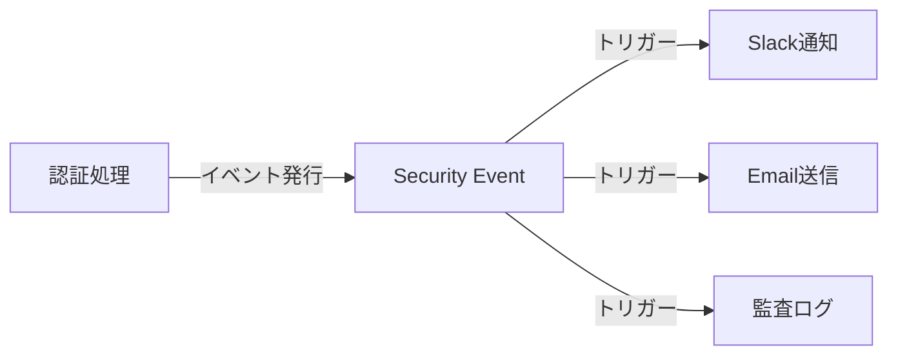
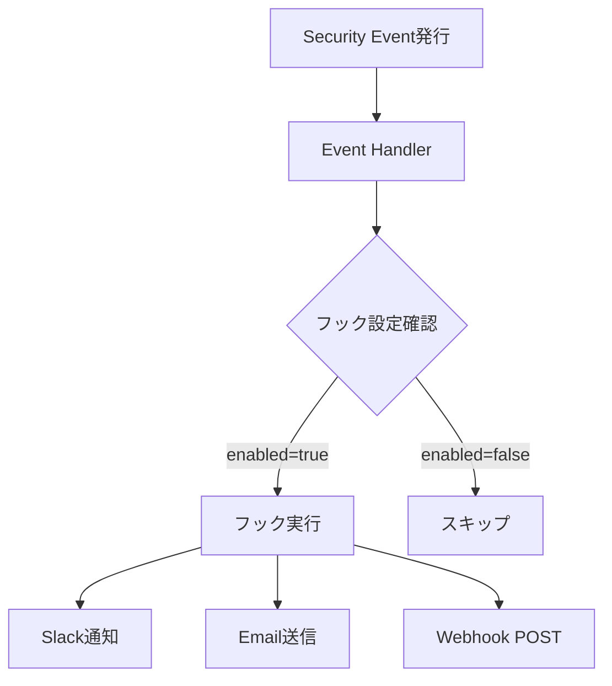
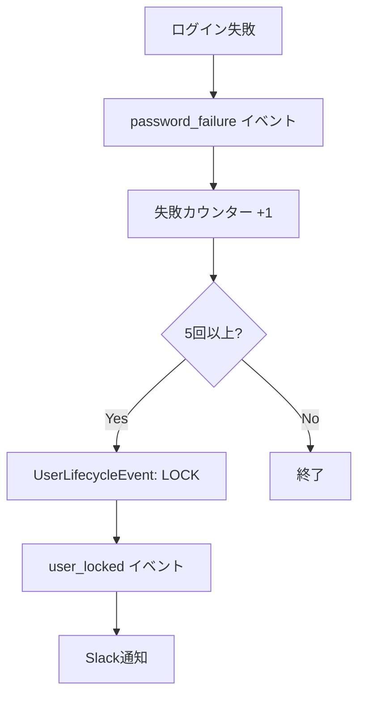

# セキュリティイベント・フック

idp-serverのセキュリティイベントとフックシステムの概念について説明します。

## セキュリティイベントとは

**セキュリティイベント（Security Event）** とは、認証・認可ライフサイクル上の重要なアクションを表現するイベントです。



### 目的

- **可観測性**: システムで何が起きているかをリアルタイムに把握
- **監査**: コンプライアンス要件のためのログ記録
- **外部システム連携**: SIEM、アラートシステムとの統合
- **自動対応**: セキュリティイベントに基づく自動アクション（アカウントロック等）

### イベント駆動アーキテクチャ

idp-serverでは、フロー本体のロジック（認証・認可処理）と副作用的処理（通知、ログ記録）を明確に分離しています。

**従来のアプローチ**:
```java
// 認証処理の中に通知ロジックが混在
public void authenticate() {
    // 認証処理
    if (success) {
        slackNotification.send("ログイン成功");
        emailService.send("ログイン通知");
        auditLog.record("login_success");
    }
}
```

**イベント駆動アプローチ**:
```java
// 認証処理はイベント発行のみ
public void authenticate() {
    // 認証処理
    if (success) {
        eventPublisher.publish(SecurityEventType.LOGIN_SUCCESS);
        // 通知・ログはイベントハンドラーが処理
    }
}
```

---

## 主要なセキュリティイベント

idp-serverでは、以下のようなセキュリティイベントを発行します。

### 認証関連イベント

| イベントタイプ | 説明 | 典型的な用途 |
|:---|:---|:---|
| `oauth_authorize` | OAuth認可リクエスト | 認可リクエストの監視 |
| `mfa_success` | MFA認証成功 | MFA利用状況の追跡 |
| `mfa_failure` | MFA認証失敗 | 不正アクセス検知 |
| `password_failure` | パスワード認証失敗 | アカウントロックトリガー |

### ユーザー操作イベント

| イベントタイプ | 説明 | 典型的な用途 |
|:---|:---|:---|
| `user_signup` | ユーザー登録 | 新規ユーザー通知 |
| `user_login` | ユーザーログイン | ログイン通知 |
| `user_logout` | ユーザーログアウト | セッション管理 |
| `user_locked` | アカウントロック | セキュリティアラート |
| `user_delete` | ユーザー削除 | 監査ログ |

### フェデレーション関連イベント

| イベントタイプ | 説明 | 典型的な用途 |
|:---|:---|:---|
| `federation_callback_success` | 外部IdP認証成功 | フェデレーション利用状況 |
| `federation_callback_failure` | 外部IdP認証失敗 | 外部IdP連携エラー検知 |

### トークン・セッション関連イベント

| イベントタイプ | 説明 | 典型的な用途 |
|:---|:---|:---|
| `token_issued` | トークン発行 | トークン発行監視 |
| `token_revoked` | トークン失効 | セキュリティ監視 |
| `session_created` | セッション作成 | セッション管理 |
| `session_terminated` | セッション終了 | セッション監視 |

---

## セキュリティイベントフックとは

**セキュリティイベントフック（Security Event Hook）** とは、セキュリティイベント発生時に実行される処理です。

### フックの仕組み



### トリガー条件

各フックは、特定のイベントタイプに対してのみ実行されるように設定できます：

```json
{
  "type": "SLACK",
  "triggers": [
    "user_locked",
    "password_failure"
  ],
  "enabled": true
}
```

この例では、`user_locked`と`password_failure`イベントが発生した時のみSlack通知が実行されます。

### テナント単位設定

フックはテナント単位で設定されるため、テナントごとに異なる通知先や処理を定義できます：

- **テナントA**: Slackチャンネル#security-alerts
- **テナントB**: Email admin@tenant-b.com
- **テナントC**: Webhook https://siem.tenant-c.com/events

---

## サポートされるフックタイプ

idp-serverでは、以下の6種類のフックをサポートしています。

### 1. Slack通知

**用途**: リアルタイムなチーム通知

**設定例**:
```json
{
  "type": "SLACK",
  "triggers": ["user_locked", "mfa_failure"],
  "enabled": true,
  "details": {
    "incoming_webhook_url": "https://hooks.slack.com/services/xxx"
  }
}
```

### 2. Email通知

**用途**: 管理者へのメール通知

**設定例**:
```json
{
  "type": "EMAIL",
  "triggers": ["user_signup", "user_delete"],
  "enabled": true,
  "details": {
    "to": "admin@example.com",
    "subject": "Security Alert"
  }
}
```

### 3. Webhook

**用途**: 外部システムへのHTTP POST

**設定例**:
```json
{
  "type": "WEBHOOK",
  "triggers": ["oauth_authorize", "token_issued"],
  "enabled": true,
  "details": {
    "url": "https://external-system.com/events",
    "method": "POST"
  }
}
```

### 4. SSF (Shared Signals Framework)

**用途**: セキュリティイベント標準フォーマット送信

**設定例**:
```json
{
  "type": "SSF",
  "triggers": ["user_locked", "session_terminated"],
  "enabled": true,
  "details": {
    "transmission_endpoint": "https://receiver.com/ssf"
  }
}
```

参考: [OpenID Shared Signals and Events Framework](https://openid.net/specs/openid-sse-framework-1_0.html)

### 5. Datadog

**用途**: メトリクス・ログ送信

**設定例**:
```json
{
  "type": "DATADOG",
  "triggers": ["user_login", "mfa_success"],
  "enabled": true,
  "details": {
    "api_key": "xxx",
    "site": "datadoghq.com"
  }
}
```

### 6. 監査ログ

**用途**: データベース永続化

**設定例**:
```json
{
  "type": "AUDIT_LOG",
  "triggers": ["user_delete", "client_create"],
  "enabled": true,
  "details": {
    "store_execution_payload": true
  }
}
```

---

## ユースケース

### 1. セキュリティ監視: パスワード失敗5回でアカウントロック



このフローでは、SecurityEventとUserLifecycleEventが連携して動作します：

1. `password_failure`イベント発行
2. イベントハンドラーが失敗回数をカウント
3. 5回以上でUserLifecycleEvent（LOCK）発行
4. ユーザーステータスがLOCKEDに変更
5. `user_locked`イベント発行
6. Slackに通知

### 2. コンプライアンス: 監査ログの保存

すべての重要な操作を監査ログとして保存：

```json
{
  "type": "AUDIT_LOG",
  "triggers": [
    "user_delete",
    "client_create",
    "client_update",
    "authorization_server_update"
  ],
  "enabled": true,
  "store_execution_payload": true
}
```

### 3. 外部連携: SIEMへのイベント送信

セキュリティイベントをSIEMに送信して脅威検知：

```json
{
  "type": "WEBHOOK",
  "triggers": [
    "mfa_failure",
    "user_locked",
    "password_failure"
  ],
  "enabled": true,
  "details": {
    "url": "https://siem.example.com/events"
  }
}
```

### 4. 運用通知: 新規ユーザー登録をSlack通知

```json
{
  "type": "SLACK",
  "triggers": ["user_signup"],
  "enabled": true,
  "details": {
    "incoming_webhook_url": "https://hooks.slack.com/services/xxx",
    "channel": "#user-registrations"
  }
}
```

---

## SecurityEventとUserLifecycleEventの関係

idp-serverでは、2種類のイベントシステムが連携して動作します。

### SecurityEvent vs UserLifecycleEvent

| イベント | 目的 | トリガーソース | 影響 |
|:---|:---|:---|:---|
| **SecurityEvent** | 不審なアクションの検出と通知 | 認証フロー、ログイン | 通知、監査、ライフサイクルイベントトリガー |
| **UserLifecycleEvent** | ユーザー状態の変更 | 管理者アクション、自動ロック | ユーザー状態更新、データ削除 |

### 連携例: アカウントロック

```java
// SecurityEventがトリガー
SecurityEvent passwordFailure = new SecurityEvent(PASSWORD_FAILURE);

// カウンターチェック
if (failureCount >= 5) {
    // UserLifecycleEventを発行
    UserLifecycleEvent lockEvent = new UserLifecycleEvent(LOCK);

    // ユーザーステータス更新
    user.setStatus(LOCKED);

    // 再度SecurityEventを発行（通知用）
    SecurityEvent userLocked = new SecurityEvent(USER_LOCKED);
}
```

詳細は[イベント処理](../content_06_developer-guide/developer-guide/events.md)を参照してください。

---

## 設定と制御

### 有効/無効

フックは`enabled`フラグで制御できます：

- **`enabled: true`**: フック実行
- **`enabled: false`**: フック無効（設定は保持）

### リトライ機能

外部システムへの送信失敗時、自動的にリトライします：

```json
{
  "retry_configuration": {
    "max_retries": 3,
    "retryable_status_codes": [502, 503, 504],
    "backoff_delays": ["PT1S", "PT2S", "PT4S"]
  }
}
```

### 実行結果保存

デバッグや監査のため、フック実行結果を保存できます：

```json
{
  "store_execution_payload": true
}
```

これにより、以下の情報が保存されます：
- リクエスト内容
- レスポンス内容
- 実行時刻
- 成功/失敗ステータス

---

## 関連ドキュメント

- [イベント & フックシステム](../content_06_developer-guide/developer-guide/security-event-hooks.md) - 実装詳細
- [イベント処理](../content_06_developer-guide/developer-guide/events.md) - SecurityEventとUserLifecycleEventの関係
- [HTTP Request Executor](../content_06_developer-guide/developer-guide/http-request-executor.md) - Webhook実行基盤
- [認証ポリシー](concept-05-authentication-policy.md) - アカウントロック設定

---

## 参考仕様

- [OpenID Shared Signals and Events Framework](https://openid.net/specs/openid-sse-framework-1_0.html)
- [CAEP - Continuous Access Evaluation Profile](https://openid.net/specs/openid-caep-specification-1_0.html)
