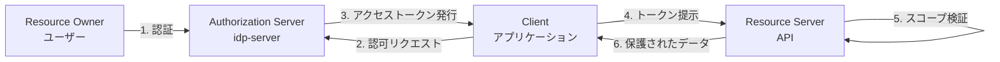
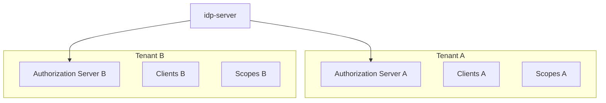
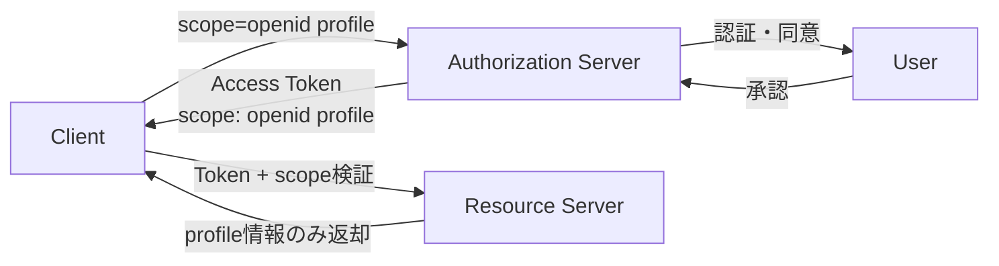
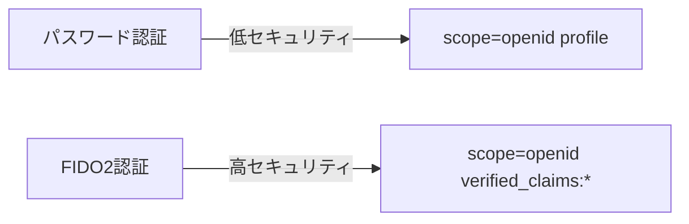
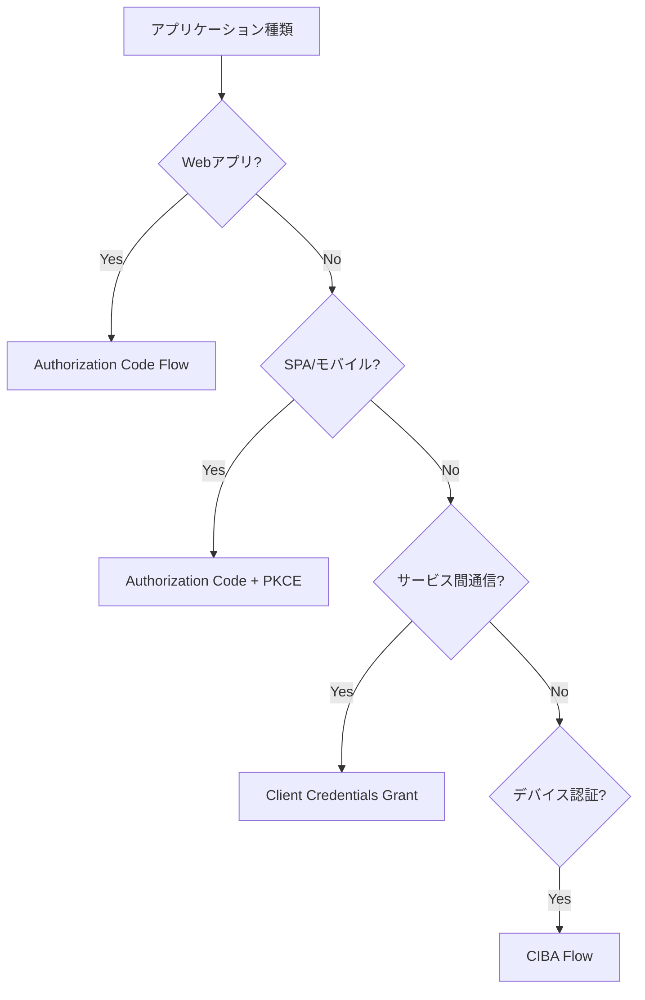
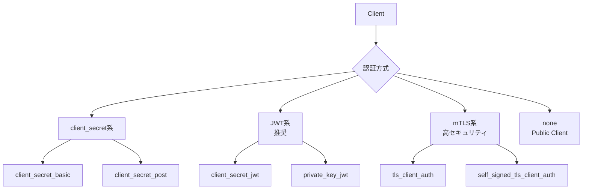

# 認可

---

## 前提知識

このドキュメントを理解するには、以下の基礎知識が役立ちます：

- [OAuth 2.0の基本](basic/basic-06-oauth2-authorization.md) - OAuth 2.0の認可の仕組み
- [OpenID Connectの基本](basic/basic-11-oauth-oidc-basics.md) - OIDCによる認証
- [OAuth 2.0の役割](basic/basic-07-oauth2-roles.md) - 4つの役割
- [認可コードフロー](../content_04_protocols/protocol-01-authorization-code-flow.md) - 認可フローの詳細

---

## 概要

idp-serverは、OAuth 2.0/OpenID Connect/CIBAに準拠した**認可サーバー（Authorization Server）** として動作します。

**認可サーバー**とは、リソースへのアクセス権限を管理し、トークンを発行する役割を担うサーバーです。



idp-serverでは以下のような用途に対応できます：

* Webアプリケーションでの「スコープ制限付きアクセス」
* SPAでの「安全なトークン管理（PKCE + Refresh Token Rotation）」
* マイクロサービスでの「サービス間認証（Client Credentials Grant）」
* IoTデバイスでの「非同期認証（CIBA Flow）」

### OAuth 2.0における4つの役割

| 役割 | 説明 | idp-serverでの対応 |
|:---|:---|:---|
| **Resource Owner** | リソースの所有者（エンドユーザー） | idp-serverで認証・同意 |
| **Client** | リソースにアクセスしたいアプリケーション | Management APIで登録・管理 |
| **Authorization Server** | 認可を管理し、トークンを発行 | **idp-server本体** |
| **Resource Server** | 保護されたリソース（API）を提供 | Introspectionでトークン検証 |

---

## idp-serverにおける認可の設計思想

### 1. テナント単位の認可サーバー

idp-serverでは、**1つのテナント = 1つの独立した認可サーバー** として動作します。



**特徴**:
- テナントごとに異なる認可ポリシー
- テナントごとに独立したクライアント管理
- テナントごとに異なるトークン設定

**メリット**:
- マルチテナント環境での完全な分離
- テナントごとのカスタマイズ可能
- セキュリティ境界の明確化

詳細は [concept-01: マルチテナント](concept-01-multi-tenant.md) を参照。

### 2. スコープベースのアクセス制御

idp-serverでは、**スコープ（Scope）** を単位としてアクセス権限を管理します。



**スコープの種類**:

| スコープタイプ | 例 | 用途 |
|:---|:---|:---|
| **標準スコープ** | `openid`, `profile`, `email` | OIDC標準のユーザー属性 |
| **カスタムスコープ** | `api:read`, `api:write` | 独自API権限 |
| **カスタムクレームスコープ** | `claims:roles`, `claims:permissions` | 個別属性指定（idp-server独自） |
| **身元確認スコープ** | `verified_claims:given_name` | 身元確認済み属性（idp-server独自） |

**設計原則**:
- **最小権限の原則**: 必要最小限のスコープのみ付与
- **粒度の適切さ**: 粗すぎず細かすぎない権限設計
- **認証強度との連動**: 強い認証 = より多くのスコープ許可（動的スコープフィルタリング）

詳細は [concept-09: カスタムクレーム](concept-09-custom-claims.md) を参照。

### 3. 認証強度と連動した動的スコープフィルタリング

**idp-server独自の機能**として、認証方式に応じてスコープを動的に制限できます。



**使用例**:
```
パスワード認証のみ → scope=openid profile（基本情報のみ）
FIDO2認証 → scope=openid verified_claims:*（身元確認済み情報も許可）
```

**メリット**:
- 認証強度に応じた適切な情報開示
- 過剰な権限付与の防止
- セキュリティとユーザー体験の両立

詳細は [concept-05: 認証ポリシー](concept-05-authentication-policy.md) を参照。

### 4. 身元確認との連携

`verified_claims:` スコープにより、身元確認済み属性のみを取得できます。

**使用例**:
```
scope=openid verified_claims:given_name verified_claims:family_name

→ 身元確認済みの名前のみを取得
```

**条件**:
- ユーザーが身元確認（eKYC）を完了していること
- `verified_claims:` プレフィックス付きスコープを要求
- 認証強度が要件を満たしていること

詳細は [concept-03: 身元確認済みID](concept-03-id-verified.md) を参照。

### 5. 多様な認可フロー

idp-serverは、クライアントの特性に応じた複数の認可フローをサポートします。



**フロー選択の基準**:

| クライアント種類 | 推奨フロー | 理由 |
|:---|:---|:---|
| サーバーサイドWebアプリ | Authorization Code Flow | 最も安全、シークレット保護可能 |
| SPA/モバイルアプリ | Authorization Code + PKCE | Public Clientでも安全 |
| マイクロサービス（M2M） | Client Credentials Grant | ユーザー不要の認可 |
| IoT/デバイス認証 | CIBA Flow | 非同期・プッシュ通知対応 |

詳細は以下を参照：
- [protocol-01: Authorization Code Flow](../content_04_protocols/protocol-01-authorization-code-flow.md)
- [protocol-02: CIBA Flow](../content_04_protocols/protocol-02-ciba-flow.md)

### 6. クライアント認証の柔軟性

idp-serverは、クライアントの認証方式を柔軟に選択できます。



**推奨度**:

| 認証方式 | セキュリティ | 推奨度 | 用途 |
|:---|:---|:---|:---|
| `private_key_jwt` | ★★★★★ | 最推奨 | 本番環境全般 |
| `tls_client_auth` | ★★★★★ | 推奨 | 金融・医療等 |
| `client_secret_jwt` | ★★★☆☆ | 条件付き | シークレット共有可能な場合 |
| `client_secret_basic` | ★★☆☆☆ | 非推奨 | レガシー互換 |
| `none` | ★☆☆☆☆ | Public Clientのみ | SPA/モバイル（+PKCE必須） |

### 7. 2種類のトークン形式

idp-serverは、2種類のトークン形式をサポートします。

**識別子型（Opaque Token）**:
```
アクセストークン: "7b3f8c2d-9e1a-4f6b-8d2c-1a3e5f7b9d2c"
→ データベースで検証・管理
→ Introspectionで検証
→ 即座に失効可能
```

**内包型（JWT Token）**:
```
アクセストークン: "eyJhbGciOiJSUzI1NiIsInR5cCI6IkpXVCJ9..."
→ 署名検証のみで利用可能
→ データベースアクセス不要
→ 失効は有効期限まで不可（リボケーションリストで対応）
```

**比較**:

| 特性 | 識別子型 | 内包型（JWT） |
|:---|:---|:---|
| **検証方法** | Introspection API | 署名検証 |
| **即座の失効** | 可能 | 不可（リボケーションリストで対応） |
| **パフォーマンス** | DB問い合わせ必要 | 署名検証のみ |
| **推奨用途** | 厳密な制御が必要な場合 | 高速・スケーラブル |

詳細は [concept-06: トークン管理](concept-06-token-management.md) を参照。

---

## ユースケース

### 1. Webアプリケーションでのユーザー認証・認可

**シーン**: SaaSサービスのWebアプリで、ユーザーのプロフィール情報を取得したい

**設定**:
- クライアントタイプ: Confidential Client
- 認可フロー: Authorization Code Flow
- クライアント認証: `private_key_jwt`
- スコープ: `openid profile email`
- トークン形式: 内包型（JWT）

**フロー**:
1. ユーザーがWebアプリにアクセス
2. Webアプリがidp-serverにリダイレクト
3. ユーザーが認証・同意
4. 認可コード発行
5. Webアプリがトークンエンドポイントでトークン取得
6. IDトークンからユーザー情報取得

### 2. SPAでの認証・認可

**シーン**: React/VueのSPAで、安全にユーザー認証したい

**設定**:
- クライアントタイプ: Public Client
- 認可フロー: Authorization Code Flow + PKCE
- クライアント認証: `none`
- スコープ: `openid profile`
- トークン形式: Refresh Token Rotation有効化

**セキュリティ対策**:
- PKCE必須（code_verifier/code_challenge）
- Refresh Token Rotation（使い捨てトークン）
- 短いアクセストークン有効期限（15分以内推奨）

### 3. マイクロサービスでのAPI保護

**シーン**: マイクロサービス間通信で、サービスAがサービスBのAPIにアクセスしたい

**設定**:
- クライアントタイプ: Confidential Client
- 認可フロー: Client Credentials Grant
- クライアント認証: `private_key_jwt`
- スコープ: `api:read api:write`
- トークン検証: Introspection

**フロー**:
1. サービスAが Client Credentials Grant でトークン取得
2. サービスAがトークンを付けてサービスBにリクエスト
3. サービスBがIntrospectionでトークン検証
4. スコープ確認（`api:read`がある？）
5. レスポンス返却

### 4. モバイルアプリでのデバイス認証

**シーン**: モバイルアプリで、プッシュ通知による認証を実現したい

**設定**:
- クライアントタイプ: Confidential Client
- 認可フロー: CIBA Flow (Push Mode)
- クライアント認証: `private_key_jwt`
- スコープ: `openid profile verified_claims:*`
- 認証デバイス: FCM Push通知

**フロー**:
1. クライアントがバックチャネル認証リクエスト
2. idp-serverがユーザーのデバイスにプッシュ通知
3. ユーザーがデバイスで認証・承認
4. idp-serverがクライアントにPush通知（認証完了）
5. クライアントがトークンエンドポイントでトークン取得

詳細は [protocol-02: CIBA Flow](../content_04_protocols/protocol-02-ciba-flow.md) を参照。

---

## セキュリティ考慮事項

### 認可サーバー側の責務

- **クライアント検証**: リダイレクトURIの厳密な一致検証
- **PKCE強制**: Public Clientは必ずPKCE使用
- **トークン有効期限**: 適切な短期設定（Access Token: 15分、Refresh Token: 30日等）
- **同意の記録**: ユーザーの同意履歴を永続化
- **監査ログ**: すべての認可操作をログ記録（concept-11参照）

### クライアント側の責務

- **ステート検証**: CSRF対策（`state`パラメータ）
- **PKCE実装**: Public Clientは必須
- **トークン保護**: セキュアな保存（HTTPOnly Cookie、Secure Storage等）
- **スコープ最小化**: 必要最小限のスコープのみ要求

### スコープ設計の原則

- **最小権限**: 必要な情報だけアクセス
- **粒度の適切さ**: `admin`のような粗すぎるスコープは避ける
- **センシティブ情報**: `verified_claims`等は慎重に扱う
- **認証強度連動**: 弱い認証では強いスコープを許可しない

---

## セキュリティ拡張機能

idp-serverは、最新のOAuth/OIDCセキュリティ拡張をサポートします。

| 拡張仕様 | 仕様 | 目的 | idp-server対応 |
|:---|:---|:---|:---|
| **PKCE** | RFC 7636 | 認可コード横取り攻撃対策 | ✅ 必須（Public Client） |
| **JAR** | RFC 9101 | 認可リクエストのJWT化 | ✅ 対応 |
| **JARM** | OIDF JARM | 認可レスポンスのJWT化 | ✅ 対応 |
| **PAR** | RFC 9126 | 認可リクエストの事前プッシュ | ✅ 対応 |
| **RAR** | RFC 9396 | 詳細なアクセス要求 | ✅ 対応 |
| **FAPI** | OIDF FAPI 1.0/2.0 | 金融レベルセキュリティ | ✅ Baseline/Advanced対応 |

これらの拡張により、金融・医療・行政など高セキュリティ要件の環境でも利用可能です。

---

## 関連ドキュメント

- [マルチテナント](concept-01-multi-tenant.md) - テナント単位の認可サーバー
- [身元確認済みID](concept-03-id-verified.md) - verified_claimsスコープ
- [認証ポリシー](concept-05-authentication-policy.md) - 認証強度と連動したスコープ制御
- [トークン管理](concept-06-token-management.md) - トークン形式・有効期限設計
- [カスタムクレーム](concept-09-custom-claims.md) - スコープとクレームの関係
- [コントロールプレーン](concept-10-control-plane.md) - 認可サーバー・クライアント設定API
- [セキュリティイベント](concept-11-security-events.md) - 認可操作のログ記録
- [Authorization Code Flow](../content_04_protocols/protocol-01-authorization-code-flow.md) - 認可フロー詳細
- [CIBA Flow](../content_04_protocols/protocol-02-ciba-flow.md) - バックチャネル認証
- [Introspection](../content_04_protocols/protocol-03-introspection.md) - トークン検証

---

## 参考仕様

- [RFC 6749: The OAuth 2.0 Authorization Framework](https://datatracker.ietf.org/doc/html/rfc6749) - OAuth 2.0基本仕様
- [RFC 7591: OAuth 2.0 Dynamic Client Registration Protocol](https://datatracker.ietf.org/doc/html/rfc7591) - 動的クライアント登録
- [RFC 7636: Proof Key for Code Exchange (PKCE)](https://datatracker.ietf.org/doc/html/rfc7636) - PKCE
- [RFC 7662: OAuth 2.0 Token Introspection](https://datatracker.ietf.org/doc/html/rfc7662) - Introspection
- [RFC 7009: OAuth 2.0 Token Revocation](https://datatracker.ietf.org/doc/html/rfc7009) - Revocation
- [RFC 8705: OAuth 2.0 Mutual-TLS Client Authentication and Certificate-Bound Access Tokens](https://datatracker.ietf.org/doc/html/rfc8705) - mTLS
- [RFC 9101: The OAuth 2.0 Authorization Framework: JWT-Secured Authorization Request (JAR)](https://datatracker.ietf.org/doc/html/rfc9101) - JAR
- [RFC 9126: OAuth 2.0 Pushed Authorization Requests (PAR)](https://datatracker.ietf.org/doc/html/rfc9126) - PAR
- [RFC 9396: OAuth 2.0 Rich Authorization Requests (RAR)](https://datatracker.ietf.org/doc/html/rfc9396) - RAR
- [OpenID Connect Core 1.0](https://openid.net/specs/openid-connect-core-1_0.html) - OIDC基本仕様
- [OpenID Connect Discovery 1.0](https://openid.net/specs/openid-connect-discovery-1_0.html) - Discovery
- [OpenID Connect Client-Initiated Backchannel Authentication Flow - Core 1.0](https://openid.net/specs/openid-client-initiated-backchannel-authentication-core-1_0.html) - CIBA
- [JWT Secured Authorization Response Mode for OAuth 2.0 (JARM)](https://openid.net/specs/oauth-v2-jarm.html) - JARM
- [Financial-grade API (FAPI) 1.0 - Part 1: Baseline](https://openid.net/specs/openid-financial-api-part-1-1_0.html) - FAPI Baseline
- [Financial-grade API (FAPI) 1.0 - Part 2: Advanced](https://openid.net/specs/openid-financial-api-part-2-1_0.html) - FAPI Advanced
- [Financial-grade API: Client Initiated Backchannel Authentication Profile](https://openid.net/specs/openid-financial-api-ciba.html) - FAPI-CIBA
