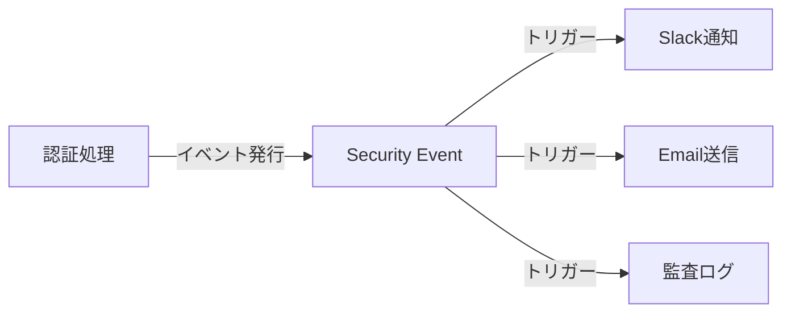
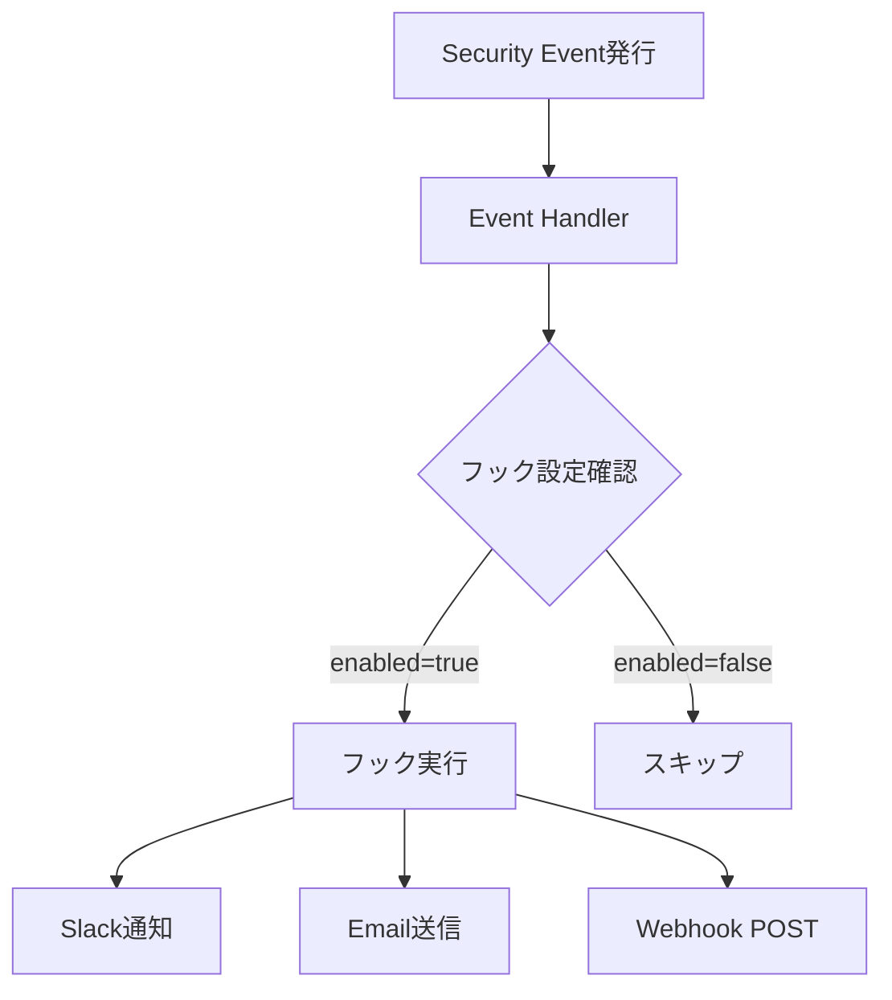

# セキュリティイベント・フック

idp-serverのセキュリティイベントとフックシステムの概念について説明します。

## セキュリティイベントとは

**セキュリティイベント（Security Event）** とは、認証・認可ライフサイクル上の重要なアクションを表現するイベントです。



### 目的

- **可観測性**: システムで何が起きているかをリアルタイムに把握
- **監査**: コンプライアンス要件のためのログ記録
- **外部システム連携**: SIEM、アラートシステムとの統合
- **自動対応**: セキュリティイベントに基づく自動アクション（アカウントロック等）

### イベント駆動アーキテクチャ

idp-serverでは、フロー本体のロジック（認証・認可処理）と副作用的処理（通知、ログ記録）を明確に分離しています。

**従来のアプローチ**:
```java
// 認証処理の中に通知ロジックが混在
public void authenticate() {
    // 認証処理
    if (success) {
        slackNotification.send("ログイン成功");
        emailService.send("ログイン通知");
        auditLog.record("login_success");
    }
}
```

**イベント駆動アプローチ**:
```java
// 認証処理はイベント発行のみ
public void authenticate() {
    // 認証処理
    if (success) {
        eventPublisher.publish(SecurityEventType.LOGIN_SUCCESS);
        // 通知・ログはイベントハンドラーが処理
    }
}
```

---

## 主要なセキュリティイベント

idp-serverでは、以下のようなセキュリティイベントを発行します。

### 認証関連イベント

| イベントタイプ | 説明 | 典型的な用途 |
|:---|:---|:---|
| `oauth_authorize` | OAuth認可成功 | 認可リクエストの監視 |
| `password_success` | パスワード認証成功 | ログイン成功の追跡 |
| `password_failure` | パスワード認証失敗 | アカウントロックトリガー |
| `fido2_authentication_success` | FIDO2認証成功 | FIDO認証利用状況 |
| `fido2_authentication_failure` | FIDO2認証失敗 | 不正アクセス検知 |

### ユーザー操作イベント

| イベントタイプ | 説明 | 典型的な用途 |
|:---|:---|:---|
| `user_signup` | ユーザー登録 | 新規ユーザー通知 |
| `login_success` | ユーザーログイン | ログイン通知 |
| `logout` | ユーザーログアウト | セッション管理 |
| `user_lock` | アカウントロック | セキュリティアラート |
| `user_deletion` | ユーザー削除 | 監査ログ |

### フェデレーション関連イベント

| イベントタイプ | 説明 | 典型的な用途 |
|:---|:---|:---|
| `federation_success` | 外部IdP認証成功 | フェデレーション利用状況 |
| `federation_failure` | 外部IdP認証失敗 | 外部IdP連携エラー検知 |

### トークン関連イベント

| イベントタイプ | 説明 | 典型的な用途 |
|:---|:---|:---|
| `issue_token_success` | トークン発行成功 | トークン発行監視 |
| `revoke_token_success` | トークン失効成功 | セキュリティ監視 |
| `refresh_token_success` | トークン更新成功 | トークン管理 |
| `inspect_token_success` | トークン検証成功 | トークン利用状況 |

---

## ユーザー識別情報

セキュリティイベントには、管理者がユーザーを識別しやすいようにユーザー情報が含まれます。

### イベントに含まれるユーザー情報

| フィールド | 説明 | 用途 |
|:---|:---|:---|
| `user.id` | ユーザーの内部識別子（sub） | システム間連携、ログ追跡 |
| `user.name` | ユーザーの表示名（preferred_username） | 管理者による視覚的な識別 |
| `user.external_user_id` | 外部システム連携用の識別子 | 外部システムとの照合 |

### user.nameとIDポリシーの関係

`user.name`に記録される値は、テナントの**IDポリシー設定**によって決定されます：

| IDポリシー | user.nameに記録される値 | 例 |
|:---|:---|:---|
| `EMAIL_OR_EXTERNAL_USER_ID`（デフォルト） | メールアドレス | `user@example.com` |
| `USERNAME_OR_EXTERNAL_USER_ID` | ユーザー名 | `john_doe` |

これにより、管理者はセキュリティイベントを確認する際に、UUIDではなく人間が識別しやすい名前でユーザーを特定できます。

### セキュリティイベントの検索

Management APIでは、様々な条件でセキュリティイベントを検索できます。

#### 検索パラメータ一覧

| パラメータ | 説明 | 検索方式 | 例 |
|:---|:---|:---|:---|
| `id` | イベントID | 完全一致 | `?id=3ec055a8-8000-44a2-8677-e70ebff414e2` |
| `user_id` | ユーザーID（sub） | 完全一致 | `?user_id=uuid` |
| `user_name` | ユーザー名 | 部分一致 | `?user_name=john` |
| `external_user_id` | 外部ユーザーID | 完全一致 | `?external_user_id=ext-123` |
| `client_id` | クライアントID | 完全一致 | `?client_id=my-client` |
| `event_type` | イベントタイプ | 完全一致（カンマ区切りで複数指定可） | `?event_type=password_failure,user_lock` |
| `ip_address` | IPアドレス | 完全一致 | `?ip_address=192.168.1.100` |
| `user_agent` | User-Agent | 部分一致 | `?user_agent=Mozilla` |
| `from` | 検索開始日時 | 以降 | `?from=2025-01-01 00:00:00` |
| `to` | 検索終了日時 | 以前 | `?to=2025-12-31 23:59:59` |
| `limit` | 取得件数（デフォルト: 20） | - | `?limit=50` |
| `offset` | オフセット（デフォルト: 0） | - | `?offset=100` |
| `details.*` | 詳細フィールド（JSONB） | 完全一致 | `?details.error=invalid_credentials` |

#### 検索例

**特定ユーザーの認証失敗イベントを検索:**
```
GET /v1/management/tenants/{tenant-id}/security-events?user_name=john&event_type=password_failure
```

**特定IPアドレスからのアクセスを調査:**
```
GET /v1/management/tenants/{tenant-id}/security-events?ip_address=192.168.1.100
```

**特定ブラウザでの問題を調査:**
```
GET /v1/management/tenants/{tenant-id}/security-events?user_agent=Chrome
```

**日時範囲を指定して検索:**
```
GET /v1/management/tenants/{tenant-id}/security-events?from=2025-01-01 00:00:00&to=2025-01-31 23:59:59
```

### プライバシー設定

セキュリティイベントに含めるユーザー属性は、テナント設定（`security_event_user_config`）で制御できます。詳細は[テナント設定](../content_06_developer-guide/05-configuration/tenant.md#security-event-user-attribute-configuration)を参照してください。

### 失敗イベントの詳細情報

認証失敗などの失敗イベントでは、原因調査のために`detail.execution_result`に実行結果が記録されます：

```json
{
  "type": "password_failure",
  "detail": {
    "execution_result": {
      "error": "invalid_credentials",
      "error_description": "The provided password is incorrect"
    }
  }
}
```

この情報により、管理者は失敗の原因を特定し、適切な対応を行うことができます。

> **注意**: 成功イベントでは`execution_result`は記録されません。失敗イベントかつ実行結果がある場合のみ含まれます。

---

## セキュリティイベントフックとは

**セキュリティイベントフック（Security Event Hook）** とは、セキュリティイベント発生時に実行される処理です。

### フックの仕組み



### トリガー条件

各フックは、特定のイベントタイプに対してのみ実行されるように設定できます：

```json
{
  "type": "SLACK",
  "triggers": [
    "user_lock",
    "password_failure"
  ],
  "enabled": true
}
```

この例では、`user_lock`と`password_failure`イベントが発生した時のみSlack通知が実行されます。

### テナント単位設定

フックはテナント単位で設定されるため、テナントごとに異なる通知先や処理を定義できます：

- **テナントA**: Slackチャンネル#security-alerts
- **テナントB**: Email admin@tenant-b.com
- **テナントC**: Webhook https://siem.tenant-c.com/events

---

## サポートされるフックタイプ

idp-serverでは、以下の6種類のフックをサポートしています。

| フックタイプ | 用途 | 送信先 |
|:---|:---|:---|
| **Slack** | リアルタイムなチーム通知 | Slack Incoming Webhook |
| **Email** | 管理者へのメール通知 | SMTP経由でメール送信 |
| **Webhook** | 外部システムへのHTTP POST | 任意のHTTPエンドポイント |
| **SSF** | セキュリティイベント標準フォーマット送信 | SSF準拠の受信エンドポイント |
| **Datadog** | メトリクス・ログ送信 | Datadog API |
| **監査ログ** | データベース永続化 | idp-serverデータベース |

詳細な設定方法については、[イベント & フックシステム](../content_06_developer-guide/04-implementation-guides/impl-15-security-event-hooks.md)を参照してください。

### SSFについて

SSF (Shared Signals Framework)は、OpenID Foundationが標準化したセキュリティイベント共有フレームワークです。

参考: [OpenID Shared Signals and Events Framework](https://openid.net/specs/openid-sse-framework-1_0.html)

---

## ユースケース

### 1. セキュリティ監視: アカウントロック

パスワード失敗を検知し、一定回数を超えたらアカウントをロックしてSlackに通知。

- **イベント**: `password_failure` → `user_lock`
- **フック**: Slack通知
- **効果**: 不正アクセス試行をリアルタイムで検知

### 2. コンプライアンス: 監査ログの保存

すべての重要な操作を監査ログとして保存。

- **イベント**: `user_deletion`, `user_create`, `user_edit`等
- **フック**: 監査ログ
- **効果**: コンプライアンス要件を満たす監査証跡

### 3. 外部連携: SIEMへのイベント送信

セキュリティイベントをSIEMに送信して脅威を検知。

- **イベント**: `fido2_authentication_failure`, `user_lock`, `password_failure`
- **フック**: Webhook
- **効果**: 外部セキュリティシステムとの統合

### 4. 運用通知: 新規ユーザー登録の通知

新規ユーザー登録をSlackで通知。

- **イベント**: `user_signup`
- **フック**: Slack通知
- **効果**: チームへのリアルタイム情報共有

---

## SecurityEventとUserLifecycleEventの関係

idp-serverでは、2種類のイベントシステムが連携して動作します。

| イベント | 目的 | トリガー | 影響 |
|:---|:---|:---|:---|
| **SecurityEvent** | 不審なアクションの検出と通知 | 認証フロー、ログイン | 通知、監査、ライフサイクルイベントトリガー |
| **UserLifecycleEvent** | ユーザー状態の変更 | 管理者アクション、自動ロック | ユーザー状態更新、データ削除 |

**連携例**: パスワード失敗5回 → `password_failure`イベント → UserLifecycleEvent(LOCK) → `user_lock`イベント → Slack通知

---

## 設定と制御

### 有効/無効

フックは`enabled`フラグで制御できます：

- **`enabled: true`**: フック実行
- **`enabled: false`**: フック無効（設定は保持）

### リトライ機能

外部システムへの送信失敗時、自動的にリトライします：

```json
{
  "retry_configuration": {
    "max_retries": 3,
    "retryable_status_codes": [502, 503, 504],
    "backoff_delays": ["PT1S", "PT2S", "PT4S"]
  }
}
```

### 実行結果保存

デバッグや監査のため、フック実行結果を保存できます：

```json
{
  "store_execution_payload": true
}
```

これにより、以下の情報が保存されます：
- リクエスト内容
- レスポンス内容
- 実行時刻
- 成功/失敗ステータス

---

## 関連ドキュメント

- [イベント & フックシステム](../content_06_developer-guide/04-implementation-guides/impl-15-security-event-hooks.md) - 実装詳細
- [HTTP Request Executor](../content_06_developer-guide/04-implementation-guides/impl-16-http-request-executor.md) - Webhook実行基盤
- [認証ポリシー](concept-06-authentication-policy.md) - アカウントロック設定

---

## 参考仕様

- [OpenID Shared Signals and Events Framework](https://openid.net/specs/openid-sse-framework-1_0.html)
- [CAEP - Continuous Access Evaluation Profile](https://openid.net/specs/openid-caep-specification-1_0.html)
