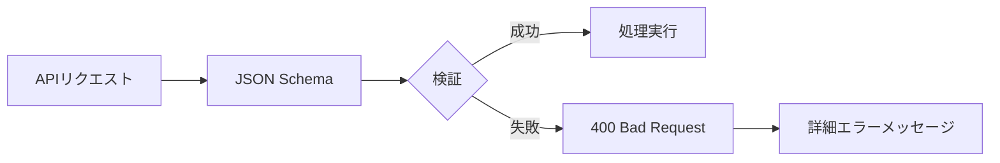
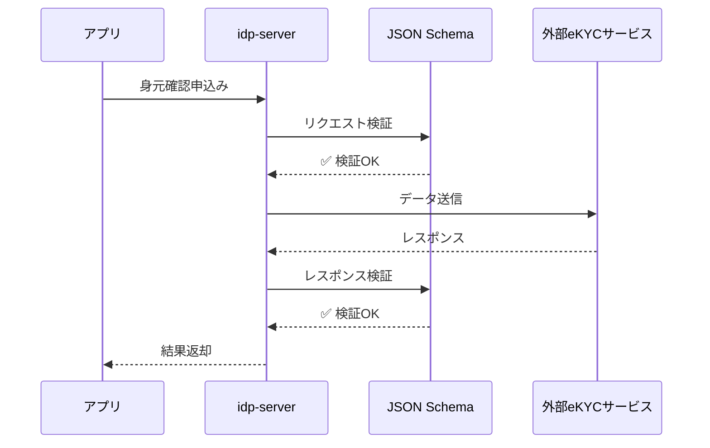

# スキーマバリデーション（JSON Schema）

---

## 前提知識

このドキュメントを理解するには、以下の基礎知識が役立ちます：

- [身元確認済みID](concept-03-id-verified.md) - 身元確認プロセスの概要
- [外部サービス連携](concept-16-external-service-integration.md) - 外部API連携の仕組み
- [認証ポリシー](concept-05-authentication-policy.md) - 認証フローの設定

---

## 概要

`idp-server` は、**JSON Schema**を用いた柔軟かつ厳格なデータ検証機能を提供します。

**JSON Schemaバリデーション**とは、JSONデータの構造・型・制約を定義し、リクエストやレスポンスが仕様に準拠しているかを自動的に検証する仕組みです。



idp-serverでは以下のような用途に対応できます：

* **初期登録**: ユーザー属性の柔軟な定義とバリデーション
* **身元確認申込み**: 外部eKYCサービスとの連携時のデータ検証
* **外部API連携**: リクエスト/レスポンスの型安全性確保
* **マルチテナント**: テナントごとの独自検証ルール定義

---

## なぜJSON Schemaを採用したのか

### 1. 柔軟性と拡張性

従来の固定的なバリデーションロジックでは、テナントごとの要件変更に対応できません。

**従来の問題点:**
```java
// ❌ 固定的なバリデーション - テナントごとの要件変更に対応不可
if (request.email == null || !request.email.matches("^[a-z]+@[a-z]+\\.[a-z]+$")) {
    throw new ValidationException("invalid email");
}
if (request.age < 18) {
    throw new ValidationException("age must be 18 or over");
}
```

**JSON Schemaによる解決:**
```json
{
  "properties": {
    "email": {
      "type": "string",
      "format": "email"
    },
    "age": {
      "type": "integer",
      "minimum": 18
    }
  }
}
```

**メリット:**
- テナントごとに異なる検証ルールを定義可能
- コード変更不要で検証ロジックを変更可能
- Control Plane APIで動的に設定を更新可能

---

### 2. 外部サービス連携の型安全性

外部eKYCサービスとの連携では、サービスごとに異なるAPI仕様に対応する必要があります。



**メリット:**
- 外部サービスAとBで異なる要求項目を柔軟に定義
- データ変換ミスを早期検出
- 外部サービスの仕様変更に素早く対応

---

### 3. セキュリティ向上

JSON Schemaによる厳格な検証は、セキュリティ脅威を防止します。

**防止できる脅威:**

#### インジェクション攻撃
```json
{
  "properties": {
    "username": {
      "type": "string",
      "pattern": "^[a-zA-Z0-9_-]+$",
      "maxLength": 50
    }
  }
}
```
→ SQLインジェクション、XSS攻撃のリスクを軽減

#### データ型の厳格化
```json
{
  "properties": {
    "age": {
      "type": "integer",
      "minimum": 0,
      "maximum": 150
    }
  }
}
```
→ 型混乱攻撃（Type Confusion）を防止

#### データサイズ制限
```json
{
  "properties": {
    "address": {
      "type": "string",
      "maxLength": 500
    }
  }
}
```
→ DoS攻撃（巨大データ送信）を防止

---

### 4. 標準仕様準拠

JSON Schemaは業界標準であり、多くのツールやライブラリがサポートしています。

**メリット:**
- OpenAPI仕様との連携が容易
- バリデーションロジックの再利用が可能
- エコシステムが豊富（エディタのサポート、自動生成ツール等）

**準拠仕様:**
- JSON Schema Draft 2020-12
- OpenAPI 3.0/3.1
- OpenID Connect for Identity Assurance (OIDC4IDA)

---

## idp-serverでのJSON Schema活用シーン

### 1. 初期登録（ユーザー属性登録）

**用途**: ユーザー登録時の必須項目・形式をテナントごとに定義

**設定例:**
```json
{
  "type": "initial-registration",
  "payload": {
    "required": ["email", "password", "name"],
    "properties": {
      "email": {
        "type": "string",
        "format": "email",
        "maxLength": 255
      },
      "password": {
        "type": "string",
        "pattern": "^(?=.*[A-Z])(?=.*\\d)(?=.*[!@#$%^&*()]).+$",
        "minLength": 8,
        "maxLength": 64
      },
      "name": {
        "type": "string",
        "maxLength": 255
      }
    }
  }
}
```

**バリデーションフロー:**
```
APIリクエスト
  ↓
JsonSchemaValidator.validate()
  ↓
検証結果（JsonSchemaValidationResult）
  ├─ 成功 → ユーザー作成
  └─ 失敗 → 400 Bad Request + エラー詳細
```

**詳細**: [初期登録設定ガイド](../content_06_developer-guide/05-configuration/authn/initial-registration.md)

---

### 2. 身元確認申込み

**用途**: 外部eKYCサービスへのリクエストデータ検証

**設定例:**
```json
{
  "processes": {
    "apply": {
      "request": {
        "schema": {
          "type": "object",
          "required": ["last_name", "first_name", "birthdate"],
          "properties": {
            "last_name": {
              "type": "string",
              "maxLength": 255
            },
            "first_name": {
              "type": "string",
              "maxLength": 255
            },
            "birthdate": {
              "type": "string",
              "format": "date"
            },
            "address": {
              "type": "object",
              "required": ["postal_code", "country"],
              "properties": {
                "postal_code": {
                  "type": "string",
                  "pattern": "^[0-9]{3}-[0-9]{4}$"
                },
                "country": {
                  "type": "string",
                  "enum": ["JP", "US", "GB"]
                }
              }
            }
          }
        }
      }
    }
  }
}
```

**バリデーションフロー:**
```
POST /{tenant}/v1/me/identity-verification/applications/{type}/apply
  ↓
JsonSchemaValidator.validate(request, schema)
  ↓
検証結果
  ├─ 成功 → 外部eKYCサービスへデータ送信
  └─ 失敗 → 400 Bad Request + error_messages配列
```

**エラーレスポンス例:**
```json
{
  "error": "invalid_request",
  "error_description": "The identity verification request is invalid. Please review your input for missing or incorrect fields.",
  "error_messages": [
    "last_name is missing",
    "birthdate is not a string",
    "address.postal_code pattern is ^[0-9]{3}-[0-9]{4}$"
  ]
}
```

**詳細**: [身元確認申込みガイド](../content_05_how-to/how-to-16-identity-verification-application.md)

---

### 3. 外部サービスレスポンス検証

**用途**: 外部サービスからのレスポンスが期待通りの形式であることを確認

**設定例:**
```json
{
  "processes": {
    "callback-result": {
      "request": {
        "schema": {
          "type": "object",
          "required": ["application_id", "status", "verified_data"],
          "properties": {
            "application_id": {
              "type": "string"
            },
            "status": {
              "type": "string",
              "enum": ["approved", "rejected"]
            },
            "verified_data": {
              "type": "object",
              "required": ["family_name", "given_name", "birthdate"]
            }
          }
        }
      }
    }
  }
}
```

**メリット:**
- 外部サービスの仕様変更を検出
- データ不整合を早期発見
- デバッグの効率化

---

## JSON Schemaでできること

JSON Schemaは以下のような検証を宣言的に定義できます：

### 主要な検証機能

- **型検証**: string, integer, boolean, object, array
- **必須項目**: `required: ["email", "name"]`
- **文字列制約**: 長さ（minLength/maxLength）、パターン（正規表現）、フォーマット（email, date, uuid等）
- **数値制約**: 最小値/最大値（minimum/maximum）
- **列挙値**: `enum: ["JP", "US", "GB"]`
- **ネストされたオブジェクト**: 階層的な構造の検証

### 設定例

```json
{
  "type": "object",
  "required": ["email", "password", "address"],
  "properties": {
    "email": {
      "type": "string",
      "format": "email",
      "maxLength": 255
    },
    "password": {
      "type": "string",
      "pattern": "^(?=.*[A-Z])(?=.*\\d)(?=.*[!@#$%^&*()]).+$",
      "minLength": 8
    },
    "age": {
      "type": "integer",
      "minimum": 18,
      "maximum": 100
    },
    "address": {
      "type": "object",
      "required": ["postal_code", "country"],
      "properties": {
        "postal_code": {
          "type": "string",
          "pattern": "^[0-9]{3}-[0-9]{4}$"
        },
        "country": {
          "type": "string",
          "enum": ["JP", "US", "GB"]
        }
      }
    }
  }
}
```

### エラーレスポンス例

**不正なリクエスト:**
```json
{
  "last_name": 123,
  "email": "invalid-email"
}
```

**エラーレスポンス:**
```json
{
  "error": "invalid_request",
  "error_description": "The identity verification request is invalid. Please review your input for missing or incorrect fields.",
  "error_messages": [
    "last_name is not a string",
    "first_name is missing",
    "email format is email"
  ]
}
```

エラーメッセージは自動的に生成され、どのフィールドに問題があるかが明確に示されます。

---

## 関連ドキュメント

### 設定方法
- [初期登録設定](../content_06_developer-guide/05-configuration/authn/initial-registration.md) - JSON Schemaの詳細設定
- [身元確認申込み](../content_05_how-to/how-to-16-identity-verification-application.md) - 申込みテンプレートでの活用

### API仕様
- [リソースオーナー用API](../content_07_reference/api-reference/api-resource-owner-ja.md) - バリデーションエラーのレスポンス形式

### E2Eテスト
- `e2e/src/tests/integration/ida/integration-04-jsonschema-validation-logging.test.js` - バリデーションログの動作確認
