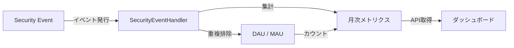
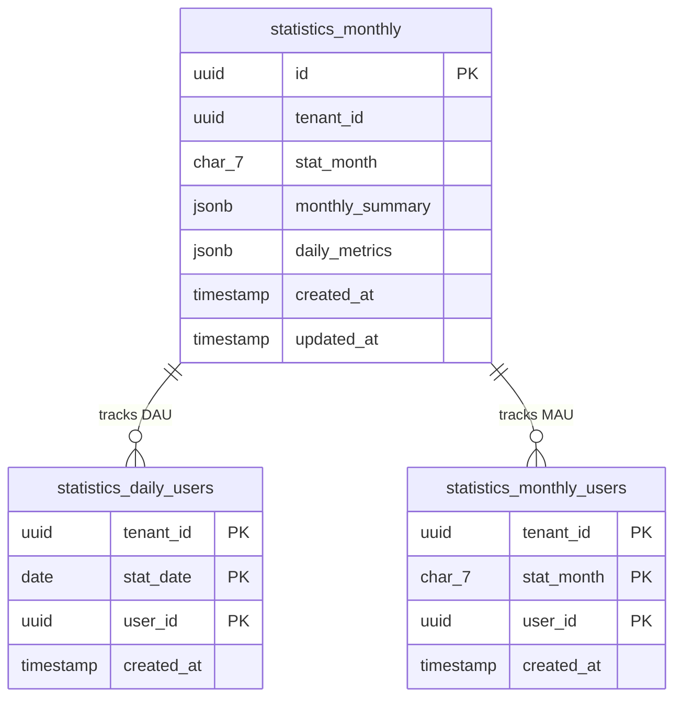
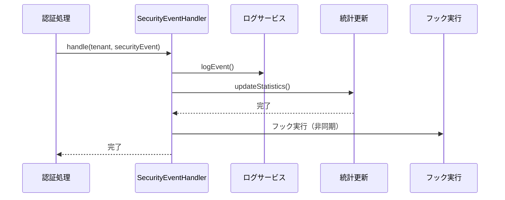
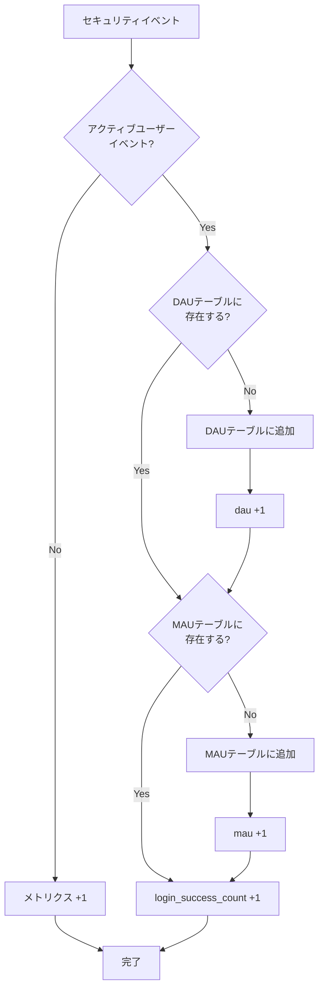
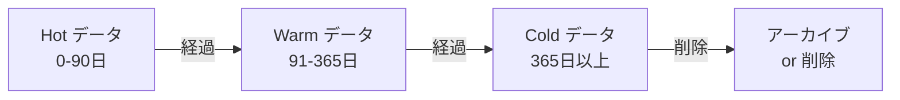
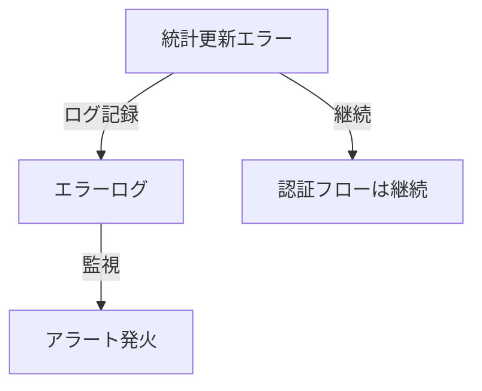

# テナント統計管理

idp-serverのテナント統計管理システムの概念について説明します。

## テナント統計とは

**テナント統計（Tenant Statistics）** とは、各テナントのユーザー活動やシステム利用状況を月次・日次で集計・分析するための仕組みです。



### 目的

- **利用状況の可視化**: DAU（日次アクティブユーザー）、MAU（月次アクティブユーザー）、ログイン数などの把握
- **容量計画**: テナントごとのリソース使用状況の追跡
- **課金基盤**: MAUベースの課金データ提供
- **セキュリティ監視**: 異常なアクティビティの検知

---

## アーキテクチャの選択

### イベント駆動 vs バッチ処理

idp-serverでは、バッチ処理ではなく**イベント駆動によるリアルタイム統計更新**を採用しています。

| アプローチ | 特徴 | メリット | デメリット |
|:---|:---|:---|:---|
| **バッチ処理** | 定期的に過去データを集計 | シンプル | データ遅延、高負荷 |
| **イベント駆動** | イベント発生時に増分更新 | リアルタイム、低負荷 | 実装複雑 |

**イベント駆動を選択する理由**:
- セキュリティイベントは既に発行されている（追加コスト小）
- リアルタイムな可視化が可能
- 増分更新のため計算コストが低い
- トランザクション整合性を保証できる

**トレードオフ**:
- イベントハンドラーの複雑性増加
- 統計更新失敗時のエラーハンドリング必要
- ただし、認証フローと統計更新は疎結合（統計失敗でも認証は成功）

---

## データモデル

### データベーステーブル構成

統計データは3つのテーブルで管理されます。



### テーブル詳細

#### statistics_monthly

月次統計のメインテーブル。1テナント・1月 = 1レコードで管理。

| カラム | 型 | 説明 |
|:---|:---|:---|
| `id` | UUID | 統計レコードID |
| `tenant_id` | UUID | テナント識別子 |
| `stat_month` | CHAR(7) | 統計対象月（YYYY-MM形式、例: 2025-01） |
| `monthly_summary` | JSONB | 月次集計メトリクス |
| `daily_metrics` | JSONB | 日別メトリクス（キー: 日番号 01-31） |

**月次集計メトリクス（monthly_summary）の例**:

```json
{
  "mau": 5000,
  "login_success_count": 45000,
  "dau": 3200,
  "issue_token_success": 12000,
  "refresh_token_success": 8000
}
```

**日別メトリクス（daily_metrics）の例**:

```json
{
  "1": {"dau": 100, "login_success_count": 1500},
  "2": {"dau": 110, "login_success_count": 1600},
  "15": {"dau": 95, "login_success_count": 1400},
  "31": {"dau": 88, "login_success_count": 1200}
}
```

#### statistics_daily_users

日次アクティブユーザー（DAU）の重複排除テーブル。

| カラム | 型 | 説明 |
|:---|:---|:---|
| `tenant_id` | UUID | テナント識別子 |
| `stat_date` | DATE | 統計対象日 |
| `user_id` | UUID | ユーザー識別子 |

**複合主キー**: `(tenant_id, stat_date, user_id)`

同一ユーザーが同じ日に複数回ログインしても、1レコードのみ記録されます。

#### statistics_monthly_users

月次アクティブユーザー（MAU）の重複排除テーブル。

| カラム | 型 | 説明 |
|:---|:---|:---|
| `tenant_id` | UUID | テナント識別子 |
| `stat_month` | CHAR(7) | 統計対象月（YYYY-MM形式） |
| `user_id` | UUID | ユーザー識別子 |

**複合主キー**: `(tenant_id, stat_month, user_id)`

同一ユーザーが同じ月に複数回ログインしても、1レコードのみ記録されます。

---

## 統計更新フロー

### SecurityEventHandlerによる統計収集

セキュリティイベント発行時に、`SecurityEventHandler`が統計を同期的に更新します。



### アクティブユーザーイベントの判定

以下のセキュリティイベントがアクティブユーザーイベントとして判定されます（`DefaultSecurityEventType.isActiveUserEvent()`）:

| イベントタイプ | 説明 |
|:---|:---|
| `login_success` | ログイン成功 |
| `issue_token_success` | トークン発行成功 |
| `refresh_token_success` | トークンリフレッシュ成功 |
| `inspect_token_success` | トークン検証成功 |

### 統計更新処理の詳細



**処理フロー**:

1. **イベント種別判定**: `DefaultSecurityEventType.isActiveUserEvent()` でアクティブユーザーイベントか判定
2. **タイムゾーン変換**: UTCタイムスタンプをテナントのタイムゾーンに変換して日付を決定
3. **DAU処理**: `statistics_daily_users` テーブルでユーザーの初回アクティビティを検出
4. **MAU処理**: `statistics_monthly_users` テーブルでユーザーの月初アクティビティを検出
5. **メトリクス更新**: 日次・月次メトリクスをJSONBで増分更新

---

## メトリクス種別

### 収集されるメトリクス

| メトリクス名 | 説明 | 集計レベル |
|:---|:---|:---|
| `dau` | 日次アクティブユーザー数 | 日次 |
| `mau` | 月次アクティブユーザー数 | 月次 |
| `login_success_count` | ログイン成功回数 | 日次・月次 |
| `issue_token_success` | トークン発行成功回数 | 日次・月次 |
| `refresh_token_success` | トークンリフレッシュ成功回数 | 日次・月次 |
| その他セキュリティイベント | イベント種別ごとにカウント | 日次・月次 |

### カウントパターン

#### パターン1: シンプルなカウンター

セキュリティイベント発生ごとにメトリクスを+1します。

```
イベント発生 → daily_metrics[day].{metric} +1
           → monthly_summary.{metric} +1
```

**適用**: 非アクティブユーザーイベント（例: `password_failure`, `authorize_failure`）

#### パターン2: ユニークカウンター（DAU/MAU）

重複排除テーブルを使用してユニークユーザーをカウントします。

```
ログイン成功 → statistics_daily_users に INSERT（重複時は無視）
           → 新規なら dau +1
           → statistics_monthly_users に INSERT（重複時は無視）
           → 新規なら mau +1
           → login_success_count +1
```

---

## タイムゾーン処理

グローバルなマルチテナント環境では、タイムゾーン処理が重要です。

```java
// SecurityEventHandler.updateStatistics() より
LocalDate eventDate = securityEvent
    .createdAt()
    .value()
    .atZone(ZoneOffset.UTC)
    .withZoneSameInstant(tenant.timezone())
    .toLocalDate();
```

**原則**:
- イベントのタイムスタンプはUTCで記録
- 統計日付はテナントのタイムゾーンで計算
- 例: 東京のテナント（JST +9）の23:30 UTC → 翌日08:30 JST として集計

---

## データベース実装

### PostgreSQL vs MySQL

両データベースで同等の機能を提供しています。

| 機能 | PostgreSQL | MySQL |
|:---|:---|:---|
| UUID生成 | `gen_random_uuid()` | `UUID()` |
| JSON型 | `JSONB` | `JSON` |
| JSONパス更新 | `jsonb_set()` | `JSON_SET()` |
| UPSERT | `ON CONFLICT ... DO UPDATE` | `ON DUPLICATE KEY UPDATE` |
| 行レベルセキュリティ | RLSポリシー | なし（アプリ層で制御） |

### UPSERT による増分更新

アトミックな増分更新により、同時実行制御を実現しています。

**PostgreSQL例**:
```sql
INSERT INTO statistics_monthly (...)
VALUES (...)
ON CONFLICT (tenant_id, stat_month)
DO UPDATE SET
    daily_metrics = jsonb_set(
        COALESCE(statistics_monthly.daily_metrics, '{}'::jsonb),
        ARRAY[?::text],
        jsonb_set(
            COALESCE(statistics_monthly.daily_metrics->?::text, '{}'::jsonb),
            ARRAY[?::text],
            to_jsonb(COALESCE((statistics_monthly.daily_metrics->?::text->>?::text)::int, 0) + ?::int)
        )
    ),
    updated_at = now()
```

**メリット**:
- ロック不要
- デッドロック回避
- 高スループット

---

## 管理API

### エンドポイント

#### システムレベルAPI

```
GET /v1/management/tenants/{tenantId}/statistics?from=2025-01&to=2025-12
```

#### 組織レベルAPI

```
GET /v1/management/organizations/{orgId}/tenants/{tenantId}/statistics?from=2025-01&to=2025-12
```

### リクエストパラメータ

| パラメータ | 必須 | 型 | 説明 |
|:---|:---|:---|:---|
| `from` | Yes | String | 開始月（YYYY-MM形式、例: 2025-01） |
| `to` | Yes | String | 終了月（YYYY-MM形式、例: 2025-12） |
| `limit` | No | Integer | 最大取得件数（デフォルト: 12、最大: 100） |
| `offset` | No | Integer | スキップ件数（デフォルト: 0） |

### レスポンス

```json
{
  "list": [
    {
      "stat_month": "2025-01",
      "monthly_summary": {
        "mau": 5000,
        "login_success_count": 45000,
        "dau": 3200
      },
      "daily_metrics": {
        "1": {"dau": 100, "login_success_count": 1500},
        "2": {"dau": 110, "login_success_count": 1600}
      },
      "created_at": "2025-01-01T00:00:00Z",
      "updated_at": "2025-01-31T23:59:59Z"
    }
  ],
  "total_count": 12,
  "limit": 12,
  "offset": 0
}
```

### 必要な権限

| API | 必要権限 |
|:---|:---|
| システムレベル | `TENANT_READ` |
| 組織レベル | `TENANT_READ` + 組織メンバーシップ |

---

## データ保持戦略

### ライフサイクル管理



### クリーンアップ関数

PostgreSQLでは以下のクリーンアップ関数が提供されています:

```sql
-- 月次統計データの削除（指定月数より古いデータ）
SELECT cleanup_old_statistics(12);  -- 12ヶ月より古いデータを削除

-- 日次アクティブユーザーデータの削除（指定日数より古いデータ）
SELECT cleanup_old_daily_users(90);  -- 90日より古いデータを削除

-- 月次アクティブユーザーデータの削除（指定月数より古いデータ）
SELECT cleanup_old_monthly_users(12);  -- 12ヶ月より古いデータを削除
```

**推奨保持期間**:
- **統計データ（statistics_monthly）**: 24ヶ月
- **DAUデータ（statistics_daily_users）**: 90日
- **MAUデータ（statistics_monthly_users）**: 12ヶ月

---

## パフォーマンス考慮事項

### インデックス戦略

```sql
-- 時系列クエリ用（最頻出）
CREATE INDEX idx_statistics_monthly_tenant_month
    ON statistics_monthly (tenant_id, stat_month DESC);

-- DAUカウントクエリ用
CREATE INDEX idx_statistics_daily_users_tenant_date
    ON statistics_daily_users (tenant_id, stat_date);

-- MAUカウントクエリ用
CREATE INDEX idx_statistics_monthly_users_tenant_month
    ON statistics_monthly_users (tenant_id, stat_month);
```

### 増分更新による負荷軽減

**避けるべきパターン**:
```
❌ 毎回全レコードを再計算（高コスト）
   statistics = load_all_events_today()
   recalculate(statistics)
```

**推奨パターン**:
```
✅ 増分更新のみ（低コスト）
   incrementDailyMetric(tenant, month, day, metric, +1)
```

---

## モニタリング

### 統計更新エラーの挙動

統計更新エラーは認証フローを停止しません（疎結合設計）。



### 監視すべき指標

- 統計更新の成功率
- DAU/MAUの急激な変動
- メトリクス更新のレイテンシ

---

## ユースケース

### 1. ダッシュボード表示

テナント管理者が自テナントの利用状況を可視化します。

**表示メトリクス**:
- DAU/MAU トレンドグラフ
- 認証成功率
- トークン発行数推移

### 2. MAUベース課金

月次アクティブユーザー数に基づく従量課金を実現します。

```json
{
  "stat_month": "2025-01",
  "monthly_summary": {
    "mau": 5000  // この値で課金計算
  }
}
```

### 3. セキュリティ監視

異常なアクティビティを検知します。

**検知パターン**:
- DAUの急増（ボット攻撃の可能性）
- ログイン失敗率の急上昇
- 特定時間帯への集中

---

## 関連ドキュメント

- [セキュリティイベント・フック](concept-11-security-events.md) - イベント駆動アーキテクチャ
- [マルチテナント](concept-01-multi-tenant.md) - テナント分離の基本概念
- [監査とコンプライアンス](concept-13-audit-compliance.md) - 監査ログとの関係
