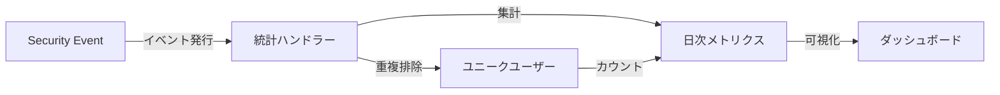
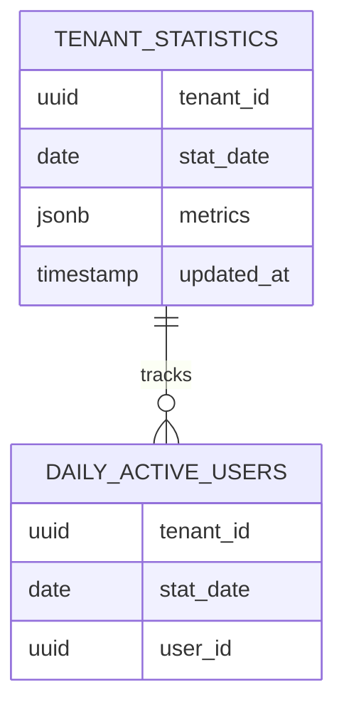
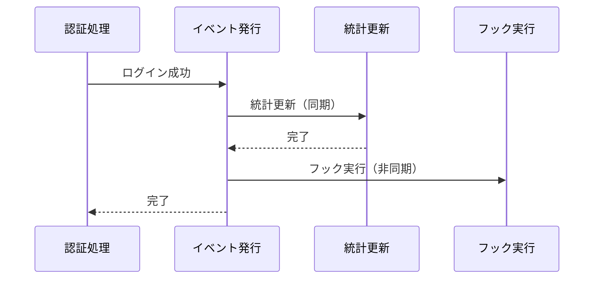
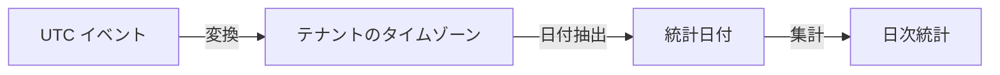
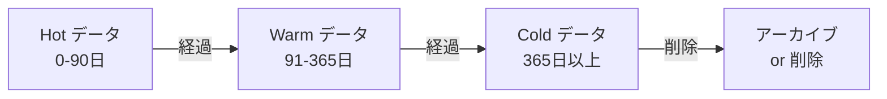
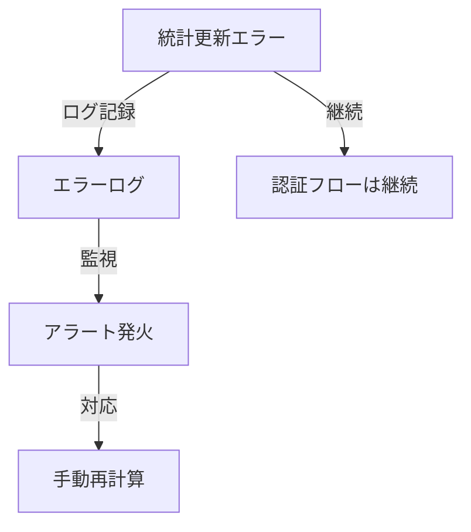

# テナント統計管理

idp-serverのテナント統計管理システムの概念について説明します。

## テナント統計とは

**テナント統計（Tenant Statistics）** とは、各テナントのユーザー活動やシステム利用状況を日次で集計・分析するための仕組みです。



### 目的

- **利用状況の可視化**: DAU、ログイン数、トークン発行数などの把握
- **容量計画**: テナントごとのリソース使用状況の追跡
- **課金基盤**: 利用量ベースの課金データ提供
- **セキュリティ監視**: 異常なアクティビティの検知

---

## アーキテクチャの選択

### イベント駆動 vs バッチ処理

idp-serverでは、バッチ処理ではなく**イベント駆動によるリアルタイム統計更新**を採用しています。

| アプローチ | 特徴 | メリット | デメリット |
|:---|:---|:---|:---|
| **バッチ処理** | 定期的に過去データを集計 | シンプル | データ遅延、高負荷 |
| **イベント駆動** | イベント発生時に増分更新 | リアルタイム、低負荷 | 実装複雑 |

**イベント駆動を選択する理由**:
- セキュリティイベントは既に発行されている（追加コスト小）
- リアルタイムな可視化が可能
- 増分更新のため計算コストが低い
- トランザクション整合性を保証できる

**トレードオフ**:
- ❌ イベントハンドラーの複雑性増加
- ❌ 統計更新失敗時のエラーハンドリング必要
- ✅ ただし、認証フローと統計更新は疎結合（統計失敗でも認証は成功）

---

## データモデル

### 統計データの構造



**設計の要点**:
- **1テナント・1日 = 1レコード**: `(tenant_id, stat_date)` の一意制約
- **JSONB形式**: 柔軟なメトリクス格納
- **別テーブル管理**: ユニークカウント（DAU等）は専用テーブルで重複排除

### メトリクスの柔軟性（JSONB）

メトリクスはJSONB形式で格納され、スキーマ変更なしで拡張可能です：

```json
{
  "user_activity": {
    "dau": 1250,
    "login_count": 1560
  },
  "authentication": {
    "password": 800,
    "webauthn": 450,
    "federation": 310
  },
  "tokens": {
    "issued": 1200,
    "refreshed": 890
  }
}
```

**JSONBを採用する理由**:
- **柔軟性**: 将来のメトリクス追加が容易
- **階層化**: カテゴリ別にメトリクスを整理
- **テナント固有性**: テナントごとに異なるメトリクスセット対応
- **クエリ性能**: GINインデックスによる高速検索

---

## 統計更新フロー

### イベント駆動更新

セキュリティイベント発行時に統計を同期的に更新します。



**同期実行の理由**:
- トランザクション整合性の保証
- エラー発生時の即座な検知
- 統計とイベントの強い一貫性

**失敗時の挙動**:
- 統計更新エラーはログ記録のみ
- 認証フローは継続（疎結合）

---

## メトリクス集計パターン

### パターン1: シンプルなカウンター

イベント発生回数をカウントする最も基本的なパターンです。

```
イベント発生 → メトリクス +1
```

**適用例**: ログイン試行、トークン発行、API呼び出し

### パターン2: ユニークエンティティのカウント

重複を排除してユニークなエンティティをカウントします。

```
イベント発生 → エンティティ記録
           → 新規なら メトリクス +1
           → 既存なら スキップ
```

**DAU（Daily Active Users）の例**:
- 同じユーザーが1日に複数回ログインしても、DAUは1
- 別テーブル（`daily_active_users`）で重複を管理
- 初回アクティビティのみメトリクスを増分

**応用**:
- DAC (Daily Active Clients) - 日次アクティブクライアント
- DAD (Daily Active Devices) - 日次アクティブデバイス

### パターン3: 集約メトリクス

複数の基本メトリクスから計算される派生メトリクスです。

```
基本: login_success_count, login_failure_count
派生: login_success_rate = success / (success + failure) × 100
```

**計算タイミングの選択**:
- **リアルタイム計算**: クエリ時に計算（最新値、計算コスト）
- **事前計算**: 定期的に計算して保存（高速、若干の遅延）

---

## タイムゾーン処理

グローバルなマルチテナント環境では、タイムゾーン処理が重要です。



**原則**:
- イベントのタイムスタンプはUTC
- 統計日付はテナントのタイムゾーンで計算
- 例: 東京のテナント（JST +9）の23:30 UTC → 翌日の統計

**重要性**:
- 正確な日次集計
- テナントごとの営業日の尊重
- 時差による集計ズレの防止

---

## データ保持戦略

### ライフサイクル管理



**推奨保持期間**:
- **Hot** (頻繁アクセス): 90日 - ダッシュボード表示用
- **Warm** (時々アクセス): 365日 - 年次レポート用
- **Cold** (稀にアクセス): S3等の外部ストレージへアーカイブ

**クリーンアップ**:
- 定期的な古いデータの削除
- ディスク容量の管理
- VACUUM実行による領域回収

---

## パフォーマンス考慮事項

### 増分更新戦略

**避けるべきパターン**:
```
❌ 毎回全レコードを再計算（高コスト）
   statistics = load_all_events_today()
   recalculate(statistics)
```

**推奨パターン**:
```
✅ 増分更新のみ（低コスト）
   increment_metric(tenant, date, metric_name, +1)
```

### インデックス戦略

**3種類のインデックス**:
1. **時系列インデックス**: `(tenant_id, stat_date DESC)` - 最頻出クエリ
2. **日付インデックス**: `(stat_date)` - クロステナント分析
3. **JSONB GINインデックス**: `(metrics)` - 柔軟な検索

### UPSERT による競合回避

アトミックな増分更新により、同時実行制御が不要になります：

```
INSERT ... ON CONFLICT ... UPDATE
  metrics = JSON_SET(metrics, path, value + 1)
```

**メリット**:
- ロック不要
- デッドロック回避
- 高スループット

---

## 管理API

### システムレベル vs 組織レベル

| レベル | エンドポイント | 権限 | 用途 |
|:---|:---|:---|:---|
| **システム** | `/v1/management/tenants/{id}/statistics` | システム管理者 | 全テナント管理 |
| **組織** | `/v1/management/organizations/{orgId}/tenants/{id}/statistics` | 組織管理者 | 組織配下テナント管理 |

**組織レベルの権限チェック**:
1. 組織メンバーシップ検証
2. テナントアクセス検証
3. 組織-テナント関係検証

---

## モニタリング

### 統計の健全性チェック

**監視すべき指標**:
- 統計更新の成功率
- メトリクス更新の遅延
- 異常値の検知（前日比、平均比）

**アラート例**:
- DAUが前日比50%以上増減
- 統計更新エラー率が1%超過
- メトリクス更新が1時間以上遅延

### 統計更新失敗時の対応



**原則**: 統計更新の失敗は認証フローを停止すべきではない

---

## ユースケース

### 1. ダッシュボード表示

テナント管理者が自テナントの利用状況を可視化します。

**表示メトリクス**:
- DAU/WAU/MAU トレンド
- 認証成功率
- トークン発行数

### 2. 課金基盤

利用量ベースの課金を実現します。

**課金メトリクス**:
- 月間アクティブユーザー数（MAU）
- API呼び出し数
- ストレージ使用量

### 3. 容量計画

リソース増強の判断材料を提供します。

**分析内容**:
- ユーザー増加トレンド
- ピーク時の負荷
- 将来予測

### 4. セキュリティ監視

異常なアクティビティを検知します。

**検知パターン**:
- ログイン失敗の急増
- 特定ユーザーの異常なAPI呼び出し
- 通常と異なる時間帯のアクセス

---

## 関連ドキュメント

- [セキュリティイベント・フック](concept-11-security-events.md) - イベント駆動アーキテクチャ
- [マルチテナント](concept-01-multi-tenant.md) - テナント分離の基本概念
- [監査とコンプライアンス](concept-13-audit-compliance.md) - 監査ログとの関係
