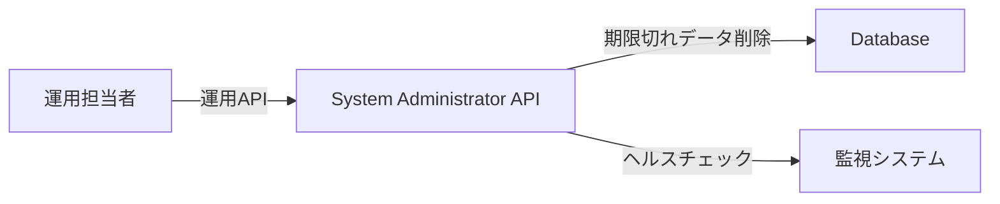
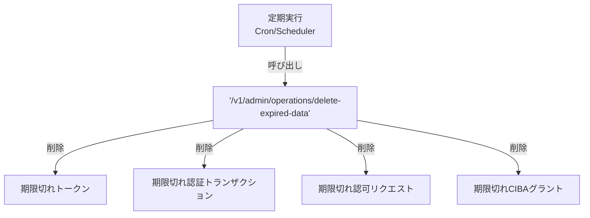

# 運用・保守

---

## 前提知識

このドキュメントを理解するには、以下の基礎知識が役立ちます：

- [コントロールプレーン](concept-02-control-plane.md) - Management APIの概要
- [監査ログ](concept-20-audit-compliance.md) - 監査証跡の保持

---

## 概要

idp-serverは、運用・保守を支援する機能を提供します。

**運用（Operations）** とは、システムを安定稼働させるための日常的な管理作業です。



idp-serverでは以下のような用途に対応できます：

* 期限切れデータの自動削除（トークン、認証トランザクション等）
* ヘルスチェックエンドポイントの提供

---

## idp-serverにおける運用の設計思想

### 1. 運用APIによる自動メンテナンス

idp-serverは、**System Administrator API** で運用操作を提供します。



**運用API**:
- `/v1/admin/operations/delete-expired-data`: 期限切れデータの一括削除

**特徴**:
- バッチ処理に最適
- 最大削除件数を指定可能（デフォルト10,000件）
- 定期実行（Cron等）で自動メンテナンス

### 2. 期限切れデータの自動削除

idp-serverは、以下のデータを自動削除します。

**削除対象**:

| データ種別 | 削除条件 | 理由 |
|:---|:---|:---|
| **OAuthトークン** | 有効期限切れ | 不要なデータの削減 |
| **認証トランザクション** | 有効期限切れ | セッション期限切れ |
| **認可リクエスト** | 有効期限切れ | 認可コード期限切れ |
| **CIBAグラント** | 有効期限切れ | バックチャネル認証期限切れ |

**削除されないデータ**:
- 監査ログ（`audit_log`）
- セキュリティイベント（`security_event`）

詳細は [concept-13: 監査ログ](concept-20-audit-compliance.md) を参照。

### 3. ヘルスチェック・モニタリング

idp-serverは、**Spring Boot Actuator** でヘルスチェックを提供します。

**ヘルスチェック**:
```
GET /actuator/health
→ {"status": "UP"}
```


## ユースケース

### 1. 定期メンテナンス: 期限切れデータの削除

毎日深夜に期限切れデータを自動削除。

- **実行**: Cronで`POST /v1/admin/operations/delete-expired-data`を定期実行
- **対象**: 期限切れトークン、認証トランザクション、認可リクエスト、CIBAグラント
- **効果**: データベース容量の削減、パフォーマンス維持

### 2. 監視: ヘルスチェック

ヘルスチェックエンドポイントで稼働状態を確認可能。

- **エンドポイント**: `/actuator/health`
- **レスポンス**: `{"status": "UP"}`
- **効果**: 外部監視システムからの稼働確認

---

## セキュリティ考慮事項

- **削除対象の明確化**: 期限切れのみ削除、監査ログは保持
- **最大削除件数**: 一度に大量削除を避ける（デフォルト10,000件）

---

## 関連ドキュメント

- [監査ログ](concept-20-audit-compliance.md) - 監査証跡、データ保持ポリシー
- [コントロールプレーン](concept-02-control-plane.md) - Management API、System Administrator権限
- [運用ガイダンス](../content_08_ops/commercial-deployment/05-operational-guidance.md) - 詳細な運用手順、トラブルシューティング

---

## 参考

### 運用ベストプラクティス
- [Spring Boot Actuator](https://docs.spring.io/spring-boot/reference/actuator/index.html) - ヘルスチェック・メトリクス
