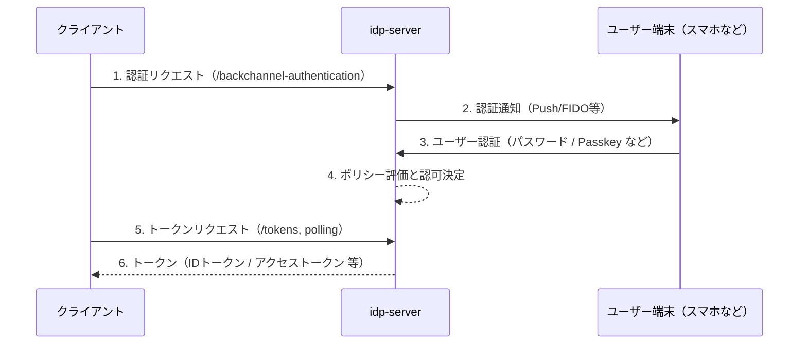

# CIBA フロー

## 概要

`idp-server` は、OpenID Connect
の拡張仕様である [OpenID Connect CIBA (Client Initiated Backchannel Authentication)](https://openid.net/specs/openid-clientAttributes-initiated-backchannel-authentication-core-1_0.html)
をサポートしています。

スマートフォン等のユーザー操作可能な端末を用いた非同期認証を実現し、以下のようなユースケースに最適です。

- 生体認証・FIDOを用いたリモート承認
- 金融機関の第二要素としての身元確認

## シーケンス（抽象）

## login_hint

`idp-server` は CIBA フローの login_hint パラメータに対して、複数の識別子形式をサポートしています。これにより、柔軟なユーザー特定が可能です。

CIBA 仕様 に準拠し、login_hint はユーザー識別のヒントとして使用されます。

### サポート形式

以下のような接頭辞つきの拡張形式に対応しており、ユーザーの識別方法を柔軟に指定できます：

| フォーマット                                | 意味              | 例                                      |
|---------------------------------------|-----------------|----------------------------------------|
| `sub:<subject>`                       | 内部ユーザーIDで直接識別   | `sub:abc123`                           |
| `ex-sub:<subject>,idp:<id-provider>`  | 外部IdPのサブジェクトで識別 | `ex-sub:ex-idp123,idp:ex-idp`          |
| `device:<deviceId>,idp:<id-provider>` | 認証デバイスで識別       | `device:device123,idp:ex-idp`          |
| `email:<email>,idp:<id-provider>`     | メールアドレスによる識別    | `email:foo@example.com,idp:idp-server` |
| `phone:<number>,idp:<id-provider>`    | 電話番号による識別       | `phone:09012345678,idp:idp-server`     |

※ `id-provider` のデフォルト値は `idp-server`となります。 フェデレーションによる外部IdPを利用してユーザーを作成している場合は、外部IdPプロバイダー名を指定することができます。

## ユーザー通知・端末連携

- ユーザー端末への通知は `AuthenticationDeviceNotifier` プラグインにより実行されます
  - デフォルト実装: FCM (Firebase Cloud Messaging) / APNs対応
  - 通知チャネルは `AuthenticationDevice` の設定で制御

## 認証方式

CIBA フローにおけるユーザー認証も、通常の認可コードフローと同様に認証ポリシーに従い実行されます。

- Password 認証
- Passkey 認証
- FIDO-UAF 認証
- Email / SMS OTP
- 認可内容に応じた多段認証

## 認証ポリシー（概要）

通常の認可コードフローと同様に、認可対象のスコープ・acr_values などを条件に、認証の強度を制御することができます。

## デリバリーモード

`idp-server`は Poll・Push・Pingの3つのモードをサポートしています。

| 項目     | 説明                                                       | 備考                       |
|--------|----------------------------------------------------------|--------------------------|
| `Poll` | クライアントからポーリングを実施しトークンを取得する方式。                            |                          |
| `Push` | ユーザーの認証認可が完了した場合に、idp-serverからクライントにトークンをWebhookで連携する方式。 | FAPIでは利用不可。              |
| `Ping` | ユーザーの認証認可が完了した場合に、idp-serverからクライントに完了通知をWebhookで連携する方式。 | クライントで完了通知を受け取るAPIの開発が必要 |

## 設定項目

`idp-server`は、標準仕様に準拠した設定をサポートしています。

### 拡張設定

また、仕様には定義されていないけれど、CIBAフローを実現するために必要な項目も設定が可能となっています。

| 項目                                              | 説明                                 | デフォルト                                |
|-------------------------------------------------|------------------------------------|--------------------------------------|
| `backchannel_authentication_request_expires_in` | 認証リクエストの有効期限                       | 300秒                                 |
| `backchannel_authentication_polling_interval`   | ポーリング間隔（pollモード）                   | 5秒                                   |
| `default_ciba_authentication_interaction_type`  | デフォルト認証インタラクションタイプ                 | `authentication-device-notification` |
| `required_backchannel_auth_user_code`           | バックチャネル認証でユーザーコード入力を必須とするか         | `false`                              |
| `backchannel_auth_user_code_type`               | ユーザーコードのタイプ（`password` / `numeric`） | `password`                           |

## クライアント認証

このエンドポイントはクライアント認証を必要とします。
以下のクライアント認証方式に対応しています（Client Authentication）：

| 認証方式                          | 説明                                                                   | 
|-------------------------------|----------------------------------------------------------------------|
| `client_secret_basic`         | AuthorizationヘッダにBasic認証形式で `client_id` / `client_secret` を送信（デフォルト） | 
| `client_secret_post`          | `client_id` と `client_secret` をリクエストボディに含めて送信                        |
| `client_secret_jwt`           | `client_secret` を使って署名したJWTを `client_assertion` に含めて送信               |
| `private_key_jwt`             | 秘密鍵で署名したJWTを `client_assertion` に含めて送信。公開鍵は事前に登録されている必要あり            | 
| `tls_client_auth`（mTLS）       | クライアント証明書で相互TLS認証。サーバーは証明書のSubject DNやSANでクライアントを識別                  | 
| `self_signed_tls_client_auth` | 自己署名クライアント証明書でTLS認証。証明書のフィンガープリントを事前に登録して認証を成立させる                    |

## FAPI

- CIBA フローでも FAPI に対応しています。

## 便利機能

通常の認可コードフローと同様に、便利機能を利用することができます。

主な便利機能

1. claims:xx スコープによるIDトークンクレームの動的設定
2. verified_claims:xx スコープによるアクセストークンのプロパティの動的設定
