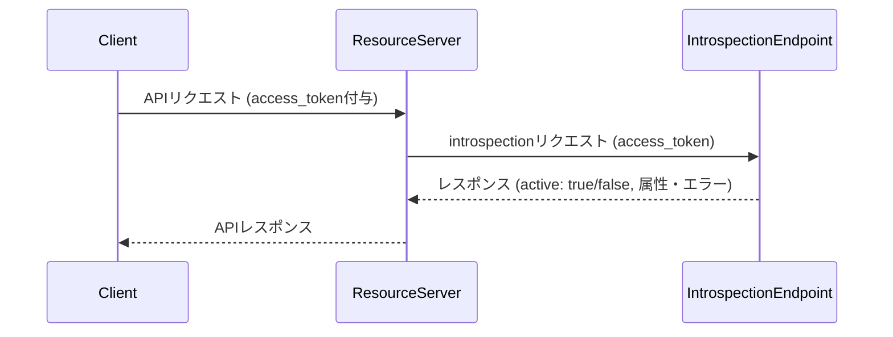

# イントロスペクション

## 1. イントロスペクションとは

イントロスペクション（Token Introspection）は、OAuth2.0やOpenID Connectで発行されたアクセストークンやリフレッシュトークンの有効性や属性情報を、クライアントやリソースサーバが確認するためのAPIエンドポイントです。主にリソースサーバがトークンを受け取った際、そのトークンが有効かつ正規のものであるかを検証する用途で利用されます。

---

## 2. シーケンス図



---

## 3. 正常系・異常系レスポンス

### 3.1 トークンが有効な場合（active: true）

```json
{
  "active": true,
  "scope": "openid profile email",
  "client_id": "example-client",
  "username": "user1",
  "exp": 1712328000,
  "iat": 1712324400,
  "nbf": 1712324400,
  "aud": "api.example.com",
  "iss": "https://idp.example.com",
  "sub": "user1",
  "cnf": {
    "x5t#S256": "XXXXXX（証明書サムプリント）"
  }
}
```
- active: true の場合は、トークンの属性情報（スコープ、クライアントID、ユーザ名、有効期限など）も含めて返却します。
- mTLS等のsender-constrained access tokenの場合、cnf パラメータも含まれます。

---

### 3.2 トークンが無効な場合（active: false, エラー理由明示）

以下のように、エラー理由が明確な場合のみ `active: false` とともに詳細情報が返却されます。

#### mTLS証明書が付与されていない

```json
{
  "active": false,
  "error": "invalid_token",
  "error_description": "Sender-constrained access token requires mTLS client certificate, but none was provided.",
  "status_code": 401
}
```

#### mTLS証明書のサムプリントが一致しない

```json
{
  "active": false,
  "error": "invalid_token",
  "error_description": "mTLS client certificate thumbprint does not match the sender-constrained access token.",
  "status_code": 401
}
```

#### スコープ不足（insufficient_scope）

```json
{
  "active": false,
  "error": "insufficient_scope",
  "error_description": "Requested scopes are not granted. Requested: management, Granted: phone openid profile write email",
  "status_code": 403
}
```

#### アクセストークンが期限切れ（リフレッシュは有効）

```json
{
  "active": false,
  "error": "invalid_token",
  "error_description": "Access token has expired, but the refresh token is still valid.",
  "status_code": 401
}
```

#### アクセストークンもリフレッシュトークンも期限切れ

```json
{
  "active": false,
  "error": "invalid_token",
  "error_description": "Token has expired (access and refresh tokens).",
  "status_code": 401
}
```

---

## 4. レスポンス属性一覧

| パラメータ         | 型      | 説明                              | 有効時 | 無効時 |
|--------------------|---------|-----------------------------------|--------|-----|
| active             | boolean | トークンが有効かどうか            | ○      | ○   |
| scope              | string  | トークン付与時のスコープ          | ○      | ×   |
| client_id          | string  | 発行元クライアントID              | ○      | ×   |
| username           | string  | トークン紐付けユーザ名            | ○      | ×   |
| exp                | number  | 有効期限（UNIXタイムスタンプ）    | ○      | ×   |
| iat                | number  | 発行日時（UNIXタイムスタンプ）    | ○      | ×   |
| nbf                | number  | Not Before（有効開始）            | ○      | ×   |
| aud                | string  | Audience                          | ○      | ×   |
| iss                | string  | Issuer                            | ○      | ×   |
| sub                | string  | Subject (ユーザID)                | ○      | ×   |
| cnf                | object  | mTLS等の証明書情報                | △      | ×   |
| error              | string  | エラーコード                      | ×      | ○    |
| error_description  | string  | エラー詳細                        | ×      | ○    |
| status_code        | number  | HTTPステータスコード相当          | ×      | ○    |

○: 返却される　×: 返却されない　△: 条件により返却

---

## 5. セキュリティ要件

- クライアント認証必須（不正な照会を防ぐ）
- active: true のときのみ、必要最小限の情報を返却
- active: false の場合は上記のようなエラー情報を付与

---

## 6. よくある質問（FAQ）

- Q: introspectエンドポイントの利用制限は？
    - A: クライアント認証を通過したリクエストのみ許可します。
- Q: トークンが失効した場合のレスポンスは？
    - A: 明確なエラー理由を付与して active: false を返します。
- Q: レスポンスの属性を拡張できますか？
    - A: 実装によっては拡張可能です。必要に応じてご相談ください。

---

参考:
- [RFC 7662: OAuth 2.0 Token Introspection](https://datatracker.ietf.org/doc/html/rfc7662)
