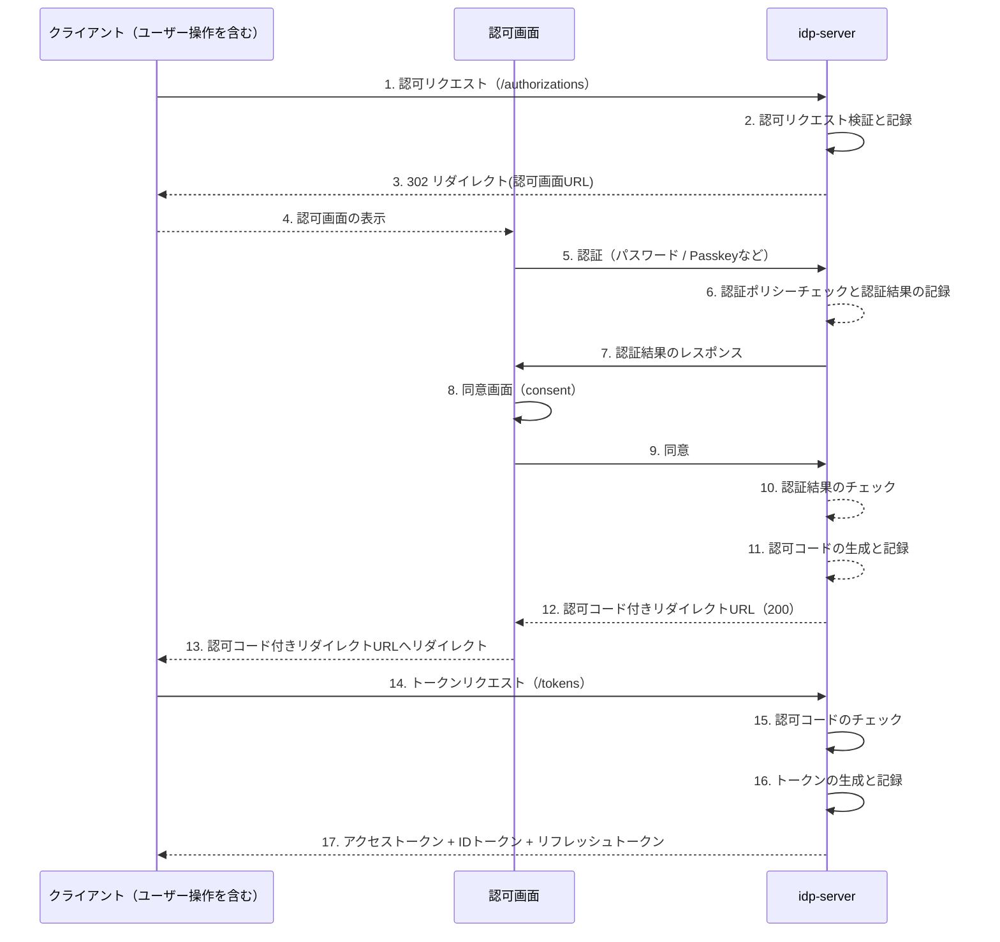

# 認可コードフロー

---

## 前提知識

このドキュメントを理解するには、以下の基礎知識が役立ちます：

- [OAuth 2.0の基本](../content_03_concepts/basic/basic-06-oauth2-authorization.md) - OAuth 2.0の認可の仕組み
- [認可コードグラントフロー](../content_03_concepts/basic/basic-08-oauth2-authorization-code-flow.md) - 認可コードフローの詳細
- [OpenID Connectの基本](../content_03_concepts/basic/basic-11-oauth-oidc-basics.md) - OIDCによる認証

---

## 概要

`idp-server`は、OAuth 2.0 および OpenID Connectに準拠した認可コードフローを提供します。  
さらに、下記の拡張仕様をサポートしています。

- Financial-grade API (FAPI)
- OIDC4IDA
- RFC 7636（PKCE）
- Rich Authorization Request（RAR）
- Pushed Authorization Request (PAR)
- etc

---

## シーケンス

1. クライアントは認可リクエストをidp-serverにリクエストを行います。
2. idp-serverは認可リクエストが仕様に準拠しているかを検証します。
3. idp-serverは **テナントの認可画面のURL** をクライアントに返却します。
4. クライアントは302リダイレクトに応じて、テナントの認可画面を表示します。
5. 認可画面は **テナントの認証ポリシー** に応じて、ユーザーとの認証を開始します。パスワード / Passkeyなど
6. idp-serverはユーザーとの認証結果と認証ポリシーを比較します。認証ポリシーを満たしている場合は認証完了とします。
7. idp-serverは認証完了を認可画面に返却します。
8. 認可画面は同意画面を表示します。
9. ユーザーが同意した場合、認可画面はidp-serverに同意のリクエストをします。
10. idp-serverは認証が完了しているかをチェックします。
11. idp-serverは認証が完了している場合、認可コードを生成します。
12. idp-serverは認可画面に認可コード付きのリダイレクトURLを含むレスポンスを返却します。
13. 認可画面を認可コード付きのリダイレクトURLにリダイレクトします。
14. クライアントはリダイレクトURLから認可コードを抽出し、idp-serverにトークンリクエストを行います。
15. idp-serverは認可コードの検証を行います。
16. idp-serverはトークンを生成し記録します。
17. idp-serverはアクセストークン + IDトークン + リフレッシュトークンをレスポンスします。

---

## 認証

### 方式

認可画面で実施する認証はテナントの認証ポリシーに応じて、下記の方式を柔軟に実施することが可能です。

| 方式                                                     | 説明                             |
|:-------------------------------------------------------|:-------------------------------|
| [初期登録](../content_06_developer-guide/configuration/authn/initial-registration.md)  | IDの属性情報の登録                     |
| [Password](../content_06_developer-guide/configuration/authn/password.md)          | ユーザーIDとパスワードによる認証。             |
| [SMS](../content_06_developer-guide/configuration/authn/sms.md)                    | SMS番号登録用の認証コード送信。              |
| [Email](../content_06_developer-guide/configuration/authn/email.md)                | メールリンクによるワンタイム認証。              |
| [FIDO-UAF](../content_06_developer-guide/configuration/authn/fido-uaf.md)          | FIDO-UAFによる登録チャレンジ生成。          |
| [WebAuthn](../content_06_developer-guide/configuration/authn/webauthn.md)          | WebAuthn（Passkeyなど）の登録チャレンジ生成。 |
| [デバイス](../content_06_developer-guide/configuration/authn/authentication-device.md) | CIBAやデバイス連携による認証通知。            |
| [レガシー](../content_06_developer-guide/configuration/authn/legacy.md)                | 外部レガシーIDサービス連携による認証。           |

例えば、

1. Password認証
2. SMS認証
3. Email認証

のような他要素認証を実施することができます。

また、認証の順序も認証ポリシーで制御可能です。

1. Password認証
2. Email認証
3. SMS認証

のように順序を入れ替えることも可能です。

さらに、Password認証が不要であれば、Webauthn（Passkey）のみの設定も可能です。

---

### 認証ポリシー（概要）

テナントに複数の認証ポリシーを設定できます。

| 項目                   | 説明                                                     |
|----------------------|--------------------------------------------------------|
| `conditions`         | 適用条件。`acr_values`, `scopes`, `authorization_flow`などを指定 |
| `available_methods`  | 利用可能な認証方式のリスト（UIや内部フローで利用）                             |
| `success_conditions` | 認証成功とみなす条件                                             |
| `failure_conditions` | 警告や統計記録の対象となる失敗条件                                      |
| `lock_conditions`    | アカウントロックや認可拒否に至る失敗条件                                   |

## 設定

`idp-server`は、OAuth 2.0 および OpenID Connectに準拠した設定をサポートしています。

### 拡張設定

また、仕様には定義されていないけれど、認可コードフローを実現するために必要な項目も設定が可能となっています。

| 項目                                       | 説明                                | デフォルト値 |
|------------------------------------------|-----------------------------------|--------|
| `authorization_code_valid_duration`      | 認可コードの有効期限                        | 600秒   |
| `access_token_duration`                  | アクセストークンの有効期限                     | 1800秒  |
| `refresh_token_duration`                 | リフレッシュトークンの有効期限                   | 3600秒  |
| `id_token_duration`                      | IDトークンの有効期限                       | 3600秒  |
| `id_token_strict_mode`                   | スペックに準拠させ、スコープ等によるカスタムクレームの設定が付加。 | false  |
| `default_max_age`                        | デフォルトのセッションの有効期限                  | 86400秒 |
| `authorization_response_duration`        | JARMの有効期限                         | 60秒    |
| `oauth_authorization_request_expires_in` | 認可リクエストの有効期限                      | 1800秒  |
| `access_token_type`                      | 識別子(opaque) or 内包型(JWT)           | opaque |

## FAPIプロファイル

`idp-server`は、FAPIプロファイルをサポートしています。

FAPIプロファイルの適用をスコープで判断します。

| 項目                     | 説明                       | デフォルト値 |
|------------------------|--------------------------|--------|
| `fapi_baseline_scopes` | Baselineのプロファイルを提供するスコープ | 空配列    |
| `fapi_advance_scopes`  | Advanceのプロファイルを提供するスコープ  | 空配列    |

認可リクエストに設定したスコープを含む場合に、FAPIプロファイルに応じた認可リクエスト・トークンリクエストの検証を実施します。

## OIDC4IDA

`idp-server`は、OIDC4IDAをサポートしています。

また、身元確認サービスとの連携機能も備えておりエンドユーザーからの申込みベースで身元確認済みのクレームを登録することができます。

## 便利機能

`idp-server` は便利機能をいくつか用意しており、主な機能は下記2つとなります。

1. claims:xx スコープによるIDトークン・アクセストークンクレームの動的設定
2. verified_claims:xx スコープによるアクセストークンのプロパティの動的設定

### claims:xx スコープによるIDトークン・アクセストークンクレームの動的設定

`idp-server` では、スコープに `claims:`プレフィックス付きスコープが含まれる場合、ユーザーのカスタム属性やロール情報を動的に
IDトークンとアクセストークンに含めることができます。

**注意**: `id_token_strict_mode` 設定はIDトークンへの追加時のみ適用され、アクセストークンには影響しません。

これは `ScopeMappingCustomClaimsCreator` により実現され、以下の条件で動作します：

* `custom_claims_scope_mapping` が有効であること
* 対象スコープに `claims:` プレフィックスが含まれていること

**IDトークンへの追加時の追加条件**：
* `id_token_strict_mode` が無効であること

対象スコープが `claims:roles` の場合、ユーザーが持つロール一覧（リスト形式）が `roles` クレームとして付加されます。

同様に `claims:assigned_tenants` や `claims:assigned_organizations` を指定することで、関連するテナントや組織のIDを含めることも可能です。

### verified_claims:xx スコープによるアクセストークンのプロパティの動的設定

`idp-server` では、スコープに `verified_claims:`プレフィックス付きスコープが含まれる場合、身元確認済みの属性を
アクセストークンに含めることができます。

これは `AccessTokenSelectiveVerifiedClaimsCreator` により実現され、以下の条件で動作します：

* `enabled_access_token_selective_verified_claims` が有効であること
* 対象スコープに `verified_claims:` プレフィックスが含まれていること
* ユーザーが該当の `verified_claims` 属性を所持していること

対象スコープが `verified_claims:name` の場合、ユーザーが持つverified_claimsの `name` をプロパティに設定します。

---

## 参考資料

### 標準仕様
- [RFC 6749: The OAuth 2.0 Authorization Framework](https://datatracker.ietf.org/doc/html/rfc6749)
- [RFC 6750: Bearer Token Usage](https://datatracker.ietf.org/doc/html/rfc6750)
- [OpenID Connect Core 1.0](https://openid.net/specs/openid-connect-core-1_0.html)
- [RFC 7636: Proof Key for Code Exchange (PKCE)](https://datatracker.ietf.org/doc/html/rfc7636)
- [RFC 9396: Rich Authorization Requests (RAR)](https://datatracker.ietf.org/doc/html/rfc9396)
- [RFC 9126: Pushed Authorization Requests (PAR)](https://datatracker.ietf.org/doc/html/rfc9126)
- [FAPI 1.0 Baseline Profile](https://openid.net/specs/openid-financial-api-part-1-1_0.html)
- [FAPI 1.0 Advanced Profile](https://openid.net/specs/openid-financial-api-part-2-1_0.html)
- [OpenID Connect for Identity Assurance 1.0](https://openid.net/specs/openid-connect-4-identity-assurance-1_0.html)

### 関連ドキュメント
- [マルチテナント](../content_03_concepts/multi-tenant.md) - テナント設定の詳細
- [身元確認済みID](../content_03_concepts/id-verified.md) - OIDC4IDAの実装ガイド

---
