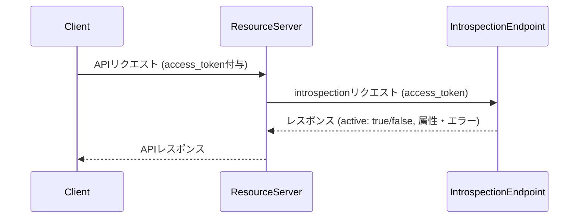

# イントロスペクション

## 1. イントロスペクションとは

イントロスペクション（Token Introspection）は、OAuth2.0やOpenID Connectで発行されたアクセストークンやリフレッシュトークンの有効性や属性情報を、クライアントやリソースサーバが確認するためのAPIエンドポイントです。主にリソースサーバがトークンを受け取った際、そのトークンが有効かつ正規のものであるかを検証する用途で利用されます。

---

## 2. シーケンス図



---

## 3. 正常系・異常系レスポンス

### 3.1 トークンが有効な場合（active: true）

```json
{
  "active": true,
  "scope": "openid profile email",
  "client_id": "example-client",
  "username": "user1",
  "exp": 1712328000,
  "iat": 1712324400,
  "nbf": 1712324400,
  "aud": "api.example.com",
  "iss": "https://idp.example.com",
  "sub": "user1",
  "cnf": {
    "x5t#S256": "XXXXXX（証明書サムプリント）"
  }
}
```
- active: true の場合は、トークンの属性情報（スコープ、クライアントID、ユーザ名、有効期限など）も含めて返却します。
- mTLS等のsender-constrained access tokenの場合、cnf パラメータも含まれます。

---

### 3.2 トークンが無効な場合（active: false）

RFC 7662に準拠し、トークンが無効な場合は以下のレスポンスのみ返却されます：

```json
{
  "active": false
}
```

**重要**: セキュリティ上の理由から、無効理由の詳細情報は含まれません。これにより、トークン列挙攻撃を防止します。

### 3.3 呼び出し元のクライアント認証に失敗した場合

Resource Server 自身の資格情報が無効なときは、認証方式に関わらず `401` を返し、`active` は含めません（RFC 7662 §2.3）。`active: false` は、認証に成功した呼び出しでトークンが無効なとき（3.2）だけに返します。`client_secret_basic` で失敗した場合は `WWW-Authenticate: Basic realm="<issuer>"` が付きます。

```http
HTTP/1.1 401 Unauthorized
WWW-Authenticate: Basic realm="https://api.example.com/{tenant-id}"

{
  "error": "invalid_client",
  "error_description": "..."
}
```

`active` を認証エラーに使わない理由は [クライアント認証に失敗したときの応答](../content_11_learning/16-oauth-oidc-rfc/client-auth/client-authentication-error-response.md) を参照してください。

---

## 4. レスポンス属性一覧

| パラメータ | 型      | 説明                           | 有効時 | 無効時 |
|-----------|---------|--------------------------------|--------|--------|
| active    | boolean | トークンが有効かどうか         | ○      | ○      |
| scope     | string  | トークン付与時のスコープ       | ○      | ×      |
| client_id | string  | 発行元クライアントID           | ○      | ×      |
| sub       | string  | Subject (ユーザID)             | ○      | ×      |
| exp       | number  | 有効期限（UNIXタイムスタンプ） | ○      | ×      |
| iat       | number  | 発行日時（UNIXタイムスタンプ） | ○      | ×      |
| iss       | string  | Issuer                         | ○      | ×      |
| cnf       | object  | mTLS等の証明書情報             | △      | ×      |

○: 返却される　×: 返却されない　△: 条件により返却

**注意**: `username`, `nbf`, `aud` は現在の実装では含まれません。

---

## 5. セキュリティ要件

- クライアント認証必須（不正な照会を防ぐ）
- `active: true` のときのみ、必要最小限の情報を返却
- `active: false` の場合は、RFC 7662に準拠し詳細情報を含めない（トークン列挙攻撃の防止）

---

## 6. よくある質問（FAQ）

- Q: introspectエンドポイントの利用制限は？
    - A: クライアント認証を通過したリクエストのみ許可します。
- Q: トークンが失効した場合のレスポンスは？
    - A: 明確なエラー理由を付与して active: false を返します。
- Q: レスポンスの属性を拡張できますか？
    - A: 実装によっては拡張可能です。必要に応じてご相談ください。

---

参考:
- [RFC 7662: OAuth 2.0 Token Introspection](https://datatracker.ietf.org/doc/html/rfc7662)
