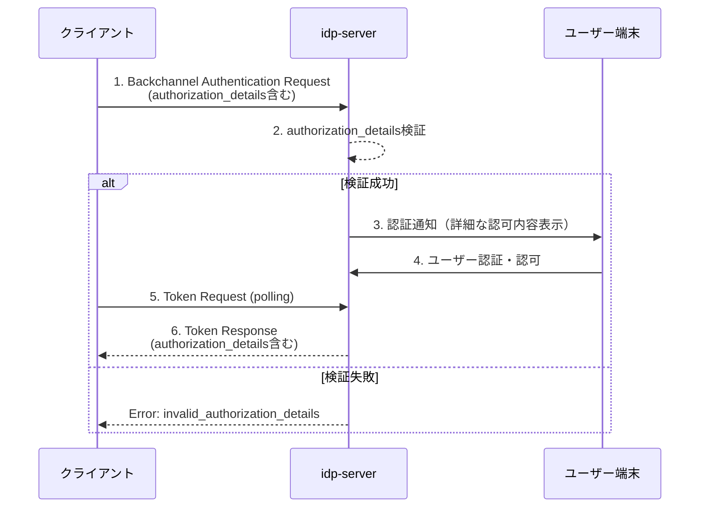

# CIBA + Rich Authorization Requests (RAR)

## 🎯 この機能を一言で説明すると

**「スマホで認証するときに、もっと細かく『何をどこまで許可するか』を指定できる機能」**

従来は「メールを見る権限」のような大雑把な指定しかできませんでしたが、RARを使えば「どのフォルダの、どのメールを、いつまで見られるか」まで細かく指定できます。

## 💡 なぜこの機能が必要なのか

### 従来の方法（スコープ）の問題点

```
アプリ「お客様の口座情報を見る権限をください」
あなた「OK（全口座の全情報が見られる）」← 粗すぎる！
```

- ❌ 「口座を見る」権限しかなく、**どの口座**かは指定できない
- ❌ 「読む」権限だけで、**何を読むか**は制御できない
- ❌ 複数の細かい権限が必要なとき、何度もリクエストが必要

### RARで解決できること

```
アプリ「個人口座12345の残高だけ見る権限をください」
あなた「OK（個人口座の残高だけが見られる）」← 安心！
```

- ✅ **どのリソース**に対する権限かを明示
- ✅ **何ができるか**（読む、書く、削除など）を細かく指定
- ✅ 複数の異なる権限を**1回のリクエスト**でまとめて要求

## 👤 こんな人・こんな場面で便利

| 使う人 | 使う場面 | メリット |
|--------|---------|---------|
| **銀行アプリ開発者** | 決済アプリで振込を実行 | 「口座A から 1,000円を口座B に振込」という具体的な権限を要求 |
| **会計ソフト開発者** | 複数の口座情報を取得 | 「個人口座の残高」と「会社口座の取引履歴」を同時に要求 |
| **医療アプリ開発者** | 患者の医療記録へアクセス | 「2024年の血液検査結果だけ」という限定的なアクセス |

## 📱 ユーザーから見るとこう見える

スマホに届く認証リクエスト画面のイメージ：

```
━━━━━━━━━━━━━━━━━━━━━━━━
  認可リクエスト
━━━━━━━━━━━━━━━━━━━━━━━━

アプリ名: 家計簿アプリ

📋 要求される権限の詳細:

【個人口座 (口座番号: ****1234)】
✓ 残高の確認
✓ 過去3ヶ月の取引履歴の閲覧

【会社口座 (口座番号: ****5678)】
✓ 入金履歴の閲覧のみ

━━━━━━━━━━━━━━━━━━━━━━━━
  [許可する] [拒否する]
━━━━━━━━━━━━━━━━━━━━━━━━
```

**従来の方法だと**: 「すべての口座情報を見る権限」という曖昧な表示だけ

**RARを使うと**: 上記のように具体的に「何を・どこまで」が表示される

## 📚 用語集（初めての方向け）

| 用語 | 簡単な説明 | 具体例 |
|------|-----------|--------|
| **CIBA** | スマホなどの別のデバイスで認証する仕組み | PCで「ログイン」→スマホに通知→スマホで承認→PCでログイン完了 |
| **OAuth 2.0** | アプリにパスワードを渡さずに権限を与える標準的な方法 | 「Googleの連絡先を見る権限をXXアプリに渡す」 |
| **スコープ** | 従来の粗い権限指定方法 | `"read:email"` = メール読む権限（どのメールかは指定できない） |
| **RAR** | 細かい権限指定ができる新しい方法 | 「個人フォルダの未読メールだけ」という具体的な指定が可能 |
| **authorization_details** | RARで権限の詳細を記述するパラメータ | 「何を、どこまで、どうするか」を JSON 形式で記述 |
| **Request Object** | 認証リクエストをJWT形式で署名付きで送る方法 | セキュリティを高めるための技術（改ざん防止） |

## 🆚 スコープ vs RAR の比較

### 従来のスコープだけの場合

```json
{
  "scope": "read:accounts"
}
```

**結果**:
- ❌ 全ての口座が見える
- ❌ 残高も取引履歴も全部見える
- ❌ 個人口座も会社口座も区別なし

### RARを使った場合

```json
{
  "scope": "openid profile",
  "authorization_details": [
    {
      "type": "account_information",
      "account_id": "personal-account-1234",
      "actions": ["read_balance"],
      "valid_until": "2024-12-31"
    }
  ]
}
```

**結果**:
- ✅ 個人口座1234だけが対象
- ✅ 残高の閲覧のみ許可（取引履歴は見えない）
- ✅ 2024年末まで有効

## 概要（技術者向け）

`idp-server` は、CIBA (Client Initiated Backchannel Authentication) フローにおいて [RFC 9396 - OAuth 2.0 Rich Authorization Requests](https://www.rfc-editor.org/rfc/rfc9396.html) をサポートしています。

Rich Authorization Requests (RAR) により、従来のスコープベースの認可に加えて、きめ細かい認可要求を `authorization_details` パラメータで表現できます。

## ユースケース（詳細）

- **金融取引**: 決済金額・通貨・受取人などの詳細な取引情報の認可
- **データアクセス**: 特定のリソース（口座・ファイル等）への限定的なアクセス権限
- **複数リソース**: 異なる種類の認可を1つのリクエストでまとめて要求

## RFC 9396 準拠

### サポート機能

| 機能 | RFC 9396 Section | サポート状況 |
|------|-----------------|------------|
| `authorization_details` パラメータ | Section 2 | ✅ 完全対応 |
| Request Object統合 | Section 3 | ✅ 完全対応 |
| 無効なtype拒否 | Section 4, 5 | ✅ 完全対応 |
| トークンレスポンス返却 | Section 7 | ✅ 完全対応 |
| 複数authorization_details処理 | Section 2 | ✅ 完全対応 |

### 検証ロジック

`idp-server` は RFC 9396 に準拠した以下の検証を実施します：

1. **type必須チェック**: 各authorization_detailには `type` フィールドが必須
2. **サポート済みtype検証**: Authorization Server設定で定義されたtypeのみ許可
3. **クライアント認可検証**: クライアントに認可されたtypeのみ許可

検証に失敗した場合、`invalid_authorization_details` エラーが返却されます。

## シーケンス



## authorization_details パラメータ

### 基本構造

```json
{
  "authorization_details": [
    {
      "type": "account_information",
      "actions": ["list_accounts", "read_balances"],
      "locations": ["https://example.com/accounts"]
    }
  ]
}
```

### フィールド定義

| フィールド | 必須 | 説明 | 例 |
|-----------|------|------|-----|
| `type` | ✅ | 認可詳細のタイプ識別子 | `"account_information"` |
| `actions` | ❌ | 実行可能なアクション | `["read", "write"]` |
| `locations` | ❌ | リソースのURL | `["https://api.example.com"]` |
| `datatypes` | ❌ | データタイプ | `["balance", "transaction"]` |
| `identifier` | ❌ | リソース識別子 | `"account-123"` |
| `privileges` | ❌ | アクセス権限 | `["read-only"]` |

## Request Object統合

### 🔐 初めての方向け：Request Objectって何？

**簡単に言うと**:
リクエストパラメータをJWT形式で署名して送る方法です。

**なぜ使うの？**:
- 🔒 **改ざん防止**: 署名があるので、途中で書き換えられない
- 🔐 **セキュリティ向上**: 特に金融系アプリで重要
- 📦 **パラメータをまとめて送れる**: 1つのJWTに全部入れられる

**イメージ**:
```
【普通の方法】
パラメータを個別に送る
↓
途中で誰かが書き換えられるかも...

【Request Object】
パラメータをJWTで署名して送る
↓
署名があるので改ざんできない！安全！
```

### RFC 9396 Section 3 準拠（技術者向け）

Request Object (JWT) 内で `authorization_details` を指定可能です。

**実装例**:

```javascript
// ライブラリを使ってJWTを作成
const jwt = require('jsonwebtoken');
const fs = require('fs');

// 秘密鍵を読み込む
const privateKey = fs.readFileSync('path/to/private-key.pem');

// Request Objectを作成
const requestObject = jwt.sign(
  {
    // 通常のパラメータ
    client_id: "household-app-123",
    scope: "openid profile",
    binding_message: "999",
    user_code: "userCode001",
    login_hint: "sub:user123,idp:idp-server",

    // authorization_detailsもここに含められる！
    authorization_details: [
      {
        "type": "payment_initiation",
        "actions": ["initiate"],
        "instructedAmount": {
          "currency": "EUR",
          "amount": "123.50"
        },
        "creditorAccount": {
          "iban": "DE02100100109307118603"
        }
      }
    ],

    // JWTの標準クレーム
    aud: "https://idp.example.com",
    iss: "household-app-123",
    exp: Math.floor(Date.now() / 1000) + 3600,  // 1時間後に期限切れ
    iat: Math.floor(Date.now() / 1000),
    jti: "unique-request-id-12345"
  },
  privateKey,
  { algorithm: 'ES256' }  // 署名アルゴリズム
);

// リクエストに含めて送る
const response = await axios.post(
  'https://idp.example.com/backchannel-authentication',
  {
    client_id: 'household-app-123',
    client_secret: 'your-secret',
    request: requestObject  // ← JWT形式のRequest Object
  }
);
```

### パラメータ優先順位

RFC 9396 Section 3 に従い、以下の優先順位が適用されます：

```
Request Object内のauthorization_details > 通常パラメータのauthorization_details
```

**具体例**:
```javascript
// リクエストの例
{
  client_id: "app123",
  authorization_details: '[{"type":"A"}]',  // 通常パラメータ
  request: "eyJ..."  // JWT（中身: authorization_details: [{"type":"B"}]）
}

// → Request Object内の "type":"B" が優先される！
```

### 検証タイミング

Request Objectのパース後、通常パラメータと同じ検証ロジックが自動的に適用されます。

**処理の流れ**:
```
1. Request Objectをデコード・検証
2. 通常パラメータとマージ（Request Objectが優先）
3. authorization_detailsを検証
   - typeが必須か
   - サポートされているtypeか
   - クライアントに認可されているtypeか
4. OK → 認証処理へ
   NG → invalid_authorization_details エラー
```

## エラーハンドリング

### invalid_authorization_details エラー

以下の場合、`invalid_authorization_details` エラーが返却されます：

| エラーケース | error_description 例 |
|-------------|---------------------|
| typeフィールド欠損 | `"authorization details does not contains type"` |
| 未サポートtype | `"unsupported authorization details type (custom_type)"` |
| 未認可type | `"unauthorized authorization details type (invalid_type)"` |
| 配列形式違反 | `"authorization_details must be array"` |
| 空配列 | `"authorization_details is unspecified"` |

### エラーレスポンス例

```json
{
  "error": "invalid_authorization_details",
  "error_description": "unauthorized authorization details type (invalid_type)"
}
```

## 設定

### 🔧 初めての方向け：設定の流れ

RARを使うには、2段階の設定が必要です：

#### ステップ1: サーバー側で「どんな種類の権限を扱うか」を決める

```
例: このサーバーでは「口座情報」と「決済」の権限を扱います
```

#### ステップ2: アプリ（クライアント）ごとに「どの権限を使えるか」を決める

```
例: 「家計簿アプリ」は「口座情報」だけ使える
    「決済アプリ」は「口座情報」と「決済」の両方使える
```

これにより、**不正なアプリが勝手に決済権限を要求できない**ようになります。

### Authorization Server設定（サーバー全体の設定）

**何を設定するか**: このサーバーが扱える `type` の種類

**どこで設定するか**: テナント設定（Management API または 設定ファイル）

**設定例**:

```json
{
  "supported_authorization_details_types": [
    "account_information",    // 口座情報へのアクセス
    "payment_initiation"      // 決済の実行
  ]
}
```

**意味**:
- このサーバーでは `account_information` と `payment_initiation` という2種類の詳細権限を扱えます
- これ以外の `type` （例: `medical_record`）が来たらエラーになります

### クライアント設定（アプリごとの設定）

**何を設定するか**: このアプリが使える `type` の種類

**どこで設定するか**: クライアント設定（Management API または 設定ファイル）

**設定例**:

```json
{
  "client_id": "household-app-123",
  "client_name": "家計簿アプリ",
  "authorization_details_types": [
    "account_information"     // このアプリは口座情報だけ見られる
  ]
}
```

**意味**:
- この家計簿アプリは `account_information` （口座情報の閲覧）だけ使えます
- `payment_initiation` （決済実行）は使えません → セキュリティ向上

### 💡 なぜ2段階必要なの？

```
【悪い例】サーバー設定だけの場合
→ 全てのアプリが全ての権限を要求できてしまう

【良い例】サーバー設定 + アプリ設定
→ サーバー: "扱える権限の種類"を制限
→ アプリ: "このアプリが使える権限"をさらに制限
→ 二重のセキュリティチェック！
```

## 実装例

### 🚀 初めての方向け：実装の3ステップ

#### ステップ1: authorization_detailsを作る

```javascript
// JavaScriptの例
const authorizationDetails = [
  {
    type: "account_information",          // 権限の種類
    actions: ["list_accounts", "read_balances"],  // 何ができるか
    locations: ["https://example.com/accounts"]   // どこにアクセスするか
  }
];
```

#### ステップ2: リクエストに含めて送る

```javascript
// Node.js / JavaScript での例
const axios = require('axios');

const response = await axios.post(
  'https://idp.example.com/backchannel-authentication',
  {
    client_id: 'your-app-id',
    client_secret: 'your-app-secret',
    scope: 'openid profile',
    login_hint: 'sub:user123,idp:idp-server',
    binding_message: '999',
    user_code: 'code001',
    authorization_details: JSON.stringify(authorizationDetails)  // ← ここ！
  }
);

console.log('auth_req_id:', response.data.auth_req_id);
```

#### ステップ3: トークンを取得する

```javascript
// ポーリングでトークンを取得
const tokenResponse = await axios.post(
  'https://idp.example.com/token',
  {
    grant_type: 'urn:openid:params:grant-type:ciba',
    auth_req_id: response.data.auth_req_id,
    client_id: 'your-app-id',
    client_secret: 'your-app-secret'
  }
);

// authorization_detailsが含まれている
console.log('access_token:', tokenResponse.data.access_token);
console.log('authorization_details:', tokenResponse.data.authorization_details);
```

### 📝 HTTPリクエストの生の形（上級者向け）

#### Backchannel Authentication Request

```bash
POST /backchannel-authentication HTTP/1.1
Host: idp.example.com
Content-Type: application/x-www-form-urlencoded

client_id=client123
&client_secret=secret
&scope=openid+profile
&login_hint=sub:user123,idp:idp-server
&binding_message=999
&user_code=code001
&authorization_details=%5B%7B%22type%22%3A%22account_information%22%2C%22actions%22%3A%5B%22list_accounts%22%5D%7D%5D
```

**URLエンコードされている部分**を人間が読める形に：

デコード後の `authorization_details`:
```json
[
  {
    "type": "account_information",
    "actions": ["list_accounts"]
  }
]
```

### Token Response

```json
{
  "access_token": "eyJhbGciOiJFUzI1NiIsInR5cCI6IkpXVCJ9...",
  "token_type": "Bearer",
  "expires_in": 3600,
  "id_token": "eyJhbGciOiJFUzI1NiIsInR5cCI6IkpXVCJ9...",
  "authorization_details": [
    {
      "type": "account_information",
      "actions": ["list_accounts"],
      "locations": ["https://example.com/accounts"]
    }
  ]
}
```

### Access Tokenペイロード

```json
{
  "sub": "user123",
  "aud": "client123",
  "iss": "https://idp.example.com",
  "exp": 1234567890,
  "iat": 1234564290,
  "authorization_details": [
    {
      "type": "account_information",
      "actions": ["list_accounts"],
      "locations": ["https://example.com/accounts"]
    }
  ]
}
```

## 複数authorization_details

RFC 9396 Section 2 に従い、複数のauthorization_detailsを1つのリクエストで指定可能です。

### 複数リソースタイプ

```json
{
  "authorization_details": [
    {
      "type": "account_information",
      "actions": ["list_accounts", "read_balances"]
    },
    {
      "type": "payment_initiation",
      "actions": ["initiate"],
      "instructedAmount": {
        "currency": "EUR",
        "amount": "100.00"
      }
    }
  ]
}
```

### 同一タイプの複数エントリ

同じtypeのauthorization_detailsを複数指定することも可能です：

```json
{
  "authorization_details": [
    {
      "type": "account_information",
      "actions": ["list_accounts"],
      "locations": ["https://example.com/accounts/personal"]
    },
    {
      "type": "account_information",
      "actions": ["read_balances"],
      "locations": ["https://example.com/accounts/business"]
    }
  ]
}
```

## ユーザー体験

### 認証デバイスでの表示

`authorization_details` の情報は認証デバイス（スマートフォン等）の認証画面に表示されます：

```
━━━━━━━━━━━━━━━━━━━━━━━━
  認可リクエスト
━━━━━━━━━━━━━━━━━━━━━━━━

クライアント: 銀行アプリ

認可内容:
• 口座情報の閲覧
  - 口座一覧の取得
  - 残高の確認

リソース:
• https://example.com/accounts

━━━━━━━━━━━━━━━━━━━━━━━━
  [認可する] [拒否する]
━━━━━━━━━━━━━━━━━━━━━━━━
```

## セキュリティ考慮事項

### 1. type検証の重要性

未検証のtypeを許可すると、意図しないリソースへのアクセスを許可する可能性があります。`idp-server` は以下の検証を実施します：

- Authorization Server設定での明示的なtype定義
- クライアントごとの認可type制限

### 2. クライアント認証

`authorization_details` を含むBackchannel Authentication Requestは、必ずクライアント認証が必要です。

### 3. ユーザー同意

詳細な認可内容はユーザーに明示的に表示され、ユーザーの同意を得る必要があります。

## 参考資料

- [RFC 9396 - OAuth 2.0 Rich Authorization Requests](https://www.rfc-editor.org/rfc/rfc9396.html)
- [OpenID Connect CIBA Core 1.0](https://openid.net/specs/openid-client-initiated-backchannel-authentication-core-1_0.html)
- [CIBA フロー基本ドキュメント](protocol-02-ciba-flow.md)
