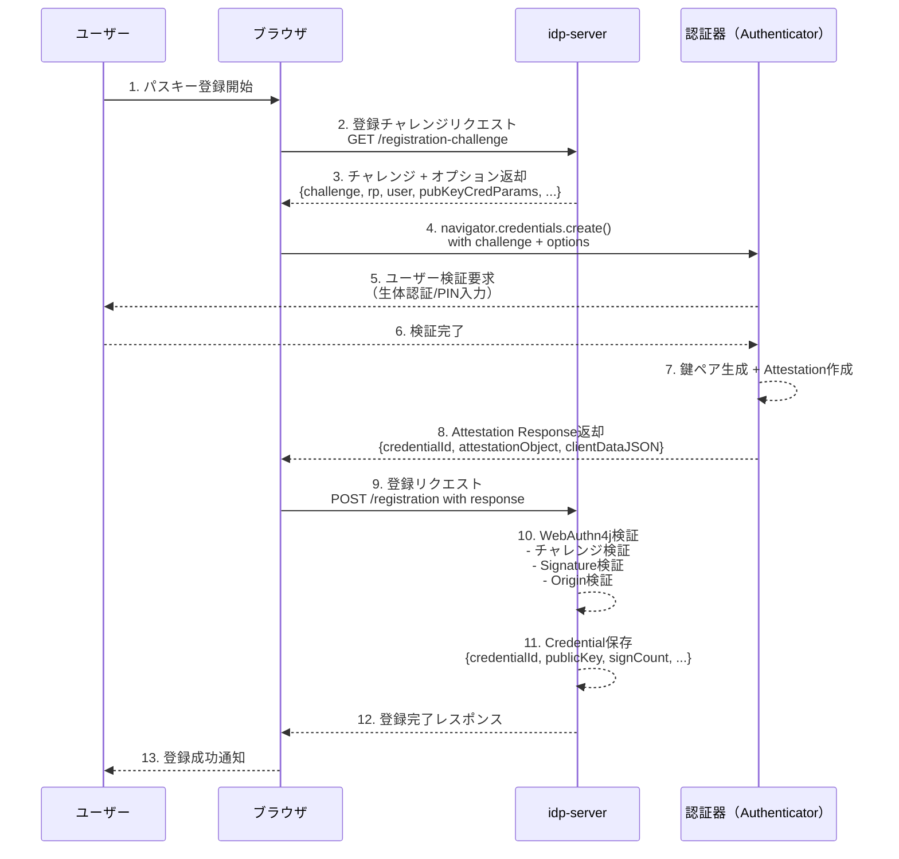
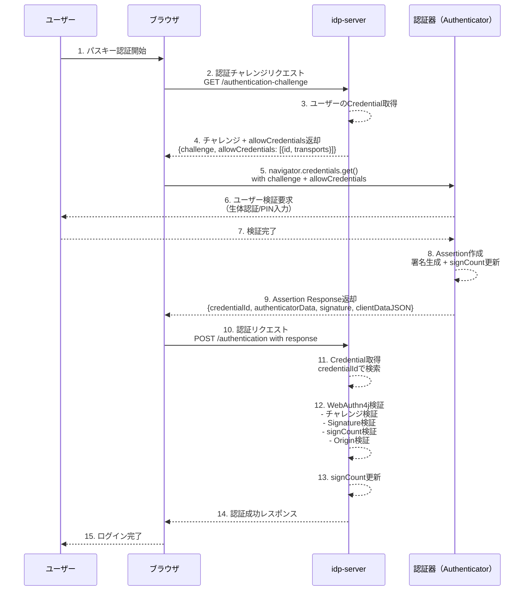

# FIDO2 / WebAuthn 認証フロー

## 概要

`idp-server` は、W3C WebAuthn および FIDO2 仕様に準拠したパスキー認証をサポートしています。

WebAuthn（Web Authentication API）は、公開鍵暗号方式を用いた強力な認証メカニズムであり、以下のような特徴があります：

- **フィッシング耐性**: 公開鍵認証により、パスワード漏洩のリスクを排除
- **パスワードレス認証**: 生体認証やPINを用いた認証でユーザー体験を向上
- **多様な認証器サポート**: セキュリティキー、スマートフォン、PC内蔵認証器に対応

### ユースケース

| ユースケース | 認証器タイプ | ユーザー体験 |
|---------|---------|---------|
| **パスワードレスログイン** | Platform（TouchID/FaceID/Windows Hello） | デバイス生体認証のみで即座にログイン |
| **2要素認証（2FA）** | Cross-platform（USB/NFCセキュリティキー） | パスワード + セキュリティキータップ |
| **高セキュリティ認証** | FIDO2認定セキュリティキー | PIN入力 + セキュリティキータップ |
| **スマホ連携認証** | Hybrid（QRコード経由） | QRコード読み取り + スマホ生体認証 |

## WebAuthn仕様準拠

`idp-server` は以下の仕様に準拠しています：

- [W3C WebAuthn Level 2](https://www.w3.org/TR/webauthn-2/)
- [FIDO CTAP2.1](https://fidoalliance.org/specs/fido-v2.1-ps-20210615/fido-client-to-authenticator-protocol-v2.1-ps-errata-20220621.html)
- [WebAuthn4j 0.30.0.RELEASE](https://github.com/webauthn4j/webauthn4j) - サーバー側検証ライブラリ

## シーケンス図

### 登録フロー（Registration）



### 認証フロー（Authentication）



## シーケンス詳細説明

### 登録フロー詳細

#### フェーズ1: チャレンジ取得（ステップ1-3）

**1. パスキー登録開始**
- ユーザーが「パスキーを登録」ボタンをクリック
- JavaScriptが登録フローを開始

**2. 登録チャレンジリクエスト**
```http
GET /api/webauthn/registration-challenge?userId=user123
Authorization: Bearer {access_token}
```

**3. サーバーレスポンス**
```json
{
  "challenge": "random-base64url-string",
  "rp": {
    "name": "IDP Server",
    "id": "example.com"
  },
  "user": {
    "id": "dXNlcjEyMw",
    "name": "user@example.com",
    "displayName": "User Name"
  },
  "pubKeyCredParams": [
    {"type": "public-key", "alg": -7},   // ES256
    {"type": "public-key", "alg": -257}  // RS256
  ],
  "timeout": 120000,
  "authenticatorSelection": {
    "residentKey": "required",
    "userVerification": "required",
    "authenticatorAttachment": "platform"
  },
  "attestation": "none"
}
```

**重要ポイント**:
- `challenge`: ランダム生成された32バイト以上の値（再利用攻撃防止）
- `user.id`: ユーザーの一意識別子（Base64URL形式）
- `authenticatorSelection`: ユーザー体験を決定する重要パラメータ

#### フェーズ2: 認証器操作（ステップ4-8）

**4. JavaScript API呼び出し**
```javascript
const credential = await navigator.credentials.create({
  publicKey: challengeResponse
});
```

**5-6. ユーザー検証**
- **Platform認証器**: TouchID/FaceID/Windows Helloプロンプト表示
- **Cross-platform認証器**: セキュリティキーLED点滅 → タップ要求
- **userVerification="required"**: PIN/生体認証必須

**7. 鍵ペア生成**
認証器が実行する処理：
1. **楕円曲線暗号鍵ペア生成**（ES256: P-256曲線）
2. **Credential ID生成**（ランダム32バイト）
3. **秘密鍵を認証器内部に安全保存**（抽出不可）
4. **公開鍵をAttestation Objectに格納**
5. **署名カウンタ初期化**（signCount=0）

**8. Attestation Response構造**
```javascript
{
  id: "base64url-credential-id",
  rawId: ArrayBuffer,
  type: "public-key",
  response: {
    attestationObject: ArrayBuffer,  // CBOR形式
    clientDataJSON: ArrayBuffer      // JSON形式
  }
}
```

**attestationObjectの内容**（CBOR形式）:
```
{
  fmt: "none",                    // Attestation形式
  authData: {
    rpIdHash: <32 bytes>,         // SHA-256(rpId)
    flags: 0x45,                  // UP=1, UV=1, AT=1
    signCount: 0,                 // カウンタ初期値
    attestedCredentialData: {
      aaguid: <16 bytes>,         // 認証器GUID
      credentialId: <32 bytes>,   // Credential識別子
      credentialPublicKey: <COSE> // 公開鍵（COSE形式）
    }
  },
  attStmt: {}                     // Attestation Statement
}
```

#### フェーズ3: サーバー検証・保存（ステップ9-13）

**9. 登録リクエスト**
```http
POST /api/webauthn/registration
Content-Type: application/json

{
  "response": {
    "attestationObject": "base64url-string",
    "clientDataJSON": "base64url-string"
  },
  "id": "credential-id"
}
```

**10. WebAuthn4j検証プロセス**

`WebAuthn4jRegistrationManager.java` が実行：

1. **clientDataJSON検証**
   ```java
   // Challenge一致確認
   if (!storedChallenge.equals(clientData.getChallenge())) {
     throw new ChallengeVerificationException();
   }

   // Origin検証（フィッシング対策）
   if (!allowedOrigins.contains(clientData.getOrigin())) {
     throw new OriginVerificationException();
   }

   // Type確認
   if (!"webauthn.create".equals(clientData.getType())) {
     throw new InvalidTypeException();
   }
   ```

2. **AuthenticatorData検証**
   ```java
   // RP ID Hash検証
   byte[] expectedRpIdHash = SHA256(rpId);
   if (!Arrays.equals(authData.getRpIdHash(), expectedRpIdHash)) {
     throw new RpIdHashVerificationException();
   }

   // Flags確認
   boolean userPresent = (flags & 0x01) != 0;    // UP bit
   boolean userVerified = (flags & 0x04) != 0;   // UV bit
   boolean attestedData = (flags & 0x40) != 0;   // AT bit

   if (userVerification == "required" && !userVerified) {
     throw new UserVerificationException();
   }
   ```

3. **公開鍵抽出**
   ```java
   AttestedCredentialData credData = authData.getAttestedCredentialData();
   COSEKey publicKey = credData.getCOSEKey();
   // ES256: {1: 2, 3: -7, -1: 1, -2: x, -3: y}
   ```

4. **Attestation検証**（企業環境用）
   ```java
   AttestationStatement attStmt = attestationObject.getAttestationStatement();
   // fmt="none" の場合は検証スキップ
   // fmt="packed"/"fido-u2f"等の場合は署名検証
   ```

**11. Credential保存**

データベースINSERT:
```sql
INSERT INTO webauthn_credentials (
  id, idp_user_id, rp_id, aaguid,
  attested_credential_data, signature_algorithm, sign_count,
  attestation_type, rk, cred_protect, transports, created_at
) VALUES (?, ?, ?, ?, ?, ?, ?, ?, ?, ?, ?::jsonb, NOW());
```

保存される情報:
- `attested_credential_data`: 公開鍵を含むCBORバイナリ（Base64URL）
- `signature_algorithm`: -7（ES256）または-257（RS256）
- `sign_count`: 0（初期値）
- `transports`: `["internal"]` または `["usb", "nfc"]` 等

**12-13. 登録完了**
```http
HTTP/1.1 201 Created
Content-Type: application/json

{
  "credentialId": "base64url-credential-id",
  "status": "registered"
}
```

---

### 認証フロー詳細

#### フェーズ1: チャレンジ取得（ステップ1-4）

**1. パスキー認証開始**
- ユーザーがログインページで「パスキーでログイン」選択
- ユーザー名入力（rk=falseの場合）またはスキップ（rk=trueの場合）

**2. 認証チャレンジリクエスト**
```http
GET /api/webauthn/authentication-challenge?username=user@example.com
```

**3. サーバー側処理**
```java
// ユーザーのCredential一覧取得
List<WebAuthn4jCredential> credentials =
    credentialRepository.findByUserId(userId);

// allowCredentials作成
List<PublicKeyCredentialDescriptor> allowCredentials =
    credentials.stream()
        .map(c -> new PublicKeyCredentialDescriptor(
            c.idAsBytes(),
            c.transports()  // UX最適化のため重要
        ))
        .collect(Collectors.toList());
```

**4. サーバーレスポンス**
```json
{
  "challenge": "random-base64url-string",
  "timeout": 120000,
  "rpId": "example.com",
  "allowCredentials": [
    {
      "type": "public-key",
      "id": "credential-id-1",
      "transports": ["internal"]
    },
    {
      "type": "public-key",
      "id": "credential-id-2",
      "transports": ["usb", "nfc"]
    }
  ],
  "userVerification": "required"
}
```

**transportsの重要性**:
- `["internal"]` → ブラウザは即座にTouchID/FaceIDプロンプト表示
- `["usb"]` → "USBセキュリティキーを挿入" メッセージ
- `["hybrid"]` → QRコード + Bluetoothスマホ連携

---

### allowCredentialsの詳細挙動

`allowCredentials` は認証時にブラウザが**どの認証器を使用すべきか**を決定する重要なパラメータです。

#### パターン1: allowCredentials指定あり（通常の認証）

**サーバーレスポンス**:
```json
{
  "challenge": "...",
  "allowCredentials": [
    {
      "type": "public-key",
      "id": "credential-id-abc",
      "transports": ["internal"]
    },
    {
      "type": "public-key",
      "id": "credential-id-xyz",
      "transports": ["usb", "nfc"]
    }
  ]
}
```

**ブラウザの処理フロー**:

1. **Credential IDマッチング**
   ```javascript
   // ブラウザは各認証器に問い合わせ
   for (const credential of allowCredentials) {
     if (authenticator.hasCredential(credential.id)) {
       // このCredentialを持つ認証器を発見
       useThisAuthenticator(authenticator);
     }
   }
   ```

2. **Transportsによるフィルタリング**
   - `transports: ["internal"]` → Platform認証器（TouchID/FaceID）のみ問い合わせ
   - `transports: ["usb"]` → USB接続認証器のみ問い合わせ
   - `transports: ["usb", "nfc"]` → USB/NFC両方の認証器を問い合わせ

3. **ユーザー体験**
   ```
   ケース1: credential-id-abc を Platform認証器が保持
   → 即座にTouchID/FaceIDプロンプト表示

   ケース2: credential-id-xyz を YubiKeyが保持
   → "USBセキュリティキーを挿入してタップしてください" 表示

   ケース3: どの認証器もCredentialを保持していない
   → エラー: "認証器が見つかりません"
   ```

**重要**: `allowCredentials` がある場合、ブラウザは**リスト内のCredential IDを持つ認証器のみ**を使用します。

#### パターン2: allowCredentials空配列（Discoverable Credential）

**サーバーレスポンス**:
```json
{
  "challenge": "...",
  "allowCredentials": []  // 空配列 = 全ての認証器が候補
}
```

**ブラウザの処理フロー**:

1. **全認証器に問い合わせ**
   ```javascript
   // ブラウザは利用可能な全ての認証器に問い合わせ
   const credentials = await authenticator.discoverCredentials(rpId);
   // rpId="example.com" に紐づくCredentialをすべて取得
   ```

2. **Credential選択UI表示**
   ```
   複数のCredentialが見つかった場合:
   ┌─────────────────────────────────────┐
   │ ログインするアカウントを選択        │
   ├─────────────────────────────────────┤
   │ ● user1@example.com (TouchID)      │
   │ ○ user2@example.com (YubiKey)      │
   │ ○ user3@example.com (iPhone)       │
   └─────────────────────────────────────┘
   ```

3. **ユーザー体験**
   ```
   ステップ1: ブラウザがアカウント選択UIを表示
   ステップ2: ユーザーがアカウントを選択
   ステップ3: 選択した認証器でユーザー検証（PIN/生体認証）
   ステップ4: 認証完了
   ```

**重要**: `allowCredentials=[]` の場合、認証器は**Resident Key（rk=true）のCredentialのみ**を返します。

#### パターン3: allowCredentials省略（仕様非推奨）

**サーバーレスポンス**:
```json
{
  "challenge": "...",
  // allowCredentials フィールド自体が存在しない
}
```

**ブラウザの挙動**: パターン2と同じ（空配列として扱われる）

---

### allowCredentialsとResident Keyの関係

| 設定 | allowCredentials | Resident Key | ユーザー体験 | ユースケース |
|------|-----------------|--------------|-------------|-------------|
| **パターンA** | 指定あり（1個以上） | 不要（rk=false可） | ユーザー名入力 → 認証器タップ | 2要素認証（2FA） |
| **パターンB** | 空配列 `[]` | 必須（rk=true） | 認証器選択 → アカウント選択 → 認証 | パスワードレスログイン |
| **パターンC** | 省略（null） | 必須（rk=true） | パターンBと同じ | パスワードレスログイン |

#### パターンA詳細（2FA）

**フロー**:
```
1. ユーザーがユーザー名 "user@example.com" 入力
   ↓
2. サーバーがユーザーのCredential ID一覧を取得
   SELECT id, transports FROM webauthn_credentials WHERE idp_user_id = ?
   ↓
3. allowCredentials に Credential ID を列挙してレスポンス
   ↓
4. ブラウザが該当Credentialを持つ認証器を自動検出
   ↓
5. ユーザーが認証器をタップ（または生体認証）
```

**メリット**:
- Resident Key不要 → セキュリティキーのストレージ節約
- サーバーが認証器を制御 → 特定デバイスのみ許可可能

**デメリット**:
- ユーザー名入力必須 → パスワードレスではない

#### パターンB詳細（Passwordless）

**フロー**:
```
1. ユーザーが「パスキーでログイン」ボタンクリック
   ↓
2. サーバーが allowCredentials=[] でレスポンス
   ↓
3. ブラウザが全認証器にrpId="example.com"のCredential問い合わせ
   ↓
4. Platform認証器が保存済みCredential一覧を返却:
   [
     {credentialId: "abc", userId: "user1", displayName: "User 1"},
     {credentialId: "xyz", userId: "user2", displayName: "User 2"}
   ]
   ↓
5. ブラウザがアカウント選択UI表示
   ↓
6. ユーザーがアカウント選択 + 生体認証
```

**メリット**:
- 完全なパスワードレス体験
- ユーザー名入力不要

**デメリット**:
- Resident Key必須 → 認証器のストレージ消費
- 複数アカウントがあると選択UIが煩雑

---

### 実装例比較

#### ケース1: 2要素認証（GitHub/Google方式）

**登録時設定**:
```json
{
  "authenticatorSelection": {
    "residentKey": "discouraged",  // rk=false
    "userVerification": "discouraged"
  }
}
```

**認証時処理**:
```java
// サーバー側: ユーザーのCredential取得
List<WebAuthn4jCredential> credentials =
    credentialRepository.findByUserId(userId);

// allowCredentials構築
List<PublicKeyCredentialDescriptor> allowCredentials =
    credentials.stream()
        .map(c -> new PublicKeyCredentialDescriptor(
            PublicKeyCredentialType.PUBLIC_KEY,
            c.idAsBytes(),
            c.transports()
        ))
        .collect(Collectors.toList());

// レスポンス
return new AuthenticationChallengeResponse(
    challenge,
    allowCredentials  // 1個以上のCredential ID
);
```

**ユーザー体験**:
1. ユーザー名 + パスワード入力
2. "セキュリティキーをタップ" プロンプト
3. YubiKeyタップ
4. ログイン完了

---

#### ケース2: パスワードレス認証（Apple/Microsoft方式）

**登録時設定**:
```json
{
  "authenticatorSelection": {
    "residentKey": "required",  // rk=true（必須）
    "userVerification": "required",
    "authenticatorAttachment": "platform"
  }
}
```

**認証時処理**:
```java
// サーバー側: allowCredentialsは空配列
return new AuthenticationChallengeResponse(
    challenge,
    Collections.emptyList()  // 空配列
);
```

**ユーザー体験**:
1. 「パスキーでログイン」ボタンクリック
2. アカウント選択UI表示（ブラウザ提供）
   - user1@example.com
   - user2@example.com
3. FaceIDで認証
4. ログイン完了

---

### allowCredentialsのセキュリティ影響

#### 1. Credential列挙攻撃の防止

**攻撃シナリオ**:
```
攻撃者が "user@example.com" の登録Credential一覧を知りたい
↓
ログインAPI で allowCredentials を観察
```

**対策**:
```java
// ❌ 脆弱な実装
if (userExists(username)) {
  return allowCredentials;  // ユーザー存在判定が可能
} else {
  return emptyList();      // ユーザー不在がバレる
}

// ✅ 安全な実装
if (userExists(username)) {
  return allowCredentials;
} else {
  return generateDummyCredentials();  // ダミーCredential返却
}
```

#### 2. Transportsによる情報漏洩

**問題**:
```json
{
  "allowCredentials": [
    {
      "id": "credential-id",
      "transports": ["internal"]  // ユーザーがPlatform認証器使用と判明
    }
  ]
}
```

**影響**: 攻撃者がユーザーの認証器タイプを推測可能

**対策**: Transportsを含めるかはトレードオフ
- UX優先: Transports含める（ブラウザUIが最適化）
- セキュリティ優先: Transports省略（情報漏洩防止）

#### 3. Credential ID の暗号化

一部の高セキュリティ実装では、Credential IDを暗号化して返却：

```java
// Credential IDを暗号化
String encryptedId = encrypt(credentialId, serverKey);

return new PublicKeyCredentialDescriptor(
    PublicKeyCredentialType.PUBLIC_KEY,
    Base64.decode(encryptedId),
    transports
);
```

**目的**: Credential ID自体の漏洩を防止（通常は不要）

---

### ブラウザの内部挙動

#### allowCredentials処理フロー（Chromium実装）

```cpp
// 1. allowCredentials から認証器を探索
for (const auto& descriptor : allow_credentials) {
  // Platform認証器確認
  if (HasTransport(descriptor.transports, "internal")) {
    platform_authenticator->CheckCredential(descriptor.id);
  }

  // USB認証器確認
  if (HasTransport(descriptor.transports, "usb")) {
    usb_authenticator->CheckCredential(descriptor.id);
  }

  // NFC認証器確認
  if (HasTransport(descriptor.transports, "nfc")) {
    nfc_authenticator->CheckCredential(descriptor.id);
  }

  // Hybrid認証器確認（Bluetooth）
  if (HasTransport(descriptor.transports, "hybrid")) {
    hybrid_authenticator->CheckCredential(descriptor.id);
  }
}

// 2. Credentialが見つかった認証器でAssertion生成
if (found_authenticator) {
  return found_authenticator->GetAssertion(challenge);
} else {
  throw new NotAllowedError("No credentials found");
}
```

#### Discoverable Credential処理フロー

```cpp
// allowCredentials が空の場合
if (allow_credentials.empty()) {
  // 全認証器に rpId のDiscoverable Credential問い合わせ
  List<Credential> credentials;

  credentials += platform_authenticator->DiscoverCredentials(rp_id);
  credentials += usb_authenticator->DiscoverCredentials(rp_id);
  credentials += hybrid_authenticator->DiscoverCredentials(rp_id);

  if (credentials.size() > 1) {
    // アカウント選択UI表示
    ShowAccountPicker(credentials);
  } else if (credentials.size() == 1) {
    // 唯一のCredentialで認証
    return credentials[0].GetAssertion(challenge);
  } else {
    throw new NotAllowedError("No discoverable credentials");
  }
}
```

---

### デバッグ・トラブルシューティング

#### 問題1: "認証器が見つかりません"

**原因**: `allowCredentials` に含まれるCredential IDを認証器が保持していない

**確認方法**:
```javascript
// ブラウザ開発者コンソール
console.log(challengeResponse.allowCredentials);
// 出力例: [{id: "abc123", transports: ["internal"]}]

// 問題: Platform認証器にCredential "abc123" が存在しない
```

**解決策**:
```sql
-- サーバー側: ユーザーのCredential確認
SELECT id, transports FROM webauthn_credentials WHERE idp_user_id = 'user123';

-- 結果が空 → Credential未登録
-- 結果あり → Credential IDがallowCredentialsと一致するか確認
```

---

#### 問題2: パスワードレスログインできない

**原因**: Resident Key（rk=false）のCredentialで`allowCredentials=[]`を使用

**確認方法**:
```sql
-- rk列確認
SELECT id, rk FROM webauthn_credentials WHERE idp_user_id = 'user123';

-- rk=false → Discoverable Credentialではない
```

**解決策**:
```json
// 登録時に rk=true を強制
{
  "authenticatorSelection": {
    "residentKey": "required",
    "requireResidentKey": true
  }
}
```

---

#### 問題3: Transportsが効いていない

**原因**: データベースにTransportsが保存されていない

**確認方法**:
```sql
SELECT id, transports FROM webauthn_credentials WHERE id = 'credential-id';

-- transports列がNULL → 保存されていない
```

**解決策**: Phase 1実装を確認
- `WebAuthn4jRegistrationManager.java:88-95` でTransports抽出
- `PostgresqlExecutor.java:54-62` でTransports保存

#### フェーズ2: 認証器操作（ステップ5-9）

**5. JavaScript API呼び出し**
```javascript
const credential = await navigator.credentials.get({
  publicKey: challengeResponse
});
```

ブラウザが実行する処理:
1. `allowCredentials` から利用可能な認証器をフィルタリング
2. `transports` に基づいてUI表示を最適化
3. 該当する認証器にCTAP2コマンド送信

**6-7. ユーザー検証**
- `userVerification="required"` → PIN/生体認証必須
- `userVerification="preferred"` → 可能なら実行
- `userVerification="discouraged"` → タップのみ

**8. Assertion作成**

認証器が実行:
```
1. Credential ID検索（内部ストレージ）
2. 秘密鍵取得
3. AuthenticatorData構築:
   - rpIdHash: SHA-256(rpId)
   - flags: UP=1, UV=0/1
   - signCount: 前回値 + 1
4. 署名生成:
   signature = Sign(authData + SHA-256(clientDataJSON))
5. Assertion返却
```

**9. Assertion Response構造**
```javascript
{
  id: "credential-id",
  rawId: ArrayBuffer,
  type: "public-key",
  response: {
    authenticatorData: ArrayBuffer,  // AuthDataバイナリ
    clientDataJSON: ArrayBuffer,     // JSON
    signature: ArrayBuffer,          // ECDSA署名
    userHandle: ArrayBuffer          // rk=trueの場合のみ
  }
}
```

#### フェーズ3: サーバー検証（ステップ10-15）

**10. 認証リクエスト**
```http
POST /api/webauthn/authentication
Content-Type: application/json

{
  "id": "credential-id",
  "response": {
    "authenticatorData": "base64url-string",
    "clientDataJSON": "base64url-string",
    "signature": "base64url-string"
  }
}
```

**11. Credential取得**
```java
WebAuthn4jCredential credential =
    credentialRepository.findById(credentialId)
        .orElseThrow(() -> new CredentialNotFoundException());

// CredentialRecordImpl変換
CredentialRecordImpl credentialRecord =
    new WebAuthn4jCredentialConverter(credential).convert();
```

**12. WebAuthn4j検証プロセス**

1. **clientDataJSON検証**
   ```java
   // Challenge一致
   if (!storedChallenge.equals(clientData.getChallenge())) {
     throw new ChallengeVerificationException();
   }

   // Origin検証
   if (!allowedOrigins.contains(clientData.getOrigin())) {
     throw new OriginVerificationException();
   }

   // Type確認
   if (!"webauthn.get".equals(clientData.getType())) {
     throw new InvalidTypeException();
   }
   ```

2. **AuthenticatorData検証**
   ```java
   // RP ID Hash
   byte[] expectedRpIdHash = SHA256(rpId);
   if (!Arrays.equals(authData.getRpIdHash(), expectedRpIdHash)) {
     throw new RpIdHashVerificationException();
   }

   // User Verification確認
   boolean userVerified = (authData.getFlags() & 0x04) != 0;
   if (requiredUV && !userVerified) {
     throw new UserVerificationException();
   }
   ```

3. **署名検証**
   ```java
   // 検証データ構築
   byte[] authData = authDataBytes;
   byte[] clientDataHash = SHA256(clientDataJSON);
   byte[] signedData = concat(authData, clientDataHash);

   // ECDSA署名検証（ES256）
   PublicKey publicKey = credential.getPublicKey();
   boolean valid = verify(publicKey, signedData, signature);

   if (!valid) {
     throw new SignatureVerificationException();
   }
   ```

4. **signCountクローン検出**
   ```java
   long storedCount = credential.getSignCount();
   long newCount = authData.getSignCount();

   // カウンタ増加確認
   if (newCount > 0 && newCount <= storedCount) {
     throw new ClonedAuthenticatorException(
       "Credential may be cloned"
     );
   }
   ```

**13. signCount更新**
```sql
UPDATE webauthn_credentials
SET
  sign_count = ?,
  updated_at = NOW(),
  authenticated_at = NOW()
WHERE id = ?;
```

**14-15. 認証成功**
```http
HTTP/1.1 200 OK
Content-Type: application/json

{
  "authenticated": true,
  "userId": "user123",
  "credentialId": "credential-id"
}
```

---

## データフロー図解

### 登録時のデータ変換

```
クライアント側（JavaScript）
  ↓ navigator.credentials.create()
認証器
  ↓ 鍵ペア生成 + Attestation作成
{
  attestationObject: CBOR(authData + attStmt),
  clientDataJSON: JSON({challenge, origin, type})
}
  ↓ POST /registration
サーバー側（Java）
  ↓ WebAuthn4j検証
{
  credentialId: "abc123",
  publicKey: COSE({kty, alg, crv, x, y}),
  signCount: 0,
  transports: ["internal"],
  credProtect: 2
}
  ↓ INSERT
データベース（PostgreSQL/MySQL）
{
  id: "abc123",
  attested_credential_data: "Base64URL(CBOR)",
  sign_count: 0,
  transports: '["internal"]'::jsonb
}
```

### 認証時のデータ変換

```
データベース
  ↓ SELECT
{
  id: "abc123",
  attested_credential_data: "Base64URL(CBOR)",
  sign_count: 5
}
  ↓ WebAuthn4jCredentialConverter
CredentialRecordImpl
{
  attestedCredentialData: {
    credentialId: bytes,
    credentialPublicKey: COSE
  },
  signCount: 5,
  transports: Set<AuthenticatorTransport>
}
  ↓ WebAuthn4j検証 + 署名検証
検証成功 → signCount更新
  ↓ UPDATE
{
  sign_count: 6,
  authenticated_at: NOW()
}
```

## ユーザー体験に影響するパラメータ

WebAuthnでは、複数のパラメータがユーザーの認証体験に直接影響します。以下、各パラメータの詳細と設定方法を説明します。

### 1. Resident Key (Discoverable Credential)

**概要**: 認証器がCredential IDとユーザー情報を内部保存するかどうかを決定します。

| 設定値 | 意味 | ユーザー体験 | ユースケース |
|--------|------|-------------|-------------|
| `required` | 必須（rk=true） | ユーザー名入力不要<br/>→ 認証器選択のみでログイン | パスワードレスログイン |
| `preferred` | 推奨（可能なら有効） | 認証器の能力に依存 | 柔軟な認証 |
| `discouraged` | 非推奨（rk=false） | ユーザー名入力必須<br/>→ ユーザー名 + 認証器 | 2要素認証 |

**サーバー設定例**:
```json
{
  "authenticatorSelection": {
    "residentKey": "required",
    "requireResidentKey": true
  }
}
```

**実装クラス**: `WebAuthn4jRegistrationManager.java:111`
```java
// rk flag extraction
Boolean rk = isUserPresent && isUserVerified;
```

### 2. User Verification (UV)

**概要**: 認証器がユーザー本人確認（生体認証やPIN）を実行するかを制御します。

| 設定値 | 意味 | ユーザー体験 | セキュリティレベル |
|--------|------|-------------|-------------------|
| `required` | 必須 | 毎回PIN/生体認証が必要 | 高（FAPI準拠） |
| `preferred` | 推奨 | 可能なら実行、不可なら省略 | 中 |
| `discouraged` | 非推奨 | 認証器タップのみ（プレゼンス確認） | 低 |

**サーバー設定例**:
```json
{
  "authenticatorSelection": {
    "userVerification": "required"
  }
}
```

**仕様準拠**: WebAuthn Level 2 - Section 5.8.6

### 3. Authenticator Attachment

**概要**: 認証器のタイプを制限します。

| 設定値 | 意味 | 認証器例 | ユーザー体験 |
|--------|------|---------|-------------|
| `platform` | プラットフォーム認証器 | TouchID, FaceID, Windows Hello | デバイス内蔵生体認証 |
| `cross-platform` | 外部認証器 | USB/NFCセキュリティキー | セキュリティキー挿入 |
| `null`（未指定） | 制限なし | 全ての認証器 | ユーザーが選択可能 |

**サーバー設定例**:
```json
{
  "authenticatorSelection": {
    "authenticatorAttachment": "platform"
  }
}
```

**ブラウザ動作**:
- `platform`: デバイス生体認証プロンプトのみ表示
- `cross-platform`: "セキュリティキーを挿入してください" プロンプト表示
- `null`: ユーザーに選択肢を提示

### 4. Credential Protection Policy (credProtect)

**概要**: 認証器がCredentialの使用時にUser Verificationを要求するレベルを定義します（CTAP2.1 Extension）。

| レベル | 値 | 意味 | ユーザー体験 |
|--------|-----|------|-------------|
| `userVerificationOptional` | `0x01` | UV不要 | タップのみで認証可能 |
| `userVerificationOptionalWithCredentialIDList` | `0x02` | Discoverable CredentialならUV必須 | パスワードレス時はPIN/生体認証必須 |
| `userVerificationRequired` | `0x03` | 常にUV必須 | 常にPIN/生体認証必須 |

**重要**: このパラメータは**クライアント側**で設定し、**認証器が最終決定**します。サーバーは結果を受け取るのみです。

**クライアント設定例（JavaScript）**:
```javascript
navigator.credentials.create({
  publicKey: {
    extensions: {
      credProtect: 2,  // Level 2を要求
      enforceCredentialProtectionPolicy: false  // ダウングレード許可
    }
  }
})
```

**実装クラス**: `WebAuthn4jRegistrationManager.java:113-120`
```java
// Extract credProtect from authenticator extensions
Integer credProtect = null;
AuthenticationExtensionsAuthenticatorOutputs<?> authenticatorExtensions =
    verified.getAttestationObject().getAuthenticatorData().getExtensions();
if (authenticatorExtensions != null && authenticatorExtensions.getCredProtect() != null) {
  CredentialProtectionPolicy policy = authenticatorExtensions.getCredProtect();
  credProtect = (int) policy.toByte(); // 0x01, 0x02, or 0x03
}
```

**仕様準拠**: [FIDO CTAP2.1 credProtect Extension](https://fidoalliance.org/specs/fido-v2.1-ps-20210615/fido-client-to-authenticator-protocol-v2.1-ps-errata-20220621.html#sctn-credProtect-extension)

### 5. Transports

**概要**: 認証器がサポートする通信方式を示します（認証器が自動的に設定）。

| Transport | 意味 | デバイス例 |
|-----------|------|-----------|
| `usb` | USB接続 | YubiKey USB |
| `nfc` | NFC（近距離無線通信） | YubiKey 5 NFC |
| `ble` | Bluetooth Low Energy | スマートフォン |
| `internal` | デバイス内蔵 | TouchID/FaceID/Windows Hello |
| `hybrid` | QRコード + Bluetooth | スマートフォン（CTAP2.2） |

**ブラウザUX最適化**:
- `internal` → プラットフォーム生体認証プロンプト即表示
- `usb` → "USBセキュリティキーを挿入" メッセージ
- `hybrid` → QRコード表示でスマホ連携

**実装クラス**:
- 登録時抽出: `WebAuthn4jRegistrationManager.java:88-95`
- 認証時復元: `WebAuthn4jCredentialConverter.java:48-54`

```java
// Restore transports from database (important for UX)
Set<AuthenticatorTransport> transports =
    credential.transports() != null
        ? credential.transports().stream()
            .map(AuthenticatorTransport::create)
            .collect(Collectors.toSet())
        : null;
```

## パラメータ組み合わせによるUXパターン

### パターン1: パスワードレスログイン（高セキュリティ）

**目的**: ユーザー名入力不要 + 強力な本人確認

```json
{
  "authenticatorSelection": {
    "residentKey": "required",        // ユーザー名不要
    "userVerification": "required",   // 生体認証/PIN必須
    "authenticatorAttachment": "platform"  // デバイス生体認証のみ
  }
}
```

**ユーザー体験**:
1. ログインボタンクリック
2. FaceID/TouchID/Windows Helloプロンプト表示
3. 生体認証完了 → 即座にログイン完了

**適用例**: 金融アプリ、医療ポータル、エンタープライズSaaS

---

### パターン2: セキュリティキー2要素認証

**目的**: パスワード + セキュリティキーの2段階認証

```json
{
  "authenticatorSelection": {
    "residentKey": "discouraged",          // ユーザー名必須
    "userVerification": "discouraged",     // タップのみ
    "authenticatorAttachment": "cross-platform"  // セキュリティキー限定
  }
}
```

**ユーザー体験**:
1. ユーザー名 + パスワード入力
2. "セキュリティキーを挿入してください" プロンプト
3. USBキー挿入 → タップ
4. ログイン完了

**適用例**: GitHub、Google、AWS（セキュリティキー2FA）

---

### パターン3: 柔軟なパスワードレス認証

**目的**: デバイス生体認証とセキュリティキーの両方をサポート

```json
{
  "authenticatorSelection": {
    "residentKey": "required",        // ユーザー名不要
    "userVerification": "preferred",  // 可能なら実行
    "authenticatorAttachment": null   // 制限なし
  }
}
```

**ユーザー体験**:
1. ログインボタンクリック
2. ブラウザが選択肢を提示:
   - "このデバイスを使用" → TouchID/FaceID
   - "セキュリティキー" → USB/NFCキー
   - "スマートフォン" → QRコード表示
3. ユーザーが選択 → 認証完了

**適用例**: Microsoft Account、Apple ID、1Password

---

### パターン4: FAPI準拠高セキュリティ認証

**目的**: 金融グレードの認証（FAPI 1.0 Advanced準拠）

```json
{
  "authenticatorSelection": {
    "residentKey": "required",        // Discoverable Credential
    "userVerification": "required"    // UV必須（FAPI要件）
  },
  "extensions": {
    "credProtect": 3  // クライアント側で設定
  }
}
```

**ユーザー体験**:
1. ログインボタンクリック
2. 認証器選択（生体認証またはセキュリティキー）
3. **必ずPIN/生体認証が要求される**（credProtect=3により強制）
4. ログイン完了

**適用例**: オープンバンキングAPI、決済サービス、証券取引アプリ

**FAPI準拠ポイント**:
- `userVerification: "required"` - FAPI 1.0 Advanced Section 5.2.2 要件
- `credProtect: 3` - Credential再利用時も常にUV要求

---

### パターン5: スマートフォン連携認証（Hybrid）

**目的**: PC/タブレットでスマホ生体認証を利用

```json
{
  "authenticatorSelection": {
    "residentKey": "required",
    "userVerification": "required"
    // authenticatorAttachment指定なし（Hybrid自動選択）
  }
}
```

**ユーザー体験**:
1. ログインボタンクリック
2. QRコード表示
3. スマートフォンでQRコード読み取り
4. スマホで生体認証（TouchID/FaceID）
5. PCでログイン完了

**適用例**: Google Passkeys、Apple Passkeys、パスワードマネージャー

**Transports**: `["hybrid"]` が自動設定され、次回以降はBluetooth経由で直接接続（QRコード不要）

## 設定責任マトリックス

| パラメータ | サーバー設定 | クライアント設定 | 認証器決定 | 備考 |
|-----------|------------|----------------|-----------|------|
| **residentKey** | ✅ `authenticatorSelection.residentKey` | ❌ | ✅ 最終判断 | サーバーが要求、認証器が能力に基づき決定 |
| **userVerification** | ✅ `authenticatorSelection.userVerification` | ❌ | ✅ 実行 | サーバーが要求、認証器が実行 |
| **authenticatorAttachment** | ✅ `authenticatorSelection.authenticatorAttachment` | ❌ | N/A | ブラウザがフィルタリング |
| **credProtect** | ❌（検証のみ） | ✅ `extensions.credProtect` | ✅ 最終判断 | クライアント要求、認証器が決定 |
| **transports** | ❌ | ❌ | ✅ 自動検出 | 認証器が自動設定、サーバーは保存のみ |

### 重要な設計判断

1. **サーバー主導パラメータ**:
   - `residentKey`, `userVerification`, `authenticatorAttachment`
   - サーバーが認証ポリシーに基づいて設定

2. **クライアント主導パラメータ**:
   - `credProtect`
   - アプリケーション要件に基づきJavaScriptで設定

3. **認証器決定パラメータ**:
   - `transports`
   - 認証器の能力に応じて自動設定

4. **サーバーの役割**:
   - 登録時: パラメータを要求し、認証器の決定結果を保存
   - 認証時: 保存済みCredentialとTransportsをクライアントに提供
   - 検証時: WebAuthn4jで署名・Origin・チャレンジを検証

## データベーススキーマ

### Credential保存データ

`idp-server` は以下の情報をPostgreSQL/MySQLに保存します：

| カラム名 | 型 | 説明 | 用途 |
|---------|-----|------|------|
| `id` | VARCHAR(255) PK | Credential ID（Base64URL） | Credential識別子 |
| `idp_user_id` | VARCHAR(255) | ユーザーID | ユーザー紐付け |
| `rp_id` | VARCHAR(255) | Relying Party ID | ドメイン検証 |
| `aaguid` | UUID | Authenticator AAGUID | デバイス識別 |
| `attested_credential_data` | TEXT | 公開鍵を含むCredentialデータ | 署名検証 |
| `signature_algorithm` | INTEGER | 署名アルゴリズム（-7=ES256） | 検証アルゴリズム選択 |
| `sign_count` | BIGINT | 署名カウンタ | クローン検出 |
| `attestation_type` | VARCHAR(50) | Attestation形式（none/packed/...） | デバイス信頼性評価 |
| `rk` | BOOLEAN | Resident Key有効フラグ | Discoverable判定 |
| `cred_protect` | INTEGER | Credential保護レベル（1/2/3） | UV要求判定 |
| `transports` | JSONB/JSON | 通信方式リスト | ブラウザUX最適化 |
| `created_at` | TIMESTAMP | 登録日時 | 監査 |
| `updated_at` | TIMESTAMP | 更新日時 | signCount更新追跡 |
| `authenticated_at` | TIMESTAMP | 最終認証日時 | セキュリティ監査 |

### DDLファイル

- PostgreSQL: `/libs/idp-server-database/postgresql/V0_9_1__webauthn4j.sql`
- MySQL: `/libs/idp-server-database/mysql/_V1_0_1__webauthn.mysql.sql`

### トランザクション管理

**signCount更新**:
```sql
UPDATE webauthn_credentials
SET sign_count = ?, updated_at = NOW(), authenticated_at = NOW()
WHERE id = ?;
```

**重要**: `sign_count` はクローン検出に利用されます（値が減少した場合はCredentialクローンの可能性）。

## 実装クラス

### サーバー側検証

| クラス | 責務 | ファイルパス |
|--------|------|------------|
| `WebAuthn4jRegistrationManager` | 登録データ検証・Credential作成 | `/libs/idp-server-webauthn4j-adapter/.../WebAuthn4jRegistrationManager.java` |
| `WebAuthn4jAuthenticationManager` | 認証データ検証・signCount更新 | `/libs/idp-server-webauthn4j-adapter/.../WebAuthn4jAuthenticationManager.java` |
| `WebAuthn4jCredential` | Credentialデータモデル | `/libs/idp-server-webauthn4j-adapter/.../WebAuthn4jCredential.java` |
| `WebAuthn4jCredentialConverter` | DB ↔ WebAuthn4j変換 | `/libs/idp-server-webauthn4j-adapter/.../WebAuthn4jCredentialConverter.java` |
| `WebAuthn4jConfiguration` | RP設定（rpId, origin, timeout） | `/libs/idp-server-webauthn4j-adapter/.../WebAuthn4jConfiguration.java` |

### データアクセス

| クラス | 責務 | ファイルパス |
|--------|------|------------|
| `PostgresqlExecutor` | PostgreSQL用SQL実行 | `/libs/idp-server-webauthn4j-adapter/.../datasource/credential/PostgresqlExecutor.java` |
| `MysqlExecutor` | MySQL用SQL実行 | `/libs/idp-server-webauthn4j-adapter/.../datasource/credential/MysqlExecutor.java` |
| `WebAuthn4jCredentialDataSource` | Credential CRUD操作 | `/libs/idp-server-webauthn4j-adapter/.../datasource/credential/WebAuthn4jCredentialDataSource.java` |

### 検証フロー

1. **登録時**:
   ```
   WebAuthn4jRegistrationManager
     ↓ parseRegistrationResponseJSON()
   WebAuthnManager (WebAuthn4j)
     ↓ verify(registrationData, registrationParameters)
   検証成功 → WebAuthn4jCredential作成
     ↓ credProtect/transports抽出
   PostgresqlExecutor/MysqlExecutor
     ↓ register()
   データベース保存
   ```

2. **認証時**:
   ```
   WebAuthn4jAuthenticationManager
     ↓ parseAuthenticationResponseJSON()
   WebAuthn4jCredentialDataSource
     ↓ findById(credentialId)
   WebAuthn4jCredentialConverter
     ↓ convert() → CredentialRecordImpl
   WebAuthnManager (WebAuthn4j)
     ↓ verify(authenticationData, authenticationParameters)
   検証成功 → signCount更新
     ↓ updateSignCount()
   データベース更新
   ```

## セキュリティ考慮事項

### 1. Origin検証

**重要**: WebAuthn4jは以下を自動検証します：
- `clientDataJSON.origin` がサーバー設定の `origin` と一致
- フィッシング攻撃を防止（異なるドメインからの認証を拒否）

**設定例**:
```json
{
  "rpId": "example.com",
  "origin": "https://example.com"
}
```

### 2. Challenge検証

- チャレンジは各リクエストでランダム生成
- 再利用攻撃を防止（同一チャレンジは1回のみ有効）
- サーバー側でセッション管理が必要

### 3. signCountクローン検出

```java
// WebAuthn4jAuthenticationManager.java
if (newSignCount <= storedSignCount) {
  throw new ClonedAuthenticatorException(
    "Credential may be cloned (signCount did not increase)"
  );
}
```

### 4. Attestation検証（企業向け）

**デバイス信頼性評価**:
- `attestationType` により認証器の種類を判定
- FIDO認定デバイスのみ許可するポリシー実装可能
- `aaguid` によりデバイスメーカー・モデル識別

**例**: YubiKey 5 NFCのみ許可
```java
// AAGUID: cb69481e-8ff7-4039-93ec-0a2729a154a8
if (!allowedAAGUIDs.contains(credential.aaguid())) {
  throw new UnauthorizedAuthenticatorException();
}
```

### 5. FAPI準拠（金融グレード）

FAPI 1.0 Advanced準拠のための設定：

```json
{
  "authenticatorSelection": {
    "userVerification": "required"  // FAPI Section 5.2.2.2 要件
  },
  "timeout": 300000  // 5分（デフォルト: 2分）
}
```

**追加要件**:
- TLS 1.2以上
- MTLS（Mutual TLS）対応
- signCount strict検証

## トラブルシューティング

### 問題1: "セキュリティキーを検出できません"

**原因**: `authenticatorAttachment` が `cross-platform` だが、ユーザーがPlatform認証器を使用しようとしている

**解決策**:
```json
{
  "authenticatorSelection": {
    "authenticatorAttachment": null  // 制限解除
  }
}
```

---

### 問題2: "ユーザー検証に失敗しました"

**原因**: `userVerification: "required"` だが、認証器がUVをサポートしていない

**解決策**:
```json
{
  "authenticatorSelection": {
    "userVerification": "preferred"  // 柔軟に変更
  }
}
```

---

### 問題3: signCountが増加しない

**原因**: 一部の認証器（特にPlatform認証器）は常に `signCount=0` を返す

**解決策**:
```java
// signCount=0は許容する設計
if (newSignCount > 0 && newSignCount <= storedSignCount) {
  // クローン検出
}
```

---

### 問題4: TransportsがnullでブラウザUIが最適化されない

**原因**: Transports情報がデータベースに保存されていない（実装漏れ）

**確認**:
```sql
SELECT id, transports FROM webauthn_credentials WHERE idp_user_id = 'user123';
```

**解決策**: Phase 1実装（`WebAuthn4jRegistrationManager.java:88-95`）を確認

---

### 問題5: credProtectが常にnull

**原因**: クライアント側で `extensions.credProtect` を設定していない

**解決策（JavaScript）**:
```javascript
navigator.credentials.create({
  publicKey: {
    extensions: {
      credProtect: 2,
      enforceCredentialProtectionPolicy: false
    }
  }
})
```

## 参考資料

### 仕様書

- [W3C WebAuthn Level 2 Recommendation](https://www.w3.org/TR/webauthn-2/)
- [FIDO CTAP2.1 Specification](https://fidoalliance.org/specs/fido-v2.1-ps-20210615/fido-client-to-authenticator-protocol-v2.1-ps-errata-20220621.html)
- [FIDO Metadata Service](https://fidoalliance.org/metadata/)
- [FAPI 1.0 Advanced](https://openid.net/specs/openid-financial-api-part-2-1_0.html)

### ライブラリ

- [WebAuthn4j GitHub](https://github.com/webauthn4j/webauthn4j)
- [WebAuthn4j Documentation](https://webauthn4j.github.io/webauthn4j/en/)

### ツール

- [WebAuthn.io](https://webauthn.io/) - デモサイト
- [webauthn.me](https://webauthn.me/) - デバッグツール
- [FIDO Conformance Tools](https://fidoalliance.org/certification/functional-certification/conformance/)

### ブラウザサポート

| ブラウザ | Platform | Cross-platform | Hybrid |
|---------|----------|----------------|--------|
| Chrome 108+ | ✅ | ✅ | ✅ |
| Safari 16+ | ✅ | ✅ | ✅ |
| Firefox 119+ | ✅ | ✅ | ❌ |
| Edge 108+ | ✅ | ✅ | ✅ |

## Javadoc参照

詳細なパラメータ説明とコード例は以下のJavadocを参照してください：

- `WebAuthn4jCredential` - ユーザー体験影響パラメータの詳細説明
- `WebAuthn4jRegistrationManager` - 登録フロー実装
- `WebAuthn4jAuthenticationManager` - 認証フロー実装
- `WebAuthn4jConfiguration` - サーバー設定

```bash
# Javadoc生成
./gradlew :libs:idp-server-webauthn4j-adapter:javadoc

# 出力先
# build/docs/javadoc/index.html
```
